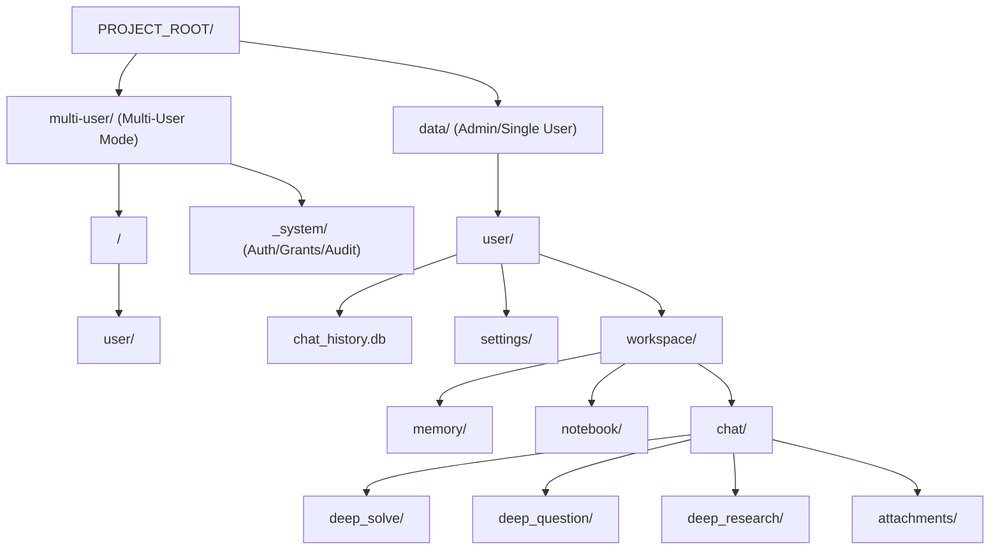
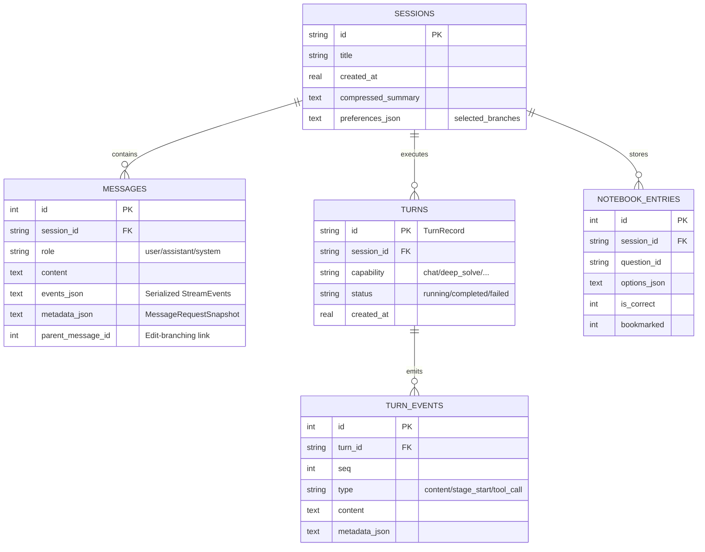
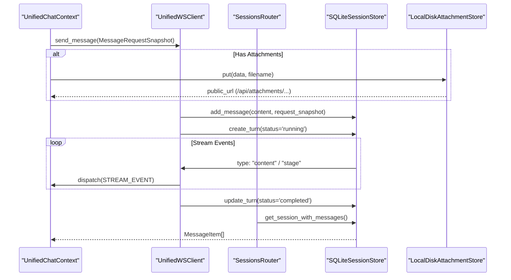

# 데이터 흐름과 저장소

관련 소스 파일

다음 파일들은 이 위키 페이지를 생성할 때 참고한 컨텍스트로 사용되었습니다:

- [README.md](README.md)
- [assets/README/README_AR.md](assets/README/README_AR.md)
- [assets/README/README_CN.md](assets/README/README_CN.md)
- [assets/README/README_ES.md](assets/README/README_ES.md)
- [assets/README/README_FR.md](assets/README/README_FR.md)
- [assets/README/README_HI.md](assets/README/README_HI.md)
- [assets/README/README_JA.md](assets/README/README_JA.md)
- [assets/README/README_PL.md](assets/README/README_PL.md)
- [assets/README/README_PT.md](assets/README/README_PT.md)
- [assets/README/README_RU.md](assets/README/README_RU.md)
- [assets/README/README_TH.md](assets/README/README_TH.md)
- [deeptutor/api/routers/memory.py](deeptutor/api/routers/memory.py)
- [deeptutor/api/routers/settings.py](deeptutor/api/routers/settings.py)
- [deeptutor/multi_user/context.py](deeptutor/multi_user/context.py)
- [deeptutor/multi_user/paths.py](deeptutor/multi_user/paths.py)
- [deeptutor/services/path_service.py](deeptutor/services/path_service.py)
- [tests/api/test_settings_router.py](tests/api/test_settings_router.py)

## 목적과 범위

이 문서는 DeepTutor의 데이터 영속성 아키텍처, 디렉터리 구조, 파일 형식을 설명합니다. 이 시스템이 통합 채팅 세션, 지식 베이스(KB) 수집, 에이전트별 작업공간 산출물을 어떻게 관리하는지 다룹니다. DeepTutor는 모든 영속 상태를 위해 중앙집중식 `data/` 디렉터리를 사용하며, 사용자별 데이터와 전역 지식 자산을 분리하는 마이그레이션에 강한 구조를 채택합니다. 이 아키텍처는 단일 사용자 로컬 배포와 다중 사용자 범위 격리 모두를 지원합니다.

---

## 디렉터리 구조 개요

DeepTutor는 배포 모드에 따라 모든 영속 데이터를 루트 `data/` 디렉터리 또는 `multi-user/` 디렉터리 아래에 구성합니다. 시스템은 `PathService`를 사용해 이 위치들을 프로젝트 루트 기준으로 해석합니다 [deeptutor/services/path_service.py:76-82]().

### 루트 데이터 디렉터리 레이아웃

**Sources:** [deeptutor/services/path_service.py:76-82](), [deeptutor/multi_user/paths.py:14-18](), [deeptutor/multi_user/paths.py:41-46](), [deeptutor/api/routers/settings.py:42-44]()

### 디렉터리 용도 표

| 경로 | 용도 | 핵심 코드 엔티티 |
|------|---------|-----------------|
| `.../user/chat_history.db` | 세션, 메시지, 턴을 위한 통합 SQLite 저장소 | `SQLiteSessionStore` |
| `.../user/settings/` | UI 환경설정(`interface.json`)과 모델 카탈로그 영속성 | `deeptutor/api/routers/settings.py` |
| `.../user/workspace/chat/deep_solve/` | Smart Solver 산출물과 추론 체인 | `PathService.get_chat_feature_dir` |
| `.../user/workspace/chat/attachments/` | 채팅 업로드용 바이너리 파일 저장소 | `LocalDiskAttachmentStore` |
| `.../user/workspace/chat/_detached_code_execution/` | LLM이 생성한 코드를 실행하는 샌드박스 | `PathService.get_chat_feature_dir` |
| `.../user/workspace/notebook/` | 사용자의 개인 질문 노트북과 북마크 | `notebook_entries` (Table) |
| `.../user/workspace/memory/` | 학습자 프로필과 세션 요약(L2/L3) | `MemoryStore` |

**Sources:** [deeptutor/services/path_service.py:76-82](), [deeptutor/api/routers/settings.py:42-44](), [deeptutor/api/routers/settings.py:46-49]()

---

## 통합 세션 저장소(SQLite)

DeepTutor는 상호작용의 생명주기를 관리하기 위해 사용자 범위별로 단일 SQLite 데이터베이스인 `chat_history.db`를 사용합니다. 이는 다중 에이전트 작업에 대해 ACID 준수를 제공하며, edit-branching 같은 고급 기능을 지원합니다.

### 데이터베이스 스키마와 엔티티 매핑

스키마는 "Chat Session" 같은 고수준 "자연어" 개념과 SQL 테이블 및 Pydantic 모델인 "코드 엔티티 공간"을 연결합니다.

**Sources:** [deeptutor/api/routers/memory.py:1-28](), [deeptutor/api/routers/settings.py:52-68]()

---

## 데이터 흐름: 통합 턴 생명주기

사용자가 메시지를 보내면 데이터는 WebSocket 인터페이스를 통해 백엔드 오케스트레이션 계층으로 흐릅니다.

### 상호작용 흐름 다이어그램

**Sources:** [deeptutor/api/routers/settings.py:167-183](), [deeptutor/api/routers/settings.py:199-212]()

---

## 다중 사용자 격리와 경로

DeepTutor는 데이터가 `user_id`별로 분할되는 다중 사용자 모드를 지원합니다.

### 사용자 범위와 경로 해석
`PathService`는 `ContextVar`의 `CurrentUser`를 기반으로 가져옵니다 [deeptutor/multi_user/context.py:22-23]().

- **관리자 범위**: `data/`를 루트로 합니다 [deeptutor/multi_user/paths.py:22-23]().
- **사용자 범위**: `multi-user/<user_id>/`를 루트로 합니다 [deeptutor/multi_user/paths.py:38]().
- **시스템 데이터**: 인증, 권한 부여, 감사 로그를 위해 `multi-user/_system/`을 루트로 합니다 [deeptutor/multi_user/paths.py:17](), [deeptutor/multi_user/paths.py:49-51]().

**Sources:** [deeptutor/multi_user/paths.py:14-18](), [deeptutor/multi_user/context.py:22-23](), [deeptutor/services/path_service.py:76-82]()

---

## 메모리와 영속성 서비스

DeepTutor는 구조화된 데이터베이스 상태와 반구조화된 마크다운 메모리를 구분합니다.

### 3계층 메모리 시스템
메모리 서브시스템은 세 계층의 영속 데이터를 관리합니다 [deeptutor/api/routers/memory.py:1-28]():
1.  **L1 Trace**: 표면(surface)별 원시 이벤트 로그(예: chat, research).
2.  **L2 Summary**: 표면별 요약(예: `workspace/memory/chat.md`).
3.  **L3 Knowledge**: 합성된 지식을 위한 표면 간 슬롯(예: `workspace/memory/profile.md`).

### 첨부파일 저장소
`LocalDiskAttachmentStore`는 바이너리 업로드를 처리합니다. 파일은 충돌을 방지하고 격리를 보장하기 위해 사용자의 작업공간 내에 저장됩니다. 기록되기 전에 경로 탐색 취약점을 방지하도록 파일명이 정화(sanitize)됩니다.

### 구성 영속성
- **UI 설정**: `settings/interface.json`에 저장됩니다. 여기에는 테마 환경설정, 언어, 활성화된 선택적 도구가 포함됩니다 [deeptutor/api/routers/settings.py:42-44](), [deeptutor/api/routers/settings.py:57-68]().
- **투어 캐시**: 로컬 `.tour_cache.json` 파일이 사용자가 온보딩 투어를 완료했는지 추적합니다 [deeptutor/api/routers/settings.py:46-49]().
- **모델 카탈로그**: `ModelCatalogService`를 통해 관리되며 사용자의 설정 디렉터리에 영속화됩니다 [deeptutor/api/routers/settings.py:24-28]().
- **런타임 무효화**: 관리자가 새 모델 카탈로그를 적용하면 시스템은 전역 LLM 및 embedding 클라이언트를 재설정해 변경 사항을 반영하며, 이는 진행 중인 턴에 영향을 줄 수 있습니다 [deeptutor/api/routers/settings.py:150-165]().

**Sources:** [deeptutor/api/routers/memory.py:1-28](), [deeptutor/api/routers/settings.py:42-68](), [deeptutor/api/routers/settings.py:150-165](), [deeptutor/services/path_service.py:76-82]()
