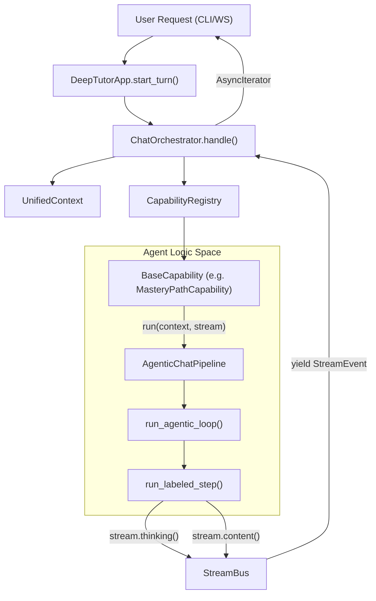
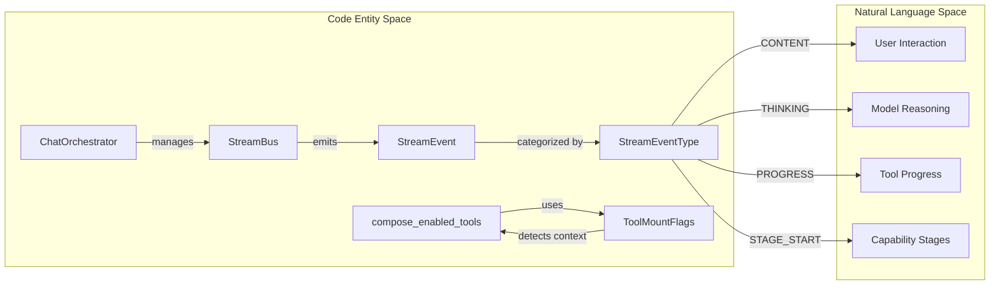

# 런타임과 오케스트레이션

관련 소스 파일

다음 파일들은 이 위키 페이지를 생성할 때 참고한 컨텍스트로 사용되었습니다:

- [AGENTS.md](AGENTS.md)
- [SKILL.md](SKILL.md)
- [deeptutor/agents/_shared/tool_composition.py](deeptutor/agents/_shared/tool_composition.py)
- [deeptutor/agents/chat/agent_loop.py](deeptutor/agents/chat/agent_loop.py)
- [deeptutor/agents/chat/prompt_blocks.py](deeptutor/agents/chat/prompt_blocks.py)
- [deeptutor/agents/research/pipeline.py](deeptutor/agents/research/pipeline.py)
- [deeptutor/app/facade.py](deeptutor/app/facade.py)
- [deeptutor/book/models.py](deeptutor/book/models.py)
- [deeptutor/capabilities/mastery_path.py](deeptutor/capabilities/mastery_path.py)
- [deeptutor/core/stream_bus.py](deeptutor/core/stream_bus.py)
- [deeptutor/loop_plugins/__init__.py](deeptutor/loop_plugins/__init__.py)
- [deeptutor/loop_plugins/mastery/__init__.py](deeptutor/loop_plugins/mastery/__init__.py)
- [deeptutor/loop_plugins/mastery/plugin.py](deeptutor/loop_plugins/mastery/plugin.py)
- [deeptutor/runtime/bootstrap/builtin_capabilities.py](deeptutor/runtime/bootstrap/builtin_capabilities.py)
- [deeptutor/runtime/orchestrator.py](deeptutor/runtime/orchestrator.py)
- [deeptutor/tools/builtin/__init__.py](deeptutor/tools/builtin/__init__.py)
- [deeptutor/tools/paper_search_tool.py](deeptutor/tools/paper_search_tool.py)
- [tests/runtime/test_orchestrator.py](tests/runtime/test_orchestrator.py)
- [web/lib/unified-ws.ts](web/lib/unified-ws.ts)

런타임과 오케스트레이션 계층은 DeepTutor의 중추 신경계 역할을 합니다. 이 계층은 통합 실행 환경을 통해 고수준 **Capabilities**(복잡한 다중 에이전트 워크플로)와 저수준 **Tools**(원자적 함수)를 연결합니다. 또한 이 계층은 사용자 "turn"의 생명주기, 기능 탐색, 그리고 백엔드 로직과 프론트엔드 또는 CLI 인터페이스를 연결하는 스트리밍 이벤트 버스를 관리합니다.

## ChatOrchestrator와 레지스트리

`ChatOrchestrator`는 "Turn"(단일 사용자 상호작용)을 실행하는 책임을 지는 주요 조정자입니다. 이 조정자는 시스템 기능을 탐색하고 호출하기 위해 특화된 레지스트리에 의존합니다.

### Capability Registry
`CapabilityRegistry`는 `chat`, `deep_solve`, `deep_question`, `deep_research` 같은 고수준 에이전트 모듈을 관리합니다 [deeptutor/runtime/orchestrator.py:20-21](). 기능은 `BUILTIN_CAPABILITY_CLASSES`의 클래스 경로를 통해 등록됩니다 [deeptutor/runtime/bootstrap/builtin_capabilities.py:3-12](). 각 기능은 `BaseCapability`를 구현하고, 이름, 설명, 실행 단계를 포함하는 `CapabilityManifest`를 정의합니다 [deeptutor/capabilities/mastery_path.py:58-67]().

### Tool Registry
`ToolRegistry`는 LLM이 호출할 수 있는 함수의 탐색과 실행을 처리합니다. 오케스트레이터는 이를 사용해 사용 가능한 도구를 나열하고 함수 호출용 OpenAI 호환 JSON 스키마를 생성합니다 [deeptutor/runtime/orchestrator.py:121-132](). 도구는 사용자 토글과 컨텍스트 플래그에 따라 조합되며(예: 지식 베이스가 연결되어 있으면 `rag` 도구가 자동으로 마운트됨) [deeptutor/agents/_shared/tool_composition.py:71-88, 120-121]().

| 레지스트리 | 책임 | 핵심 메서드 |
|:---|:---|:---|
| **Capability Registry** | 다단계 에이전트 워크플로 오케스트레이션 | `get_capability_registry().get(name)` [deeptutor/runtime/orchestrator.py:47]() |
| **Tool Registry** | 원자적 함수에 대한 스키마와 실행 제공 | `get_tool_registry().list_tools()` [deeptutor/runtime/orchestrator.py:122]() |

**Sources:**
- `deeptutor/runtime/orchestrator.py` [20-21, 47, 121-132]()
- `deeptutor/runtime/bootstrap/builtin_capabilities.py` [3-12]()
- `deeptutor/capabilities/mastery_path.py` [58-67]()
- `deeptutor/agents/_shared/tool_composition.py` [71-88, 120-121]()

## 실행 데이터 흐름

런타임은 `StreamBus`를 사용해 깊은 에이전트 계층에서 사용자 인터페이스로 이벤트를 전파합니다. 이를 통해 오래 걸리는 프로세스도 "stage"와 "thinking" 이벤트를 통해 실시간 피드백을 제공합니다.

### 오케스트레이션 파이프라인
`ChatOrchestrator.handle` 메서드는 `StreamBus`의 생명주기를 관리합니다. 이 메서드는 선택된 기능을 실행할 태스크를 생성하고, 그 결과로 나오는 이벤트 스트림을 구독합니다 [deeptutor/runtime/orchestrator.py:80-98](). `UnifiedContext`는 데이터 운반체 역할을 하며, 사용자 메시지, 세션 메타데이터, 그리고 개인화된 페르소나를 위한 `agent_identity` 같은 메타데이터를 담습니다 [deeptutor/agents/chat/prompt_blocks.py:100-117]().

**런타임 요청 흐름**

**Sources:**
- `deeptutor/runtime/orchestrator.py` [80-98]()
- `deeptutor/app/facade.py` [114-134]()
- `deeptutor/capabilities/mastery_path.py` [69-73]()
- `deeptutor/core/stream_bus.py` [40-69]()

## 스트리밍 이벤트 버스와 추적

`StreamBus`는 모든 실시간 통신을 위한 통합 채널입니다. 이는 최종 콘텐츠뿐 아니라 에이전트 내부 추론의 "trace"도 포착합니다.

### 이벤트 프로토콜
버스는 `StreamEventType`에 정의된 여러 유형의 `StreamEvent` 객체를 처리합니다 [deeptutor/core/stream_bus.py:27](). 주요 이벤트 유형은 다음과 같습니다:
1.  **THINKING:** 내부 추론 또는 "pre-prose" 로직을 포착합니다 [deeptutor/core/stream_bus.py:123-138]().
2.  **TOOL_CALL / TOOL_RESULT:** 함수 호출과 데이터 반환을 추적합니다 [deeptutor/core/stream_bus.py:157-191]().
3.  **PROGRESS:** 오래 걸리는 작업에 대한 상태 업데이트(예: "Step 1 of 5")를 제공합니다 [deeptutor/core/stream_bus.py:193-213]().
4.  **STAGE_START / STAGE_END:** 기능의 논리적 단계(예: 조사에서의 "Rephrasing")를 정의합니다 [deeptutor/core/stream_bus.py:78-104]().

### 내장 도구 생태계
도구는 **User-Toggleable**(예: `web_search`, `brainstorm`)과 **Auto-Mounted**(예: `rag`, `code_execution`, `ask_user`)로 분류됩니다 [deeptutor/agents/_shared/tool_composition.py:33-50](). 자동 마운트 도구는 `has_kb` 또는 `has_memory` 같은 특정 컨텍스트 플래그가 충족될 때만 LLM의 manifest에 나타납니다 [deeptutor/agents/_shared/tool_composition.py:71-88]().

**코드 엔티티 연관**

**Sources:**
- `deeptutor/core/stream_bus.py` [27, 78-213]()
- `deeptutor/agents/_shared/tool_composition.py` [33-50, 71-88, 115-143]()
- `deeptutor/runtime/orchestrator.py` [11-19]()

## Turn 생명주기와 세션 관리

`DeepTutorApp` 페이사드는 모든 어댑터(CLI, WebSocket, SDK)가 런타임과 상호작용할 수 있는 안정적인 진입점을 제공합니다 [deeptutor/app/facade.py:56-59]().

### Turn 초기화
turn이 시작되면 `TurnRequest`는 해석된 기능 이름과 구성을 포함하는 payload로 변환됩니다 [deeptutor/app/facade.py:16-31, 119-125](). 이후 시스템은 언어와 노트북 참조 같은 세션 환경설정을 업데이트합니다 [deeptutor/app/facade.py:126-133]().

### 다단계 기능
`deep_research` 같은 복잡한 기능은 turn을 서로 다른 단계(Rephrase, Decompose, Research, Reporting)로 나눕니다 [deeptutor/agents/research/pipeline.py:4-30](). 각 단계는 `LABEL_THINK`, `LABEL_TOOL`, `LABEL_FINISH` 같은 허용된 LLM 출력을 제어하기 위해 특정 `LabelProtocol` 정의를 사용합니다 [deeptutor/agents/research/pipeline.py:107-124]().

| 구성 요소 | 코드 엔티티 | 책임 |
|:---|:---|:---|
| **Turn Request** | `TurnRequest` | turn 시작을 위한 데이터 구조 [deeptutor/app/facade.py:16](). |
| **Agent Loop** | `run_agentic_loop` | agentic 기능의 핵심 실행 루프 [deeptutor/agents/research/pipeline.py:68](). |
| **Prompt Assembly** | `ChatPromptAssembler` | 블록으로부터 구조화된 시스템 프롬프트를 구성 [deeptutor/agents/chat/prompt_blocks.py:12](). |
| **Event Completion** | `_publish_completion` | turn 완료를 전역 버스에 알림 [deeptutor/runtime/orchestrator.py:101-120](). |

**Sources:**
- `deeptutor/app/facade.py` [16-31, 56-59, 114-134]()
- `deeptutor/agents/research/pipeline.py` [4-30, 107-124]()
- `deeptutor/agents/chat/prompt_blocks.py` [12-44]()
- `deeptutor/runtime/orchestrator.py` [101-120]()
