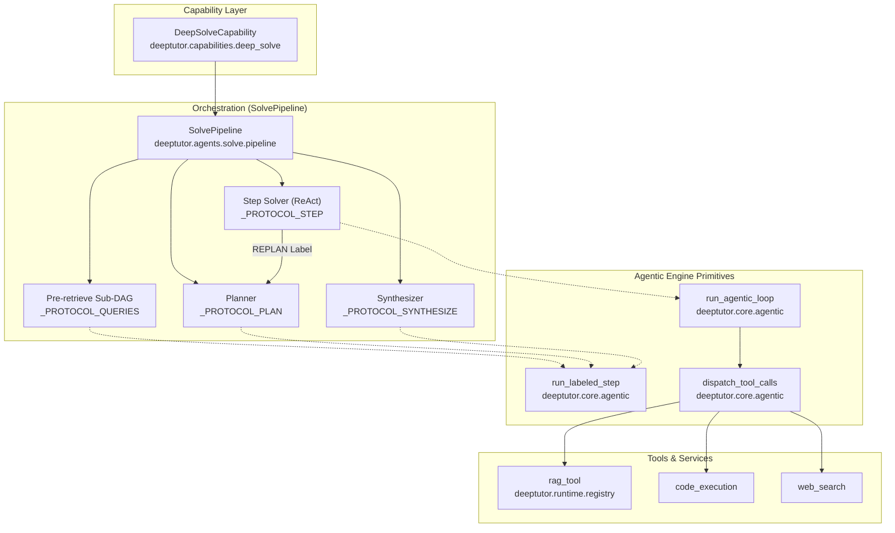
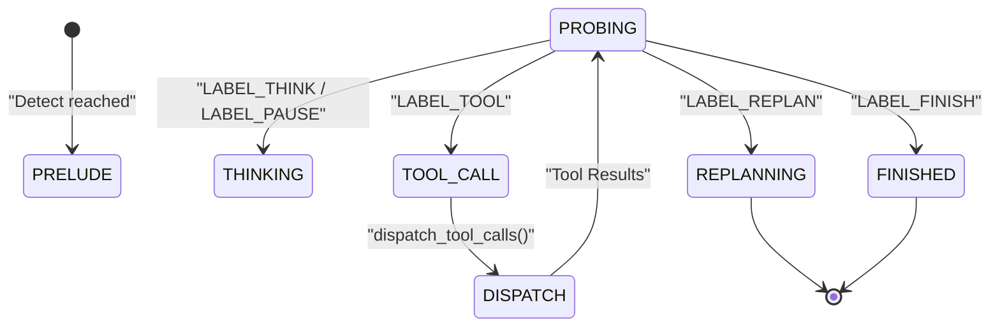

# Smart Solver

관련 소스 파일

다음 파일들은 이 위키 페이지를 생성할 때 참고한 컨텍스트로 사용되었습니다:

- [deeptutor/capabilities/_answer_now.py](deeptutor/capabilities/_answer_now.py)
- [deeptutor/capabilities/deep_research.py](deeptutor/capabilities/deep_research.py)
- [deeptutor/capabilities/deep_solve.py](deeptutor/capabilities/deep_solve.py)
- [deeptutor/capabilities/math_animator.py](deeptutor/capabilities/math_animator.py)
- [tests/capabilities/__init__.py](tests/capabilities/__init__.py)

## 목적과 범위

Smart Solver는 DeepTutor의 이중 루프 문제 해결 시스템으로, 반복적인 지식 수집과 구조화된 해법 생성을 결합해 사용자 질문에 답합니다. 이 시스템은 **분석 단계**(사전 검색 및 계획) 뒤에 **해결 단계**(에이전틱 단계 실행)가 이어지는 순차적 아키텍처로 동작합니다.

이 시스템은 복잡한 추론과 도구 사용을 관리하기 위해 라벨이 붙은 단계(`THINK`, `TOOL`, `FINISH`, `REPLAN`)를 사용하는 엔진 기반 접근 방식을 구현한 `SolvePipeline` [deeptutor/agents/solve/pipeline.py:11]()을 활용합니다. 여러 번의 검색 단계, 검증을 위한 코드 실행, 근거가 있는 인용을 포함한 다단계 추론이 필요한 질의를 처리하도록 설계되었습니다.

Sources: [deeptutor/capabilities/deep_solve.py:1-6](), [deeptutor/agents/solve/pipeline.py:1-22]()

---

## 아키텍처 개요

### 이중 루프 설계

Smart Solver는 각 루프가 문제 해결 워크플로에서 서로 다른 목적을 담당하는 순차적 이중 루프 아키텍처를 구현합니다.

*   **분석 루프(Phase 0 & 1)**: "Pre-retrieve"와 "Plan"에 집중합니다. 지식 베이스(KB)가 연결되어 있으면 여러 쿼리를 생성하고, 병렬로 RAG를 실행한 뒤, 구조화된 JSON 계획을 생성하기 전에 결과를 지식 노트로 모읍니다.
*   **해결 루프(Phase 2 & 3)**: 생성된 계획을 단계별로 실행합니다. 각 단계는 에이전틱 루프를 실행합니다. 단계가 실패하거나 방향 전환이 필요하면 `REPLAN` 역방향 경로를 통해 Phase 1로 되돌아갑니다. 마지막으로 최종 답변을 합성합니다.

Sources: [deeptutor/agents/solve/pipeline.py:3-22](), [deeptutor/capabilities/deep_solve.py:18-26]()

### 시스템 흐름과 코드 엔티티

다음 다이어그램은 논리적 solver 구성 요소를 구체적인 구현 클래스와 엔진 프로토콜에 매핑합니다.

**Solver 실행 파이프라인**

Sources: [deeptutor/capabilities/deep_solve.py:39-53](), [deeptutor/agents/solve/pipeline.py:85-133](), [deeptutor/agents/solve/pipeline.py:201-213]()

---

## 분석 단계 구성 요소

### 사전 검색(Phase 0)
지식 베이스가 연결되어 있으면 solver는 planner를 기반으로 하기 위한 초기 조사 폭발을 수행합니다.
- **쿼리 생성**: `LABEL_QUERIES`를 내보내 기본값 3개의 검색 문자열을 생성합니다 [deeptutor/agents/solve/pipeline.py:75-139]().
- **병렬 RAG**: `rag` 도구를 통해 쿼리를 병렬 실행합니다 [deeptutor/agents/solve/pipeline.py:5-7]().
- **지식 집계**: `LABEL_SUMMARY`를 내보내 검색된 스니펫을 최대 6000자까지 압축해 "Knowledge Note"로 만듭니다 [deeptutor/agents/solve/pipeline.py:149-152]().

### 계획 수립(Phase 1)
planner는 사용자 질문을 순서가 있는 `PlanStep` 엔티티로 분해합니다.
- **프로토콜**: 단일 `PLAN` 라벨 JSON 응답을 요구하는 `_PROTOCOL_PLAN`을 사용합니다 [deeptutor/agents/solve/pipeline.py:99-105]().
- **재진입**: Solve 단계에서 `REPLAN` 신호가 오면, 이전 시도와 실패 이유를 추가 컨텍스트로 넣어 planner를 다시 실행합니다 [deeptutor/agents/solve/pipeline.py:8-11]().

Sources: [deeptutor/agents/solve/pipeline.py:1-22](), [deeptutor/agents/solve/pipeline.py:178-195]()

---

## 해결 단계 구성 요소

### 단계 실행(Phase 2)
계획의 각 단계에 대해 `SolvePipeline` [deeptutor/agents/solve/pipeline.py:11]()은 전체 에이전틱 루프를 실행합니다.
- **라벨**: `THINK`, `TOOL`, `FINISH`, `REPLAN`을 지원합니다 [deeptutor/agents/solve/pipeline.py:107-112]().
- **컨텍스트 흐름**: 이전 단계의 `FINISH` 텍스트는 다음 단계의 프롬프트 컨텍스트로 스트리밍되어, 최종 출력이 연속적이고 논리적인 서술로 읽히도록 합니다 [deeptutor/agents/solve/pipeline.py:13-15]().
- **반복 제한**: 무한 루프를 방지하기 위해 기본적으로 단계당 7회 반복으로 제한됩니다 [deeptutor/agents/solve/pipeline.py:137-138]().

### 합성(Phase 3)
모든 단계가 완료되면(또는 모델이 충분한 정보를 얻었다고 판단하면) 최종 합성 단계가 트리거됩니다.
- **최종 답변**: 정확한 최종 답변과 짧은 요약을 생성하기 위해 `FINISH` 라벨이 붙은 단계를 내보냅니다 [deeptutor/agents/solve/pipeline.py:16-17]().
- **수정**: 최종 출력이 예상 형식을 위반하면 한 번만 복구하는 메커니즘이 포함됩니다 [deeptutor/agents/solve/pipeline.py:151-152]().

Sources: [deeptutor/agents/solve/pipeline.py:106-119](), [deeptutor/agents/solve/pipeline.py:135-144]()

---

## 프로토콜과 엔진 통합

solver는 스트리밍, 라벨 파싱, 도구 디스패치를 위해 핵심 `agentic` 엔진에 의존합니다.

| 엔티티 | 코드 심볼 | 파일 | 목적 |
| :--- | :--- | :--- | :--- |
| **Plan Step** | `PlanStep` | [deeptutor/agents/solve/pipeline.py:179]() | 고유 ID를 가진 개별 목표 |
| **Full Plan** | `Plan` | [deeptutor/agents/solve/pipeline.py:185]() | 분석과 순서가 있는 단계의 컨테이너 |
| **Label Protocol** | `LabelProtocol` | [deeptutor/core/agentic/labels.py]() | 유효한 전이(예: `THINK` -> `TOOL`)를 정의 |
| **Labeled Result** | `LabeledStepResult` | [deeptutor/core/agentic/labeled_step.py:87-93]() | 파싱된 도구 호출을 포함한 단일 라벨 LLM 호출의 결과 |

### Agentic 루프 상태 기계
solver는 스트리밍과 도구 실행의 저수준 메커니즘을 처리하기 위해 `run_agentic_loop`를 사용합니다. 이 루프는 라벨 이전 추론 블록(예: ``)을 지원하며, 이는 라벨 탐지가 재개되기 전에 추론 서브 트레이스로 라우팅됩니다 [deeptutor/core/agentic/labeled_step.py:18-31]().

**엔진 상태 전이**

Sources: [deeptutor/core/agentic/labeled_step.py:1-31](), [deeptutor/agents/solve/pipeline.py:106-112](), [deeptutor/core/agentic/__init__.py]()

---

## 빠른 경로(Answer Now)

`deep_solve`는 무거운 기능이지만, 긴급 종료를 위한 시스템 전역 `answer_now` 프로토콜에도 참여합니다.

- **추출**: `extract_answer_now_context` [deeptutor/capabilities/_answer_now.py:54]()는 중단된 turn의 payload를 검증하며, 비어 있지 않은 `original_user_message`를 요구합니다 [deeptutor/capabilities/_answer_now.py:58-74]().
- **추적 요약**: 캡처된 스트림 이벤트를 최대 6000자까지 렌더링해 한 번에 합성하기 좋은 간결한 요약으로 만듭니다 [deeptutor/capabilities/_answer_now.py:76-122]().
- **생략 안내**: 어떤 단계(예: `planning`, `reasoning`)가 생략되었는지 알려주는 i18n 인식 안내문을 앞에 붙입니다 [deeptutor/capabilities/_answer_now.py:131-147]().

Sources: [deeptutor/capabilities/_answer_now.py:1-27](), [deeptutor/capabilities/math_animator.py:68-78]()
