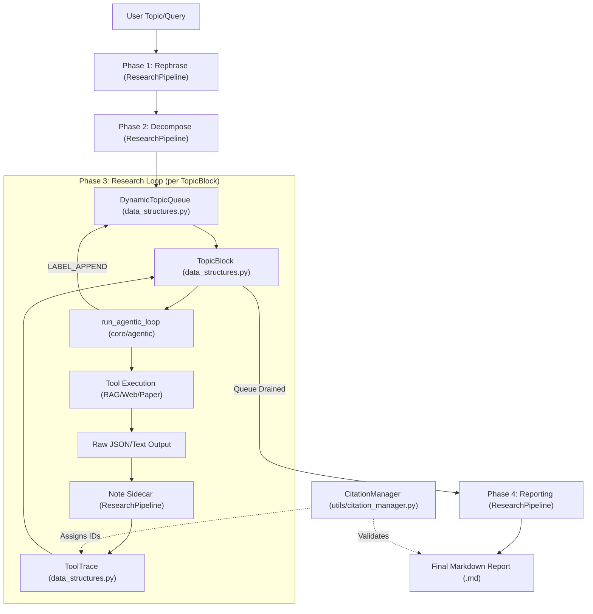
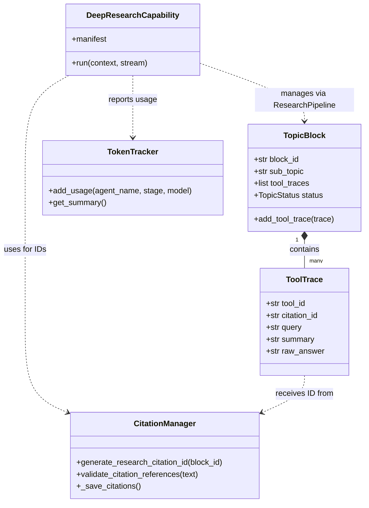

# Deep Research

관련 소스 파일

다음 파일들은 이 위키 페이지를 생성할 때 참고한 컨텍스트로 사용되었습니다:

- [deeptutor/agents/research/data_structures.py](deeptutor/agents/research/data_structures.py)
- [deeptutor/agents/research/utils/citation_manager.py](deeptutor/agents/research/utils/citation_manager.py)
- [deeptutor/agents/research/utils/token_tracker.py](deeptutor/agents/research/utils/token_tracker.py)
- [deeptutor/capabilities/_answer_now.py](deeptutor/capabilities/_answer_now.py)
- [deeptutor/capabilities/deep_research.py](deeptutor/capabilities/deep_research.py)
- [deeptutor/capabilities/deep_solve.py](deeptutor/capabilities/deep_solve.py)
- [deeptutor/capabilities/math_animator.py](deeptutor/capabilities/math_animator.py)
- [deeptutor/utils/json_parser.py](deeptutor/utils/json_parser.py)
- [tests/capabilities/__init__.py](tests/capabilities/__init__.py)

Deep Research 모듈은 복잡한 주제에 대해 자율적이고 심층적인 조사를 수행하도록 설계된 다중 에이전트 파이프라인입니다. 이 모듈은 "Decompose-Investigate-Note-Report" 워크플로를 활용해 광범위한 질의를 관리 가능한 하위 주제로 분해하고, 반복적인 도구 기반 조사(web search, RAG, paper search)를 수행한 뒤, 완전한 인용 관리를 포함한 구조화된 보고서로 결과를 합성합니다.

### 다중 에이전트 파이프라인 아키텍처

조사 과정은 특화된 여러 에이전트와 단계의 순서를 통해 오케스트레이션됩니다. 워크플로는 `ResearchPipeline`이 관리하며, 이 파이프라인은 재표현, 분해, 조사, 보고 단계 사이의 전이를 조정하는 에이전틱 엔진 기반 시스템으로 동작합니다 [deeptutor/capabilities/deep_research.py:69-74]().

| 단계 | 책임 | 프로토콜 / 라벨 |
| :--- | :--- | :--- |
| **Phase 1: Rephrase** | `ask_user`를 통해 초기 사용자 질의를 더 잘 분해되도록 최적화합니다. | `_PROTOCOL_REPHRASE` (`THINK`, `TOOL`, `FINISH`) |
| **Phase 2: Decompose** | 주제를 조사할 `TopicBlock` 단위의 큐로 분해합니다. | `_PROTOCOL_DECOMPOSE` (`OUTLINE`) |
| **Phase 3: Research** | 특정 하위 주제에 대한 증거를 모으기 위해 도구 호출(Web, RAG, Papers)을 수행합니다. | `_PROTOCOL_BLOCK` (`THINK`, `TOOL`, `APPEND`, `FINISH`) |
| **Phase 4: Reporting** | Outline → Intro → Sections → Conclusion의 일련의 한 번 실행 단계입니다. | `_PROTOCOL_REPORT_SECTION` 등 |
| **Sidecar: Note** | 원시 도구 결과를 인용을 위한 짧고 밀도 높은 요약으로 압축합니다. | `_PROTOCOL_NOTE` (`FINISH`) |

#### 데이터 흐름과 오케스트레이션
이 파이프라인은 복원력 있고 동적으로 설계되었습니다. **Phase 3** 동안 `APPEND` 라벨은 에이전트가 조사 큐를 중간에 변경하여 발견이 생길 때마다 새 하위 주제를 추가할 수 있게 합니다. 조사 루프는 증거를 생성하는 도구, 특히 `rag`, `web_search`, `paper_search`, `code_execution`을 지원합니다 [deeptutor/capabilities/deep_research.py:42-42]().

`DeepResearchCapability`는 2단계 outline-preview 흐름을 처리합니다. 첫 호출은 사용자가 확인할 `outline_preview`를 생성하고, 확인되면 두 번째 호출이 전체 조사 및 보고 단계를 실행합니다 [deeptutor/capabilities/deep_research.py:58-67]().

**Research Pipeline Data Flow**

**Sources:** [deeptutor/capabilities/deep_research.py:37-45](), [deeptutor/agents/research/data_structures.py:189-203](), [deeptutor/agents/research/utils/citation_manager.py:18-30]()

---

### 핵심 데이터 구조

Deep Research는 `deeptutor/agents/research/data_structures.py`에 정의된 정형 데이터 구조에 의존해 상태를 유지하고, 수집된 모든 정보에 대한 "paper trail"을 제공합니다.

#### TopicBlock과 ToolTrace
- **`TopicBlock`**: 큐에서의 최소 스케줄링 단위입니다. 하위 주제를 나타내며, 해당 하위 주제에 대한 조사 이력을 나타내는 `ToolTrace` 객체 목록을 포함합니다 [deeptutor/agents/research/data_structures.py:189-203]().
- **`ToolTrace`**: 단일 도구 상호작용 루프를 기록합니다. 고유한 `citation_id`, `query`, `raw_answer`(50KB를 넘으면 자동으로 잘림), 그리고 Note sidecar가 생성한 `summary`를 저장합니다 [deeptutor/agents/research/data_structures.py:67-81]().
- **`TopicStatus`**: 블록의 생명주기를 추적하는 열거형입니다: `PENDING`, `RESEARCHING`, `COMPLETED`, `FAILED` [deeptutor/agents/research/data_structures.py:44-50]().

#### Truncation 로직
컨텍스트 윈도우 오버플로와 저장소 비대화를 방지하기 위해 `ToolTrace`는 `_truncate_raw_answer`를 통해 지능형 truncation을 구현합니다. 이 함수는 `parse_json_response`를 사용해 답변을 JSON으로 파싱하려 시도하고, 구조적 무결성을 유지하려 하면서 `answer`, `content`, `text`, `chunks`, `documents` 같은 콘텐츠 필드를 선택적으로 자릅니다 [deeptutor/agents/research/data_structures.py:95-127](). JSON 파싱이 실패하면 마커를 붙인 단순 문자열 잘라내기로 되돌아갑니다 [deeptutor/agents/research/data_structures.py:129-133]().

**Sources:** [deeptutor/agents/research/data_structures.py:1-210](), [deeptutor/utils/json_parser.py:34-62]()

---

### 인용 관리

`CitationManager` 클래스는 전역 ID 관리를 처리하고 최종 보고서의 모든 주장에 대해 출처를 추적할 수 있도록 보장합니다 [deeptutor/agents/research/utils/citation_manager.py:18-20](). 이 클래스는 두 가지 주요 ID 형식을 관리합니다:
1.  **PLAN-XX**: 초기 계획 또는 사전 검색 단계에서 수집한 정보용 [deeptutor/agents/research/utils/citation_manager.py:50-58]().
2.  **CIT-X-XX**: 조사 단계에서 수집한 정보용이며, `X`는 블록 번호, `XX`는 해당 블록 내 순번입니다 [deeptutor/agents/research/utils/citation_manager.py:60-84]().

#### 참조 매핑과 영속성
시스템은 세션 간 카운터와 ID 매핑을 유지하기 위해 작업공간에 `citations.json` 파일을 보관하며(`get_path_service`가 관리), [deeptutor/agents/research/utils/citation_manager.py:31-48]() `validate_citation_references`를 통해 검증 로직을 제공합니다. 이 검증은 `\[\[([A-Z]+-\d+-?\d*)\]\]` 같은 정규식 패턴을 사용해 생성된 텍스트 내의 인라인 인용이 기존 도구 추적과 일치하는지 확인합니다 [deeptutor/agents/research/utils/citation_manager.py:175-194]().

**Sources:** [deeptutor/agents/research/utils/citation_manager.py:18-112](), [deeptutor/services/path_service.py:14-14]()

---

### 토큰과 비용 추적

Deep Research는 모든 에이전트와 단계 전반의 자원 소비를 모니터링하기 위해 특화된 `TokenTracker`를 사용합니다 [deeptutor/agents/research/utils/token_tracker.py:105-111]().
- **카운팅 방법**: 직접 API 사용량 보고, 로컬 카운팅을 위한 `tiktoken`, 그리고 폴백으로 단어 수 추정(단어 수 * 1.3)을 지원합니다 [deeptutor/agents/research/utils/token_tracker.py:115-150]().
- **비용 계산**: 입력/출력 가격을 바탕으로 USD 비용을 계산하기 위해 `MODEL_PRICING` 테이블(예: `gpt-4o`, `deepseek-chat`)을 사용합니다 [deeptutor/agents/research/utils/token_tracker.py:24-34](), [deeptutor/agents/research/utils/token_tracker.py:82-86]().
- **보고**: 에이전트, 모델, 계산 방식별 요약을 제공합니다 [deeptutor/agents/research/utils/token_tracker.py:171-195]().

**엔티티 연관 다이어그램**

**Sources:** [deeptutor/agents/research/data_structures.py:67-203](), [deeptutor/capabilities/deep_research.py:37-100](), [deeptutor/agents/research/utils/citation_manager.py:18-84](), [deeptutor/agents/research/utils/token_tracker.py:105-170]()
