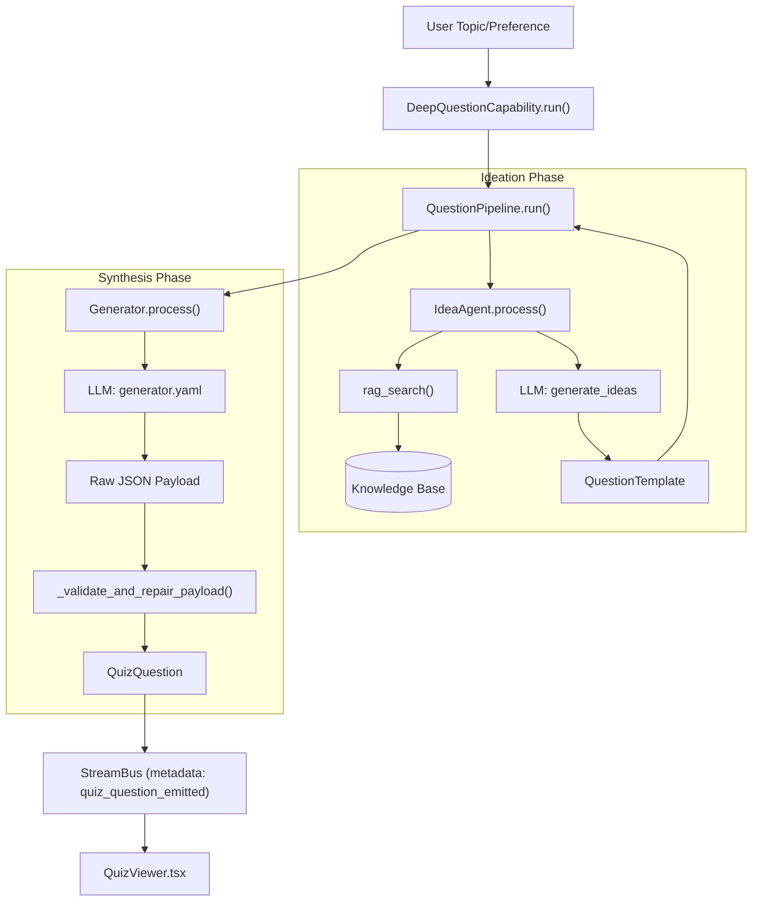
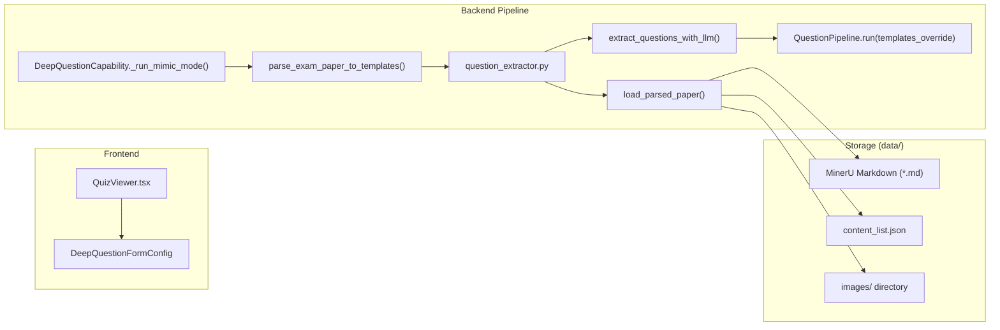

# 퀴즈 생성

관련 소스 파일

다음 파일들은 이 위키 페이지를 생성할 때 참고한 컨텍스트로 사용되었습니다:

- [deeptutor/agents/question/coordinator.py](deeptutor/agents/question/coordinator.py)
- [deeptutor/capabilities/deep_question.py](deeptutor/capabilities/deep_question.py)
- [deeptutor/tools/question/question_extractor.py](deeptutor/tools/question/question_extractor.py)
- [tests/tools/test_question_extractor.py](tests/tools/test_question_extractor.py)

**퀴즈 생성** 모듈은 고품질의 근거 기반 교육 평가를 만들기 위한 다단계 파이프라인을 제공합니다. 이 모듈은 두 가지 주요 워크플로를 지원합니다: 사용자가 정의한 주제로부터 RAG를 사용해 문제를 합성하는 **주제 기반 생성**, 그리고 기존 시험지(PDF)를 파싱해 새 문제의 구조적·주제적 참조로 사용하는 **시험지 모사**입니다.

## 핵심 아키텍처

이 시스템은 느슨하게 결합된 "아이디어 구상 후 생성(Ideation-then-Generation)" 패턴을 따릅니다. 이를 통해 실제 콘텐츠를 초안하기 전에 교육적 목표(난이도, 초점, 문제 유형)를 먼저 확정할 수 있어, 검증과 수정 사이클을 더 잘 수행할 수 있습니다.

### Deep Question Capability

퀴즈 시스템의 주요 진입점은 `DeepQuestionCapability`입니다 [deeptutor/capabilities/deep_question.py:28](). 이 모듈은 사용자 요청을 세 가지 서로 다른 경로로 라우팅합니다 [deeptutor/capabilities/deep_question.py:3-9]():
*   **Followup**: `FollowupAgent`를 사용해 이전에 생성된 퀴즈에 관한 질문을 처리합니다 [deeptutor/capabilities/deep_question.py:53-56]().
*   **Custom Mode**: `QuestionPipeline`을 사용한 표준 주제-퀴즈 생성입니다 [deeptutor/capabilities/deep_question.py:104-141]().
*   **Mimic Mode**: 먼저 시험지를 파싱한 뒤, 템플릿 오버라이드를 적용한 `QuestionPipeline`을 사용합니다 [deeptutor/capabilities/deep_question.py:144-156]().

### Question Generation Pipeline

생성 과정은 `QuestionPipeline`이 오케스트레이션합니다 [deeptutor/agents/question/pipeline.py:19](). 이 파이프라인은 레거시 `AgentCoordinator` 페이사드를 통해서도 노출됩니다 [deeptutor/agents/question/coordinator.py:31-37](). 이 파이프라인은 특화된 에이전트의 생명주기를 관리합니다:

1.  **IdeaAgent**: "Ideation"을 담당합니다. 지식 베이스에 대해 RAG 조회를 수행하고 문제 템플릿을 생성합니다.
2.  **Generator**: "Synthesis"를 담당합니다. 템플릿을 받아 문제, 선택지, 정답, 해설을 포함한 최종 `QuizQuestion` payload를 생성합니다.

### 데이터 흐름: 주제 기반 워크플로

Title: "Topic-Driven Generation Data Flow"

**Sources:** [deeptutor/capabilities/deep_question.py:100-141](), [deeptutor/agents/question/coordinator.py:66-92](), [deeptutor/agents/question/pipeline.py:19-25]()

---

## 구성 요소 세부 사항

### 1. IdeaAgent (아이디어 구상)
`IdeaAgent`는 퀴즈를 위한 교육적 청사진을 만듭니다. 
- **지식 기반화**: `UnifiedContext`에 지식 베이스가 제공되면 [deeptutor/capabilities/deep_question.py:43]() 관련 컨텍스트를 조회해 문제가 사실에 근거하도록 보장합니다.
- **제약 만족**: 사용자가 정의한 난이도와 문제 유형(choice, concept, fill_in_blank, short_answer, written, coding)을 강제합니다.

### 2. Generator (합성 및 수정)
`Generator`는 템플릿을 완전한 `QuizQuestion`으로 변환합니다.
- **검증과 수정**: LLM이 응답을 생성한 뒤 에이전트는 `_validate_and_repair_payload`를 실행합니다. 이를 통해 `choice` 문제는 유효한 선택지를 가져야 하고, `concept` 문제(True/False)는 올바른 형식이어야 하는 등 구조적 무결성을 보장합니다.
- **멀티모달 지원**: 생성기는 채팅 첨부파일(이미지)을 처리할 수 있어, 비전 기능이 있는 모델이 시각적 컨텍스트를 바탕으로 문제를 생성할 수 있습니다 [deeptutor/capabilities/deep_question.py:71]().

### 3. AgentCoordinator
`AgentCoordinator`는 호환성 계층 역할을 합니다 [deeptutor/agents/question/coordinator.py:1-7](). 이 계층은 `QuestionPipeline`을 초기화하고 [deeptutor/agents/question/coordinator.py:162-167]() `WsCallback`을 통해 이벤트를 프론트엔드로 전달합니다 [deeptutor/agents/question/coordinator.py:63-64]().

**Sources:** [deeptutor/agents/question/coordinator.py:31-64](), [deeptutor/capabilities/deep_question.py:28-83]()

---

## 시험지 모사 워크플로

시험지 모사 워크플로는 시스템이 기존 시험지의 스타일과 깊이를 "복제"하도록 합니다. 이 워크플로는 정교한 추출 파이프라인을 사용해 정적 PDF를 생성 템플릿으로 변환합니다.

### 구현 로직
1.  **Paper Parsing**: 시스템은 업로드된 문서를 처리하기 위해 `parse_exam_paper_to_templates`를 사용합니다 [deeptutor/agents/question/coordinator.py:116-121]().
2.  **Question Extraction**: `question_extractor.py`는 LLM 분석을 사용해 MinerU로 파싱된 마크다운에서 문제 번호, 텍스트, 연관 이미지를 식별합니다 [deeptutor/tools/question/question_extractor.py:143-162]().
3.  **Image Handling**: 문서의 이미지 참조를 감지해 `images/` 디렉터리의 로컬 파일로 매핑합니다 [deeptutor/tools/question/question_extractor.py:139-143]().
4.  **Mimicry**: 추출된 템플릿은 표준 `IdeaAgent` 아이디어 구상 단계를 우회하고 `templates_override`로 `QuestionPipeline`에 전달됩니다 [deeptutor/capabilities/deep_question.py:177]().

Title: "Exam-Mimicry Code Entity Map"

**Sources:** [deeptutor/capabilities/deep_question.py:158-185](), [deeptutor/tools/question/question_extractor.py:58-133](), [deeptutor/agents/question/coordinator.py:94-146]()

---

## 지원되는 문제 유형

시스템은 `question_extractor`와 프론트엔드 로직에 정의된 정식 유형 집합으로 다양한 LLM 별칭을 정규화합니다 [deeptutor/tools/question/question_extractor.py:156-162]() :

| 정식 유형 | 설명 | LLM 필드 |
| :--- | :--- | :--- |
| `choice` | 선택지가 분리된 객관식(A/B/C/D). | `question_type` |
| `concept` | 판단을 위한 True/False 명제. | `question_type` |
| `fill_in_blank` | 단어/구를 채워 넣는 빈칸이 있는 문항. | `question_type` |
| `short_answer`| 몇 문장의 설명이 필요한 개념형 문항. | `question_type` |
| `written` | 더 긴 에세이, 증명, 다단계 유도 문제. | `question_type` |
| `coding` | 코드를 기대하는 프로그래밍 / 알고리즘 문제. | `question_type` |

**Sources:** [deeptutor/tools/question/question_extractor.py:156-162](), [deeptutor/capabilities/deep_question.py:88-96]()

---

## 검증 및 수정 생명주기

시스템은 여러 처리 계층을 통해 매끄러운 평가 경험을 보장합니다:

1.  **Streaming Extraction**: 백엔드 이벤트는 `StreamBus`를 통해 방출됩니다. `QuestionPipeline`은 생성되는 대로 `quiz_question_emitted` 이벤트를 내보내는 것을 처리합니다 [deeptutor/agents/question/pipeline.py:140]().
2.  **History Awareness**: `DeepQuestionCapability`는 `load_session_quiz_history`를 통해 세션 기록을 불러와 [deeptutor/capabilities/deep_question.py:120]() 파이프라인이 문제를 반복하지 않거나 이전 turn을 바탕으로 확장할 수 있도록 합니다.
3.  **Follow-up System**: 사용자가 특정 퀴즈 항목에 대해 질문하면 `FollowupAgent`가 [deeptutor/capabilities/deep_question.py:53]() `question_followup_context`를 처리해 [deeptutor/capabilities/deep_question.py:49]() 맞춤형 설명을 제공합니다.
4.  **Repair Mechanism**: 파이프라인에는 `Generator`가 LLM 출력이 예상 JSON 스키마와 일치하는지 검증하고, 질문이 스트림에 방출되기 전에 일반적인 형식 오류를 수정하는 단계가 포함됩니다.

**Sources:** [deeptutor/capabilities/deep_question.py:48-83](), [deeptutor/agents/question/pipeline.py:100-141](), [deeptutor/agents/question/coordinator.py:180-191]()
