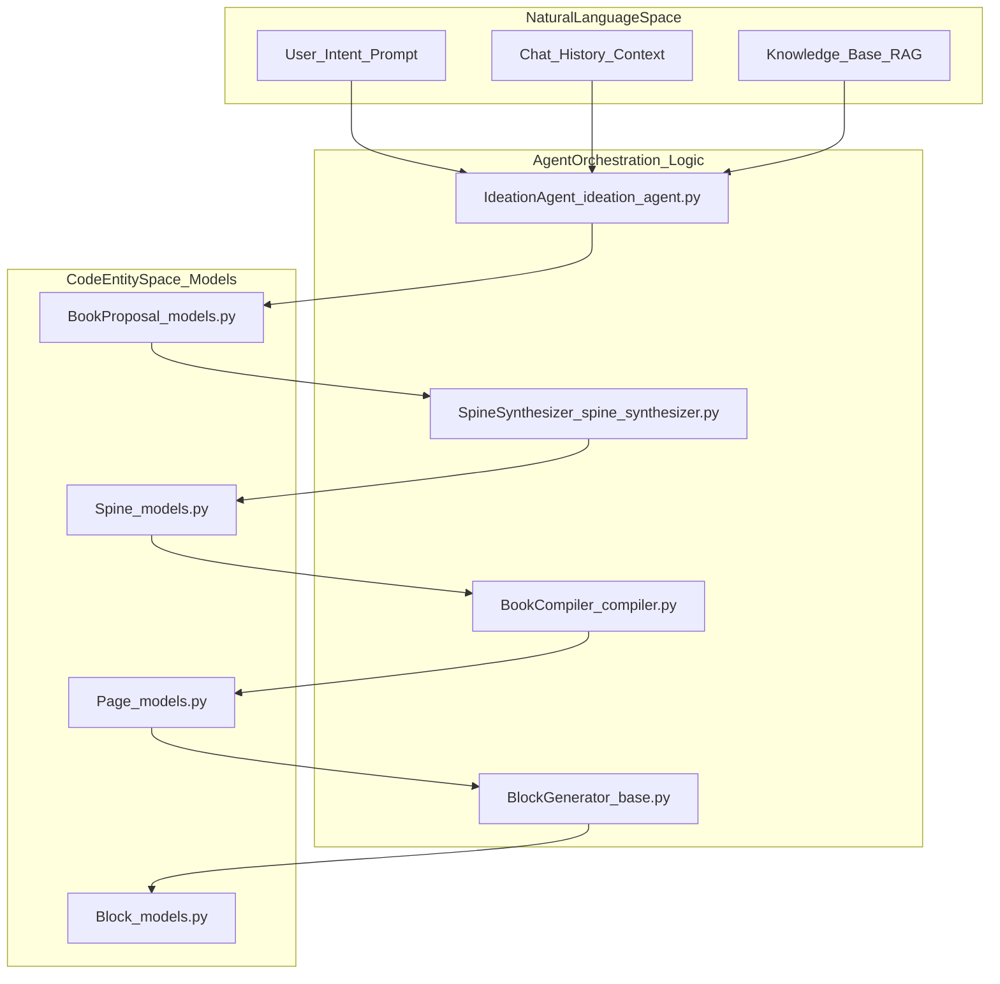
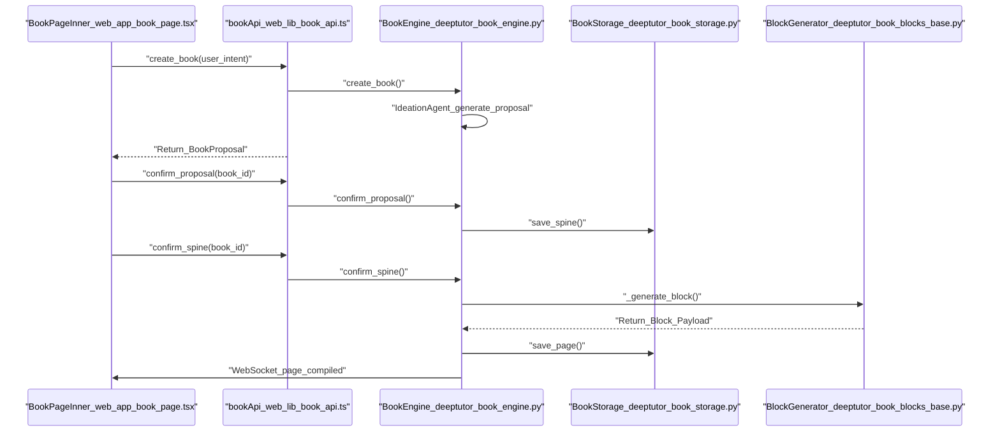

# Book Engine

관련 소스 파일

다음 파일들은 이 위키 페이지를 생성할 때 참고한 컨텍스트로 사용되었습니다:

- [assets/roster/forkers.svg](assets/roster/forkers.svg)
- [assets/roster/stargazers.svg](assets/roster/stargazers.svg)
- [deeptutor/book/blocks/_llm_writer.py](deeptutor/book/blocks/_llm_writer.py)
- [deeptutor/book/blocks/code.py](deeptutor/book/blocks/code.py)
- [deeptutor/book/blocks/deep_dive.py](deeptutor/book/blocks/deep_dive.py)
- [deeptutor/book/blocks/flash_cards.py](deeptutor/book/blocks/flash_cards.py)
- [deeptutor/book/blocks/timeline.py](deeptutor/book/blocks/timeline.py)
- [deeptutor/book/engine.py](deeptutor/book/engine.py)
- [deeptutor/book/kb_health.py](deeptutor/book/kb_health.py)
- [deeptutor/services/__init__.py](deeptutor/services/__init__.py)
- [web/app/(workspace)/book/components/BookLibrary.tsx](web/app/(workspace)/book/components/BookLibrary.tsx)
- [web/app/(workspace)/book/components/BookSidebar.tsx](web/app/(workspace)/book/components/BookSidebar.tsx)
- [web/app/(workspace)/book/components/PageReader.tsx](web/app/(workspace)/book/components/PageReader.tsx)
- [web/app/(workspace)/book/components/blocks/AnimationBlock.tsx](web/app/(workspace)/book/components/blocks/AnimationBlock.tsx)
- [web/app/(workspace)/book/page.tsx](web/app/(workspace)/book/page.tsx)
- [web/app/layout.tsx](web/app/layout.tsx)
- [web/components/ThemeScript.tsx](web/components/ThemeScript.tsx)
- [web/lib/debounce.ts](web/lib/debounce.ts)
- [web/lib/theme-utils.ts](web/lib/theme-utils.ts)
- [web/lib/theme.ts](web/lib/theme.ts)

**Book Engine**은 채팅 기록, 지식 베이스, 퀴즈 은행을 포함한 다양한 교육 자료를 구조화된 대화형 디지털 책으로 변환하도록 설계된 다중 에이전트 "living book" 컴파일러입니다 [deeptutor/book/engine.py:2-7](). 이 엔진은 고수준 아이디어 구상에서 세밀한 블록 수준 합성으로 전환되는 정교한 파이프라인을 활용하며, 14가지 서로 다른 대화형 블록 유형을 지원합니다 [deeptutor/book/models.py:47-55]().

## 시스템 아키텍처

Book Engine은 책별 컴파일 큐와 다단계 에이전트 생명주기를 관리하는 오케스트레이터로 동작합니다. 이 시스템은 비정형 자연어 의도와 엄격하게 타입이 지정된 "Spine" 및 "Page" 코드 엔티티 공간을 연결합니다. 표준 에이전트와 달리 `BookEngine`은 `ChatOrchestrator`와 병렬로 존재하는 최상위 서비스입니다 [deeptutor/book/engine.py:5-7]().

### Book 생성 생명주기

생성 과정은 `BookEngine` 오케스트레이터와 `BookCompiler`가 관리하는 다단계 파이프라인을 따릅니다 [deeptutor/book/engine.py:100-113]():

1.  **IdeationAgent**: 사용자 의도와 제공된 소스(KB, Chat, Notebooks)를 분석해 `BookProposal`을 생성합니다 [deeptutor/book/engine.py:41-41](), [deeptutor/book/engine.py:200-211]().
2.  **SourceExplorer**: RAG 기반 탐색을 사용해 관련 지식 조각과 데이터 포인트를 제안된 장(chapter)에 매핑합니다 [deeptutor/book/engine.py:42-42]().
3.  **SpineSynthesizer**: 제안서를 `Spine`으로 공식화하여 페이지의 계층 구조와 의도된 교육 목표를 정의합니다 [deeptutor/book/engine.py:43-43](), [deeptutor/book/engine.py:241-245]().
4.  **BookCompiler**: 특정 `BlockGenerator` 구현을 사용해 개별 페이지를 `Block` 컴포넌트로 컴파일합니다 [deeptutor/book/engine.py:110-113]().
5.  **Rendering**: 프론트엔드 `PageReader`가 컴파일된 JSON을 대화형 React 컴포넌트로 렌더링합니다 [web/app/(workspace)/book/page.tsx:39-39]().

### 자연어에서 코드 엔티티로의 매핑

다음 다이어그램은 사용자 개념이 백엔드 데이터 구조와 코드 엔티티로 어떻게 변환되는지 보여줍니다.

**다이어그램: NL 공간에서 코드 엔티티로의 매핑**

**Sources:** [deeptutor/book/engine.py:41-44](), [deeptutor/book/models.py:46-63](), [deeptutor/book/blocks/base.py:19-20]().

## 구현 세부 사항

### 책별 컴파일 큐
엔진은 진행 상황을 추적하기 위해 영속 상태 기계를 사용합니다. 각 책은 `draft`, `spine_ready`, `compiling`, `ready` 같은 상태를 거칩니다 [deeptutor/book/models.py:53-53](). 실시간 업데이트는 전용 WebSocket 엔드포인트 `openBookSocket`을 통해 프론트엔드로 전송되며, 이는 `reduceBookEvent` 함수를 통해 로컬 UI 상태를 갱신합니다 [web/app/(workspace)/book/page.tsx:139-141](). 내부적으로 엔진은 활성 책마다 `asyncio.Queue`와 백그라운드 워커 태스크를 포함하는 `_BookRuntime`을 유지합니다 [deeptutor/book/engine.py:85-92]().

### 컴파일 파이프라인
`BookCompiler`는 단일 페이지의 생명주기를 관리합니다. 이 컴파일러는 계획된 블록을 순회하며 `FlashCardsGenerator` 또는 `CodeGenerator` 같은 특화 생성기를 호출합니다 [deeptutor/book/blocks/flash_cards.py:19-20](), [deeptutor/book/blocks/code.py:21-22](). 컴파일러는 `CompilerOptions` 객체로 초기화되며, 현재 기본값은 `phase=2`입니다 [deeptutor/book/engine.py:112-113]().

### 대화형 블록 유형
생성기는 구조화된 데이터, 소스 앵커, 메타데이터를 반환하는 `_generate` 메서드를 구현합니다 [deeptutor/book/blocks/flash_cards.py:22-24]().

주요 특화 생성기는 다음과 같습니다:
*   **Assessment**: `FlashCardsGenerator`는 `front`, `back`, `hint`를 포함한 카드 목록을 반환합니다 [deeptutor/book/blocks/flash_cards.py:57-63]().
*   **Visual/Structural**: `TimelineGenerator`는 시간순 이벤트 목록을 반환합니다 [deeptutor/book/blocks/timeline.py:43-55](). `DeepDiveGenerator`는 하위 페이지 생성을 위한 "Go deeper" 동작을 만듭니다 [deeptutor/book/blocks/deep_dive.py:21-22]().
*   **Content/Logic**: `CodeGenerator`는 설명이 포함된 코드 조각을 생성합니다 [deeptutor/book/blocks/code.py:57-62](). `AnimationBlock`은 Manim 기반 수학 애니메이션을 처리합니다 [web/app/(workspace)/book/components/blocks/AnimationBlock.tsx:10-15]().

**다이어그램: BookEngine 데이터 흐름**

**Sources:** [deeptutor/book/engine.py:200-260](), [web/app/(workspace)/book/page.tsx:139-156](), [deeptutor/book/storage.py:148-153](), [deeptutor/book/storage.py:206-209]().

## LLM과 콘텐츠 합성

블록 생성기는 `llm_json` 같은 공용 LLM 헬퍼를 사용해 일관된 출력과 언어 준수를 보장합니다 [deeptutor/book/blocks/_llm_writer.py:134-142](). 이 헬퍼는 구조화된 출력 생성 중 실패를 방지하기 위해 견고한 JSON 파싱, thinking tag 제거, 재시도 로직을 포함합니다 [deeptutor/book/blocks/_llm_writer.py:93-131](), [deeptutor/book/blocks/_llm_writer.py:156-186]().

### 블록 컨텍스트
모든 생성기는 다음을 포함하는 `BlockContext`를 받습니다:
*   **Chapter Context**: 주제 정합성을 위해 `ctx.chapter.title`과 `ctx.chapter.summary`에 접근할 수 있습니다 [deeptutor/book/blocks/timeline.py:26-27]().
*   **Language Directive**: `llm_text` 헬퍼는 책에서 선택한 언어를 바탕으로 시스템 프롬프트에 엄격한 언어 지시문을 덧붙입니다 [deeptutor/book/blocks/_llm_writer.py:32-45]().
*   **Pedagogical Goals**: 콘텐츠 생성을 유도하기 위해 `ctx.chapter.learning_objectives`에 접근할 수 있습니다 [deeptutor/book/blocks/flash_cards.py:28]().

## KB Health와 Drift 감지

엔진에는 책의 컴파일된 콘텐츠와 연결된 지식 베이스의 현재 상태 사이의 "drift"를 감지하는 `kb_health` 모듈이 포함되어 있습니다 [deeptutor/book/kb_health.py:1-12]().

*   **Fingerprinting**: KB는 파일 이름, mtime, 크기를 사용해 fingerprint됩니다 [deeptutor/book/kb_health.py:35-42]().
*   **Drift Reporting**: `detect_kb_drift`는 새로 생기거나 제거되거나 변경된 KB를 식별하고 영향을 받는 페이지를 stale로 표시합니다 [deeptutor/book/kb_health.py:102-152]().
*   **Self-Healing**: 엔진은 fingerprint를 다시 계산해 책의 기준선을 다시 잡거나 페이지를 재컴파일 대상으로 표시할 수 있습니다 [deeptutor/book/kb_health.py:155-173]().

## 프론트엔드 컴포넌트

Book Engine 인터페이스는 `BookPageInner`가 관리하며, `useReducer`를 사용해 `reduceBookEvent`를 통해 실시간 진행 상황을 추적합니다 [web/app/(workspace)/book/page.tsx:101-105]().

| Component | Role | File Reference |
| :--- | :--- | :--- |
| `BookLibrary` | 상태 배지가 있는 기존 책의 그리드 뷰. | [web/app/(workspace)/book/page.tsx:37-37]() |
| `BookSidebar` | 장(chapter) 탐색 및 재빌드 제어. | [web/app/(workspace)/book/page.tsx:39-39]() |
| `PageReader` | 상단에서 접히는 헤더가 있는 मुख्य 콘텐츠 영역. | [web/app/(workspace)/book/components/PageReader.tsx:49-106]() |
| `SpineEditor` | 컴파일 전에 책 구조를 검토하고 편집하는 인터페이스. | [web/app/(workspace)/book/page.tsx:41-41]() |
| `BookChatPanel` | 특정 페이지에 대해 AI와 상호작용하는 사이드바. | [web/app/(workspace)/book/page.tsx:34-34]() |

### 영속성과 딥링크
엔진은 URL 매개변수(`?book=<id>`)를 통한 딥링크를 지원합니다. 메인 페이지의 `useEffect` 훅은 `requestedBookId`를 감시하고 `handleSelectBook`를 자동으로 호출합니다 [web/app/(workspace)/book/page.tsx:222-235](). 책 데이터는 `BookStorage`의 원자적 JSON 쓰기 전략을 사용해 디스크에 영속화되며, 이 저장소는 manifest, spine, 개별 페이지 파일을 위한 디렉터리 구조를 관리합니다 [deeptutor/book/storage.py:7-19]().

**Sources:** [web/app/(workspace)/book/page.tsx:67-106](), [deeptutor/book/kb_health.py:102-152](), [deeptutor/book/blocks/_llm_writer.py:134-186](), [web/app/(workspace)/book/components/PageReader.tsx:71-106]().
