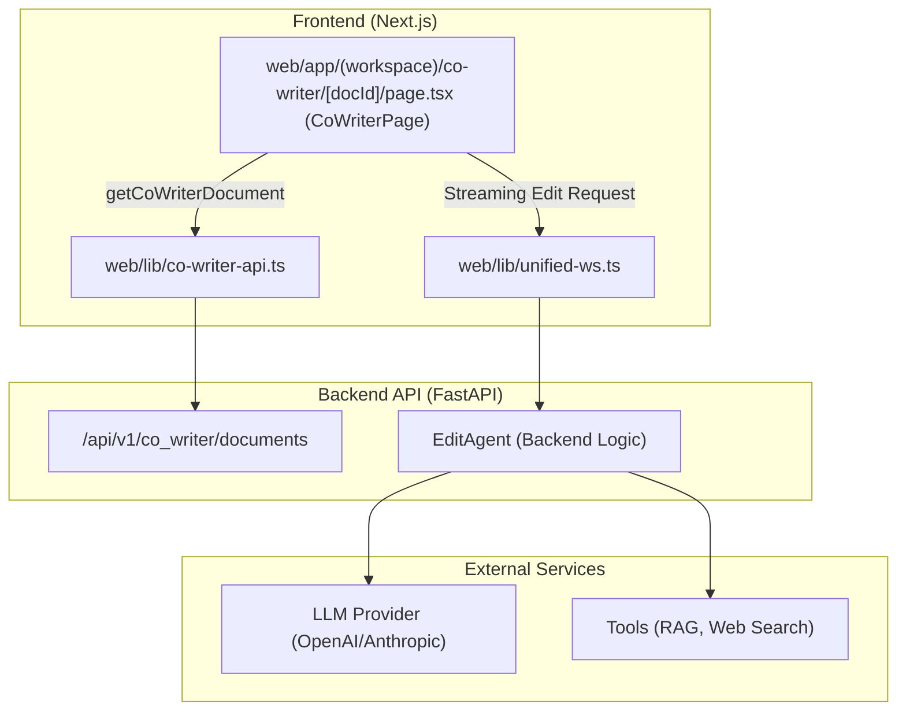
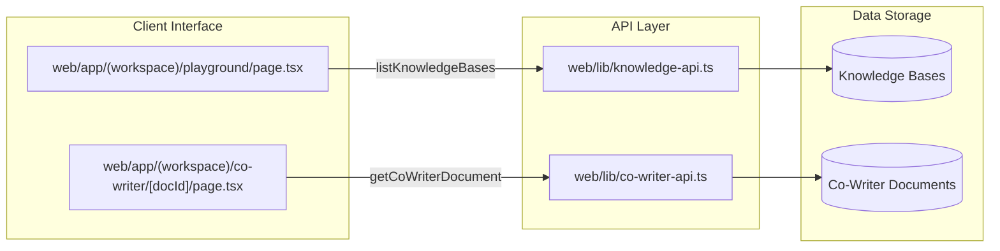

# 아이디어 생성과 Co-Writer

관련 소스 파일

다음 파일들은 이 위키 페이지를 생성할 때 참고한 컨텍스트로 사용되었습니다:

- [web/app/(workspace)/co-writer/[docId]/page.tsx](web/app/(workspace)/co-writer/[docId]/page.tsx)
- [web/app/(workspace)/playground/page.tsx](web/app/(workspace)/playground/page.tsx)
- [web/components/chat/preview/previewers/useTextSource.ts](web/components/chat/preview/previewers/useTextSource.ts)
- [web/components/notebook/SaveToNotebookModal.tsx](web/components/notebook/SaveToNotebookModal.tsx)
- [web/components/sidebar/BookRecent.tsx](web/components/sidebar/BookRecent.tsx)
- [web/lib/co-writer-api.ts](web/lib/co-writer-api.ts)
- [web/lib/knowledge-api.ts](web/lib/knowledge-api.ts)
- [web/lib/notebook-api.ts](web/lib/notebook-api.ts)

## 목적과 범위

이 페이지는 DeepTutor 내부의 자동 아이디어 생성 워크플로와 대화형 마크다운 공동 작성 시스템을 설명합니다. 이 모듈들은 두 가지 서로 다른 모드를 통해 창의적 지식 합성과 콘텐츠 생성을 지원합니다:

- **아이디어 생성**: 지식 베이스 자료를 처리해 구조화된 학습 방향을 산출하는 체계적인 브레인스토밍 엔진입니다. 일반적으로 Quiz Generation과 Book Engine 파이프라인에 통합됩니다.
- **Co-Writer**: 문서 중심의 대화형 편집 환경입니다. 이 환경은 사용자가 마크다운 초안을 다시 쓰거나, 확장하거나, 다듬는 작업을 돕기 위해 멀티툴 추론(RAG, web search, code execution)이 가능한 `EditAgent`를 제공합니다 [web/lib/co-writer-api.ts:41-54]().

---

## Co-Writer 모듈

### 개요
Co-Writer는 정교한 마크다운 편집 경험을 제공합니다. 표준 채팅 인터페이스와 달리 문서 인식이 가능하여, 사용자가 특정 텍스트 구간을 선택해 AI 지원 변환을 수행할 수 있습니다 [web/app/(workspace)/co-writer/[docId]/page.tsx:206-214](). `CoWriterPage`의 프론트엔드 구현은 분할 화면 비율, 스크롤 동기화, 로컬 초안 자동 저장을 포함한 복잡한 상태를 관리합니다 [web/app/(workspace)/co-writer/[docId]/page.tsx:75-80]().

**핵심 기능:**
- **대화형 편집**: 선택된 텍스트에 대해 `rewrite`, `shorten`, `expand` 같은 구체적인 작업을 지원합니다 [web/app/(workspace)/co-writer/[docId]/page.tsx:82-86]().
- **에이전틱 파이프라인**: ReAct 스타일 루프를 사용해 편집기가 작성 과정 중 사실을 검증하기 위해 웹 검색이나 RAG 조회를 수행할 수 있습니다 [web/app/(workspace)/co-writer/[docId]/page.tsx:63-68]().
- **도구 통합**: 사용자는 각 편집 작업마다 `rag`와 `web`(Web Search) 같은 특정 도구를 켜고 끌 수 있습니다 [web/app/(workspace)/co-writer/[docId]/page.tsx:88-91]().

### 프론트엔드 구현과 데이터 흐름
`CoWriterPage` 컴포넌트는 편집기(Markdown/Textarea)와 백엔드 `EditAgent` 사이의 상호작용을 오케스트레이션합니다. 이 컴포넌트는 지역화된 편집을 수행하기 위해 `selectedRange`를 추적합니다 [web/app/(workspace)/co-writer/[docId]/page.tsx:206-209]().

**주요 함수:**
- `updateCoWriterDocument`: 문서 변경 사항(제목과 내용)을 백엔드 저장소에 영속화합니다 [web/lib/co-writer-api.ts:68-84]().
- `handleSelectionEdit`: 사용자가 텍스트 선택에 대해 AI 편집을 요청할 때 트리거됩니다. 이 함수는 스트리밍 WebSocket 또는 POST 요청을 통해 지시와 컨텍스트를 백엔드로 보냅니다 [web/app/(workspace)/co-writer/[docId]/page.tsx:209-214]().
- `SelectionTraceData`: 도구 호출과 결과를 포함한 AI의 추론 과정을 "Trace" 패널에 캡처하고 표시합니다 [web/app/(workspace)/co-writer/[docId]/page.tsx:122-135]().

### Co-Writer 시스템 아키텍처

Title: Co-Writer Frontend-Backend Interaction

Sources: [web/app/(workspace)/co-writer/[docId]/page.tsx:44-50](), [web/lib/co-writer-api.ts:56-66](), [web/lib/co-writer-api.ts:68-84]()

---

## 아이디어 생성과 지식 통합

### 개요
아이디어 생성 워크플로는 원시 주제를 구조화된 후보 방향으로 전환하는 과정을 지원합니다. Playground와 Chat 인터페이스에서는 이 기능이 종종 `brainstorm` 도구로 노출됩니다 [web/app/(workspace)/playground/page.tsx:59-66]().

### Playground 통합
`Playground` 페이지는 개발자와 고급 사용자가 공동 작성과 브레인스토밍에 사용되는 도구를 포함해 다양한 에이전트의 아이디어 구상 및 도구 호출 기능을 시험할 수 있게 합니다 [web/app/(workspace)/playground/page.tsx:1-25]().

**주요 로직:**
- **도구 매핑**: UI는 `brainstorm`과 `rag` 같은 내부 도구 이름을 특정 아이콘과 레이블로 매핑합니다 [web/app/(workspace)/playground/page.tsx:59-75]().
- **기능 실행**: `deep_solve`나 `deep_research` 같은 기능을 트리거해 아이디어를 생성하거나 복잡한 문제를 해결할 수 있으며, 결과는 Co-Writer에서 렌더링 가능합니다 [web/app/(workspace)/playground/page.tsx:77-91]().

### 지식 기반 아이디어 구상 흐름

Title: Knowledge Base and Tool Integration

Sources: [web/lib/knowledge-api.ts:95-113](), [web/lib/co-writer-api.ts:31-39](), [web/app/(workspace)/playground/page.tsx:36-46]()

---

## Notebook 통합

Co-Writer와 아이디어 생성 시스템은 통합된 `Notebook` 시스템과 연동됩니다. 사용자는 장기 보존을 위해 초안이나 생성된 채팅 기록을 노트북에 직접 저장할 수 있습니다 [web/components/notebook/SaveToNotebookModal.tsx:29-36]().

**저장 워크플로:**
- **Payload 구성**: 시스템은 레코드 유형(`co_writer`, `research`, `solve` 등), 제목, 마크다운 출력을 포함한 `NotebookSavePayload`를 구성합니다 [web/components/notebook/SaveToNotebookModal.tsx:29-36]().
- **선택 모드**: 사용자는 저장할 기록에 어떤 turn(사용자 질의 + assistant 응답)을 포함할지 선택할 수 있으며, 이는 특히 아이디어 구상 세션에 유용합니다 [web/components/notebook/SaveToNotebookModal.tsx:47-57]().
- **영속성**: 기록은 `/api/v1/notebook` 엔드포인트를 통해 저장되며, 이를 custom notebook으로 정리할 수 있습니다 [web/lib/notebook-api.ts:45-52]().

### 데이터 모델

| 기능 | 엔티티 | 설명 |
| :--- | :--- | :--- |
| **Document Summary** | `CoWriterDocumentSummary` | 문서 목록을 위한 메타데이터(ID, 제목, 미리보기) [web/lib/co-writer-api.ts:5-11]() |
| **Document Content** | `CoWriterDocument` | 마크다운 내용을 포함한 전체 문서 데이터 [web/lib/co-writer-api.ts:13-19]() |
| **Notebook Record** | `NotebookRecordItem` | 아이디어 구상 또는 작성 세션의 저장된 스냅샷 [web/lib/notebook-api.ts:29-39]() |
| **Record Types** | `NotebookRecordType` | 소스 모듈의 열거형: `solve`, `question`, `research`, `chat`, `co_writer`, `tutorbot` [web/lib/notebook-api.ts:10-16]() |

Sources: [web/lib/co-writer-api.ts:5-19](), [web/lib/notebook-api.ts:10-16](), [web/components/notebook/SaveToNotebookModal.tsx:21-27]()
