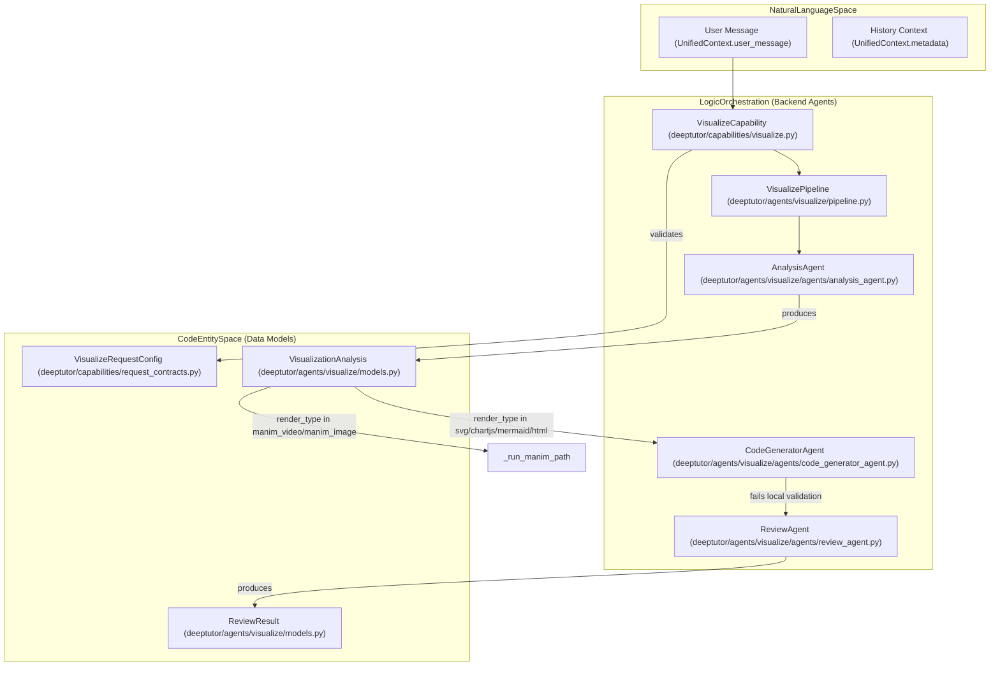
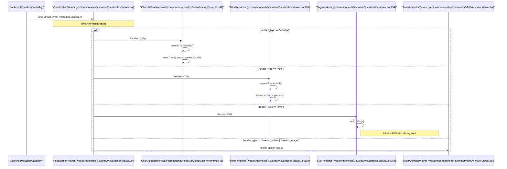

# Visualization Agent

관련 소스 파일

다음 파일들은 이 위키 페이지를 생성할 때 참고한 컨텍스트로 사용되었습니다:

- [deeptutor/agents/visualize/agents/code_generator_agent.py](deeptutor/agents/visualize/agents/code_generator_agent.py)
- [deeptutor/agents/visualize/agents/review_agent.py](deeptutor/agents/visualize/agents/review_agent.py)
- [deeptutor/agents/visualize/models.py](deeptutor/agents/visualize/models.py)
- [deeptutor/agents/visualize/pipeline.py](deeptutor/agents/visualize/pipeline.py)
- [deeptutor/agents/visualize/prompts/en/analysis_agent.yaml](deeptutor/agents/visualize/prompts/en/analysis_agent.yaml)
- [deeptutor/agents/visualize/prompts/en/code_generator_agent.yaml](deeptutor/agents/visualize/prompts/en/code_generator_agent.yaml)
- [deeptutor/agents/visualize/prompts/en/review_agent.yaml](deeptutor/agents/visualize/prompts/en/review_agent.yaml)
- [deeptutor/agents/visualize/prompts/zh/analysis_agent.yaml](deeptutor/agents/visualize/prompts/zh/analysis_agent.yaml)
- [deeptutor/agents/visualize/prompts/zh/code_generator_agent.yaml](deeptutor/agents/visualize/prompts/zh/code_generator_agent.yaml)
- [deeptutor/agents/visualize/prompts/zh/review_agent.yaml](deeptutor/agents/visualize/prompts/zh/review_agent.yaml)
- [deeptutor/agents/visualize/utils.py](deeptutor/agents/visualize/utils.py)
- [deeptutor/book/blocks/figure.py](deeptutor/book/blocks/figure.py)
- [deeptutor/book/blocks/interactive.py](deeptutor/book/blocks/interactive.py)
- [deeptutor/capabilities/prompts/en/visualize.yaml](deeptutor/capabilities/prompts/en/visualize.yaml)
- [deeptutor/capabilities/prompts/zh/visualize.yaml](deeptutor/capabilities/prompts/zh/visualize.yaml)
- [deeptutor/capabilities/visualize.py](deeptutor/capabilities/visualize.py)
- [tests/capabilities/test_answer_now.py](tests/capabilities/test_answer_now.py)
- [tests/core/test_capabilities_runtime.py](tests/core/test_capabilities_runtime.py)
- [web/components/visualize/VisualizationViewer.tsx](web/components/visualize/VisualizationViewer.tsx)
- [web/components/visualize/svg-theme.css](web/components/visualize/svg-theme.css)
- [web/lib/iframe-html.ts](web/lib/iframe-html.ts)

**Visualization Agent**는 자연어 데이터 설명이나 요청을 대화형 고품질 시각 표현으로 변환하도록 설계된 DeepTutor 내부의 특화 파이프라인입니다. 이 모듈은 다단계 에이전틱 워크플로를 사용해 요구사항을 분석하고, 코드를 생성하며, 결정론적 로컬 검증과 목표 지향적 수정을 통해 품질 보증을 수행합니다.

## 개요

시각화 시스템은 텍스트 기반 그래픽과 수학 애니메이션으로 분류되는 6가지 주요 렌더링 엔진을 지원합니다:
1.  **Chart.js**: 정량 데이터용(bar, line, pie, radar 등) [deeptutor/capabilities/visualize.py:5-9]().
2.  **Mermaid.js**: 구조화된 다이어그램용(flowchart, sequence diagram, mindmap 등) [deeptutor/capabilities/visualize.py:5-9]().
3.  **SVG**: 정확한 좌표 제어와 테마 인식이 필요한 사용자 정의 일러스트레이션이나 자유형 그래픽용 [deeptutor/capabilities/visualize.py:5-9]().
4.  **HTML**: 샌드박스 iframe이 필요한 복잡하거나 대화형이거나 여러 라이브러리를 쓰는 시각화용 [deeptutor/capabilities/visualize.py:5-9]().
5.  **Manim Video**: Manim 서브프로세스를 통해 MP4로 렌더링되는 고품질 수학 애니메이션 [deeptutor/capabilities/visualize.py:47-48]().
6.  **Manim Image**: 정적 프레임으로 렌더링되는 고품질 수학 스토리보드 [deeptutor/capabilities/visualize.py:47-48]().

## 시스템 아키텍처

이 파이프라인은 텍스트 기반 렌더링에 대해 "Analyze -> Generate -> Review/Repair" 패턴을 따릅니다. 수학 애니메이션의 경우, 초기 분석 단계 이후 특화된 Manim 경로로 분기됩니다 [deeptutor/capabilities/visualize.py:116-126]().

### 파이프라인 데이터 흐름

다음 다이어그램은 사용자의 자연어 요청이 최종 코드 엔티티 공간으로 전환되는 과정을 보여주며, 특히 검증에 사용되는 Pydantic 모델과 표준 시각화와 Manim 렌더링 간의 분기를 강조합니다.

**자연어에서 코드 엔티티로의 매핑**

**Sources:** [deeptutor/capabilities/visualize.py:63-141](), [deeptutor/agents/visualize/pipeline.py:13-41](), [deeptutor/agents/visualize/agents/code_generator_agent.py:14-29](), [deeptutor/capabilities/request_contracts.py:19-23]()

### 구성 요소 세부 사항

#### 1. AnalysisAgent
`AnalysisAgent`는 사용자의 의도에 따라 가장 적절한 `render_type`과 `visual_genre`(예: flowchart, structural, illustrative)를 결정합니다 [deeptutor/agents/visualize/prompts/en/analysis_agent.yaml:27-44](). 이 에이전트는 고수준 설명과 필요한 시각 요소를 포함한 `VisualizationAnalysis` 객체를 출력합니다 [deeptutor/agents/visualize/models.py:10-25]().

#### 2. CodeGeneratorAgent
`CodeGeneratorAgent`는 실제 코드 payload를 생성합니다. 이 에이전트는 형식별 규칙 블록(예: `rules_svg`, `rules_chartjs`)을 사용해 출력이 선택된 엔진에 최적화되도록 합니다 [deeptutor/agents/visualize/prompts/en/code_generator_agent.yaml:33-111]().
*   **SVG 테마 인식**: 에이전트는 하드코딩 색상 대신 미리 정의된 CSS 클래스(예: `.c-blue`, `.th`, `.box`)를 사용하도록 지시받아, 그림이 애플리케이션의 라이트/다크 테마를 자동으로 따르게 합니다 [deeptutor/agents/visualize/prompts/en/code_generator_agent.yaml:53-64]().
*   **견고한 추출**: `extract_code_block`을 사용해 LLM 산문에서 코드를 분리하고, SVG와 HTML 루트 요소에 대해 방어적 태그 정리(tag trimming)를 수행합니다 [deeptutor/agents/visualize/agents/code_generator_agent.py:87-119]().

#### 3. Deterministic Validation & ReviewAgent
열린 형식의 LLM 검토 대신, 시스템은 결정론적 로컬 검사를 사용합니다(SVG의 XML well-formedness, Chart.js의 엄격한 JSON 등) [deeptutor/capabilities/visualize.py:148-154]().
*   **목표 지향적 수정**: 검증에 실패하면, `ReviewAgent`가 구체적인 오류 메시지와 함께 호출되어 최소한의 표적 수정만 수행합니다 [deeptutor/agents/visualize/agents/review_agent.py:31-44]().
*   **HTML 폴백**: HTML 문서는 클 수 있으므로 수정 루프를 건너뜁니다. 렌더할 수 없으면 시스템은 최소한의 폴백 템플릿을 제공합니다 [deeptutor/capabilities/visualize.py:170-185]().

## 프론트엔드 렌더링

`VisualizationViewer` 컴포넌트는 생성된 코드를 안전하게 렌더링하고, HTML에 대해 전체화면 모드와 "Open in New Tab" 같은 상호작용 기능을 제공합니다 [web/components/visualize/VisualizationViewer.tsx:1-11]().

### 컴포넌트 상호작용 다이어그램

**프론트엔드 렌더링 컴포넌트 맵**

**Sources:** [web/components/visualize/VisualizationViewer.tsx:41-108](), [web/components/visualize/VisualizationViewer.tsx:110-185](), [web/components/visualize/VisualizationViewer.tsx:254-285](), [web/lib/visualize-types.ts:10-11]()

### 주요 프론트엔드 구현 세부 사항
*   **SVG 정화**: `sanitizeSvg` 함수는 원시 문자열을 XML로 파싱하고, SVG를 DOM에 인라인하기 전에 `<script>`나 이벤트 핸들러 같은 잠재적 XSS 벡터를 제거합니다 [web/components/visualize/VisualizationViewer.tsx:195-212]().
*   **테마 통합**: `svg-theme.css` 파일은 `CodeGeneratorAgent`가 사용하는 색상 그라데이션(예: `.c-teal`, `.c-coral`)을 정의합니다. 이 파일은 CSS 변수를 사용해 라이트/다크 모드 팔레트를 전환합니다 [web/components/visualize/svg-theme.css:108-154]().
*   **Iframe 브리지**: `HtmlRenderer`는 샌드박스 iframe에서 오는 메시지를 수신하며, 이를 통해 시각화가 `sendPrompt()`를 통해 새 채팅 프롬프트를 트리거하거나 콘텐츠 높이를 보고할 수 있게 합니다 [web/components/visualize/VisualizationViewer.tsx:125-144]().

## 데이터 모델

### VisualizationAnalysis
`AnalysisAgent`가 생성하는 구조화된 브리프입니다 [deeptutor/agents/visualize/models.py:10-25]().

| Field | Type | Description |
| :--- | :--- | :--- |
| `render_type` | `str` | 엔진 구분자(svg, chartjs, mermaid, html 등). |
| `visual_genre` | `str` | 그리기 스타일(flowchart, structural, illustrative 등). |
| `description` | `str` | 시각화의 고수준 목표. |
| `chart_type` | `str` | 하위 유형(예: Chart.js의 "bar" 또는 Mermaid의 "sequenceDiagram"). |
| `visual_elements` | `list[str]` | 렌더에 포함할 구체적 구성 요소. |

### ReviewResult
표적 수정 단계의 출력입니다 [deeptutor/agents/visualize/models.py:40-46]().

| Field | Type | Description |
| :--- | :--- | :--- |
| `optimized_code` | `str` | 수정되고 렌더 가능한 코드 블록. |
| `changed` | `bool` | 원래 코드가 수정되었는지 여부. |
| `review_notes` | `str` | `ReviewAgent`가 수행한 수정의 요약. |

**Sources:** [deeptutor/agents/visualize/models.py:10-46](), [deeptutor/capabilities/visualize.py:35-45]()
