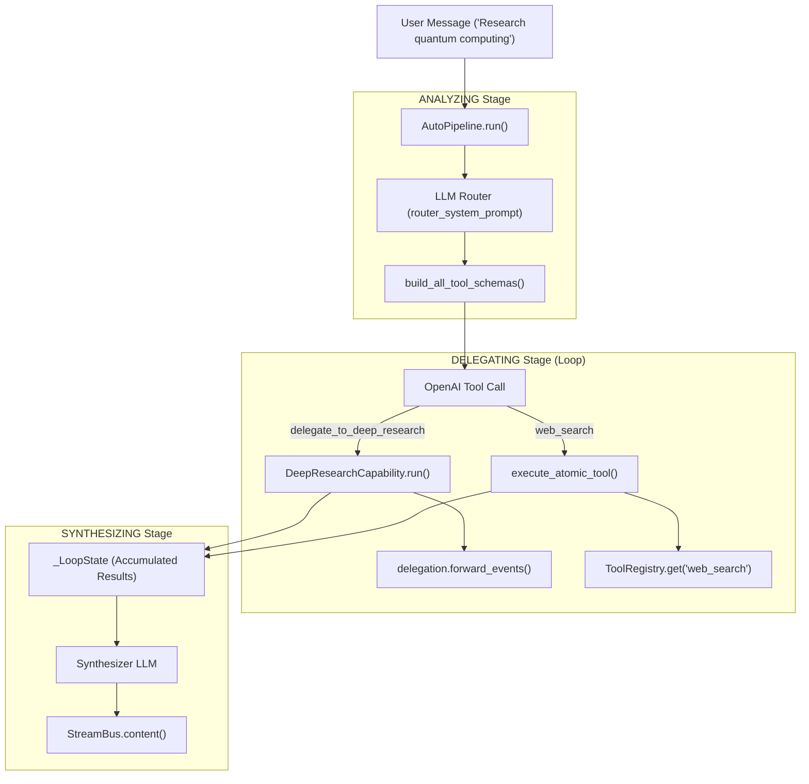
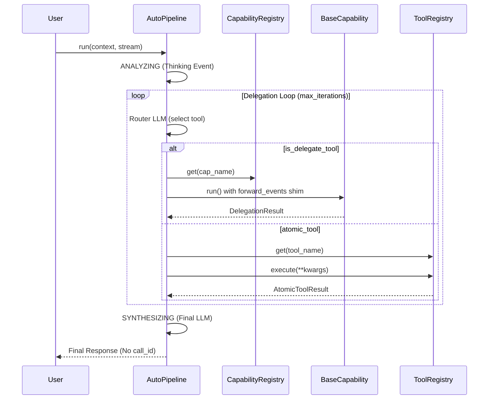

# Auto Mode

관련 소스 파일

다음 파일들은 이 위키 페이지를 생성할 때 참고한 컨텍스트로 사용되었습니다:

- [AGENTS.md](AGENTS.md)
- [SKILL.md](SKILL.md)
- [deeptutor/agents/_shared/tool_composition.py](deeptutor/agents/_shared/tool_composition.py)
- [deeptutor/agents/chat/agent_loop.py](deeptutor/agents/chat/agent_loop.py)
- [deeptutor/agents/chat/prompt_blocks.py](deeptutor/agents/chat/prompt_blocks.py)
- [deeptutor/agents/research/pipeline.py](deeptutor/agents/research/pipeline.py)
- [deeptutor/app/facade.py](deeptutor/app/facade.py)
- [deeptutor/capabilities/_answer_now.py](deeptutor/capabilities/_answer_now.py)
- [deeptutor/capabilities/deep_research.py](deeptutor/capabilities/deep_research.py)
- [deeptutor/capabilities/deep_solve.py](deeptutor/capabilities/deep_solve.py)
- [deeptutor/capabilities/mastery_path.py](deeptutor/capabilities/mastery_path.py)
- [deeptutor/capabilities/math_animator.py](deeptutor/capabilities/math_animator.py)
- [deeptutor/loop_plugins/__init__.py](deeptutor/loop_plugins/__init__.py)
- [deeptutor/loop_plugins/mastery/__init__.py](deeptutor/loop_plugins/mastery/__init__.py)
- [deeptutor/loop_plugins/mastery/plugin.py](deeptutor/loop_plugins/mastery/plugin.py)
- [deeptutor/tools/builtin/__init__.py](deeptutor/tools/builtin/__init__.py)
- [deeptutor/tools/paper_search_tool.py](deeptutor/tools/paper_search_tool.py)
- [tests/capabilities/__init__.py](tests/capabilities/__init__.py)
- [web/lib/unified-ws.ts](web/lib/unified-ws.ts)

**Auto Mode**(`AutoPipeline`로 구현)는 시스템의 특화된 기능을 동적으로 오케스트레이션하는 3단계 에이전틱 라우터입니다. 사용자가 "Deep Research"나 "Smart Solver" 같은 특정 모드를 수동으로 고를 필요 없이, Auto Mode는 사용자의 의도를 분석하고, 작업을 가장 적합한 하위 기능 또는 원자 도구에 위임한 뒤, 최종 응답을 합성합니다. 이는 `CapabilityRegistry`에서 `auto` 기능으로 노출됩니다 [deeptutor/runtime/bootstrap/builtin_capabilities.py:12-18]().

## 개요

Auto Mode는 사용자의 요청 생명주기를 **ANALYZING**, **DELEGATING**, **SYNTHESIZING**의 세 가지 뚜렷한 단계로 관리하는 고수준 "메타 에이전트"로 동작합니다 [deeptutor/agents/auto/auto_pipeline.py:3-21](). 이 모듈은 독립적인 재시도 예산, 무한 루프를 방지하는 동일 기능 쿼터, 그리고 `answer_now`를 통한 즉시 중단용 "fast-path" 메커니즘을 포함한 고급 트래픽 제어를 제공합니다.

### 핵심 구성 요소
- **AutoPipeline**: `_LoopState`를 통해 3단계 생명주기와 루프 상태를 관리하는 핵심 오케스트레이터입니다 [deeptutor/agents/auto/auto_pipeline.py:105-132]().
- **Capability Router**: 자연어 의도를 `delegate_to_<capability>` 도구 호출이나 원자 도구 실행으로 매핑하는 LLM 기반 로직입니다 [deeptutor/agents/auto/schemas.py:1-14]().
- **Delegation Module**: `rag`나 `web_search` 같은 하위 기능과 원자 도구의 순차적 디스패치를 처리합니다 [deeptutor/agents/auto/delegation.py:1-20]().
- **ForwardEvents Shim**: 대화 기록이 중간 "thinking"으로 오염되지 않도록 하면서 하위 기능의 이벤트를 메인 `StreamBus`로 스트리밍하는 메커니즘입니다 [deeptutor/agents/auto/auto_pipeline.py:36-43]().

**Sources:** [deeptutor/agents/auto/auto_pipeline.py:3-43](), [deeptutor/agents/auto/schemas.py:1-14]()

---

## 3단계 파이프라인

Auto Mode는 다음 단계들을 따라 선형적으로 진행되지만, 위임 단계에서는 `max_iterations`까지 반복될 수 있습니다 [deeptutor/agents/auto/auto_pipeline.py:7-18]().

### 1. ANALYZING 단계
이 단계에서는 도구를 사용하지 않은 초기 LLM 호출을 수행해 사용자의 의도를 확인하고 "thinking" 추적을 제공합니다. 이는 즉각적인 피드백을 위해 `thinking` 이벤트로 스트리밍됩니다 [deeptutor/agents/auto/auto_pipeline.py:5-6]().

### 2. DELEGATING 단계
라우터 LLM에는 `delegate_to_<cap>` 함수와 원자 도구의 결합 스키마가 제공됩니다 [deeptutor/agents/auto/schemas.py:134-144]().
1. **도구 선택**: LLM은 하위 기능(예: `deep_solve`) 또는 원자 도구(예: `web_search`)를 선택합니다 [deeptutor/agents/auto/delegation.py:57-62]().
2. **쿼터 강제**: 파이프라인은 `same_cap_calls`를 추적하고 기본값 2의 제한을 적용해 라우터가 하나의 기능에 갇히는 것을 막습니다 [deeptutor/agents/auto/auto_pipeline.py:13-14]().
3. **실행**: 원자 도구는 `ToolRegistry`를 통해 디스패치되고, 기능은 재시도 예산(`per_delegation_retries`)과 함께 호출됩니다 [deeptutor/agents/auto/auto_pipeline.py:15-17]().

### 3. SYNTHESIZING 단계
위임 루프가 자연어 텍스트로 종료되면 그 텍스트가 그대로 방출됩니다. 그렇지 않고 루프가 반복 횟수를 모두 소진하면, 최종 `synthesizer` LLM 호출이 모든 도구 결과와 위임 결과의 누적 추적을 바탕으로 답변을 생성합니다 [deeptutor/agents/auto/auto_pipeline.py:19-21]().

### 데이터 흐름 다이어그램: 의도에서 실행까지
다음 다이어그램은 자연어가 코드 수준의 기능 및 도구 실행으로 어떻게 변환되는지 보여줍니다.

**자연어에서 코드 엔티티 공간으로**

**Sources:** [deeptutor/agents/auto/auto_pipeline.py:132-164](), [deeptutor/agents/auto/schemas.py:134-144](), [deeptutor/agents/auto/delegation.py:57-62]()

---

## 고급 기능

### Answer Now 빠른 경로
Auto Mode는 범용 "Answer Now" 중단 기능을 지원합니다. 사용자가 UI나 특정 신호를 통해 조기 종료를 트리거하면, 파이프라인은 표준 단계를 건너뛰고 `_run_answer_now`를 호출합니다 [deeptutor/agents/auto/auto_pipeline.py:156-159](). 이때 `extract_answer_now_context`를 사용해 부분 실행 추적을 가져오고 `format_trace_summary`를 사용해 "최선 노력" 합성을 제공합니다 [deeptutor/capabilities/_answer_now.py:58-81]().

### 대화 기록 비오염
중간 에이전트 단계가 채팅 기록을 어지럽히지 않도록 하기 위해:
- **전달**: 하위 기능 이벤트는 `forward_events`를 통해 흐르며, `content` 이벤트에 `call_id`를 주입합니다 [deeptutor/agents/auto/auto_pipeline.py:38-40]().
- **필터링**: 시스템의 turn 런타임은 이 `call_id` 마커를 사용해 내부 assistant 콘텐츠를 식별하고 제거하며, 최종 합성만 영구 대화 기록에 도달하도록 보장합니다 [deeptutor/agents/auto/auto_pipeline.py:41-42]().

### 재시도 예산과 쿼터
안정성은 `AutoRequestConfig`에 정의된 별도의 재시도 예산과 제한을 통해 유지됩니다 [deeptutor/agents/auto/auto_pipeline.py:25-29]():

| Budget / Limit | Implementation Detail | Default |
| :--- | :--- | :--- |
| **Router LLM Retries** | 일시적인 API 오류(예: `APIError`, `TimeoutError`)에 대한 재시도. | 3 |
| **Per-Delegation Retries** | 하위 기능이 예외를 발생시키거나 `error` 이벤트를 방출할 때 재시도. | 3 |
| **Same-Capability Quota** | 한 turn에서 같은 기능으로 보낼 수 있는 최대 성공 호출 수(루프 방지). | 2 |
| **Max Iterations** | 허용되는 총 도구 호출 루프 수. | 10 |

**Sources:** [deeptutor/agents/auto/auto_pipeline.py:23-34](), [deeptutor/agents/auto/auto_pipeline.py:105-125]()

---

## 실행 로직과 도구 디스패치

다음 다이어그램은 고수준 `AutoPipeline` 로직과 하위 도구 및 기능 레지스트리 엔티티를 연결합니다.

**Auto Mode 로직 흐름**

**Sources:** [deeptutor/agents/auto/auto_pipeline.py:152-163](), [deeptutor/agents/auto/schemas.py:147-156](), [deeptutor/agents/auto/delegation.py:57-62]()

---

## 기능 위임 표

Auto Mode는 자신과 `chat`을 제외한 모든 등록된 기능에 대한 스키마를 생성합니다 [deeptutor/agents/auto/schemas.py:23-26](). 선택은 각 모듈의 `CapabilityManifest`에 의해 결정됩니다.

| Intent | Delegated Capability | Key Tools Exposed |
| :--- | :--- | :--- |
| Multi-step problem solving | `deep_solve` | `rag`, `web_search`, `code_execution`, `reason` [deeptutor/capabilities/deep_solve.py:23-24]() |
| Iterative deep research | `deep_research` | `rag`, `web_search`, `paper_search`, `code_execution` [deeptutor/capabilities/deep_research.py:42]() |
| Question/Quiz generation | `deep_question` | `rag`, `web_search`, `code_execution` [deeptutor/capabilities/deep_question.py:31]() |
| Math animation/Manim | `math_animator` | `render_output` [deeptutor/capabilities/math_animator.py:34]() |
| Mastery Learning | `mastery_path` | `mastery_status`, `mastery_quiz`, `rag` [deeptutor/capabilities/mastery_path.py:65]() |

**Sources:** [deeptutor/capabilities/deep_solve.py:18-26](), [deeptutor/capabilities/deep_research.py:38-45](), [deeptutor/capabilities/math_animator.py:20-39](), [deeptutor/capabilities/mastery_path.py:58-67]()
