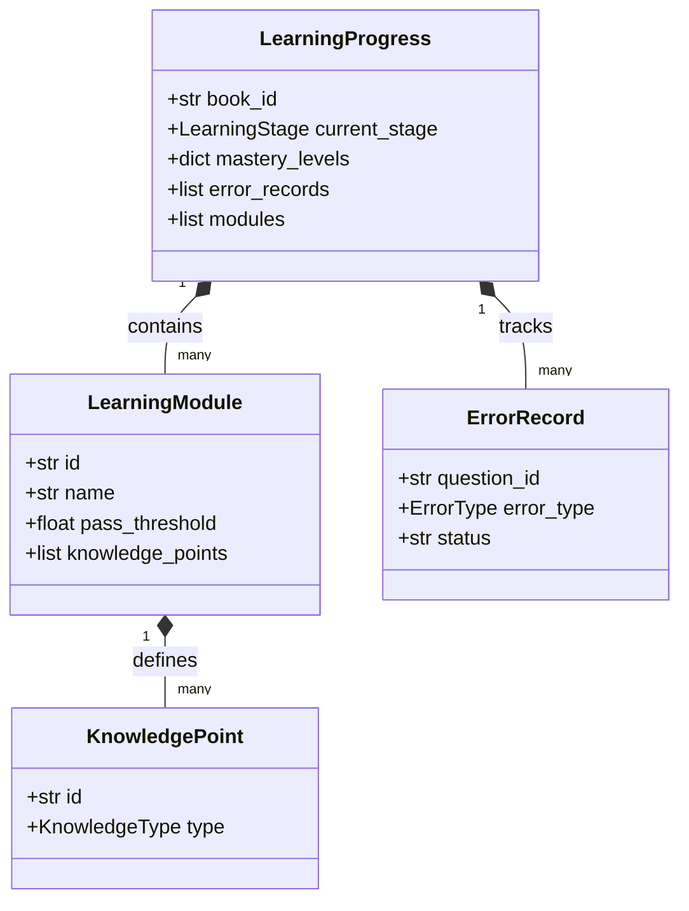
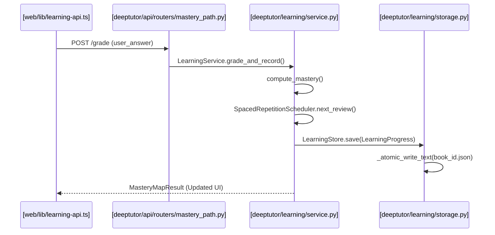

# Mastery Path 학습 엔진

<details>
<summary>관련 소스 파일</summary>

다음 파일들은 이 위키 페이지를 생성할 때 참고한 컨텍스트로 사용되었습니다:

- [deeptutor/learning/models.py](deeptutor/learning/models.py)
- [deeptutor/learning/service.py](deeptutor/learning/service.py)
- [deeptutor/learning/tests/test_api_endpoints.py](deeptutor/learning/tests/test_api_endpoints.py)
- [deeptutor/learning/tests/test_guided_mastery_updates.py](deeptutor/learning/tests/test_guided_mastery_updates.py)
- [deeptutor/learning/tests/test_models.py](deeptutor/learning/tests/test_models.py)
- [deeptutor/learning/tests/test_scheduler.py](deeptutor/learning/tests/test_scheduler.py)
- [deeptutor/learning/tests/test_service_replace_merge.py](deeptutor/learning/tests/test_service_replace_merge.py)
- [deeptutor/learning/tests/test_storage.py](deeptutor/learning/tests/test_storage.py)
- [web/app/(workspace)/learning/page.tsx](web/app/(workspace)/learning/page.tsx)
- [web/app/globals.css](web/app/globals.css)
- [web/components/sidebar/SidebarShell.tsx](web/components/sidebar/SidebarShell.tsx)
- [web/components/ui/Tooltip.tsx](web/components/ui/Tooltip.tsx)
- [web/lib/learning-api.ts](web/lib/learning-api.ts)
- [web/locales/en/app.json](web/locales/en/app.json)
- [web/locales/zh/app.json](web/locales/zh/app.json)

</details>


**Mastery Path 학습 엔진**은 학습자를 초기 노출 단계에서 검증된 숙달 상태로 이동시키기 위해 설계된 DeepTutor 내부의 포괄적인 교육 하위 시스템입니다. 표준 채팅 기반 튜터링과 달리, Mastery Path는 정성적·정량적 성과를 기반으로 하는 "hard gates"를 강제하며, 장기 기억 유지를 위해 간격 반복 스케줄러와 통합되어 있습니다.

이 엔진은 "Path"의 생명주기, 즉 학습 모듈과 지식 포인트로 구성된 구조화된 집합을 관리하며, 진행 상황을 원자적 파일 기반 저장소에 영속화합니다.

## 학습 워크플로와 단계

이 엔진은 `LearningStage` enum으로 정의된 유한 상태 기계를 통해 동작합니다. 일반적인 학습 흐름은 초기 진단에서 시작해 교수, 능동 회상, 주기적 복습으로 진행됩니다.

```mermaid
graph TD
    subgraph "Mastery Loop"
    [LearningStage.DIAGNOSTIC] -->|"Assessment"| [LearningStage.EXPLAIN]
    [LearningStage.EXPLAIN] -->|"Instruction"| [LearningStage.FEYNMAN_CHECK]
    [LearningStage.FEYNMAN_CHECK] -->|"Qualitative Gate"| [LearningStage.PRACTICE]
    [LearningStage.PRACTICE] -->|"Quantitative Gate"| [LearningStage.ERROR_DIAGNOSIS]
    [LearningStage.ERROR_DIAGNOSIS] -->|"Correction"| [LearningStage.REVIEW]
    [LearningStage.REVIEW] -->|"Spaced Repetition"| [LearningStage.COMPLETED]
    end

    [LearningService.init_modules] --> [LearningStage.DIAGNOSTIC]
    [LearningService.grade_and_record] -.->|"Triggers State Transition"| [LearningStage]
```

*   **Diagnostic**: 각 Knowledge Point(KP)에 대한 학습자의 시작 수준을 판단하기 위한 초기 평가입니다 [deeptutor/learning/models.py:66-66]().
*   **Explain & Feynman Check**: 튜터가 개념 설명을 제공한 뒤, 학습자가 그 개념을 자신의 말로 설명해야 하는 "Feynman Technique" 프롬프트가 이어집니다 [deeptutor/learning/models.py:67-68]().
*   **Practice & Error Diagnosis**: `pass_threshold`(기본 0.7)에 도달하기 위한 표적 연습입니다 [deeptutor/learning/models.py:95-95](). 오류가 발생하면 엔진은 이를 `structural`, `deviation`, `metacognitive` 같은 유형으로 분류합니다 [deeptutor/learning/models.py:36-40]().
*   **Review**: 간격 반복 간격 시퀀스에 따라 예약된 재평가입니다 [deeptutor/learning/models.py:71-71]().

**Sources:**
- [deeptutor/learning/models.py:61-77]() (LearningStage Enum)
- [deeptutor/learning/service.py:77-80]() (Stage advancement logic)

## 핵심 구성 요소

이 엔진은 데이터 모델, 오케스트레이션 서비스, API/프론트엔드 인터페이스의 세 계층으로 구성됩니다.

### 1. Learning Models and Spaced Repetition
이 계층은 지식 표현을 위한 데이터 구조와 기억 유지를 위한 수학적 정책을 정의합니다. 여기에는 mastery level, error record, review queue를 집계하는 `LearningProgress` 컨테이너가 포함됩니다.
자세한 내용은 [Learning Models and Spaced Repetition](#4.9.1)를 참고하세요.

### 2. Learning Service and Grading Pipeline
`LearningService`는 오케스트레이터 역할을 합니다. 이 서비스는 `grade_and_record` 파이프라인을 처리하며, 사용자 답안을 처리하고, 최근성 가중 알고리즘을 사용해 숙달도를 업데이트하고, `ErrorRecord` 객체의 생명주기( `active`에서 `graduated`까지)를 관리합니다.
자세한 내용은 [Learning Service and Grading Pipeline](#4.9.2)를 참고하세요.

### 3. API and Frontend Dashboard
이 시스템은 `mastery_path` REST API를 통해 노출됩니다. 프론트엔드는 "Mastery Map"을 시각화하는 `MasteryPathPage` 대시보드를 제공하며, 모든 모듈과 지식 포인트의 상태를 보여줍니다.

**Sources:**
- [deeptutor/learning/service.py:25-27]() (LearningService class)
- [web/app/(workspace)/learning/page.tsx:37-40]() (MasteryPathPage component)

## 시스템 매핑: 코드에서 개념으로

다음 다이어그램은 고수준 교육 개념과 저장소 내 실제 코드 엔티티 사이의 간극을 연결합니다.

### 데이터 엔티티 매핑
이 다이어그램은 `deeptutor/learning/models.py`에서 학습 개념이 Pydantic 모델로 어떻게 표현되는지 보여줍니다.


**Sources:**
- [deeptutor/learning/models.py:80-214]()

### 실행 파이프라인 매핑
이 다이어그램은 단일 답안 제출이 서비스 계층을 거쳐 저장소 계층으로 흐르는 과정을 보여줍니다.


**Sources:**
- [deeptutor/learning/service.py:161-173]()
- [deeptutor/learning/storage.py:19-35]()
- [web/lib/learning-api.ts:103-111]()

## 주요 데이터 구조

| Entity | Code Symbol | Purpose |
| :--- | :--- | :--- |
| **Path Container** | `LearningProgress` | 특정 책/주제에 대한 모든 사용자 데이터의 루트 객체 |
| **Knowledge Unit** | `KnowledgePoint` | 학습의 가장 작은 단위(Concept, Memory, Procedure, Design) |
| **Grading Record** | `QuizAttempt` | 단일 문제-답변 상호작용의 이력 기록 |
| **Persistence** | `LearningStore` | 로컬 파일 시스템에 대한 원자적 JSON 직렬화를 처리 |
| **Scheduler** | `RepetitionState` | 간격 반복을 위한 `interval_index`와 `next_review_at`을 추적 |

**Sources:**
- [deeptutor/learning/models.py:185-214]()
- [deeptutor/learning/storage.py:13-17]()

## 하위 페이지
*   **[Learning Models and Spaced Repetition](#4.9.1)**: Pydantic 모델, `KnowledgeType` 동작, 스케줄링 알고리즘을 자세히 살펴봅니다.
*   **[Learning Service and Grading Pipeline](#4.9.2)**: `LearningService` 오케스트레이션, Feynman 정성 게이트, REST API 통합을 깊이 있게 다룹니다.
