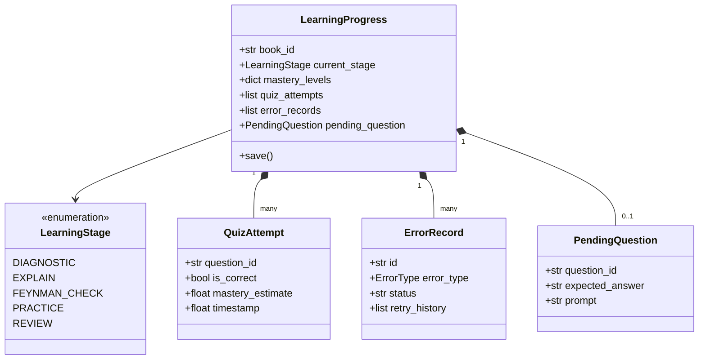
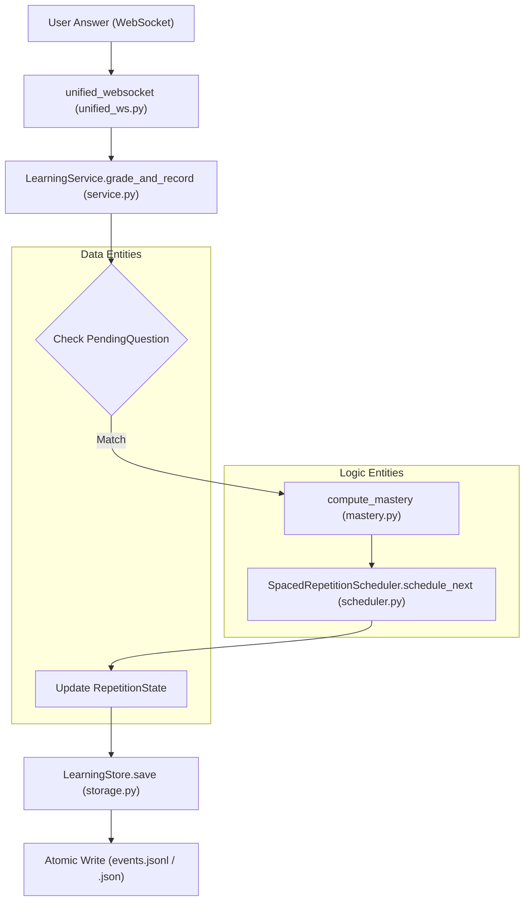

# 학습 모델과 간격 반복

관련 소스 파일

다음 파일들은 이 위키 페이지를 생성할 때 참고한 컨텍스트로 사용되었습니다:

- [deeptutor/api/routers/unified_ws.py](deeptutor/api/routers/unified_ws.py)
- [deeptutor/core/stream.py](deeptutor/core/stream.py)
- [deeptutor/learning/models.py](deeptutor/learning/models.py)
- [deeptutor/learning/scheduler.py](deeptutor/learning/scheduler.py)
- [deeptutor/learning/storage.py](deeptutor/learning/storage.py)
- [deeptutor/learning/tests/test_api_endpoints.py](deeptutor/learning/tests/test_api_endpoints.py)
- [deeptutor/learning/tests/test_guided_mastery_updates.py](deeptutor/learning/tests/test_guided_mastery_updates.py)
- [deeptutor/learning/tests/test_models.py](deeptutor/learning/tests/test_models.py)
- [deeptutor/learning/tests/test_scheduler.py](deeptutor/learning/tests/test_scheduler.py)
- [deeptutor/learning/tests/test_storage.py](deeptutor/learning/tests/test_storage.py)
- [deeptutor/services/session/pocketbase_store.py](deeptutor/services/session/pocketbase_store.py)
- [deeptutor/services/session/turn_runtime.py](deeptutor/services/session/turn_runtime.py)

Mastery Path 학습 엔진은 학습자의 진행 상황을 추적하기 위한 구조화된 Pydantic 모델 집합과, 간격 반복을 구현하는 특화된 스케줄러에 의존합니다. 이 시스템은 학습이 개인화되고, 근거 기반이며, 채팅 turn 전반에 걸쳐 영속적으로 유지되도록 보장합니다.

## 핵심 데이터 모델

시스템은 학습자 상태를 타입 안전하게 표현하기 위해 `deeptutor/learning/models.py`에 정의된 Pydantic 모델을 사용합니다.

### LearningProgress와 상태 Enum
`LearningProgress` 클래스는 특정 "book" 또는 커리큘럼을 따라가는 학습 여정의 루트 컨테이너입니다 [deeptutor/learning/models.py:185-213](). 이 클래스는 `LearningStage` enum을 사용해 학습 루프의 현재 단계를 추적합니다.

| Enum Value | Description |
| :--- | :--- |
| `DIAGNOSTIC` | 기존 지식에 대한 초기 평가. |
| `EXPLAIN` | 튜터가 설명 또는 개념 소개를 제공합니다. |
| `FEYNMAN_CHECK` | 사용자가 개념을 다시 설명하는 정성적 평가. |
| `PRACTICE` | 퀴즈와 문제를 통한 정량적 평가. |
| `ERROR_DIAGNOSIS` | 특정 오개념이나 오류에 대한 심층 분석. |
| `REVIEW` | 이전에 학습한 내용을 위한 간격 반복 단계. |
| `COMPLETED` | 모듈 숙달이 달성됨. |

**Sources:** [deeptutor/learning/models.py:61-72](), [deeptutor/learning/models.py:185-213]()

### 지식과 오류
콘텐츠는 `KnowledgeType`에 따라 분류되며, 이는 간격 반복 간격에 영향을 줍니다. 오류는 표적 교정을 가능하게 하기 위해 `ErrorRecord`로 추적됩니다.

*   **KnowledgeType**: `MEMORY`, `CONCEPT`, `PROCEDURE`, `DESIGN` [deeptutor/learning/models.py:24-28]().
*   **ErrorRecord**: 특정 지식 포인트에 대한 `ErrorType`, AI 확인, `retry_history`를 저장합니다 [deeptutor/learning/models.py:129-142]().
*   **PendingQuestion**: 보류 중인 질문에 대한 서버 측 기록입니다. 이를 통해 모델의 컨텍스트가 turn 사이에 바뀌더라도 `expected_answer`가 안전하게 저장되고 채점이 결정론적으로 유지됩니다 [deeptutor/learning/models.py:164-182]().

**Sources:** [deeptutor/learning/models.py:24-46](), [deeptutor/learning/models.py:129-182]()

## 간격 반복 스케줄러

`SpacedRepetitionScheduler`는 학습자의 성과와 습득 중인 지식 유형에 따라 복습 작업의 시점을 관리합니다.

### 간격 시퀀스
시스템은 각 `KnowledgeType`에 대해 일 단위로 측정되는 `INTERVAL_SEQUENCES`를 정의합니다 [deeptutor/learning/scheduler.py:13-18]().

| Knowledge Type | Sequence (Days) |
| :--- | :--- |
| `MEMORY` | 0, 1, 3, 7, 14, 30, 60 |
| `CONCEPT` | 3, 7, 14, 30 |
| `PROCEDURE` | 3, 7, 14 |
| `DESIGN` | 14, 28 |

**Sources:** [deeptutor/learning/scheduler.py:13-18]()

### 스케줄링 로직
`schedule_next` 함수는 `RepetitionState`를 업데이트합니다 [deeptutor/learning/scheduler.py:45-70]():
1.  **정답**: `interval_index`를 증가시킵니다. 학습자가 연속으로 두 번 정답을 맞히면, 진행 속도를 높이기 위해 인덱스를 2칸 건너뜁니다 [deeptutor/learning/scheduler.py:54-58]().
2.  **오답**: `interval_index`를 감소시키고(최소 0), 연속 정답 카운터를 초기화합니다 [deeptutor/learning/scheduler.py:59-65]().
3.  **큐 구성**: `build_review_queue`는 `ReviewTask` 객체를 생성합니다. 활성 오류와 연결된 작업은 먼저 처리되도록 우선순위 1을 받습니다 [deeptutor/learning/scheduler.py:78-98]().

**Sources:** [deeptutor/learning/scheduler.py:45-98]()

## 숙달도 계산 정책

숙달도는 단순한 정답률이 아니라, 운이 좋았던 추측이 숙달로 해석되는 것을 막기 위해 "low-confidence cap"이 적용된 최근성 가중 계산입니다.

### 계산 규칙
`compute_mastery` 함수(`test_guided_mastery_updates.py`에서 테스트됨)는 다음 로직을 적용합니다:
*   **시도 상한**: 한 번의 정답은 숙달도를 **0.5**로 제한합니다. 두 번 정답이면 **0.8**로 제한됩니다. 3회 이상 시도해야만 점수가 **1.0**에 도달할 수 있습니다 [deeptutor/learning/tests/test_guided_mastery_updates.py:47-56]().
*   **최근성 가중치**: 더 최근의 시도는 최종 점수에서 더 높은 가중치를 가집니다 [deeptutor/learning/tests/test_guided_mastery_updates.py:63-69]().
*   **정성적 게이트**: `CONCEPT`와 `DESIGN` 유형의 경우, 정량 점수만으로는 충분하지 않습니다. `qualitative_mastery` 딕셔너리는 학습자가 "Feynman Check"를 통과했는지 추적합니다 [deeptutor/learning/models.py:195-198]().

**Sources:** [deeptutor/learning/tests/test_guided_mastery_updates.py:47-69](), [deeptutor/learning/models.py:195-198]()

## 저장과 영속성

`LearningStore`는 `LearningProgress` 모델을 위한 원자적 파일 기반 영속성을 제공합니다.

### 원자적 쓰기
동시 쓰기나 시스템 충돌 중 데이터 손상을 방지하기 위해 저장소는 원자적 쓰기 패턴을 사용합니다:
1.  데이터는 임시 파일에 기록됩니다: `[book_id].json.tmp.[uuid]` [deeptutor/learning/storage.py:18-20]().
2.  임시 파일은 `os.replace`를 사용해 최종 목적지로 이동됩니다(POSIX에서 원자적) [deeptutor/learning/storage.py:21]().
3.  모듈 수준 `_cas_lock`(`threading.Lock`)이 `save` 작업 동안 Compare-And-Swap 의미론을 보장합니다 [deeptutor/learning/storage.py:13-44]().

### 작업공간 통합
저장소 루트는 `get_path_service()`가 제공하는 작업공간 내부의 `learning/` 하위 디렉터리를 기본값으로 사용합니다 [deeptutor/learning/storage.py:30](). 경로 탐색 공격을 방지하기 위해 엄격한 `book_id` 검증을 강제합니다 [deeptutor/learning/storage.py:33-36]().

**Sources:** [deeptutor/learning/storage.py:12-44](), [deeptutor/learning/storage.py:30-36]()

## 기술 다이어그램

### 학습 상태와 모델 관계
이 다이어그램은 `LearningProgress` 모델이 여러 하위 모델을 집계해 학습자 상태를 표현하는 방식을 보여줍니다.

**Sources:** [deeptutor/learning/models.py:61-213]()

### 채점과 간격 반복 데이터 흐름
이 다이어그램은 사용자의 입력이 갱신된 반복 상태와 저장소로 흐르는 과정을 보여줍니다.

**Sources:** [deeptutor/api/routers/unified_ws.py:45-134](), [deeptutor/learning/service.py:72-150](), [deeptutor/learning/storage.py:38-44](), [deeptutor/learning/scheduler.py:45-70]()
