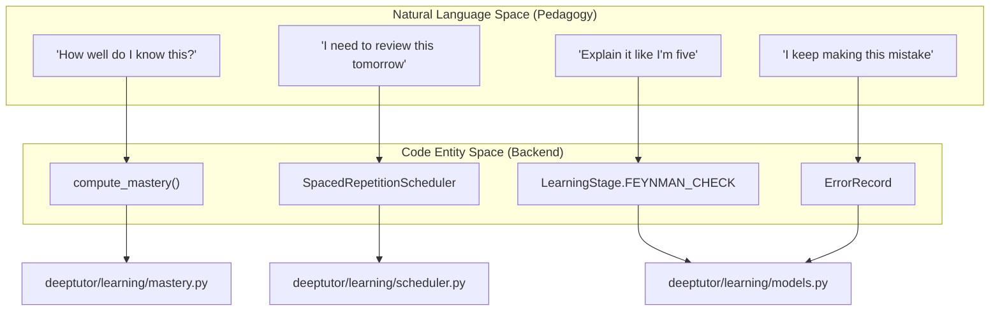
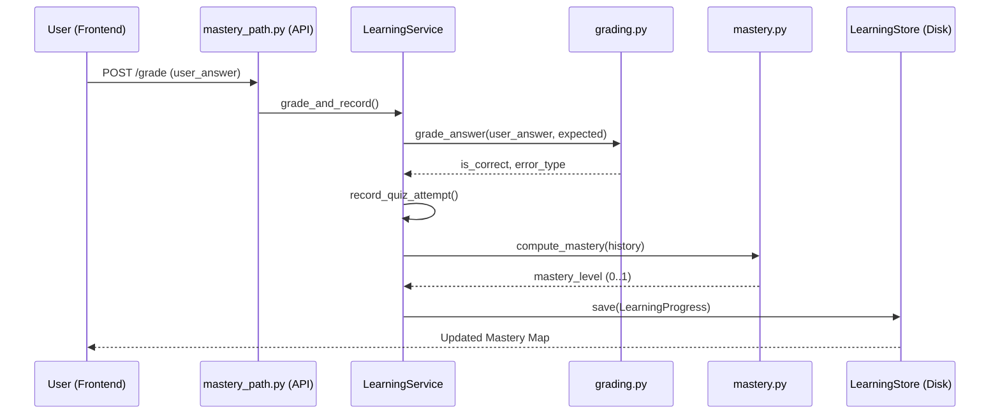

# 학습 서비스와 채점 파이프라인

관련 소스 파일

다음 파일들은 이 위키 페이지를 생성할 때 참고한 컨텍스트로 사용되었습니다:

- [deeptutor/api/routers/mastery_path.py](deeptutor/api/routers/mastery_path.py)
- [deeptutor/book/storage.py](deeptutor/book/storage.py)
- [deeptutor/learning/grading.py](deeptutor/learning/grading.py)
- [deeptutor/learning/models.py](deeptutor/learning/models.py)
- [deeptutor/learning/policy.py](deeptutor/learning/policy.py)
- [deeptutor/learning/service.py](deeptutor/learning/service.py)
- [deeptutor/learning/tests/test_api_endpoints.py](deeptutor/learning/tests/test_api_endpoints.py)
- [deeptutor/learning/tests/test_grading.py](deeptutor/learning/tests/test_grading.py)
- [deeptutor/learning/tests/test_guided_mastery_updates.py](deeptutor/learning/tests/test_guided_mastery_updates.py)
- [deeptutor/learning/tests/test_models.py](deeptutor/learning/tests/test_models.py)
- [deeptutor/learning/tests/test_scheduler.py](deeptutor/learning/tests/test_scheduler.py)
- [deeptutor/learning/tests/test_service_replace_merge.py](deeptutor/learning/tests/test_service_replace_merge.py)
- [deeptutor/learning/tests/test_storage.py](deeptutor/learning/tests/test_storage.py)
- [web/app/(workspace)/learning/page.tsx](web/app/(workspace)/learning/page.tsx)
- [web/app/globals.css](web/app/globals.css)
- [web/components/sidebar/SidebarShell.tsx](web/components/sidebar/SidebarShell.tsx)
- [web/components/ui/Tooltip.tsx](web/components/ui/Tooltip.tsx)
- [web/lib/learning-api.ts](web/lib/learning-api.ts)
- [web/locales/en/app.json](web/locales/en/app.json)
- [web/locales/zh/app.json](web/locales/zh/app.json)

`LearningService`는 Mastery Path 학습 엔진의 중앙 오케스트레이터 역할을 합니다. 이 서비스는 학습 모듈의 생명주기를 관리하고, 사용자 응답의 채점을 조정하며, `LearningProgress` 상태를 유지합니다. 또한 원시 LLM 상호작용과 숙달 기반 학습 및 간격 반복이 요구하는 구조화된 교육적 요구 사이의 간극을 메웁니다.

## 학습 서비스 생명주기

`LearningService`는 `LearningModule`과 `KnowledgePoint` 엔티티를 통해 학습자의 진행 상황을 영속화하고 변환합니다.

### 모듈 초기화와 교체
이 서비스는 모듈 갱신에 대해 "replace semantics"를 따릅니다. `init_modules` 또는 `replace_modules`가 호출되면, 학습 상태가 커리큘럼 내용과 동기화되도록 파괴적 업데이트를 수행합니다.

*   **상태 제거**: 새 모듈 집합에 더 이상 존재하지 않는 Knowledge Point(KP)의 "stale" 상태를 식별하고 제거합니다. 여기에는 `mastery_levels`, `repetition_states`, `error_records`, `feynman_retries`를 지우는 작업이 포함됩니다 [deeptutor/learning/service.py:41-70]().
*   **모듈 매핑**: 각 KP에 올바른 교육 전략(예: Feynman Technique vs. Practice Quiz)이 적용되도록 `knowledge_types` 맵을 다시 구성합니다 [deeptutor/learning/service.py:73-75]().

### 세션 오케스트레이션
이 서비스는 활성 학습 세션을 조작하기 위한 메서드를 제공합니다:
*   **`get_or_create`**: 기존 진행 상황을 불러오거나 특정 `book_id`에 대한 새로운 `LearningProgress` 객체를 초기화합니다 [deeptutor/learning/service.py:29-35]().
*   **`switch_module`**: 세션을 특정 모듈로 지정하고 단계를 `LearningStage.EXPLAIN`으로 재설정합니다 [deeptutor/learning/service.py:81-94]().
*   **`advance_stage`**: 학습자를 `LearningStage` enum(DIAGNOSTIC -> EXPLAIN -> FEYNMAN_CHECK -> PRACTICE -> 등) 사이로 전환합니다 [deeptutor/learning/service.py:77-79]().

**Sources:** [deeptutor/learning/service.py:25-94](), [deeptutor/learning/models.py:61-77]()

---

## 채점과 기록 파이프라인

`grade_and_record` 함수는 학습자의 답안을 처리하기 위한 통합 진입점입니다. 이 함수는 채점, 숙달도 재계산, 복습 스케줄링을 하나의 원자적 작업으로 묶습니다.

### 통합 파이프라인 흐름
파이프라인은 데이터 무결성을 보장하기 위해 엄격한 순서를 따릅니다:
1.  **채점**: `grade_answer`를 호출해 `user_answer`를 `PendingQuestion`에 저장된 `expected_answer`와 비교합니다 [deeptutor/learning/service.py:186-193]().
2.  **오류 분류**: 오답이면 `classify_error`를 사용해 `ErrorType`(예: `UNDERSTANDING_DEVIATION` 또는 `APPLICATION_ERROR`)을 결정합니다 [deeptutor/learning/service.py:195-197]().
3.  **시도 기록**: `QuizAttempt` 이력을 업데이트하고 `ErrorRecord`의 졸업(graduation)을 관리합니다 [deeptutor/learning/service.py:96-149]().
4.  **숙달도 계산**: `calculate_mastery`를 트리거해 최근성 가중 정책을 적용하고 KP의 숙달 수준을 갱신합니다 [deeptutor/learning/service.py:150-155]().
5.  **간격 반복**: `SpacedRepetitionScheduler`를 호출해 `RepetitionState`를 갱신하고 `review_queue`를 다시 구성합니다 [deeptutor/learning/service.py:202-205]().
6.  **영속화**: `LearningStore`를 통해 갱신된 `LearningProgress`를 저장합니다 [deeptutor/learning/service.py:207]().

### 정성적 게이트(Feynman Technique)
`CONCEPT` 또는 `DESIGN` 지식 유형의 경우 시스템은 "qualitative gates"를 사용합니다 [deeptutor/learning/models.py:195-198]().
*   **`feynman_check`**: 튜터가 학습자의 설명을 평가합니다.
*   **`qualitative_mastery`**: 학습자가 정량 퀴즈 점수와 무관하게 특정 교육 단계를 건너뛰기 위해 `True`여야 하는 `LearningProgress`의 boolean 맵입니다 [deeptutor/learning/models.py:198]().

### 오류 졸업
학습자가 이전에 `ErrorRecord`와 연결된 질문에 올바르게 답하면, 서비스는 그 기록을 "졸업"시킵니다.
*   **`active` / `retrying`**: 해결되지 않은 오류의 상태입니다 [deeptutor/learning/service.py:135]().
*   **`graduated`**: `RetryAttempt`가 성공하면 설정되며, 오류를 활성 진단 루프 밖으로 이동시킵니다 [deeptutor/learning/service.py:144]().

**Sources:** [deeptutor/learning/service.py:96-208](), [deeptutor/learning/models.py:129-143](), [deeptutor/learning/models.py:164-183]()

---

## 아키텍처: 자연어에서 코드로의 매핑

이 다이어그램은 교육 개념(Natural Language Space)과 백엔드 구현(Code Entity Space) 사이의 간극을 연결합니다.

### 교육 개념에서 시스템으로의 매핑

**Sources:** [deeptutor/learning/mastery.py:9](), [deeptutor/learning/models.py:61-71](), [deeptutor/learning/models.py:129-143]()

### 채점 파이프라인 데이터 흐름

**Sources:** [deeptutor/learning/service.py:161-208](), [deeptutor/api/routers/mastery_path.py:10](), [deeptutor/learning/storage.py:19]()

---

## REST API와 프론트엔드 통합

Mastery Path는 `mastery_path` 라우터를 통해 노출되며 `MasteryPathPage` 컴포넌트가 이를 소비합니다.

### Mastery Path 엔드포인트
백엔드는 학습 생명주기를 위한 몇 가지 핵심 엔드포인트를 제공합니다:
*   `GET /api/v1/learning/progress`: 사용자의 모든 활성 학습 경로를 나열합니다 [web/lib/learning-api.ts:129]().
*   `POST /api/v1/learning/progress/{id}/init-modules`: 특정 경로에 대한 커리큘럼을 설정합니다 [web/lib/learning-api.ts:47]().
*   `GET /api/v1/learning/progress/{id}/map`: 대시보드 렌더링에 사용되는 "gate-accurate" 숙달 스냅샷을 반환합니다 [web/lib/learning-api.ts:107]().
*   `POST /api/v1/learning/progress/{id}/redo`: 모듈 구조를 유지한 채 진행 상황을 재설정합니다 [web/lib/learning-api.ts:145]().

### 프론트엔드: MasteryPathPage
`MasteryPathPage`는 학습자의 여정을 위한 지속형 대시보드 역할을 합니다.
*   **`fetchMasteryMap`**: `new`, `learning`, `mastered`로 분류된 모든 모듈과 KP의 상태를 가져옵니다 [web/app/(workspace)/learning/page.tsx:76-89]().
*   **`MapView`**: 모듈과 지식 포인트의 계층을 렌더링하며, 진행률과 복습 횟수에 대한 시각적 피드백을 제공합니다 [web/app/(workspace)/learning/page.tsx:204-210]().
*   **`learning-api.ts`**: `apiFetch`를 사용해 FastAPI 백엔드와 상호작용하는 클라이언트 측 래퍼입니다 [web/lib/learning-api.ts:1-188]().

### 데이터 구조(TypeScript)
| Interface | Purpose |
| :--- | :--- |
| `ProgressDetail` | 숙달 수준을 포함한 특정 책/경로의 상세 상태 [web/lib/learning-api.ts:30-37]() |
| `MasteryMap` | 숙달된 KP와 학습 중인 KP의 집계 수 [web/lib/learning-api.ts:80-85]() |
| `NextStep` | 권장되는 다음 행동(예: "Review", "Learn New") [web/lib/learning-api.ts:87-95]() |

**Sources:** [web/lib/learning-api.ts:1-188](), [web/app/(workspace)/learning/page.tsx:37-210](), [deeptutor/api/routers/mastery_path.py:10]()
