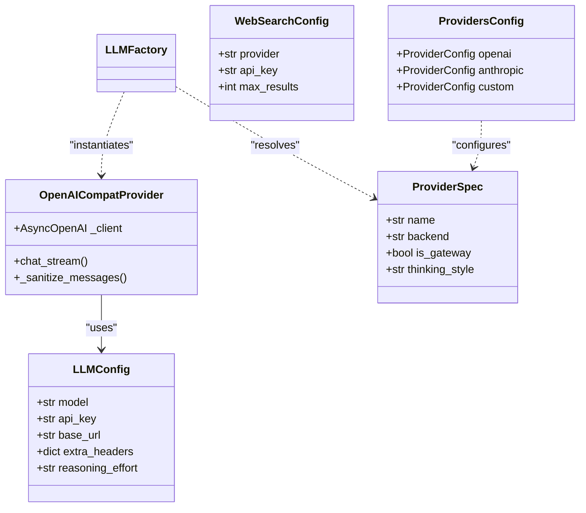

# 핵심 서비스

<details>
<summary>관련 소스 파일</summary>

다음 파일들은 이 위키 페이지를 생성할 때 참고한 컨텍스트로 사용되었습니다:

- [README.md](README.md)
- [assets/README/README_AR.md](assets/README/README_AR.md)
- [assets/README/README_CN.md](assets/README/README_CN.md)
- [assets/README/README_ES.md](assets/README/README_ES.md)
- [assets/README/README_FR.md](assets/README/README_FR.md)
- [assets/README/README_HI.md](assets/README/README_HI.md)
- [assets/README/README_JA.md](assets/README/README_JA.md)
- [assets/README/README_PL.md](assets/README/README_PL.md)
- [assets/README/README_PT.md](assets/README/README_PT.md)
- [assets/README/README_RU.md](assets/README/README_RU.md)
- [assets/README/README_TH.md](assets/README/README_TH.md)

</details>


**Core Services** 계층은 DeepTutor의 지능형 에이전트와 TutorBot 서브시스템을 구동하는 공유 인프라를 제공합니다. 이 계층은 대형 언어 모델(LLM), 웹 검색 엔진, 벡터 임베딩 같은 복잡한 외부 통합을 코드베이스 전반에서 사용하는 통합 인터페이스로 추상화합니다. 또한 다국어 프롬프트 템플릿과 영속 세션 메모리를 포함한 상태ful 작업도 관리합니다.

### 서비스 아키텍처 개요

핵심 서비스는 고수준 에이전트 로직과 저수준 외부 API를 연결하는 기반 계층으로 설계되었습니다. 이 계층은 `Smart Solver`나 `Deep Research` 같은 구성 요소가 모델에 종속되지 않고 API 구현 세부 사항보다 교육적 로직에 집중할 수 있게 보장합니다.

#### 핵심 서비스 상호작용 맵
이 다이어그램은 자연어 공간(에이전트 로직)에서 코드 엔티티 공간으로 매핑하면서, 핵심 서비스가 에이전트 요청을 이행하기 위해 어떻게 상호작용하는지 보여줍니다.

```mermaid
graph TD
    subgraph "Agent_Logic_Space"
        ["Agent_Capability"] --> ["ChatOrchestrator"]
    end

    subgraph "Core_Services_Space_(Code_Entities)"
        ["ChatOrchestrator"] --> ["PromptManager"]
        ["ChatOrchestrator"] --> ["LLMFactory"]
        ["ChatOrchestrator"] --> ["SessionStore"]
        ["ChatOrchestrator"] --> ["RAGService"]
        ["ChatOrchestrator"] --> ["NotebookManager"]
        
        ["LLMFactory"] --> ["LLMConfig"]
        ["LLMFactory"] --> ["get_runtime_provider"]
        ["get_runtime_provider"] --> ["OpenAICompatProvider"]
        
        ["RAGService"] --> ["get_pipeline"]
        ["SearchService"] -.-> ["resolve_search_runtime_config"]
        ["EmbeddingService"] -.-> ["EmbeddingClient"]
    end

    subgraph "External_Provider_Space"
        ["LLMConfig"] --> "OpenAI/Anthropic/Local"
        ["SearchService"] --> "Tavily/Brave/DuckDuckGo"
        ["EmbeddingService"] --> "Cohere/Jina/Ollama"
    end
```

**Sources:** [deeptutor/services/llm/factory.py:12-25](), [deeptutor/services/llm/config.py:21-23](), [deeptutor/services/llm/provider_factory.py:24-24](), [deeptutor/services/provider_registry.py:1-108]()

---

### 5.1 LLM 서비스와 Provider Factory
LLM 서비스는 모든 모델 상호작용의 중앙 관문입니다. 이 서비스는 `LLMFactory`를 사용해 구성을 해석하고 요청을 provider 구현체로 라우팅합니다.

주요 기능은 다음과 같습니다:
*   **통합 구성**: `LLMConfig`는 `model`, `api_key`, `base_url`, `reasoning_effort` 같은 매개변수를 처리합니다 [deeptutor/services/llm/config.py:21-23]().
*   **Provider Factory**: `get_runtime_provider`는 해석된 `ProviderSpec`을 바탕으로 올바른 구현체(예: `OpenAICompatProvider`)를 인스턴스화합니다 [deeptutor/services/llm/provider_factory.py:24-24]().
*   **레지스트리 기반 라우팅**: `PROVIDERS` 레지스트리는 OpenRouter 같은 게이트웨이와 Ollama 같은 로컬 서버를 포함한 provider 메타데이터의 단일 기준점 역할을 합니다 [deeptutor/services/provider_registry.py:109-214]().
*   **Thinking Mode 지원**: `thinking_style` 매핑과 `reasoning_content` 추출을 통해 추론 모델에 대한 특수 처리를 제공합니다 [deeptutor/services/llm/provider_core/openai_compat_provider.py:24-33]().

자세한 내용은 [LLM Service and Provider Factory](#5.1)를 참고하세요.

**Sources:** [deeptutor/services/llm/factory.py:1-110](), [deeptutor/services/provider_registry.py:1-214](), [deeptutor/services/llm/provider_core/openai_compat_provider.py:106-148]()

---

### 5.2 Search Service
Search Service는 실시간 데이터가 필요한 에이전트를 위해 웹 탐색을 통합된 계층으로 제공합니다.

*   **Provider 선택**: Brave, Tavily, Jina, Perplexity, SearXNG를 포함한 다양한 provider를 지원합니다 [deeptutor/tutorbot/config/schema.py:124-132]().
*   **통합 계층**: `AnswerConsolidator`는 Jinja2 템플릿 또는 LLM 합성을 사용해 원시 SERP 결과를 구조화된 답변으로 변환합니다.
*   **자동 폴백**: Brave처럼 프리미엄 provider에 API 키가 없으면, 서비스는 `duckduckgo` 같은 무설정 provider로 폴백할 수 있습니다.

자세한 내용은 [Search Service](#5.2)를 참고하세요.

**Sources:** [deeptutor/tutorbot/config/schema.py:124-141](), [README.md:49-51]()

---

### 5.3 Prompt Management
`PromptManager`는 에이전트 동작을 안내하는 시스템 및 작업별 프롬프트를 관리하는 싱글턴 서비스입니다.

*   **다국어 지원**: 사용자의 언어 설정에 따라 지역화된 템플릿을 로드해 교육 경험이 로케일 전반에서 일관되도록 합니다.
*   **중앙 집중형 레지스트리**: 에이전트 지침의 단일 기준점으로 작동하여, 에이전트 로직을 수정하지 않고도 버전 관리와 손쉬운 업데이트가 가능합니다.

자세한 내용은 [Prompt Management](#5.3)를 참고하세요.

---

### 5.4 Embedding Service
Embedding Service는 텍스트 벡터화를 처리하며, Knowledge Base와 RAG 워크플로에서 핵심적입니다.

*   **어댑터 패턴**: 서로 다른 provider API(OpenAI, Ollama, Cohere, Jina)를 RAG 시스템에서 사용하는 통합 인터페이스로 정규화합니다.
*   **배치 처리**: 임베딩 provider에 특화된 배치 로직과 동시성 제약을 관리합니다.

자세한 내용은 [Embedding Service](#5.4)를 참고하세요.

**Sources:** [README.md:78-80]()

---

### 5.5 세션 및 메모리 관리
DeepTutor는 영속 저장소, 노트북 관리, 3계층 메모리 서브시스템을 통해 상태를 유지합니다.

*   **Notebook Management**: `NotebookManager`는 학습자 산출물(해결 결과, 조사 보고서)을 영속화하고 레코드 추가를 처리합니다.
*   **Memory Consolidator**: 서로 다른 교육적 "surface" 전반에서 학습자 프로필과 세션 요약의 생명주기를 관리하는 파이프라인입니다 [deeptutor/tutorbot/config/schema.py:43-43]().
*   **SQLite 기반 저장소**: 세션 기록과 엔티티 변경을 추적하기 위해 영속 저장소를 사용합니다 [README.md:66-67]().

자세한 내용은 [Session and Memory Management](#5.5)를 참고하세요.

**Sources:** [deeptutor/tutorbot/config/schema.py:30-47](), [README.md:60-63]()

---

### 코드 엔티티 관계
다음 다이어그램은 Core 계층 내에서 구성 및 클라이언트 엔티티가 서비스 역할과 어떻게 연결되는지 보여줍니다.



**Sources:** [deeptutor/services/llm/config.py:21-23](), [deeptutor/services/llm/provider_core/openai_compat_provider.py:106-148](), [deeptutor/services/provider_registry.py:19-71](), [deeptutor/tutorbot/config/schema.py:70-107](), [deeptutor/tutorbot/config/schema.py:124-132]()
