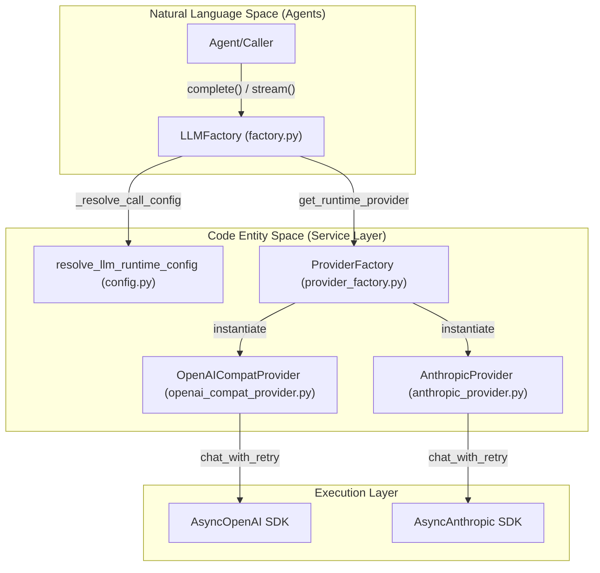
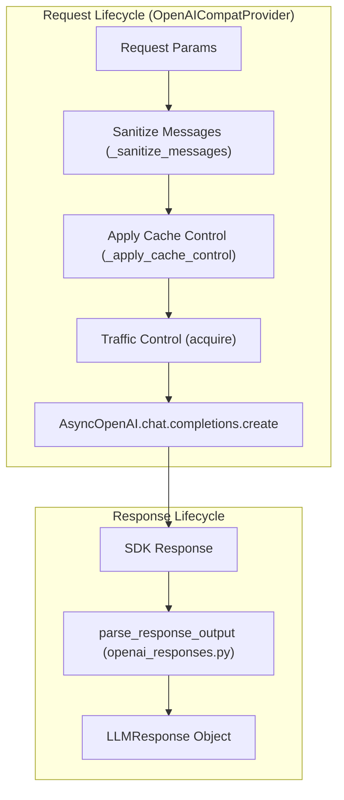

# LLM 서비스와 Provider Factory

관련 소스 파일

다음 파일들은 이 위키 페이지를 생성할 때 참고한 컨텍스트로 사용되었습니다:

- [deeptutor/services/config/launch_settings.py](deeptutor/services/config/launch_settings.py)
- [deeptutor/services/config/loader.py](deeptutor/services/config/loader.py)
- [deeptutor/services/llm/capabilities.py](deeptutor/services/llm/capabilities.py)
- [deeptutor/services/llm/cloud_provider.py](deeptutor/services/llm/cloud_provider.py)
- [deeptutor/services/llm/config.py](deeptutor/services/llm/config.py)
- [deeptutor/services/llm/context_window.py](deeptutor/services/llm/context_window.py)
- [deeptutor/services/llm/executors.py](deeptutor/services/llm/executors.py)
- [deeptutor/services/llm/factory.py](deeptutor/services/llm/factory.py)
- [deeptutor/services/llm/provider_core/openai_compat_provider.py](deeptutor/services/llm/provider_core/openai_compat_provider.py)
- [deeptutor/services/llm/reasoning_params.py](deeptutor/services/llm/reasoning_params.py)
- [deeptutor/services/provider_registry.py](deeptutor/services/provider_registry.py)
- [site/src/content/docs/docs/get-started/providers.md](site/src/content/docs/docs/get-started/providers.md)
- [site/src/content/docs/zh-cn/docs/get-started/providers.md](site/src/content/docs/zh-cn/docs/get-started/providers.md)
- [tests/services/config/test_provider_runtime.py](tests/services/config/test_provider_runtime.py)
- [tests/services/llm/test_capabilities.py](tests/services/llm/test_capabilities.py)
- [tests/services/llm/test_client.py](tests/services/llm/test_client.py)
- [tests/services/llm/test_reasoning_params.py](tests/services/llm/test_reasoning_params.py)
- [web/app/(workspace)/book/components/BookChatPanel.tsx](web/app/(workspace)/book/components/BookChatPanel.tsx)
- [web/components/chat/home/ModelSelector.tsx](web/components/chat/home/ModelSelector.tsx)
- [web/components/common/AssistantResponse.tsx](web/components/common/AssistantResponse.tsx)
- [web/hooks/useSmoothStreamText.ts](web/hooks/useSmoothStreamText.ts)
- [web/tests/skill-slug.test.ts](web/tests/skill-slug.test.ts)

LLM 서비스 계층은 DeepTutor 내부의 모든 모델 상호작용을 위한 중추 신경계 역할을 합니다. 이 계층은 여러 모델 provider(OpenAI, Anthropic, DeepSeek 등)의 복잡성을 추상화하고, 로컬과 클라우드 라우팅을 처리하며, 연결 영속성을 관리하고, 정교한 provider factory와 capability 기반 디스패치를 통해 견고한 오류 복구를 제공합니다.

## LLM Factory와 Provider Registry

주로 `factory.py`에 구현된 `LLMFactory`는 모델 추론이 필요한 에이전트와 서비스의 주요 진입점입니다. 이 팩토리는 요청이 클라우드 provider에 의해 처리되는지, 로컬 인스턴스에 의해 처리되는지 숨기는 통합 인터페이스를 제공합니다.

### Provider 사양과 탐색
시스템은 `provider_registry.py`의 `ProviderSpec` 레지스트리를 사용해 서로 다른 백엔드를 어떻게 처리할지 정의합니다.
*   **Provider 탐색**: `_resolve_provider_spec` 함수는 `binding` 이름을 확인하고, API 키/URL을 기준으로 "gateways"(예: OpenRouter)를 검색하거나, 모델 이름 패턴을 일치시켜 올바른 `ProviderSpec`를 결정합니다 [deeptutor/services/llm/factory.py:77-108]().
*   **Gateway 감지**: Gateway는 우선적으로 처리됩니다. 예를 들어 API 키가 `sk-or-`로 시작하면 시스템은 이를 자동으로 `openrouter`로 식별합니다 [deeptutor/services/provider_registry.py:136-147]().
*   **로컬 LLM 감지**: 팩토리는 `is_local_llm_server`를 사용해 `base_url`이 로컬 루프백 주소 또는 Docker 호스트 브리지인지 확인하고, 자동으로 `ollama` 또는 `vllm` 사양으로 폴백합니다 [deeptutor/services/llm/factory.py:102-105]().

### LLM 호출 흐름 다이어그램
이 다이어그램은 고수준 요청이 provider별 실행으로 전환되는 과정을 보여줍니다.

**Sources:** [deeptutor/services/llm/factory.py:153-234](), [deeptutor/services/llm/provider_factory.py:1-24](), [deeptutor/services/provider_registry.py:109-215]()

## Provider 추상화와 기능

DeepTutor는 서로 다른 LLM provider의 이질적인 기능을 처리하기 위해 capability 기반 시스템을 사용합니다. 이는 하드코딩된 체크를 중앙 집중형 레지스트리로 대체합니다.

### Provider 기능 레지스트리
시스템은 `capabilities.py`의 `PROVIDER_CAPABILITIES`와 `MODEL_OVERRIDES`를 유지하며 다음을 관리합니다:
*   **JSON Mode**: `supports_response_format(binding, model)`로 확인합니다. `deepseek-reasoner`나 `gemma` 같은 일부 모델은 특정 API 제한 때문에 이 기능이 비활성화되어 있습니다 [deeptutor/services/llm/capabilities.py:22-159](), [deeptutor/services/llm/capabilities.py:176-186]().
*   **Thinking Style**: `OpenAICompatProvider`는 `build_openai_compatible_reasoning_kwargs`를 사용해 provider별 추론 플래그(예: VolcEngine의 `thinking_type`)를 요청 본문에 주입합니다 [deeptutor/services/llm/provider_core/openai_compat_provider.py:31-33](), [deeptutor/services/llm/reasoning_params.py:12-20]().
*   **Temperature 제약**: 추론 모델(O1, GPT-5)은 안정성을 보장하기 위해 `get_effective_temperature()`를 통해 특정 temperature로 강제되는 경우가 많습니다 [deeptutor/services/llm/capabilities.py:194-200]().

### 지원되는 Provider 백엔드
| Backend | Providers | Vision | Tools | Prompt Caching |
| :--- | :--- | :--- | :--- | :--- |
| `openai_compat` | OpenAI, DeepSeek, OpenRouter, SiliconFlow | True | True | Model Dep. |
| `anthropic` | Claude 3.5/3.7, Custom Anthropic | True | True | True |
| `azure_openai` | Azure-hosted GPT models | True | True | False |

**Sources:** [deeptutor/services/llm/capabilities.py:22-159](), [deeptutor/services/provider_registry.py:109-150]()

## 실행, 텔레메트리, 트래픽 제어

실행 계층은 멀티모달 처리, 프롬프트 캐싱, 회로 차단을 포함한 LLM 호출의 생명주기를 처리합니다.

### 멀티모달 지원
provider로 디스패치하기 전에 팩토리는 `prepare_multimodal_messages`를 호출합니다. 이 유틸리티는 `image_data` 또는 `image_url`을 감지하고 provider 요구사항에 맞게 형식을 맞춥니다(예: Anthropic용 base64 변환 또는 OpenAI용 표준 `image_url` 블록) [deeptutor/services/llm/factory.py:231-255](), [deeptutor/services/llm/multimodal.py:1-20]().

### 프롬프트 캐싱과 회로 차단
*   **프롬프트 캐싱**: `OpenAICompatProvider`는 OpenRouter 같은 지원되는 gateway에서 비용을 최적화하기 위해 시스템 메시지와 마지막에서 두 번째 사용자 메시지에 `cache_control` 마커를 자동 적용합니다 [deeptutor/services/llm/provider_core/openai_compat_provider.py:171-204]().
*   **회로 차단**: provider는 `_responses_failures`를 통해 특정 모델/추론 조합에 대한 실패 횟수를 추적합니다. 실패가 `_RESPONSES_FAILURE_THRESHOLD`(기본 2)를 넘으면 provider는 더 이상의 낭비되는 요청을 막기 위해 `_RESPONSES_PROBE_INTERVAL_S`(300초) 동안 "trips" 상태가 됩니다 [deeptutor/services/llm/provider_core/openai_compat_provider.py:55-56](), [deeptutor/services/llm/provider_core/openai_compat_provider.py:146-147]().

### OpenAI 호환 Provider 구현
`OpenAICompatProvider`는 대부분의 API를 위한 주력 워크호스입니다.

**Sources:** [deeptutor/services/llm/provider_core/openai_compat_provider.py:106-147](), [deeptutor/services/llm/provider_core/openai_responses.py:24-30]()

## 구성과 환경

LLM 구성은 Environment Variables -> Database Catalog -> Runtime Resolution의 계층으로 관리됩니다.

### 런타임 구성 해석
`LLMConfig` dataclass와 `get_llm_config` 함수는 활성 모델 매개변수를 관리합니다. 시스템은 `_SCOPED_LLM_CONFIG`를 통한 `ContextVar`를 사용해 async 컨텍스트에서 요청별 또는 에이전트별 구성 오버라이드를 허용합니다 [deeptutor/services/llm/config.py:96-115](), [deeptutor/services/llm/config.py:130-138]().

### 컨텍스트 윈도우 관리
시스템은 `resolve_effective_context_window`를 사용해 토큰 예산을 계산합니다. GPT-4o, Gemini, Claude 같은 대형 컨텍스트 모델을 식별해 적절한 history-planning 윈도우를 설정합니다 [deeptutor/services/llm/context_window.py:10-23](), [deeptutor/services/llm/context_window.py:53-67]().

### 환경 변수
*   `OPENAI_API_KEY`: OpenAI 호환 서비스의 전역 폴백 키.
*   `OPENAI_BASE_URL`: 전역 폴백 엔드포인트 [deeptutor/services/llm/config.py:62-74]().
*   `DISABLE_SSL_VERIFY`: 설정되면 `_get_aiohttp_connector`가 로컬/자체 서명 엔드포인트에 대한 SSL 검증을 비활성화합니다 [deeptutor/services/llm/cloud_provider.py:123-144]().

### 응답 형식에 대한 폴백 메커니즘
일부 로컬 서버(예: Gemma가 있는 LM Studio)는 `response_format`을 HTTP 400으로 거부합니다. 시스템은 `executors.py`의 `_create_with_format_fallback`을 사용해 `BadRequestError`를 잡고, 런타임에서 `disable_response_format_at_runtime`을 통해 해당 모델의 기능을 비활성화한 뒤, 문제가 된 필드를 제거하고 다시 시도합니다 [deeptutor/services/llm/executors.py:43-70]().

**Sources:** [deeptutor/services/llm/config.py:96-115](), [deeptutor/services/llm/context_window.py:1-79](), [deeptutor/services/llm/cloud_provider.py:123-144](), [deeptutor/services/llm/executors.py:24-40]()
