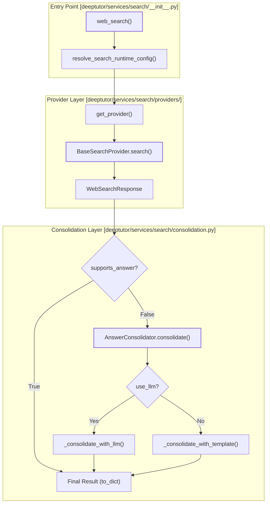

# 검색 서비스

<details>
<summary>관련 소스 파일</summary>

다음 파일들이 이 wiki 페이지를 생성할 때 맥락으로 사용되었습니다:

- [deeptutor/services/search/__init__.py](deeptutor/services/search/__init__.py)
- [deeptutor/services/search/consolidation.py](deeptutor/services/search/consolidation.py)
- [deeptutor/services/search/providers/__init__.py](deeptutor/services/search/providers/__init__.py)
- [deeptutor/tools/web_search.py](deeptutor/tools/web_search.py)

</details>


Search Service는 DeepTutor 내부의 웹 검색 기능을 위한 통합 추상화 계층을 제공합니다. provider별 구현을 관리하고, 자격 증명 해석을 처리하며, 결과 통합을 수행해 원시 검색 엔진 결과를 에이전트가 소비하기에 적합한 구조화된 답변으로 변환합니다.

## 아키텍처 개요

검색 인프라는 provider-registry 패턴을 중심으로 설계되었습니다. 원시 데이터 조회(Providers)와 그 데이터를 사람이 읽을 수 있거나 에이전트가 소비할 수 있는 형식으로 합성하는 작업(Consolidation)을 분리합니다.

### Search Service 데이터 흐름

다음 다이어그램은 검색 쿼리에서 통합된 응답으로 이어지는 경로를 보여주며, 논리적 단계를 코드 엔터티에 대응시킵니다.

**검색 실행 및 통합 흐름**

**Sources:** [deeptutor/services/search/__init__.py:73-160](), [deeptutor/services/search/consolidation.py:174-189](), [deeptutor/services/search/providers/__init__.py:42-66]()

## Provider 추상화

DeepTutor는 출력 기능에 따라 분류된 다양한 검색 provider를 지원합니다. 모든 provider는 `BaseSearchProvider` 추상 기본 클래스를 상속합니다 [deeptutor/services/search/base.py:11-13]().

### 지원되는 Provider
시스템은 자체 답변을 생성하는 "AI Providers"와 원시 검색 결과를 반환하는 "SERP Providers"를 구분합니다.

| Provider | 유형 | 구현 클래스 | 핵심 기능 |
| :--- | :--- | :--- | :--- |
| **Brave** | SERP | `BraveSearchProvider` | 개인정보 보호에 중점을 둔 웹 인덱스 |
| **Tavily** | AI | `TavilySearchProvider` | LLM 에이전트에 최적화 |
| **DuckDuckGo** | SERP | `DuckDuckGoSearchProvider` | 설정 없이 사용할 수 있는 대체 수단 |
| **Jina** | SERP+ | `JinaSearchProvider` | 전체 markdown 콘텐츠 추출 |
| **Perplexity** | AI | `PerplexitySearchProvider` | 기본 제공 LLM 기반 답변 |
| **Serper** | SERP | `SerperSearchProvider` | Google Search API 래퍼 |
| **SearXNG** | SERP | `SearXNGSearchProvider` | 자체 호스팅 메타 검색 |
| **Exa** | Deprecated | - | 대신 Brave/Tavily/Jina를 사용 |
| **Baidu** | Deprecated | - | 대신 Brave/Tavily/Jina를 사용 |

**Sources:** [deeptutor/services/search/providers/__init__.py:12-16](), [deeptutor/services/search/providers/__init__.py:148-153](), [deeptutor/tools/web_search.py:19-26]()

### Provider Registry와 선택
Provider는 `register_provider` 데코레이터를 통해 등록됩니다 [deeptutor/services/search/providers/__init__.py:19-39](). 이 서비스는 fallback 메커니즘을 사용합니다. 예를 들어 Brave 또는 Tavily 같은 선호 provider에 API key가 없으면 자동으로 `duckduckgo`로 대체됩니다 [deeptutor/services/search/__init__.py:115-117](). `exa`, `baidu`, `openrouter` 같은 deprecated provider는 registry에서 명시적으로 차단되며, 요청되면 `ValueError`를 발생시킵니다 [deeptutor/services/search/providers/__init__.py:12-16](), [deeptutor/services/search/providers/__init__.py:58-59]().

## 답변 통합

기본적으로 답변을 생성하지 않는 provider(`supports_answer=False`)의 경우, `AnswerConsolidator` 클래스 [deeptutor/services/search/consolidation.py:138-144]()를 사용해 정보를 일관된 응답으로 합성합니다.

### 통합 전략
1.  **템플릿 기반:** Jinja2 템플릿을 사용해 원시 결과를 Markdown으로 포맷합니다. provider별 템플릿은 `serper` [deeptutor/services/search/consolidation.py:31-76](), `jina` [deeptutor/services/search/consolidation.py:80-116](), 그리고 `serper_scholar` [deeptutor/services/search/consolidation.py:120-134]()에 존재합니다.
2.  **LLM 기반:** consolidator에 `use_llm=True`가 전달되면, LLM이 스니펫을 읽고 `_consolidate_with_llm`을 통해 간결한 요약을 작성합니다 [deeptutor/services/search/consolidation.py:178-181]().

### 데이터 구조
이 서비스는 `deeptutor/services/search/types.py`에 정의된 표준화된 타입을 사용해 통신합니다:
*   `SearchResult`: 제목, URL, snippet을 가진 단일 웹 항목을 나타냅니다 [deeptutor/services/search/types.py:29-29]().
*   `Citation`: 답변에서 사용된 참조를 나타냅니다 [deeptutor/services/search/types.py:29-29]().
*   `WebSearchResponse`: 쿼리, 답변, citations, raw results를 담는 통합 컨테이너입니다 [deeptutor/services/search/types.py:29-29]().

## 설정과 초기화

검색 설정은 중앙 구성 시스템과 환경 변수를 통해 관리됩니다.

### 환경 변수와 Runtime Config
서비스는 `resolve_search_runtime_config`를 사용해 구성을 해석합니다 [deeptutor/services/search/__init__.py:100]():
*   **Provider 선택:** `SEARCH_PROVIDER` 또는 사용자의 profile 설정에 의해 제어됩니다 [deeptutor/services/config.py:15-17]().
*   **API Keys:** 특정 provider(Brave, Tavily, Jina, Perplexity, Serper)에 대해 해석됩니다 [deeptutor/services/search/__init__.py:113-124]().
*   **Proxies:** runtime config에 정의되어 있으면 provider kwargs에 자동으로 주입됩니다 [deeptutor/services/search/__init__.py:136-137]().

### 코드 엔터티 관계
이 다이어그램은 구성 객체와 환경 저장소가 search service 클래스와 어떻게 상호작용하는지 보여줍니다.

**Configuration to Execution Mapping**
```mermaid
classDiagram
    class "resolve_search_runtime_config()" as SearchRuntimeConfig {
        +provider: str
        +api_key: str
        +max_results: int
        +proxy: str
    }
    class "web_search()" as WebSearchFunction {
        +execute(query)
    }
    class AnswerConsolidator {
        +jinja_env: Environment
        +use_llm: bool
        +consolidate(response: WebSearchResponse)
    }
    class BaseSearchProvider {
        <<abstract>>
        +search(query: str)
        +supports_answer: bool
        +requires_api_key: bool
    }

    WebSearchFunction ..> SearchRuntimeConfig : resolves via resolve_search_runtime_config()
    WebSearchFunction --> BaseSearchProvider : factory get_provider()
    WebSearchFunction --> AnswerConsolidator : uses for SERP results if supports_answer=False
```
**Sources:** [deeptutor/services/search/__init__.py:100-140](), [deeptutor/services/search/providers/__init__.py:130-145](), [deeptutor/services/search/consolidation.py:138-165]()

## 구현 세부 사항

### `web_search` 진입점
에이전트를 위한 주요 인터페이스는 `web_search` 함수입니다 [deeptutor/services/search/__init__.py:73-81](). 이 함수는 다음 순서로 동작합니다:
1.  `_get_web_search_config()`를 통해 검색이 활성화되어 있는지 확인합니다 [deeptutor/services/search/__init__.py:88-89]().
2.  `resolve_search_runtime_config()`를 통해 runtime config(provider, API keys, proxies)를 해석합니다 [deeptutor/services/search/__init__.py:100]().
3.  `get_provider()`를 통해 provider를 인스턴스화합니다 [deeptutor/services/search/__init__.py:139]().
4.  `search_provider.search(query, **provider_kwargs)`를 통해 검색을 실행합니다 [deeptutor/services/search/__init__.py:142]().
5.  `search_provider.supports_answer`가 False이면 `AnswerConsolidator`를 트리거합니다 [deeptutor/services/search/__init__.py:148-158]().
6.  선택적으로 `_save_results()`를 사용해 결과를 JSON 파일로 저장합니다 [deeptutor/services/search/__init__.py:161-163]().

### Provider Registry
Registry는 `deeptutor/services/search/providers/__init__.py`에서 관리됩니다.
*   `_PROVIDERS`: 이름을 클래스 타입에 매핑하는 내부 딕셔너리입니다 [deeptutor/services/search/providers/__init__.py:11]().
*   `get_available_providers()`: `instance.is_available()`를 호출해 유효한 자격 증명을 가진 provider 목록을 반환합니다 [deeptutor/services/search/providers/__init__.py:79-94]().
*   `get_providers_info()`: 프런트엔드 소비를 위한 메타데이터(display name, description, requirements)를 제공합니다 [deeptutor/services/search/providers/__init__.py:97-127]().

### Paper Search Extension
일반 웹 검색 외에도, 이 서비스는 학술 결과에 대한 특수 지원을 포함합니다. 예를 들어, `serper_scholar` 템플릿 [deeptutor/services/search/consolidation.py:120-134]()은 `pdfUrl`, `publicationInfo`, `citedBy` 같은 메타데이터를 학술 연구용으로 처리합니다.

**Sources:** [deeptutor/services/search/__init__.py:73-168](), [deeptutor/services/search/providers/__init__.py:1-165](), [deeptutor/tools/web_search.py:29-45](), [deeptutor/services/search/consolidation.py:1-189]()
