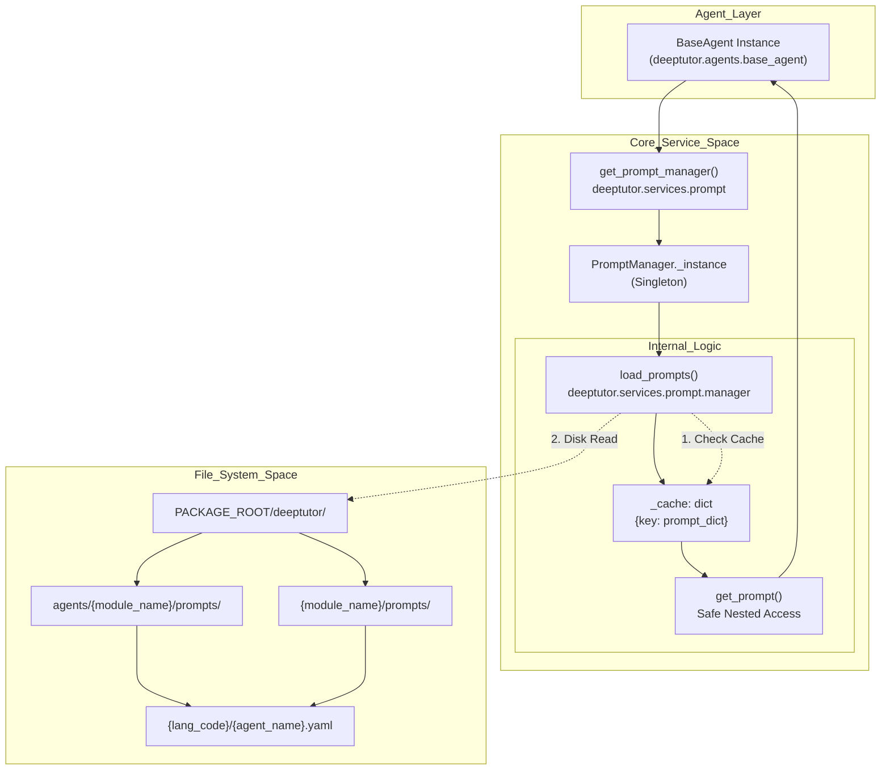
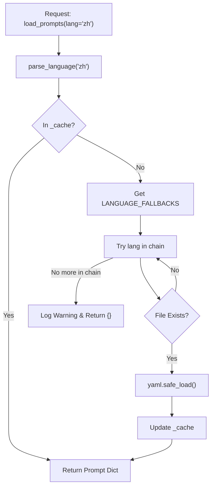
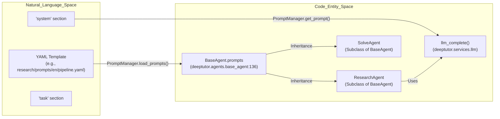

# 프롬프트 관리

<details>
<summary>관련 소스 파일</summary>

다음 파일들이 이 wiki 페이지를 생성할 때 맥락으로 사용되었습니다:

- [.pre-commit-config.yaml](.pre-commit-config.yaml)
- [deeptutor/agents/base_agent.py](deeptutor/agents/base_agent.py)
- [deeptutor/services/llm/utils.py](deeptutor/services/llm/utils.py)
- [deeptutor/services/notebook/service.py](deeptutor/services/notebook/service.py)
- [deeptutor/services/prompt/manager.py](deeptutor/services/prompt/manager.py)
- [tests/core/__init__.py](tests/core/__init__.py)
- [tests/core/test_prompt_manager.py](tests/core/test_prompt_manager.py)
- [tests/services/llm/test_utils.py](tests/services/llm/test_utils.py)
- [tests/services/rag/test_pipeline_integration.py](tests/services/rag/test_pipeline_integration.py)
- [tests/services/rag/test_rag_pipelines.py](tests/services/rag/test_rag_pipelines.py)
- [tests/services/rag/testfile.txt](tests/services/rag/testfile.txt)
- [tests/services/test_notebook_service.py](tests/services/test_notebook_service.py)

</details>


## 목적과 범위

`PromptManager`는 DeepTutor의 핵심 서비스로, 모든 지능형 에이전트 모듈 전반에서 LLM 프롬프트의 수명 주기를 중앙에서 관리하고 캐시하며 조정하도록 설계되었습니다. 프롬프트 로직을 에이전트 코드와 분리함으로써, 시스템은 매끄러운 다국어 지원(i18n), 빠른 프롬프트 엔지니어링, 일관된 템플릿 포맷을 가능하게 합니다. 또한 singleton 패턴을 사용해 디스크 I/O를 최소화하고, 자동 언어 fallback이 포함된 계층적 해석 전략을 제공합니다. [deeptutor/services/prompt/manager.py:16-26](), [tests/core/test_prompt_manager.py:19-23]()

---

## 시스템 아키텍처

프롬프트 관리 시스템은 `deeptutor/` 디렉터리 구조 안에 템플릿을 구성합니다. 대부분의 프롬프트는 `deeptutor/agents/` 아래에 있지만, 시스템은 `book`, `co_writer`, `capabilities` 같은 `NON_AGENT_MODULES`도 지원하며, 이들은 자체적인 최상위 디렉터리 구조를 가집니다. [deeptutor/services/prompt/manager.py:41-48](), [deeptutor/services/prompt/manager.py:119-129]()

### Prompt Resolution Flow

다음 다이어그램은 에이전트가 프롬프트를 요청할 때 `PromptManager`가 파일 시스템과 cache를 통해 이를 해석하는 방식을 보여줍니다.

**PromptManager Singleton and Data Flow**



**Sources:** [deeptutor/services/prompt/manager.py:16-52](), [deeptutor/services/prompt/manager.py:119-129](), [deeptutor/agents/base_agent.py:134-145]()

---

## 구현 세부 사항

`PromptManager`는 모든 템플릿 관련 작업의 단일 진실 공급원(single point of truth) 역할을 하며, 모든 지능형 모듈이 상속하는 `BaseAgent` 클래스에서 사용됩니다. [deeptutor/agents/base_agent.py:32-45]()

### 주요 클래스 멤버

| Entity | Type | Description |
|:---|:---|:---|
| `PromptManager` | Class | `__new__`를 통해 singleton 로직을 구현하는 주요 manager 클래스입니다. [deeptutor/services/prompt/manager.py:16-52]() |
| `_cache` | Dict | 복합 키를 사용해 로드된 YAML 내용을 메모리에 저장합니다. [deeptutor/services/prompt/manager.py:20-20]() |
| `LANGUAGE_FALLBACKS` | Dict | 누락된 번역에 대한 탐색 순서를 정의합니다. 예: `zh` -> `en`. [deeptutor/services/prompt/manager.py:23-26]() |
| `MODULES` | List | `research`, `solve`, `book` 등을 포함하는 지원 모듈 레지스트리입니다. [deeptutor/services/prompt/manager.py:29-39]() |
| `load_prompts()` | Method | 캐시와 언어 fallback을 적용해 프롬프트를 가져옵니다. [deeptutor/services/prompt/manager.py:54-81]() |
| `get_prompt()` | Method | section/field 로직을 사용해 로드된 딕셔너리를 안전하게 탐색합니다. [deeptutor/services/prompt/manager.py:161-192]() |
| `clear_cache()` | Method | 전역 또는 특정 모듈에 대해 메모리 cache를 비웁니다. [deeptutor/services/prompt/manager.py:194-206]() |
| `reload_prompts()`| Method | cache를 우회하여 디스크에서 프롬프트를 강제로 다시 로드합니다. [deeptutor/services/prompt/manager.py:208-222]() |

### 데이터 해석과 fallback
`load_prompts` 메서드는 강력한 탐색 전략을 구현합니다:
1. **Cache Lookup**: module, agent, language, subdirectory로 만든 키를 사용해 요청한 prompt set이 이미 `_cache`에 있는지 확인합니다. [deeptutor/services/prompt/manager.py:74-77]()
2. **Subdirectory Support**: 특정 하위 폴더에서 프롬프트를 불러올 수 있습니다(예: solve 모듈의 `solve_loop`). [deeptutor/services/prompt/manager.py:144-147]()
3. **Language Fallback**: 기본 언어가 없으면 시스템은 `LANGUAGE_FALLBACKS`를 순회합니다. `zh`의 경우 `zh`, 그다음 `cn`, 그다음 `en`을 시도합니다. [deeptutor/services/prompt/manager.py:101-107]()
4. **Recursive Search**: 파일이 예상 경로에 없으면, `rglob`를 사용해 언어 디렉터리 내부를 재귀적으로 검색합니다. [deeptutor/services/prompt/manager.py:155-157]()

**Sources:** [deeptutor/services/prompt/manager.py:54-159]()

---

## 다국어 지원

DeepTutor는 구조화된 디렉터리 레이아웃을 통해 여러 언어를 지원합니다. `PromptManager`는 `parse_language`를 사용해 사용자 요청 언어 코드와 파일 시스템 간의 매핑을 처리합니다. [deeptutor/services/prompt/manager.py:73-73]()

### 언어 해석 로직



**Sources:** [deeptutor/services/prompt/manager.py:73-117](), [deeptutor/services/prompt/manager.py:23-26]()

---

## 지능형 모듈과의 통합

프롬프트는 단순한 정적 문자열이 아닙니다. 에이전트 동작의 핵심 설정입니다. `BaseAgent`는 `PromptManager`를 통합해, `Smart Solver`에서 `Deep Research`에 이르는 모든 에이전트가 현재 시스템 언어에 따라 올바르게 지침을 로드하도록 보장합니다.

### 자연어에서 코드 엔터티로의 매핑

다음 다이어그램은 "자연어 영역"(프롬프트가 정의되는 곳)과 "코드 엔터티 영역"(에이전트가 실행되는 곳)을 연결합니다.



**Sources:** [deeptutor/agents/base_agent.py:32-45](), [deeptutor/agents/base_agent.py:134-145](), [deeptutor/services/prompt/manager.py:54-60]()

---

## 사용 예시

### 에이전트에서 프롬프트 로드
에이전트는 `BaseAgent` 생성자를 통해 초기화할 때 필요한 프롬프트를 가져오며, 이 생성자는 `get_prompt_manager().load_prompts()`를 호출합니다. [deeptutor/agents/base_agent.py:135-145]()

```python
from deeptutor.services.prompt import get_prompt_manager

# Manual usage
pm = get_prompt_manager()
prompts = pm.load_prompts(
    module_name="solve",
    agent_name="solve_agent",
    language="en",
    subdirectory="solve_loop"
)
```
[deeptutor/services/prompt/manager.py:54-69]()

### 중첩 키를 이용한 안전한 접근
`get_prompt` 유틸리티는 기본 fallback 값을 사용해 prompt 딕셔너리를 안전하게 탐색할 수 있게 하며, `KeyError` 예외를 방지합니다. [deeptutor/services/prompt/manager.py:161-167]()

```python
# Access prompts['system']['role'] safely
# If missing, returns "fallback_value"
role_prompt = pm.get_prompt(
    prompts, 
    "system", 
    "role", 
    "fallback_value"
)
```
[deeptutor/services/prompt/manager.py:180-192]()

### 강제 재로드
개발 또는 동적 업데이트 시 `reload_prompts`는 내부 cache를 우회해 최신 YAML 변경 사항이 적용되도록 보장합니다. [deeptutor/services/prompt/manager.py:208-215]()

```python
# Force a fresh read from disk
fresh_prompts = pm.reload_prompts("research", "pipeline", "en")
```
[deeptutor/services/prompt/manager.py:219-222]()

**Sources:** [deeptutor/services/prompt/manager.py:161-222](), [deeptutor/agents/base_agent.py:134-145]()
