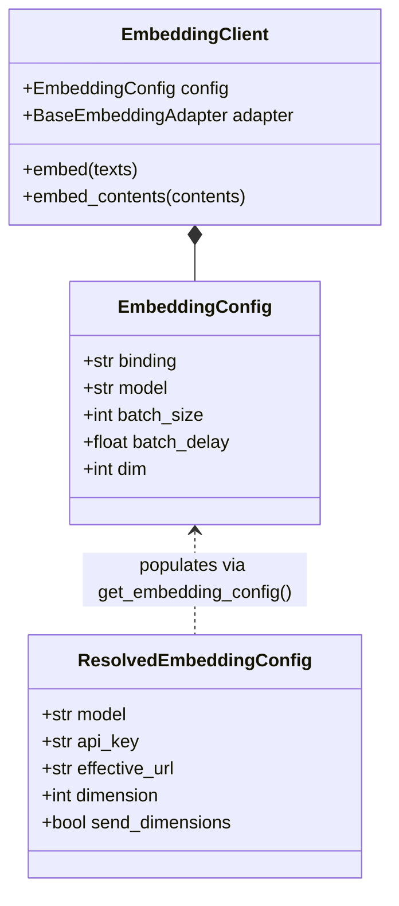

# 임베딩 서비스

<details>
<summary>관련 소스 파일</summary>

다음 파일들이 이 wiki 페이지를 생성할 때 맥락으로 사용되었습니다:

- [deeptutor/services/config/model_catalog.py](deeptutor/services/config/model_catalog.py)
- [deeptutor/services/config/provider_runtime.py](deeptutor/services/config/provider_runtime.py)
- [deeptutor/services/embedding/adapters/base.py](deeptutor/services/embedding/adapters/base.py)
- [deeptutor/services/embedding/adapters/cohere.py](deeptutor/services/embedding/adapters/cohere.py)
- [deeptutor/services/embedding/adapters/jina.py](deeptutor/services/embedding/adapters/jina.py)
- [deeptutor/services/embedding/adapters/ollama.py](deeptutor/services/embedding/adapters/ollama.py)
- [deeptutor/services/embedding/adapters/openai_compatible.py](deeptutor/services/embedding/adapters/openai_compatible.py)
- [deeptutor/services/embedding/client.py](deeptutor/services/embedding/client.py)
- [deeptutor/services/embedding/config.py](deeptutor/services/embedding/config.py)
- [deeptutor/services/llm/provider_core/openai_codex_provider.py](deeptutor/services/llm/provider_core/openai_codex_provider.py)
- [tests/services/config/test_embedding_runtime.py](tests/services/config/test_embedding_runtime.py)
- [tests/services/embedding/test_client_runtime.py](tests/services/embedding/test_client_runtime.py)
- [tests/services/embedding/test_disable_ssl_verify.py](tests/services/embedding/test_disable_ssl_verify.py)
- [tests/services/embedding/test_extract_embeddings.py](tests/services/embedding/test_extract_embeddings.py)
- [tests/services/llm/test_codex_disable_ssl_verify.py](tests/services/llm/test_codex_disable_ssl_verify.py)
- [web/app/(utility)/settings/page.tsx](web/app/(utility)/settings/page.tsx)

</details>


**Embedding Service**는 다양한 provider 전반에서 벡터 임베딩을 생성하기 위한 통합 추상화 계층을 제공합니다. 이 서비스는 **Adapter Pattern**을 사용해 서로 다른 API 스키마(OpenAI-compatible, Cohere, Jina, Ollama)에서 들어오는 요청과 응답을 DeepTutor의 RAG 및 retrieval 모듈이 사용하는 표준 형식으로 정규화합니다.

## 서비스 아키텍처

이 서비스는 `EmbeddingClient`를 중심으로 구성되며, 상위 수준 애플리케이션 모듈과 provider별 adapter 간의 상호작용을 조정합니다.

### 핵심 구성 요소

| 구성 요소 | 역할 | 파일 참조 |
|:---|:---|:---|
| `EmbeddingClient` | adapter 수명 주기, batching, 검증을 관리하는 통합 client입니다. | [deeptutor/services/embedding/client.py:34-64]() |
| `BaseEmbeddingAdapter` | `embed` 인터페이스와 구성 처리를 정의하는 추상 기본 클래스입니다. | [deeptutor/services/embedding/adapters/base.py:106-164]() |
| `EmbeddingRequest` | multimodal `contents`를 포함한 provider-agnostic 매개변수용 데이터 클래스입니다. | [deeptutor/services/embedding/adapters/base.py:15-53]() |
| `EmbeddingConfig` | 해석된 API key, URL, batch 설정을 담는 runtime 구성 객체입니다. | [deeptutor/services/embedding/config.py:11-27]() |
| `OpenAICompatibleEmbeddingAdapter` | OpenAI, Azure, SiliconFlow, 로컬 provider를 위한 구현입니다. | [deeptutor/services/embedding/adapters/openai_compatible.py:22-175]() |

### 데이터 흐름 다이어그램: 자연어에서 코드 엔터티 공간으로

이 다이어그램은 텍스트 입력이 상위 수준의 `EmbeddingClient`를 거쳐 구체적인 adapter 구현을 통과한 다음 외부 API 서비스에 도달하는 방식을 보여줍니다.

```mermaid
graph TD
    subgraph "Natural Language Space"
        Input["List[str] (texts)"]
    end

    subgraph "Code Entity Space: Embedding Service"
        Client["EmbeddingClient (deeptutor/services/embedding/client.py)"]
        Config["EmbeddingConfig (deeptutor/services/embedding/config.py)"]
        Req["EmbeddingRequest (deeptutor/services/embedding/adapters/base.py)"]
        
        subgraph "Adapters (deeptutor/services/embedding/adapters/)"
            OAI["OpenAICompatibleEmbeddingAdapter"]
            COH["CohereEmbeddingAdapter"]
            JINA["JinaEmbeddingAdapter"]
            OLL["OllamaEmbeddingAdapter"]
        end
    end

    subgraph "External Provider APIs"
        OAI_API["OpenAI / Azure / vLLM / LM Studio"]
        COH_API["Cohere API (/v2/embed)"]
        JINA_API["Jina AI API (/v1/embeddings)"]
        OLL_API["Ollama Local API (/api/embed)"]
    end

    Input -->|embed()| Client
    Client -.->|uses| Config
    Client -->|constructs| Req
    Client -->|calls embed()| OAI
    Client -->|calls embed()| COH
    Client -->|calls embed()| JINA
    Client -->|calls embed()| OLL

    OAI -->|POST verbatim URL| OAI_API
    COH -->|POST verbatim URL| COH_API
    JINA -->|POST verbatim URL| JINA_API
    OLL -->|POST verbatim URL| OLL_API
```
**Sources:** [deeptutor/services/embedding/client.py:49-60](), [deeptutor/services/embedding/client.py:66-97](), [deeptutor/services/embedding/adapters/openai_compatible.py:143-175](), [deeptutor/services/embedding/adapters/base.py:106-140]()

---

## Provider Adapters

DeepTutor는 여러 embedding backend를 지원하며, `ADAPTER_BACKENDS` 레지스트리 [deeptutor/services/embedding/client.py:13-13]()에서 backend를 조회하는 `_resolve_adapter_class` 유틸리티 [deeptutor/services/embedding/client.py:18-31]()를 통해 해석됩니다.

### 1. OpenAI 호환 Adapter
OpenAI, Azure OpenAI, SiliconFlow, 그리고 LM Studio 같은 로컬 서버에 사용됩니다.
- **유연한 파싱**: `_extract_embeddings_from_response` 메서드는 표준 OpenAI `data` 배열, Ollama의 단일 `embedding` 벡터, 중첩된 `result/output` 변형을 처리합니다 [deeptutor/services/embedding/adapters/openai_compatible.py:39-114]().
- **3상태 dimensions**: `_should_send_dimensions` 로직을 구현합니다. OpenAI `text-embedding-3*`와 Qwen3 계열에는 `dimensions` 매개변수를 자동으로 보내고, 다른 경우에는 HTTP 400 오류를 피하기 위해 생략합니다 [deeptutor/services/embedding/adapters/openai_compatible.py:120-141]().
- **멀티모달 지원**: SiliconFlow Qwen3-VL 같은 호환 모델에 대해 `contents`(텍스트/이미지 혼합)를 `input` 필드로 전달합니다 [deeptutor/services/embedding/adapters/openai_compatible.py:155-165]().
- **오류 처리**: provider가 반환한 구조화된 오류 payload를 포착해, 메시지와 코드를 추출하여 `ValueError`로 변환합니다 [deeptutor/services/embedding/adapters/openai_compatible.py:54-69]().

### 2. 특화 Adapter
- **Cohere**: v1과 v2 API를 모두 지원합니다. v2에서는 멀티모달 `contents`를 Cohere가 요구하는 중첩된 `inputs` 형식으로 변환합니다 [deeptutor/services/embedding/adapters/cohere.py:68-113](). 또한 `search_document` 같은 작업을 위한 `input_type` 매핑도 지원합니다 [deeptutor/services/embedding/adapters/cohere.py:66-67]().
- **Jina**: late chunking을 지원합니다 [deeptutor/services/embedding/adapters/jina.py:101-102](). 또한 `retrieval.passage` 또는 `retrieval.query` 같은 작업별 힌트도 지원합니다 [deeptutor/services/embedding/adapters/jina.py:29-35](). v4 모델의 멀티모달 입력도 처리합니다 [deeptutor/services/embedding/adapters/jina.py:68-76]().
- **Ollama**: 로컬 실행에 최적화되어 있습니다. `404`가 발생하면 `/api/tags` 프로브 메커니즘을 통해 누락된 모델을 사용자에게 제안합니다 [deeptutor/services/embedding/adapters/ollama.py:30-36](), [deeptutor/services/embedding/adapters/ollama.py:72-83]().

### SSL 검증
모든 adapter는 `disable_ssl_verify_enabled()` 헬퍼 [deeptutor/services/llm/openai_http_client.py:14-14]()를 통해 `DISABLE_SSL_VERIFY` 환경 변수를 따릅니다. 이 값은 `httpx.AsyncClient`를 구성할 때 사용됩니다 [deeptutor/services/embedding/adapters/openai_compatible.py:9](), [deeptutor/services/embedding/adapters/ollama.py:64-65](), [deeptutor/services/embedding/adapters/jina.py:109-110]().

**Sources:** [deeptutor/services/embedding/adapters/openai_compatible.py:22-175](), [deeptutor/services/embedding/adapters/cohere.py:51-158](), [deeptutor/services/embedding/adapters/jina.py:58-132](), [deeptutor/services/embedding/adapters/ollama.py:38-135]()

---

## 설정과 해석

이 서비스는 `resolve_embedding_runtime_config` [deeptutor/services/config/provider_runtime.py:216-228]()에 의존해, `ModelCatalog` [deeptutor/services/config/model_catalog.py:45-75]()에 있는 사용자 정의 설정과 runtime 구성 사이의 간극을 메웁니다.

### 설정 구조 다이어그램


**Sources:** [deeptutor/services/embedding/config.py:30-62](), [deeptutor/services/embedding/client.py:37-64]()

### URL 투명성
DeepTutor는 embedding 요청을 제공된 endpoint URL에 정확히 전송합니다. `EmbeddingClient`는 사용자가 숨겨진 path 덧붙이기에 의존하지 않도록 `embedding_endpoint_validation_error` [deeptutor/services/config/provider_runtime.py:21-26]()를 통해 검증을 수행합니다 [deeptutor/services/embedding/client.py:41-47](). 예를 들어 OpenAI와 Gemini는 기본값으로 완전한 형식의 embedding endpoint URL을 사용합니다 [deeptutor/services/config/provider_runtime.py:71-87]().

**Sources:** [deeptutor/services/embedding/client.py:40-47](), [deeptutor/services/embedding/config.py:30-62](), [deeptutor/services/config/provider_runtime.py:50-54]()

---

## 핵심 구현 세부 사항

### 배치 처리와 클램핑
`EmbeddingClient.embed` 메서드는 텍스트를 배치로 나눕니다 [deeptutor/services/embedding/client.py:89-90](). 또한 `EmbeddingProviderSpec`에 정의된 provider의 `max_batch_items`에 맞춰 설정된 `batch_size`를 동적으로 제한합니다 [deeptutor/services/config/provider_runtime.py:47-68](). 예를 들어 SiliconFlow는 32, DashScope는 20으로 상한이 설정됩니다 [deeptutor/services/embedding/client.py:72-83]().

### 검증과 일관성
각 batch 요청 후 client는 `validate_embedding_batch` [deeptutor/services/embedding/validation.py:15-15]()를 호출해 다음을 보장합니다:
1. 벡터 수가 입력 텍스트 수와 일치합니다 [deeptutor/services/embedding/client.py:114-122]().
2. 같은 요청의 모든 batch에서 vector 차원이 일관되어 vector database 손상을 방지합니다 [deeptutor/services/embedding/client.py:126-133]().
3. embedding vector 안에 null 값이 존재하지 않습니다. adapter가 추출 중 교체를 처리합니다 [tests/services/embedding/test_extract_embeddings.py:163-176]().

### 멀티모달 지원
이 서비스는 `embed_contents`를 통해 멀티모달 embedding을 지원합니다. `supports_multimodal_contents()`를 사용해 adapter가 멀티모달 입력을 지원하는지 확인합니다 [deeptutor/services/embedding/client.py:154-164](). `embed-v4.0`(Cohere)와 `jina-embeddings-v4` 같은 특정 모델은 각자의 `MODELS_INFO` 딕셔너리에서 멀티모달로 표시됩니다 [deeptutor/services/embedding/adapters/cohere.py:18-24](), [deeptutor/services/embedding/adapters/jina.py:22-26]().

**Sources:** [deeptutor/services/embedding/client.py:66-152](), [deeptutor/services/embedding/client.py:154-164](), [deeptutor/services/config/provider_runtime.py:103-157](), [deeptutor/services/embedding/adapters/openai_compatible.py:160-164]()
