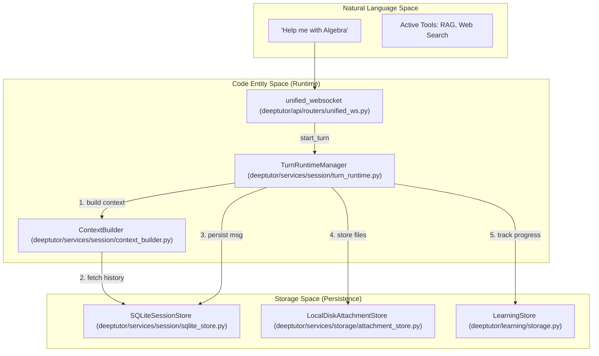
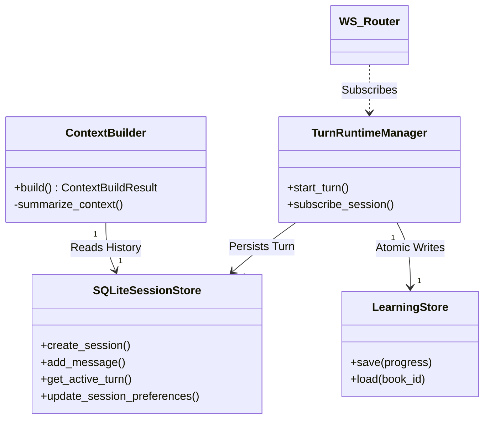

# 세션 및 메모리 관리

관련 소스 파일

다음 파일들이 이 wiki 페이지를 생성할 때 맥락으로 사용되었습니다:

- [deeptutor/agents/chat/chat_agent.py](deeptutor/agents/chat/chat_agent.py)
- [deeptutor/api/routers/sessions.py](deeptutor/api/routers/sessions.py)
- [deeptutor/api/routers/unified_ws.py](deeptutor/api/routers/unified_ws.py)
- [deeptutor/core/stream.py](deeptutor/core/stream.py)
- [deeptutor/learning/storage.py](deeptutor/learning/storage.py)
- [deeptutor/services/session/context_builder.py](deeptutor/services/session/context_builder.py)
- [deeptutor/services/session/pocketbase_store.py](deeptutor/services/session/pocketbase_store.py)
- [deeptutor/services/session/sqlite_store.py](deeptutor/services/session/sqlite_store.py)
- [deeptutor/services/session/turn_runtime.py](deeptutor/services/session/turn_runtime.py)
- [deeptutor/services/storage/attachment_store.py](deeptutor/services/storage/attachment_store.py)
- [tests/services/session/test_sqlite_store.py](tests/services/session/test_sqlite_store.py)
- [web/app/(workspace)/chat/[[...sessionId]]/page.tsx](web/app/(workspace)/chat/[[...sessionId]]/page.tsx)
- [web/components/chat/home/ChatMessages.tsx](web/components/chat/home/ChatMessages.tsx)
- [web/context/UnifiedChatContext.tsx](web/context/UnifiedChatContext.tsx)

DeepTutor는 장기적인 학습자 상호작용, 다중 에이전트 상태 지속성, 그리고 플랫폼 간 메모리 동기화를 처리하도록 설계된 정교한 세션 및 메모리 관리 시스템을 구현합니다. 이 시스템은 일시적인 runtime 상태에서 지속적인 SQLite 저장소로, 그리고 학습자 프로필을 위한 3계층 메모리 하위 시스템으로 전환합니다.

## 지속성 아키텍처

지속성 계층은 모든 상호작용 "turn"을 추적하는 SQLite 기반 session store와 계층형 파일 기반 메모리 시스템을 중심으로 구성됩니다.

### SQLite Session Store
DeepTutor는 중앙집중형 SQLite 데이터베이스를 사용해 채팅 기록과 session metadata를 유지합니다. 이를 통해 서버가 재시작되더라도 대화 맥락이 그대로 유지됩니다.
- **Database Path**: `PathService`가 관리하며, 일반적으로 `data/user/chat_history.db`에 위치합니다 [deeptutor/services/session/sqlite_store.py:81-83]().
- **Schema**: `sessions`, `messages`, `turns`, `turn_events`, `notebook_entries` 테이블을 포함합니다 [deeptutor/services/session/sqlite_store.py:104-186]().
- **Edit-Branching**: 시스템은 `messages` 테이블의 `parent_message_id` 열을 통해 분기 대화를 지원하며, 사용자가 대체 응답 경로를 탐색할 수 있게 합니다 [deeptutor/services/session/sqlite_store.py:128-128](). 프런트엔드는 이를 `ChatState`의 `selectedBranches`로 추적합니다 [web/context/UnifiedChatContext.tsx:98-99]().
- **Attachment Store**: 바이너리 파일은 세션이 분리된 디렉터리 구조(`data/user/workspace/chat/attachments/{session_id}/`)에 로컬 디스크로 저장되고, 해당 메타데이터와 public URL은 메시지 레코드에 저장됩니다 [deeptutor/services/storage/attachment_store.py:21-27](), [deeptutor/services/storage/attachment_store.py:103-110]().

### Notebook 및 Quiz 통합
`notebook_entries` 테이블은 퀴즈 결과를 위한 지속적 저장소 역할을 하며, 질문 내용, 선택지, 설명, 사용자 성과를 저장합니다 [deeptutor/services/session/sqlite_store.py:175-186](). 이 데이터는 `LearningStore`에서 `LearningProgress` 모델을 관리하는 데 사용되며, 해당 모델은 JSON 파일로 원자적으로 저장됩니다 [deeptutor/learning/storage.py:28-44]().

Sources: [deeptutor/services/session/sqlite_store.py:77-186](), [deeptutor/services/storage/attachment_store.py:1-110](), [deeptutor/learning/storage.py:16-51](), [web/context/UnifiedChatContext.tsx:83-101]()

## Turn Runtime 및 Context Building

`TurnRuntimeManager`는 개별 상호작용을 위한 주요 실행 엔진으로, 세션이 어떻게 업데이트되는지와 이벤트가 어떻게 multiplexing되는지를 조정합니다.

### Context Construction Flow
`ContextBuilder`는 LLM을 위한 제한된 prompt window를 만들기 위해 정보를 수집합니다. 이 과정에서 history depth와 token limit 사이의 trade-off를 관리합니다.
- **Token Budgeting**: 구성된 비율(기본값: history 35%, summaries는 그중 40%)에 따라 최근 history와 더 오래된 압축 context 사이에 token을 배분합니다 [deeptutor/services/session/context_builder.py:110-115]().
- **Effective Window**: LLM 모델과 `max_tokens` 설정을 기반으로 유효한 context window를 해석합니다 [deeptutor/services/session/context_builder.py:117-122]().
- **History Compression**: 예산을 초과하면 오래된 turn은 `_ContextSummaryAgent`에 의해 자동으로 요약됩니다 [deeptutor/services/session/context_builder.py:90-99](), [deeptutor/services/session/context_builder.py:182-190]().

### Turn Lifecycle 및 Protocol
각 상호작용은 `TurnRuntimeManager`가 관리하는 "Turn"으로 취급됩니다.

| Stage | Code Entity | Description |
| :--- | :--- | :--- |
| **Request** | `TurnRuntimeManager.start_turn` | 현재 UI 상태(capability, tools, KBs)의 `request_snapshot`을 캡처하면서 turn task를 시작합니다 [deeptutor/services/session/turn_runtime.py:206-250](). |
| **Context Prep** | `ContextBuilder.build` | history를 집계하고 token budget을 초과하면 요약을 수행합니다 [deeptutor/services/session/context_builder.py:223-230](). |
| **Streaming** | `UnifiedWSClient` | 프런트엔드로 실시간 이벤트를 전달하기 위한 WebSocket 연결을 관리합니다 [web/context/UnifiedChatContext.tsx:21-21](). |
| **Persistence** | `SQLiteSessionStore` | 메시지와 중간 이벤트를 DB에 저장합니다 [deeptutor/services/session/sqlite_store.py:228-245](). |

Sources: [deeptutor/services/session/turn_runtime.py:1-460](), [deeptutor/services/session/context_builder.py:104-230](), [web/context/UnifiedChatContext.tsx:21-143]()

## 3계층 메모리 하위 시스템

DeepTutor V2는 원시 상호작용을 상위 수준의 학습자 지식으로 통합하도록 설계된 3계층 메모리 하위 시스템을 도입합니다.

- **L1 (Trace)**: 원시 이벤트 캡처. chat, solver 같은 surface별로 하루 단위 append-only JSONL 로그를 남깁니다.
- **L2 (Surface Summaries)**: L1 trace에서 파생된 surface별 요약으로, 특정 모듈에서의 최근 활동을 압축해 보여줍니다.
- **L3 (Cross-Surface Knowledge)**: `profile`(사용자가 누구인지), `preferences`(어떻게 학습하길 선호하는지), `scope`(현재 무엇을 공부 중인지) 슬롯으로 나뉜 지속적 학습자 프로필입니다.

### Memory Consolidator Pipeline
consolidator pipeline은 데이터를 이 계층들을 통해 이동시키는 LLM 기반 과정입니다. 사용자는 request payload의 `memory_references`를 통해 turn마다 특정 L3 슬롯을 선택적으로 활성화할 수 있습니다 [deeptutor/services/session/turn_runtime.py:166-182]().

Sources: [deeptutor/services/session/turn_runtime.py:166-182](), [web/context/UnifiedChatContext.tsx:141-141]()

## 데이터 흐름: 자연어에서 코드 엔터티로

다음 다이어그램은 사용자 대면 개념과 내부 코드 아키텍처 사이의 연결을 보여줍니다.

**Diagram: Turn Execution and Persistence Flow**

Sources: [deeptutor/services/session/turn_runtime.py:206-250](), [deeptutor/services/session/context_builder.py:104-110](), [deeptutor/api/routers/unified_ws.py:44-118](), [deeptutor/services/session/sqlite_store.py:77-186](), [deeptutor/learning/storage.py:28-44]()

**Diagram: Session State Management**

Sources: [deeptutor/services/session/sqlite_store.py:77-186](), [deeptutor/learning/storage.py:28-44](), [deeptutor/services/session/turn_runtime.py:198-220](), [deeptutor/api/routers/unified_ws.py:90-101]()

## 주요 클래스 및 함수

| Class/Function | File | Role |
| :--- | :--- | :--- |
| `SQLiteSessionStore` | [deeptutor/services/session/sqlite_store.py:77]() | session, message, turn에 대한 SQLite schema, migrations, CRUD를 관리합니다. |
| `TurnRuntimeManager` | [deeptutor/services/session/turn_runtime.py:198]() | 요청 검증부터 백그라운드 실행까지 turn lifecycle을 조율합니다. |
| `ContextBuilder` | [deeptutor/services/session/context_builder.py:104]() | token-aware context window 관리와 history 요약을 구현합니다. |
| `LearningStore` | [deeptutor/learning/storage.py:28]() | 학습자 progress model을 JSON으로 원자적으로 저장합니다. |
| `AttachmentStore` | [deeptutor/services/storage/attachment_store.py:64]() | 바이너리 attachment를 저장하고 public access URL을 생성하는 protocol입니다. |
| `UnifiedWSClient` | [web/context/UnifiedChatContext.tsx:21]() | 통합 WebSocket protocol을 위한 프런트엔드 client입니다. |

Sources: [deeptutor/services/session/sqlite_store.py:77-186](), [deeptutor/services/session/turn_runtime.py:198-220](), [deeptutor/services/session/context_builder.py:104-110](), [deeptutor/learning/storage.py:28-64](), [deeptutor/services/storage/attachment_store.py:64-80](), [web/context/UnifiedChatContext.tsx:21-143]()
