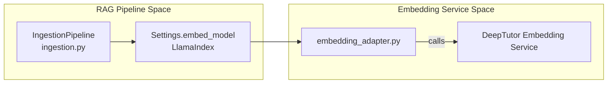

# RAG 시스템

<details>
<summary>관련 소스 파일</summary>

다음 파일들이 이 wiki 페이지를 생성할 때 맥락으로 사용되었습니다:

- [.pre-commit-config.yaml](.pre-commit-config.yaml)
- [deeptutor/knowledge/initializer.py](deeptutor/knowledge/initializer.py)
- [deeptutor/services/rag/pipelines/llamaindex/config.py](deeptutor/services/rag/pipelines/llamaindex/config.py)
- [deeptutor/services/rag/pipelines/llamaindex/ingestion.py](deeptutor/services/rag/pipelines/llamaindex/ingestion.py)
- [deeptutor/services/rag/service.py](deeptutor/services/rag/service.py)
- [tests/core/__init__.py](tests/core/__init__.py)
- [tests/core/test_prompt_manager.py](tests/core/test_prompt_manager.py)
- [tests/services/rag/test_pipeline_integration.py](tests/services/rag/test_pipeline_integration.py)
- [tests/services/rag/test_rag_pipelines.py](tests/services/rag/test_rag_pipelines.py)
- [tests/services/rag/testfile.txt](tests/services/rag/testfile.txt)

</details>


## 목적과 범위

RAG (Retrieval-Augmented Generation) 시스템은 여러 retrieval 전략과 pipeline 구현 전반에서 knowledge base를 질의하기 위한 통합 추상화 계층을 제공합니다. 이는 모든 지능형 에이전트가 구조화된 지식에 접근하기 위한 주요 도구로서, vector 기반 의미 검색과 multimodal 문서 파싱을 지원합니다.

DeepTutor의 RAG 아키텍처는 "RAG-Anything" 호환입니다. 즉, 다양한 문서 형식(PDF, Markdown, Text, Office)을 수용하고, 콘텐츠를 통합된 지식 표현으로 추출할 수 있습니다. 이 시스템은 주로 인덱싱과 retrieval에 **LlamaIndex**를 활용하며, 다양한 모델 provider를 지원하기 위해 맞춤형 embedding 계층과 통합되어 있습니다.

---

## 시스템 아키텍처

RAG 시스템은 `RAGService`가 중앙 라우팅 허브 역할을 하는 **provider-based architecture**를 구현합니다. 아키텍처는 확장 가능하도록 설계되어 있지만, 현재 구현은 핵심 엔진으로 **LlamaIndex**를 표준으로 사용합니다.

### 핵심 구성 요소 및 데이터 흐름

```mermaid
graph TB
    subgraph "Agent Layer"
        [SmartSolver]
        [QuestionGenerator]
        [ResearchAgent]
    end
    
    subgraph "RAG Tool Interface"
        [rag_search_tool]
    end
    
    subgraph "RAG Service Layer [deeptutor/services/rag/]"
        RAG_SERVICE["RAGService<br/>service.py"]
        FACTORY["Pipeline Factory<br/>factory.py"]
        LLAMA_PIPE["LlamaIndexPipeline<br/>pipelines/llamaindex/pipeline.py"]
        SMART_RETR["SmartRetriever<br/>smart_retriever.py"]
    end
    
    subgraph "Storage Layer"
        KB_BASE_DIR["DEFAULT_KB_BASE_DIR<br/>data/knowledge_bases/"]
        LI_STORAGE["storage.py<br/>VectorStoreIndex"]
    end
    
    [SmartSolver] --> [rag_search_tool]
    [QuestionGenerator] --> [rag_search_tool]
    [ResearchAgent] --> [rag_search_tool]
    
    [rag_search_tool] --> RAG_SERVICE
    RAG_SERVICE --> FACTORY
    FACTORY -->|"get_pipeline()"| LLAMA_PIPE
    RAG_SERVICE -->|"smart_retrieve()"| SMART_RETR
    
    LLAMA_PIPE --> LI_STORAGE
    LI_STORAGE --> KB_BASE_DIR
```

**Sources:** `[deeptutor/services/rag/service.py:18-47]()`, `[deeptutor/services/rag/service.py:195-200]()`, `[deeptutor/services/rag/factory.py:13-14]()`

| Component | File Path | Responsibility |
|:----------|:----------|:---------------|
| `RAGService` | `[deeptutor/services/rag/service.py:18-47]()` | KB별 provider 해석과 검색 실행을 조율합니다. |
| `SmartRetriever` | `[deeptutor/services/rag/smart_retriever.py:10-11]()` | query hint와 context를 사용해 여러 검색 결과를 집계합니다. |
| `LlamaIndexPipeline` | `[deeptutor/services/rag/pipelines/llamaindex/pipeline.py:36-50]()` | `VectorStoreIndex`와 `StorageContext`를 사용하는 구체적 구현입니다. |
| `KnowledgeBaseInitializer` | `[deeptutor/knowledge/initializer.py:25-48]()` | KB의 초기 설정, 디렉터리 생성, 문서 처리를 담당합니다. |

---

## Retrieval Pipeline 구현

### LlamaIndex 통합
`LlamaIndexPipeline`은 knowledge base의 초기화부터 질의까지 수명 주기를 관리합니다.

#### Ingestion 및 변환
DeepTutor는 문서를 node로 변환하기 위해 전용 ingestion pipeline을 사용합니다.
* **Sentence Splitting**: 구성 가능한 `chunk_size`와 `chunk_overlap`를 가진 `SentenceSplitter`를 사용합니다 `[deeptutor/services/rag/pipelines/llamaindex/ingestion.py:28-31]()`.
* **Multimodal Support**: 이 pipeline은 일반 문서와 사전 임베딩된 node(예: `ImageNode`)를 구분하여 시각적 콘텐츠를 텍스트로 다시 임베딩하지 않도록 합니다 `[deeptutor/services/rag/pipelines/llamaindex/ingestion.py:37-59]()`.
* **Pipeline Execution**: `IngestionPipeline`은 변환과 embedding 단계를 순차적으로 실행합니다 `[deeptutor/services/rag/pipelines/llamaindex/ingestion.py:26-34]()`.

#### Retrieval 전략과 프로파일
DeepTutor는 환경 변수 또는 runtime 인자를 통해 구성되는 여러 retrieval profile을 지원합니다.
* **Retrieval Profiles**: `vector`(순수 semantic search)와 `hybrid`(vector + BM25)를 지원합니다 `[deeptutor/services/rag/pipelines/llamaindex/config.py:8-10]()`.
* **Hybrid Configuration**: `RetrievalConfig` 클래스는 자식 retriever 전반의 `top_k` 결과와 query fusion 매개변수에 대한 multiplier를 관리합니다 `[deeptutor/services/rag/pipelines/llamaindex/config.py:14-26]()`.
* **Fallback Logic**: `hybrid` profile이 요청되었지만 의존성이 없으면 시스템은 투명하게 `vector` retrieval로 fallback합니다 `[deeptutor/services/rag/pipelines/llamaindex/config.py:39-42]()`.

#### 초기화 및 처리
1. **Signature Verification**: 현재 embedding model 구성과 index가 일치하는지 확인하기 위해 `EmbeddingSignature`를 사용합니다.
2. **Indexing**: 문서는 `documents_to_nodes`를 통해 node로 변환됩니다 `[deeptutor/services/rag/pipelines/llamaindex/ingestion.py:61-78]()`.
3. **Persistence**: index는 `index.storage_context.persist`를 사용해 특정 storage 디렉터리에 저장됩니다 `[deeptutor/services/rag/pipelines/llamaindex/ingestion.py:86-86]()`.
4. **Incremental Updates**: 시스템은 `insert_documents_into_index`를 통해 기존 index에 문서를 추가하는 것을 지원합니다 `[deeptutor/services/rag/pipelines/llamaindex/ingestion.py:90-96]()`.

**Sources:** `[deeptutor/services/rag/pipelines/llamaindex/ingestion.py:18-34]()`, `[deeptutor/services/rag/pipelines/llamaindex/config.py:14-48]()`, `[deeptutor/services/rag/service.py:54-60]()`

---

## 검색 및 Smart Retrieval

### 검색 정규화
`RAGService.search` 메서드는 정규화 계층으로 동작하여, 서로 다른 하위 구현 전반에서 일관된 결과 형식을 보장합니다.
* **Alias Handling**: `answer`와 `content` 필드를 별칭 처리하여 소비자가 어느 키든 사용할 수 있게 합니다 `[deeptutor/services/rag/service.py:91-94]()`.
* **Provider Enforcement**: 결과의 `provider` 필드를 명시적으로 덮어써 구성된 시스템 기본값과 일치시킵니다 `[deeptutor/services/rag/service.py:95-95]()`.
* **Event Streaming**: 실시간 프런트엔드 업데이트를 위해 `event_sink`에 tool event(예: "status", "raw_log")를 발행합니다 `[deeptutor/services/rag/service.py:70-85]()`.

### Smart Retrieval 로직
`smart_retrieve`는 여러 query hint를 사용해 더 넓은 context를 수집하는 상위 수준 인터페이스를 제공합니다.
* **Query Hint Aggregation**: 여러 query를 순회하며 각 query에 대한 passage를 수집합니다 `[deeptutor/services/rag/service.py:195-200]()`.
* **Deduplication**: 여러 검색 결과에서 고유한 passage를 집계합니다.
* **Contextual Grounding**: 최종 세트를 agent에게 반환하기 전에 제공된 `context`를 사용해 검색된 passage를 순위화하거나 필터링합니다.

**Sources:** `[deeptutor/services/rag/service.py:61-111]()`, `[tests/services/rag/test_rag_pipelines.py:56-93]()`, `[tests/services/rag/test_rag_pipelines.py:107-130]()`

---

## Embedding 및 연결성

RAG 시스템은 LlamaIndex와 DeepTutor의 내부 embedding 서비스를 연결하기 위해 통합 embedding adapter에 의존합니다.

### Embedding Adapter 아키텍처



**Sources:** `[deeptutor/services/rag/pipelines/llamaindex/ingestion.py:18-34]()`, `[deeptutor/services/rag/service.py:41-42]()`

### 연결성과 Ingestion 흐름
시스템은 ingestion 과정이 견고하도록 보장합니다:
* **Pre-embedded Nodes**: `ImageNode`에서 온 이미지와 같은 multimodal 데이터를 처리하기 위해, 시스템은 `_has_precomputed_embedding`을 확인해 이미 vector를 가진 node는 다시 임베딩하지 않습니다 `[deeptutor/services/rag/pipelines/llamaindex/ingestion.py:37-59]()`.
* **Batch Progress**: 초기화 과정은 `progress_callback`을 지원하여 배치 전반의 embedding 진행률을 추적합니다 `[deeptutor/knowledge/initializer.py:179-186]()`.

---

## Knowledge Base Management

knowledge base는 `KnowledgeBaseInitializer`가 조율하는 구조화된 수명 주기를 통해 관리됩니다.

### 초기화 워크플로
1. **Directory Creation**: `raw`와 `llamaindex_storage` 디렉터리를 생성합니다 `[deeptutor/knowledge/initializer.py:41-43]()`.
2. **Metadata Generation**: KB 이름, 생성 시간, 기본 RAG provider를 포함한 `metadata.json` 파일을 작성합니다 `[deeptutor/knowledge/initializer.py:116-126]()`.
3. **Registration**: "initializing" 상태로 중앙 `kb_config.json`에 KB를 등록합니다 `[deeptutor/knowledge/initializer.py:49-74]()`.
4. **Document Processing**: 원본 파일을 `raw` 디렉터리로 복사하고 RAG service의 `initialize` 호출을 트리거합니다 `[deeptutor/knowledge/initializer.py:130-192]()`.

### Cleanup 및 삭제
* **Service-Level Deletion**: `RAGService.delete`는 pipeline의 기본 delete 메서드를 호출하려고 시도합니다 `[deeptutor/services/rag/service.py:185-186]()`.
* **Fallback Cleanup**: pipeline이 `delete`를 구현하지 않으면, service는 파일 시스템에서 KB 디렉터리를 수동으로 제거합니다 `[deeptutor/services/rag/service.py:188-193]()`.

**Sources:** `[deeptutor/knowledge/initializer.py:107-142]()`, `[deeptutor/services/rag/service.py:181-194]()`, `[tests/services/rag/test_rag_pipelines.py:148-166]()`
