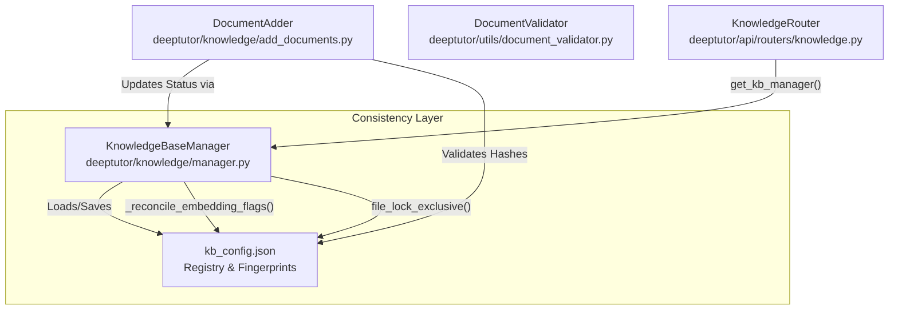
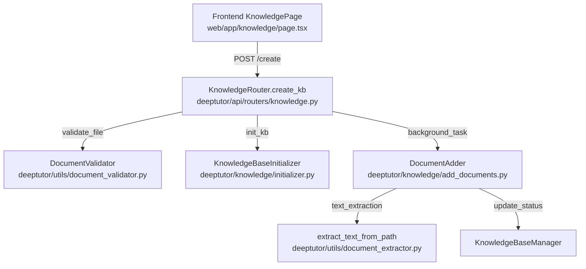

# 지식 베이스 관리

<details>
<summary>관련 소스 파일</summary>

다음 파일들이 이 wiki 페이지를 생성할 때 맥락으로 사용되었습니다:

- [deeptutor/api/routers/knowledge.py](deeptutor/api/routers/knowledge.py)
- [deeptutor/knowledge/manager.py](deeptutor/knowledge/manager.py)
- [tests/api/test_knowledge_router.py](tests/api/test_knowledge_router.py)
- [tests/knowledge/test_manager_get_info_status.py](tests/knowledge/test_manager_get_info_status.py)
- [web/app/(utility)/knowledge/page.tsx](web/app/(utility)/knowledge/page.tsx)

</details>


## 목적과 범위

이 문서는 DeepTutor의 지식 베이스(KB) 관리 시스템을 설명합니다. 이 시스템은 구조화된 문서 저장소의 생성, 유지보수, 조직화를 처리합니다. 지식 베이스는 Retrieval-Augmented Generation (RAG) 작업과 다양한 지능형 에이전트 모듈의 기초 데이터 소스 역할을 합니다.

이 시스템은 주로 `KnowledgeBaseManager` [deeptutor/knowledge/manager.py:196-198]()에 의해 관리되며, 여러 RAG provider(주로 LlamaIndex)를 조정하고 파일 시스템과 구성 레지스트리 전반의 데이터 일관성을 보장합니다. 이 페이지는 KB 초기화, 문서 추가, 디렉터리 구조 규약, 버전 관리된 인덱스 관리를 다룹니다.

**Sources:** [deeptutor/knowledge/manager.py:1-23](), [deeptutor/knowledge/add_documents.py:1-22](), [deeptutor/api/routers/knowledge.py:1-6]()

---

## 지식 베이스 디렉터리 구조

각 지식 베이스는 `./data/knowledge_bases/<kb_name>/` 아래의 표준화된 디렉터리 레이아웃을 따릅니다. 이 구조는 원본 문서, 처리된 콘텐츠, 버전 관리된 검색 엔진 인덱스를 분리합니다.

### 표준 디렉터리 레이아웃

```
data/knowledge_bases/
├── kb_config.json                    # Global KB registry and embedding fingerprints
└── <kb_name>/
    ├── metadata.json                 # KB metadata and creation history
    ├── raw/                          # Original documents (PDF, DOCX, etc.)
    ├── llamaindex_storage/           # Standard LlamaIndex persistence (legacy/fallback)
    ├── version-1/                    # Active index version (flat layout)
    │   ├── docstore.json             # LlamaIndex document store
    │   ├── index_store.json          # Index structure
    │   ├── default__vector_store.json# Vector embeddings
    │   └── meta.json                 # Version-specific embedding signature
    └── version-2/                    # Secondary version (e.g., during re-indexing)
```

| Directory/File | 목적 | Code Entity / Provider |
|----------------|---------|------------------------|
| `raw/` | 원본 소스 파일 | `DocumentAdder.raw_dir` [deeptutor/knowledge/add_documents.py:46]() |
| `version-N/` | 인덱스를 위한 flat versioned storage | `list_kb_versions` [deeptutor/knowledge/add_documents.py:19]() |
| `kb_config.json` | 모든 KB의 전역 레지스트리 | `KnowledgeBaseManager.config_file` [deeptutor/knowledge/manager.py:204]() |
| `metadata.json` | 생성 시각과 파일 해시 | `DocumentAdder.metadata_file` [deeptutor/knowledge/add_documents.py:49]() |

**Sources:** [deeptutor/knowledge/manager.py:199-204](), [deeptutor/knowledge/add_documents.py:39-52](), [tests/knowledge/test_manager_get_info_status.py:33-49]()

---

## 지식 베이스 관리

### KnowledgeBaseManager 클래스

`KnowledgeBaseManager`는 KB 수명 주기의 중앙 권한입니다. 전역 `kb_config.json`의 지속성을 처리하고, `file_lock_shared`와 `file_lock_exclusive`로 구현된 cross-platform 파일 잠금 메커니즘을 통해 서로 다른 embedding model 간 전환을 관리합니다 [deeptutor/knowledge/manager.py:53-95]().

**시스템 엔터티 관계 다이어그램**



**Sources:** [deeptutor/knowledge/manager.py:196-204](), [deeptutor/knowledge/manager.py:108-126](), [deeptutor/api/routers/knowledge.py:90-108]()

### Embedding 일관성과 상태 승격
관리자의 핵심 기능은 `_reconcile_embedding_flags` [deeptutor/knowledge/manager.py:108-126]()입니다. 이 메서드는 활성 embedding model과 차원("fingerprint")을 저장된 메타데이터 [deeptutor/knowledge/manager.py:97-105]()와 비교합니다. 불일치가 감지되면 KB에 `embedding_mismatch: true`와 `needs_reindex: true`가 설정됩니다 [deeptutor/knowledge/manager.py:184-188]().

관리자는 또한 **상태 승격(Status Promotion)**을 처리합니다. KB가 config에서 `processing` 또는 `initializing` 상태에 머물러 있지만, 디스크에 `ready` 인덱스 버전이 존재하는 경우 `get_info`는 보고된 상태를 자동으로 `ready`로 승격시켜 영구적인 processing 배너를 방지합니다 [tests/knowledge/test_manager_get_info_status.py:1-11](). 이 로직은 progress stage가 `error`일 때는 승격을 적용하지 않아, 실패가 사용자에게 계속 보이도록 합니다 [tests/knowledge/test_manager_get_info_status.py:130-135]().

**Sources:** [deeptutor/knowledge/manager.py:108-193](), [tests/knowledge/test_manager_get_info_status.py:68-90](), [tests/knowledge/test_manager_get_info_status.py:130-150]()

---

## 문서 수집 파이프라인

수집 파이프라인은 안전성과 크기 제약을 강제하면서 원시 바이트를 인덱싱 가능한 텍스트로 변환합니다.

### 검증과 안전성
라우터에서 참조하는 `DocumentValidator` [deeptutor/utils/document_validator.py:13]()는 엄격한 제한을 적용합니다:
* **Max File Size**: 일반 파일에 대해 100MB로 제한합니다 [deeptutor/api/routers/knowledge.py:204]().
* **Allowed Extensions**: `.pdf`, `.docx`, `.md`, `.txt`, `.png` 등 문서 및 데이터 형식의 특정 집합을 지원합니다 [deeptutor/api/routers/knowledge.py:117-128]().
* **Zip Safety**: 시스템은 `.zip` 업로드를 지원하며, Zip Slip 및 zip-bomb 공격을 방지하기 위해 `safe_extract_zip`으로 안전하게 확장합니다 [deeptutor/api/routers/knowledge.py:185-201]().

### API 및 라우팅
`deeptutor/api/routers/knowledge.py`의 `APIRouter`는 KB 작업을 위한 엔드포인트를 노출합니다. 인덱싱 같은 장시간 작업 동안 프런트엔드에 실시간 업데이트를 보내기 위해 `ProgressBroadcaster`를 사용합니다 [deeptutor/api/routers/knowledge.py:31]().

**Ingestion Flow: Upload to Index**



**Sources:** [deeptutor/api/routers/knowledge.py:18-38](), [deeptutor/api/routers/knowledge.py:185-220](), [web/app/(utility)/knowledge/page.tsx:1-19](), [deeptutor/knowledge/add_documents.py:27-35]()

---

## 메타데이터와 진행 상황 추적

이 시스템은 UI에 피드백을 제공하고 점진적 업데이트를 보장하기 위해 상세한 메타데이터를 유지합니다.

### 메타데이터 지속성
각 KB 디렉터리 내부의 `metadata.json`은 다음을 저장합니다:
* `file_hashes`: 변경되지 않은 파일의 재색인을 방지하기 위한 파일명과 SHA256 해시 매핑 [deeptutor/knowledge/add_documents.py:170]().
* `rag_provider`: 사용된 provider(예: `llamaindex`) [deeptutor/knowledge/add_documents.py:184]().
* `last_indexed_at`: 마지막으로 성공한 인덱싱 작업의 타임스탬프 [deeptutor/knowledge/add_documents.py:187]().

### 번호 매기기 항목과 추출
수집 중 문서는 `extract_text_from_path` 유틸리티로 처리됩니다 [deeptutor/api/routers/knowledge.py:53-57](). 이 유틸리티는 매우 큰 문서를 처리할 때 시스템 안정성을 보장하기 위해 문자 제한(`MAX_EXTRACTED_CHARS_PER_DOC`)을 적용합니다 [deeptutor/api/routers/knowledge.py:54]().

**Sources:** [deeptutor/knowledge/add_documents.py:159-173](), [deeptutor/knowledge/add_documents.py:174-188](), [deeptutor/api/routers/knowledge.py:53-60](), [tests/api/test_knowledge_router.py:111-128]()
