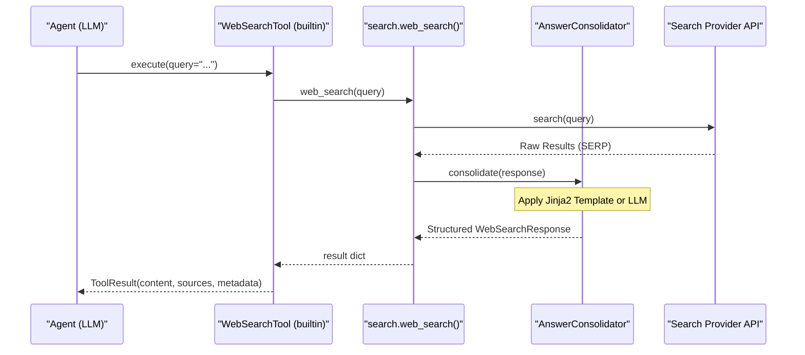

# 웹 검색 및 기타 도구

<details>
<summary>관련 소스 파일</summary>

다음 파일들이 이 wiki 페이지를 생성할 때 맥락으로 사용되었습니다:

- [AGENTS.md](AGENTS.md)
- [SKILL.md](SKILL.md)
- [deeptutor/agents/_shared/tool_composition.py](deeptutor/agents/_shared/tool_composition.py)
- [deeptutor/agents/chat/agent_loop.py](deeptutor/agents/chat/agent_loop.py)
- [deeptutor/agents/chat/prompt_blocks.py](deeptutor/agents/chat/prompt_blocks.py)
- [deeptutor/agents/research/pipeline.py](deeptutor/agents/research/pipeline.py)
- [deeptutor/app/facade.py](deeptutor/app/facade.py)
- [deeptutor/capabilities/mastery_path.py](deeptutor/capabilities/mastery_path.py)
- [deeptutor/loop_plugins/__init__.py](deeptutor/loop_plugins/__init__.py)
- [deeptutor/loop_plugins/mastery/__init__.py](deeptutor/loop_plugins/mastery/__init__.py)
- [deeptutor/loop_plugins/mastery/plugin.py](deeptutor/loop_plugins/mastery/plugin.py)
- [deeptutor/services/search/__init__.py](deeptutor/services/search/__init__.py)
- [deeptutor/services/search/consolidation.py](deeptutor/services/search/consolidation.py)
- [deeptutor/services/search/providers/__init__.py](deeptutor/services/search/providers/__init__.py)
- [deeptutor/tools/builtin/__init__.py](deeptutor/tools/builtin/__init__.py)
- [deeptutor/tools/paper_search_tool.py](deeptutor/tools/paper_search_tool.py)
- [deeptutor/tools/web_search.py](deeptutor/tools/web_search.py)
- [web/lib/unified-ws.ts](web/lib/unified-ws.ts)

</details>


이 페이지는 지능형 에이전트 모듈에 외부 정보 검색, 문서 처리, 코드 실행 기능을 제공하는 tool integration layer 구성 요소를 문서화합니다. 이 도구들은 통합된 `BaseTool` 프로토콜 [[deeptutor/core/tool_protocol.py:10-10]]()로 관리되며 시스템의 tool registry에 등록됩니다.

이 페이지에서 다루는 도구는 다음과 같습니다:
- **Web Search**: 다중 provider 지원과 자동 답변 통합을 갖춘 실시간 인터넷 검색.
- **Paper Search**: ArXiv API를 통한 학술 논문 검색.
- **Code Execution**: 계산과 검증을 위한 sandboxed Python/C/C++ 실행.
- **RAG Tool**: Retrieval-Augmented Generation을 사용한 knowledge base 검색.
- **Brainstorm Tool**: 탐색적 주제 확장과 근거 생성을 위한 도구.
- **Mastery Tools**: Mastery Path 학습 엔진을 위한 특화 도구.

## 도구 아키텍처 개요

다음 다이어그램은 `deeptutor.tools` 모듈 내부에서 자연어 공간(의도)과 코드 엔터티 공간(구현 클래스)을 연결합니다.

**자연어에서 코드 엔터티로의 매핑**
```mermaid
graph TB
    subgraph "NaturalLanguageSpace"
        ["'Search the web for...'"] --> REQ_SEARCH
        ["'Calculate the integral of...'"] --> REQ_CODE
        ["'Find recent papers on...'"] --> REQ_PAPER
        ["'What does the textbook say about...'"] --> REQ_RAG
        ["'Brainstorm ideas for...'"] --> REQ_BS
    end
    
    subgraph "CodeEntitySpace (deeptutor.tools.builtin)"
        WST["WebSearchTool"]
        CET["CodeExecutionTool"]
        RGT["RAGTool"]
        BST["BrainstormTool"]
        
        subgraph "InternalLogicServices"
            WS_FUNC["web_search.py: web_search()"]
            ET_CLASS["exec_tool.py: ExecTool"]
            PS_CLASS["paper_search_tool.py: ArxivSearchTool"]
            RG_FUNC["rag_tool.py: rag_search()"]
        end
    end

    subgraph "ExternalProvidersArtifacts"
        BRAVE["Brave / Tavily / Jina"]
        DDG["DuckDuckGo (Fallback)"]
        PERPLEXITY["Perplexity API"]
        ARXIV["ArXiv API"]
        SANDBOX["Sandbox Service"]
    end

    REQ_SEARCH --> WST
    REQ_CODE --> CET
    REQ_PAPER --> PS_CLASS
    REQ_RAG --> RGT
    REQ_BS --> BST

    WST --> WS_FUNC
    CET --> ET_CLASS
    RGT --> RG_FUNC
    
    WS_FUNC --> BRAVE
    WS_FUNC --> DDG
    WS_FUNC --> PERPLEXITY
    PS_CLASS --> ARXIV
    ET_CLASS --> SANDBOX
```

**Sources**: [[deeptutor/tools/builtin/__init__.py:1-203]](), [[deeptutor/tools/paper_search_tool.py:24-60]](), [[deeptutor/tools/exec_tool.py:1-20]]()

## Web Search Tool

`WebSearchTool` 클래스 [[deeptutor/tools/builtin/__init__.py:116-153]]()는 에이전트가 인터넷을 질의할 수 있도록 표준화된 인터페이스를 제공합니다. 이 도구는 `web_search` 서비스를 활용해 결과를 가져오고 citation과 함께 반환합니다.

### 검색 Provider 관리
이 시스템은 다양한 provider를 지원합니다. Perplexity, Tavily, Baidu 같은 provider는 답변을 기본적으로 생성하고, 다른 provider는 통합이 필요한 원시 Search Engine Result Pages (SERP)를 반환합니다 [[deeptutor/services/search/consolidation.py:25-27]]().

| Provider | 유형 | API Key 요구사항 | 설명 |
| :--- | :--- | :--- | :--- |
| **Brave/Tavily/Jina** | Professional | 필요함(없으면 DDG로 fallback) | 고품질 검색 결과 [[deeptutor/services/search/__init__.py:113-119]]() |
| **Perplexity** | AI Answer | 엄격히 필요함 | 직접 LLM 기반 답변 |
| **DuckDuckGo** | Zero-Config | 없음 | 기본 fallback provider [[deeptutor/services/search/__init__.py:117-117]]() |
| **Serper** | SERP | 필요함 | Google Search API 결과 |

### 답변 통합
기본 답변 생성을 지원하지 않는 provider의 경우 `AnswerConsolidator` [[deeptutor/services/search/consolidation.py:138-160]]()가 원시 결과를 자동으로 포맷합니다.
- **Template-based**: provider별 Jinja2 템플릿을 사용합니다(예: `serper`, `jina`, `serper_scholar`) [[deeptutor/services/search/consolidation.py:27-135]]().
- **LLM-based**: `use_llm=True`가 지정되면, 시스템은 LLM을 사용해 검색 스니펫으로부터 일관된 답변을 합성합니다 [[deeptutor/services/search/consolidation.py:178-181]]().

**Search Data Flow**


**Sources**: [[deeptutor/tools/builtin/__init__.py:116-153]](), [[deeptutor/services/search/consolidation.py:138-189]]()

## Paper Search Tool

`ArxivSearchTool`(별칭 `PaperSearchTool`) [[deeptutor/tools/paper_search_tool.py:24-207]]()는 preprint를 찾기 위한 전용 유틸리티입니다. 학술 논문에 특화된 구조화된 메타데이터를 반환합니다.

### 핵심 함수와 설정
- **`search_papers`**: `max_results`, `years_limit`(기본값 3), `sort_by`(relevance 또는 date) 파라미터로 ArXiv를 질의합니다 [[deeptutor/tools/paper_search_tool.py:35-140]]().
- **`format_paper_citation`**: 표준 "(Author et al., Year)" 문자열을 생성합니다 [[deeptutor/tools/paper_search_tool.py:142-159]]().
- **Rate Limiting**: ArXiv 사용 정책을 준수하기 위해 `arxiv.Client`를 통해 `delay_seconds=3.0`과 `num_retries=2`를 구현합니다 [[deeptutor/tools/paper_search_tool.py:29-33]]().

**Sources**: [[deeptutor/tools/paper_search_tool.py:24-140]]()

## Code Execution Tool

`CodeExecutionTool` [[deeptutor/tools/builtin/__init__.py:156-203]]()은 에이전트가 격리된 sandbox에서 코드 스니펫을 컴파일하고 실행할 수 있게 합니다.

### 실행 환경
- **Languages**: `python`, `c`, `cpp`를 지원합니다 [[deeptutor/tools/builtin/__init__.py:171-175]]().
- **Isolation**: 명령은 turn의 workspace 하위 디렉터리를 현재 작업 디렉터리(CWD)로 사용해 실행됩니다 [[deeptutor/tools/builtin/__init__.py:169-170]]().
- **Sandboxing**: `deeptutor.services.sandbox`의 OS 수준 격리와 quota를 상속합니다 [[deeptutor/tools/builtin/__init__.py:163-164]]().

**Sources**: [[deeptutor/tools/builtin/__init__.py:156-203]]()

## RAG 및 브레인스토밍 도구

### RAGTool
`RAGTool` [[deeptutor/tools/builtin/__init__.py:67-114]]()은 시스템의 Knowledge Base와 인터페이스합니다.
- **Implementation**: turn에 연결된 특정 `kb_name`에서 관련 passage를 가져오기 위해 `rag_search`를 호출합니다 [[deeptutor/tools/builtin/__init__.py:102-107]]().
- **Constraint**: `kb_name`은 사용자가 명시적으로 연결한 knowledge base 중 하나여야 합니다 [[deeptutor/tools/builtin/__init__.py:81-82]]().

### BrainstormTool
`BrainstormTool` [[deeptutor/tools/builtin/__init__.py:32-65]]()은 발산적 사고를 위해 사용됩니다.
- **Parameters**: `topic`과 선택적 `context`를 받습니다 [[deeptutor/tools/builtin/__init__.py:38-48]]().
- **Execution**: `brainstorm` 서비스를 호출해 여러 가능성을 탐색하고 근거를 제공합니다 [[deeptutor/tools/builtin/__init__.py:55-63]]().

**Sources**: [[deeptutor/tools/builtin/__init__.py:32-114]]()

## Mastery Path 도구

`MasteryPathCapability`는 적응형 학습을 구동하기 위한 특화된 도구 집합을 마운트합니다 [[deeptutor/capabilities/mastery_path.py:64-66]](). 이 도구들은 `MASTERY_TOOL_TYPES` registry [[deeptutor/tools/builtin/__init__.py:11-11]]()에 정의되어 있습니다.

- **`mastery_status`**: 학습자의 현재 진행 상태를 확인합니다.
- **`mastery_quiz`**: 지식을 테스트하기 위한 목표형 질문을 생성합니다.
- **`mastery_grade`**: 학습자가 다음 단계로 진행할 수 있는지 결정하는 결정론적 engine call입니다 [[deeptutor/capabilities/mastery_path.py:12-13]]().
- **`mastery_assess`**: 학습자 성과에 대한 질적 평가를 제공합니다.
- **`mastery_build`**: 학습 경로를 구성하거나 수정합니다.

**Sources**: [[deeptutor/capabilities/mastery_path.py:1-76]](), [[deeptutor/tools/builtin/__init__.py:11-11]]()
