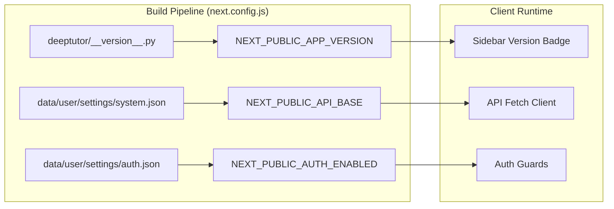
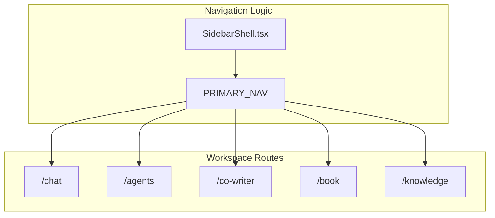

# 프론트엔드 컴포넌트

관련 소스 파일

다음 파일들이 이 wiki 페이지를 생성할 때 맥락으로 사용되었습니다:

- [.github/workflows/docker-release.yml](.github/workflows/docker-release.yml)
- [web/eslint.config.mjs](web/eslint.config.mjs)
- [web/next-env.d.ts](web/next-env.d.ts)
- [web/next.config.js](web/next.config.js)
- [web/package-lock.json](web/package-lock.json)
- [web/package.json](web/package.json)

이 페이지는 React/Next.js 프론트엔드 컴포넌트와 아키텍처를 문서화합니다. 프론트엔드는 Next.js 16+의 App Router를 사용해 구축되며, DeepTutor의 모든 지능형 에이전트 모듈을 위한 웹 기반 인터페이스를 제공합니다.

특정 영역의 자세한 내용은 다음 하위 페이지를 참조하세요:
- [Page Components](#7.1) — Research, Question, Solver, Settings 페이지의 상세 구현.
- [Global State Management](#7.2) — GlobalContext, useGlobal 훅, 상태 조율.
- [Theme System](#7.3) — 테마 관리와 localStorage 지속성.
- [Markdown Rendering and Export](#7.4) — ReactMarkdown, Mermaid, PDF export pipeline.
- [Internationalization](#7.5) — i18n 설정과 번역 정합성.

---

## 개요

프론트엔드는 **Next.js 16.2.3** 애플리케이션으로, App Router, TypeScript 5, Tailwind CSS를 사용합니다 [web/package.json:34-58](). 백엔드 에이전트와 REST API 및 실시간 스트리밍 업데이트를 위한 WebSocket 연결을 통해 상호작용하는 특화된 인터페이스를 제공합니다.

**핵심 기술:**
- **React 19**: 동시성 렌더링을 지원하는 현대적 UI 라이브러리 [web/package.json:35-35]().
- **Next.js 16**: 효율적인 Docker 배포를 위해 App Router와 `output: "standalone"`를 활용합니다 [web/next.config.js:78-89]().
- **Tailwind CSS 3.4**: 레이아웃과 테마를 위한 utility-first 스타일링 [web/package.json:57-57]().
- **i18next**: 국제화와 locale 관리를 위한 프레임워크 [web/package.json:30-30]().
- **Visualization Suite**: 복잡한 데이터 렌더링을 위한 `chart.js`, `cytoscape`, `mermaid` 통합 [web/package.json:23-33]().

---

## 애플리케이션 아키텍처

애플리케이션은 provider가 component tree를 감싸는 중앙집중식 상태 패턴을 따릅니다. 빌드 설정은 스택 전반의 일관성을 보장하기 위해 `deeptutor/__version__.py`의 백엔드 source of truth에서 애플리케이션 버전을 동적으로 해석합니다 [web/next.config.js:66-76]().

### 빌드 및 환경 설정

프론트엔드는 빌드 시점에 `data/user/settings/`에서 설정을 읽어들이며, 이를 통해 환경 변수가 Docker 또는 CI 환경에서 override로 동작할 수 있게 합니다 [web/next.config.js:32-58]().

**Sources:** [web/next.config.js:32-85](), [web/package.json:34-46]()

---

## 컴포넌트 생태계

DeepTutor는 수학 애니메이션부터 복잡한 문서 미리보기까지, 에이전트가 생성한 콘텐츠를 처리하기 위해 다양한 의존성을 활용합니다.

| Category | Libraries / Entities | Purpose |
|------|-------|---------|
| **Rendering** | `react-markdown`, `rehype-katex`, `mermaid` | LaTeX와 다이어그램을 포함한 agentic output을 렌더링합니다 [web/package.json:33-44](). |
| **Data Viz** | `chart.js`, `react-chartjs-2`, `cytoscape` | 인터랙티브 차트와 지식 그래프 [web/package.json:23-36](). |
| **Export** | `jspdf`, `html2canvas`, `exceljs` | 클라이언트 측 PDF 및 Excel 보고서 생성 [web/package.json:15-31](). |
| **Animation** | `framer-motion` | 부드러운 UI 전환과 agent state 변화 [web/package.json:28-28](). |

### 내비게이션 및 Shell 아키텍처

프론트엔드는 주요 workspace 도구와 보조 시스템 설정을 구분하는 구조화된 내비게이션 시스템을 사용합니다.

**Sources:** [web/package.json:23-45](), [web/next.config.js:96-118]()

---

## 개발 및 품질 관리

프론트엔드는 코드 품질과 국제화 표준을 유지하기 위한 강력한 개발 도구 집합을 포함합니다.

- **i18n Audit Pipeline**: 커스텀 스크립트 (`i18n_parity.mjs`, `i18n_audit.mjs`)는 지원되는 언어 전반에서 번역 키가 일치하는지 확인합니다 [web/package.json:14-17]().
- **Performance Budgets**: `route_budgets.mjs` 스크립트는 특정 route의 번들 크기와 성능을 추적합니다 [web/package.json:12-13]().
- **ESLint Integration**: `i18n/no-literal-ui-text` 같은 커스텀 규칙은 UI 내 하드코딩 문자열을 방지합니다 [web/eslint.config.mjs:1-15]().
- **Testing**: Playwright 기반 UI 감사와 node 기반 스크립트 테스트 [web/package.json:18-20]().

자세한 내용은 [Internationalization](#7.5)을 참조하세요.

**Sources:** [web/package.json:5-21](), [web/eslint.config.mjs:1-19](), [web/next.config.js:1-121]()
