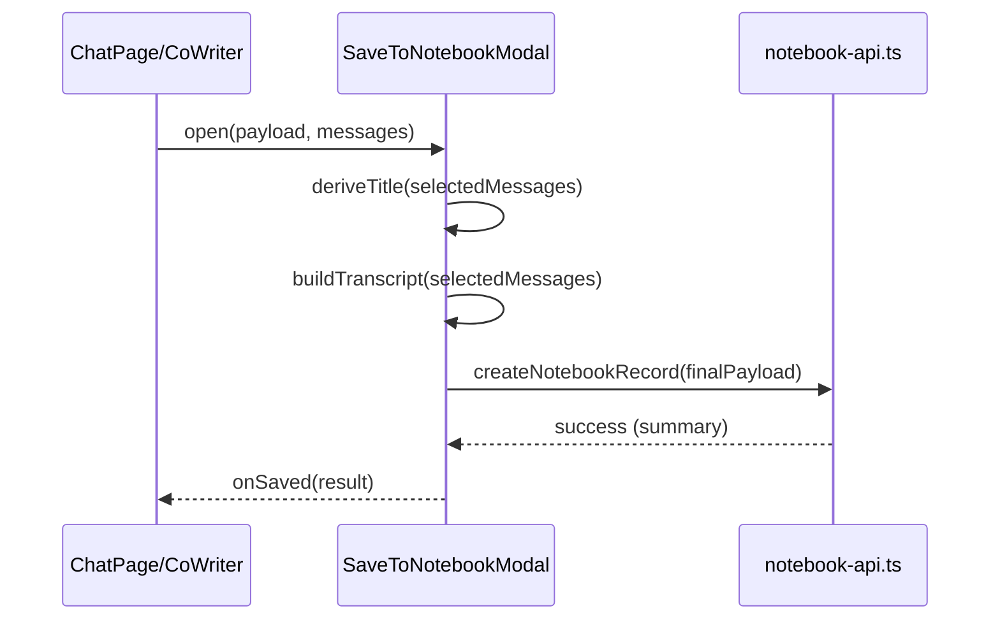

# 페이지 컴포넌트

관련 소스 파일

다음 파일들이 이 wiki 페이지를 생성할 때 맥락으로 사용되었습니다:

- [deeptutor/services/config/model_catalog.py](deeptutor/services/config/model_catalog.py)
- [deeptutor/services/config/provider_runtime.py](deeptutor/services/config/provider_runtime.py)
- [deeptutor/services/embedding/adapters/base.py](deeptutor/services/embedding/adapters/base.py)
- [deeptutor/services/embedding/adapters/openai_compatible.py](deeptutor/services/embedding/adapters/openai_compatible.py)
- [deeptutor/services/embedding/client.py](deeptutor/services/embedding/client.py)
- [deeptutor/services/embedding/config.py](deeptutor/services/embedding/config.py)
- [tests/services/config/test_embedding_runtime.py](tests/services/config/test_embedding_runtime.py)
- [tests/services/embedding/test_client_runtime.py](tests/services/embedding/test_client_runtime.py)
- [tests/services/embedding/test_extract_embeddings.py](tests/services/embedding/test_extract_embeddings.py)
- [web/app/(utility)/settings/page.tsx](web/app/(utility)/settings/page.tsx)
- [web/app/(workspace)/co-writer/[docId]/page.tsx](web/app/(workspace)/co-writer/[docId]/page.tsx)
- [web/app/(workspace)/playground/page.tsx](web/app/(workspace)/playground/page.tsx)
- [web/components/chat/home/ComposerInput.tsx](web/components/chat/home/ComposerInput.tsx)
- [web/components/chat/home/SimpleComposerInput.tsx](web/components/chat/home/SimpleComposerInput.tsx)
- [web/components/chat/preview/previewers/useTextSource.ts](web/components/chat/preview/previewers/useTextSource.ts)
- [web/components/notebook/SaveToNotebookModal.tsx](web/components/notebook/SaveToNotebookModal.tsx)
- [web/components/quiz/QuizConfigPanel.tsx](web/components/quiz/QuizConfigPanel.tsx)
- [web/components/research/ResearchConfigPanel.tsx](web/components/research/ResearchConfigPanel.tsx)
- [web/components/sidebar/BookRecent.tsx](web/components/sidebar/BookRecent.tsx)
- [web/components/visualize/VisualizeConfigPanel.tsx](web/components/visualize/VisualizeConfigPanel.tsx)
- [web/lib/co-writer-api.ts](web/lib/co-writer-api.ts)
- [web/lib/knowledge-api.ts](web/lib/knowledge-api.ts)
- [web/lib/notebook-api.ts](web/lib/notebook-api.ts)

이 문서는 DeepTutor 웹 프런트엔드의 주요 페이지 컴포넌트를 설명합니다. 이들은 Chat(Universal Workspace), Co-Writer, TutorBot Interaction, Settings, Knowledge Management와 같은 주요 사용자 인터페이스를 구현하는 최상위 Next.js 페이지 컴포넌트입니다. 각 페이지는 특화된 WebSocket 연결과 백엔드 서비스와 통합하면서 로컬 UI 상태를 관리합니다.

---

## 페이지 컴포넌트 아키텍처

프런트엔드는 대부분의 기능(Deep Solve, Quiz Generation, Deep Research 등)이 다형적인 Chat Page 또는 특화된 Playground 안에서 호스팅되는 통합 워크스페이스 아키텍처를 구현합니다. Co-Writer 시스템은 특화된 듀얼 패널 편집 경험을 제공하고, Settings와 Knowledge 페이지는 시스템 설정과 데이터 관리를 위한 유틸리티 인터페이스 역할을 합니다.

### 코드 엔터티로의 컴포넌트 맵

다음 다이어그램은 상위 수준 페이지 개념을 해당 구현 파일 및 상태 provider와 연결합니다.

Title: Frontend Page Entity Mapping

```mermaid
graph TB
    subgraph "Next.js_App_Directory"
        ChatRoute["/app/(workspace)/chat/[[...sessionId]]/page.tsx<br/>ChatPage Component"]
        PlaygroundRoute["/app/(workspace)/playground/page.tsx<br/>PlaygroundPage Component"]
        CoWriterRoute["/app/(workspace)/co-writer/[docId]/page.tsx<br/>CoWriterPage Component"]
        KnowledgeRoute["/app/(utility)/knowledge/page.tsx<br/>KnowledgePage Component"]
        SettingsRoute["/app/(utility)/settings/page.tsx<br/>SettingsIndexPage Component"]
    end
    
    subgraph "State_Providers_&_Hooks"
        UnifiedContext["UnifiedChatContext.tsx<br/>useUnifiedChat()"]
        AutoScroll["useChatAutoScroll.ts<br/>useChatAutoScroll()"]
        ComposerRef["ComposerInput.tsx<br/>ComposerInputHandle"]
    end
    
    subgraph "Specialized_Config_Panels"
        QuizConfig["QuizConfigPanel.tsx"]
        ResearchConfig["ResearchConfigPanel.tsx"]
        VizConfig["VisualizeConfigPanel.tsx"]
    end
    
    subgraph "Communication_Layer"
        WSUnified["ws://.../api/v1/ws<br/>Unified WebSocket"]
        KnowledgeAPI["knowledge-api.ts<br/>listKnowledgeBases()"]
        CoWriterAPI["co-writer-api.ts<br/>updateCoWriterDocument()"]
    end
    
    ChatRoute --> UnifiedContext
    ChatRoute --> AutoScroll
    PlaygroundRoute --> QuizConfig
    PlaygroundRoute --> ResearchConfig
    ChatRoute -- "Configures" --> VizConfig
    
    ChatRoute -- "Manages" --> WSUnified
    KnowledgeRoute -- "Fetches" --> KnowledgeAPI
    CoWriterRoute -- "Updates" --> CoWriterAPI
    CoWriterRoute -- "Renders" --> MarkdownRenderer["MarkdownRenderer.tsx"]
```

**Sources:** [web/app/(workspace)/playground/page.tsx:31-53](), [web/app/(workspace)/co-writer/[docId]/page.tsx:148-160](), [web/app/(utility)/settings/page.tsx:1-5](), [web/components/chat/home/ComposerInput.tsx:69-79](), [web/lib/knowledge-api.ts:95-113]()

---

## 워크스페이스 및 Playground 컴포넌트

### Capability Playground (`PlaygroundPage`)
Playground는 전체 세션 지속성의 부담 없이 개별 에이전트 기능을 기술적으로 테스트하는 환경입니다 [web/app/(workspace)/playground/page.tsx:1-111]().
- **Tool Testing**: `web_search`, `rag`, `code_execution` 같은 원자적 도구를 직접 실행할 수 있습니다 [web/app/(workspace)/playground/page.tsx:59-66]().
- **Config persistence**: `loadCapabilityPlaygroundConfigs`와 `saveCapabilityPlaygroundConfig`를 사용해 reload 간 UI 설정을 유지합니다 [web/app/(workspace)/playground/page.tsx:41-45]().
- **Trace Visualization**: 에이전트 실행의 내부 이벤트 스트림(`thinking`, `tool_call`, `tool_result`)을 시각화하기 위해 `TracePanel`을 구현합니다 [web/app/(workspace)/playground/page.tsx:228-251]().

### Chat Composer (`ComposerInput`)
모든 대화형 페이지의 주요 입력 메커니즘으로, 풍부한 상호작용 패턴을 지원합니다 [web/components/chat/home/ComposerInput.tsx:106-131]().
- **Slash Commands**: 입력 시작 부분의 `/persona`를 감지해 session persona 선택을 트리거합니다 [web/components/chat/home/ComposerInput.tsx:96-104]().
- **At-Mentions**: 특정 knowledge base 또는 notebook을 선택하기 위한 `@` mentions를 지원합니다 [web/components/chat/home/ComposerInput.tsx:81-84]().
- **Auto-Sizing**: 사용자가 입력할수록 입력 필드가 커지도록 `useAutoSizedTextarea`를 사용합니다 [web/components/chat/home/ComposerInput.tsx:177]().

**Sources:** [web/app/(workspace)/playground/page.tsx:1-251](), [web/components/chat/home/ComposerInput.tsx:1-205]()

---

## 특화된 페이지 컴포넌트

### Co-Writer Page (`CoWriterPage`)
AI 보조 글쓰기와 문서 정제를 위한 듀얼 패널 Markdown 편집기입니다 [web/app/(workspace)/co-writer/[docId]/page.tsx:148-220]().
- **Selection Edits**: 사용자가 텍스트 범위를 선택하면 `rewrite`, `shorten`, `expand` 작업을 위한 떠 있는 popover가 표시됩니다 [web/app/(workspace)/co-writer/[docId]/page.tsx:82-98]().
- **Sync Scroll**: 편집기 textarea와 Markdown preview pane 사이의 양방향 스크롤 동기화를 구현합니다 [web/app/(workspace)/co-writer/[docId]/page.tsx:76]().
- **Local Persistence**: `AUTOSAVE_DEBOUNCE_MS` 타이머가 백엔드 동기화를 트리거하기 전에 데이터 손실을 방지하기 위해 `localStorage`에 `LOCAL_DRAFT_PREFIX`로 로컬 초안을 유지합니다 [web/app/(workspace)/co-writer/[docId]/page.tsx:77-78]().

### Configuration Panels
개별 기능은 메인 Chat Activity 패널과 Playground 모두에 삽입할 수 있는 모듈형 설정 패널을 사용합니다.
- **QuizConfigPanel**: 질문 수, 난이도, PDF 업로드가 필요한 "Mimic Paper" 같은 특수 모드를 관리합니다 [web/components/quiz/QuizConfigPanel.tsx:102-186]().
- **VisualizeConfigPanel**: `chartjs`, `mermaid`, `manim_video`를 포함한 렌더링 모드를 구성합니다 [web/components/visualize/VisualizeConfigPanel.tsx:26-65]().

**Sources:** [web/app/(workspace)/co-writer/[docId]/page.tsx:63-221](), [web/components/quiz/QuizConfigPanel.tsx:1-186](), [web/components/visualize/VisualizeConfigPanel.tsx:1-65]()

---

## Notebook 및 Knowledge 통합

### Notebook에 저장 (`SaveToNotebookModal`)
사용자가 대화 세그먼트나 기능 출력을 개인 notebook에 보존할 수 있게 합니다 [web/components/notebook/SaveToNotebookModal.tsx:146-152]().
- **Transcript Rebuilding**: message list가 제공되면 사용자가 특정 turn을 선택할 수 있습니다. 최종 사용자 질의와 transcript는 선택된 subset을 사용해 `buildTranscript`와 `buildUserQuery`로 다시 구성됩니다 [web/components/notebook/SaveToNotebookModal.tsx:90-110]().
- **Title Derivation**: 첫 번째로 선택된 사용자 메시지를 기반으로 제목을 자동 제안합니다 [web/components/notebook/SaveToNotebookModal.tsx:111-119]().

### Knowledge Management (`KnowledgePage`)
RAG (Retrieval-Augmented Generation) 소스를 관리하기 위한 유틸리티 페이지입니다 [web/lib/knowledge-api.ts:1-20]().
- **Upload Policy**: 백엔드에서 가져온 파일 확장자와 크기 제한(`max_file_size_bytes` 등)을 강제합니다 [web/lib/knowledge-api.ts:28-33]().
- **Cache Management**: `withClientCache`를 사용해 knowledge base 목록과 파일 인벤토리를 효율적으로 관리합니다 [web/lib/knowledge-api.ts:96-113]().

Title: Notebook Saving Data Flow

**Sources:** [web/components/notebook/SaveToNotebookModal.tsx:1-233](), [web/lib/knowledge-api.ts:1-155](), [web/lib/notebook-api.ts:1-20]()
