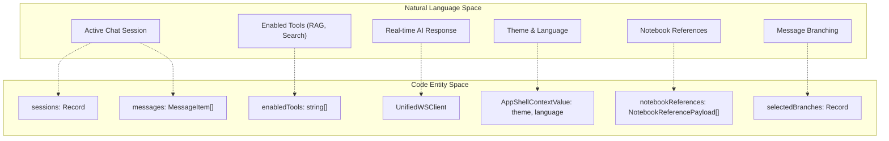
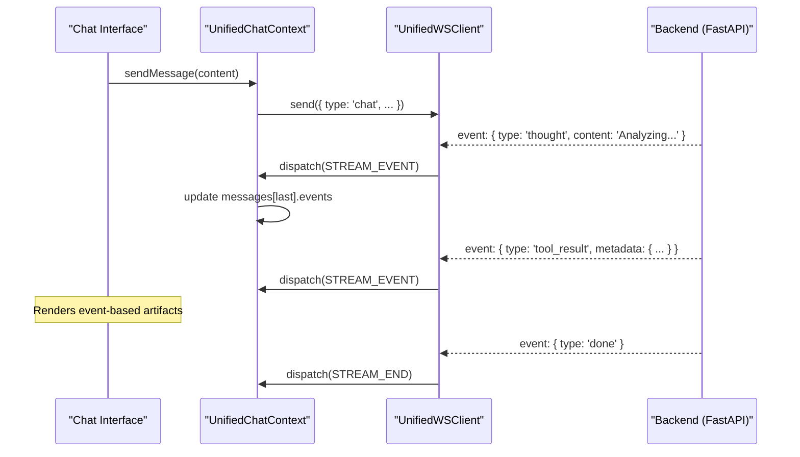

# 글로벌 상태 관리

관련 소스 파일

다음 파일들이 이 wiki 페이지를 생성할 때 맥락으로 사용되었습니다:

- [deeptutor/api/routers/sessions.py](deeptutor/api/routers/sessions.py)
- [deeptutor/services/session/sqlite_store.py](deeptutor/services/session/sqlite_store.py)
- [deeptutor/services/storage/attachment_store.py](deeptutor/services/storage/attachment_store.py)
- [tests/services/session/test_sqlite_store.py](tests/services/session/test_sqlite_store.py)
- [web/app/(workspace)/chat/[[...sessionId]]/page.tsx](web/app/(workspace)/chat/[[...sessionId]]/page.tsx)
- [web/app/(workspace)/co-writer/page.tsx](web/app/(workspace)/co-writer/page.tsx)
- [web/components/chat/home/ChatMessages.tsx](web/components/chat/home/ChatMessages.tsx)
- [web/context/AppShellContext.tsx](web/context/AppShellContext.tsx)
- [web/context/UnifiedChatContext.tsx](web/context/UnifiedChatContext.tsx)
- [web/context/app-shell-storage.ts](web/context/app-shell-storage.ts)

## 목적과 범위

이 문서는 DeepTutor 프런트엔드에 구현된 글로벌 상태 관리 시스템을 설명합니다. 이 시스템은 지능형 에이전트 모듈, WebSocket 연결, session persistence, UI 설정을 위한 중앙집중식 상태 조율을 제공합니다. React Context와 reducer 패턴을 사용해 Next.js 프런트엔드와 FastAPI 백엔드 사이의 복잡한 data flow를 관리하며, 워크스페이스 전반에서 일관된 상태를 보장합니다.

---

## 아키텍처 개요

DeepTutor는 서로 다른 상태 계층을 관리하기 위해 multi-context 접근 방식을 사용합니다. `AppShellContext`가 기본적인 UI와 환경 설정을 다루는 반면, `UnifiedChatContext`는 session 기반 에이전트 상호작용, 실시간 스트리밍, edit-branching 로직의 주요 엔진 역할을 합니다.

### 핵심 Context Provider

시스템은 애플리케이션을 감싸는 여러 핵심 provider를 중심으로 구성됩니다:

| Component | File | Purpose |
|-----------|------|---------|
| `AppShellContext` | [web/context/AppShellContext.tsx:35-44]() | 테마, 언어, 사이드바 접힘 상태를 포함한 최상위 shell 상태를 관리합니다. |
| `UnifiedChatContext` | [web/context/UnifiedChatContext.tsx:83-100]() | multi-session chat, streaming event, tool configuration, capability 전환을 조율합니다. |

### Context와 엔터티 매핑

다음 다이어그램은 UI 개념과 이를 관리하는 구체적인 코드 엔터티를 연결합니다.

**Sources:** [web/context/UnifiedChatContext.tsx:83-100](), [web/context/AppShellContext.tsx:35-44](), [web/context/UnifiedChatContext.tsx:157-166]()

---

## Unified Chat 상태 관리

`UnifiedChatContext`는 `useReducer` 패턴을 사용해 다양한 capability(Deep Solve, Research 등) 전반의 비동기 스트리밍 데이터와 multi-session history를 관리합니다.

### 상태 구조

상태는 `SessionEntry` 객체의 맵을 포함하는 `ProviderState`로 구성됩니다 [web/context/UnifiedChatContext.tsx:168-172]().

- **SessionEntry**: `sessionId`, `messages`, `status`(idle/running/completed/failed), `activeCapability`를 포함한 단일 대화 스레드를 나타냅니다 [web/context/UnifiedChatContext.tsx:157-166]().
- **MessageItem**: role, content, 그리고 해당 메시지와 연관된 "생각 과정" 또는 tool call을 나타내는 `StreamEvent` 객체 배열을 포함합니다 [web/context/UnifiedChatContext.tsx:145-155]().
- **Edit-Branching**: `selectedBranches`를 통해 관리되며, 여기서 `parent_message_id`(문자열화되었거나 `"null"`)를 해당 분기점에서 선택된 자식 ID에 매핑합니다 [web/context/UnifiedChatContext.tsx:164-165]().
- **MessageRequestSnapshot**: 메시지가 전송된 시점의 tool, knowledge base, reference(Notebook, History, Book) 상태를 정확히 캡처합니다 [web/context/UnifiedChatContext.tsx:128-143]().

### Action Dispatching

상태 업데이트는 중앙 `reducer` 함수로 처리됩니다. 주요 action은 다음과 같습니다:
- `ADD_USER_MSG`: 사용자 메시지를 추가하고 현재 request snapshot을 연결합니다 [web/context/UnifiedChatContext.tsx:181-189]().
- `STREAM_START`: 특정 session key에 대한 streaming 상태를 초기화합니다 [web/context/UnifiedChatContext.tsx:192]().
- `STREAM_EVENT`: WebSocket에서 들어오는 chunk 또는 metadata를 처리합니다 [web/context/UnifiedChatContext.tsx:193]().
- `LOAD_SESSION`: 메시지와 branch 선택을 포함해 백엔드 API에서 session을 적재합니다 [web/context/UnifiedChatContext.tsx:207-221]().
- `SET_SELECTED_BRANCH`: 다중 분기 대화에서 선택된 경로를 업데이트합니다 [web/context/UnifiedChatContext.tsx:226-230]().

**Sources:** [web/context/UnifiedChatContext.tsx:174-235]()

---

## WebSocket 및 이벤트 조율

DeepTutor는 `UnifiedWSClient` [web/context/UnifiedChatContext.tsx:21]()를 통한 통합 WebSocket protocol을 사용해 프런트엔드 상태와 백엔드 에이전트 실행을 연결합니다.

### 스트리밍 데이터 흐름

이 흐름은 UI 컴포넌트가 `events` 배열 [web/context/UnifiedChatContext.tsx:150]()을 통해 도착하는 중간 결과(예: Research Outlines 또는 Visualizations)를 렌더링할 수 있게 보장합니다.

**Sources:** [web/context/UnifiedChatContext.tsx:20-21](), [web/context/UnifiedChatContext.tsx:192-199]()

---

## 지속성 및 Shell 상태

`AppShellContext`는 애플리케이션 전체 수명 주기 동안 유지되어야 하는 상태를 관리하며, 종종 `localStorage` 또는 `sessionStorage`와 동기화됩니다.

### Storage Synchronization

시스템은 `app-shell-storage.ts`를 사용해 브라우저 수준 지속성을 관리합니다 [web/context/app-shell-storage.ts:5-11]().

- **Theme**: `localStorage`에 저장되며 `applyThemePreference`를 통해 관리됩니다 [web/context/AppShellContext.tsx:117-120]().
- **Language**: `LANGUAGE_EVENT`를 통해 동기화되어 i18next와 UI가 항상 일치하도록 합니다 [web/context/AppShellContext.tsx:122-125]().
- **Active Session**: `ACTIVE_SESSION_STORAGE_KEY`를 통해 `sessionStorage`에 추적되어 [web/context/app-shell-storage.ts:5-9]() 탭을 새로고침해도 현재 대화 맥락이 유지됩니다 [web/context/app-shell-storage.ts:42-49]().
- **Sidebar**: 상태는 `localStorage`에 `"1"`(접힘) 또는 `"0"`(펼침)으로 저장됩니다 [web/context/app-shell-storage.ts:78-84]().

### 백엔드 지속성 (SQLite)

프런트엔드 상태는 서버의 `SQLiteSessionStore`에 의해 뒷받침됩니다 [deeptutor/services/session/sqlite_store.py:77]().
- **Sessions**: 제목과 `preferences_json`(branch 선택 포함)을 저장합니다 [deeptutor/services/session/sqlite_store.py:104-112]().
- **Messages**: 분기를 위한 content, capability, `parent_message_id`를 저장합니다 [deeptutor/services/session/sqlite_store.py:114-129]().
- **Attachments**: `AttachmentStore`를 통해 관리되며, 프런트엔드용 public URL을 반환합니다 [deeptutor/services/storage/attachment_store.py:64-70]().
- **Truncation**: API router `_truncate_oversized_events`는 oversized `tool_result` payload를 제한해 백엔드 저장소에는 전체 내용을 보존하면서도 프런트엔드 성능을 보장합니다 [deeptutor/api/routers/sessions.py:100-132]().

**Sources:** [web/context/AppShellContext.tsx:48-135](), [web/context/app-shell-storage.ts:1-93](), [deeptutor/services/session/sqlite_store.py:100-150](), [deeptutor/api/routers/sessions.py:100-132]()

---

## 특화 상태 모듈

글로벌 chat을 넘어, 여러 페이지는 전역 식별자를 참조하면서도 자체적인 복잡한 수명 주기를 관리합니다.

| Module | File | State Responsibility |
|--------|------|----------------------|
| **Co-Writer** | [web/app/(workspace)/co-writer/page.tsx:34-40]() | 문서 요약, 로딩 상태, draft 삭제 수명 주기를 관리합니다. |
| **Attachments** | [deeptutor/services/storage/attachment_store.py:103-110]() | `LocalDiskAttachmentStore`를 통해 업로드된 파일의 로컬 디스크 지속성과 path sanitization을 처리합니다. |
| **Chat Auto-Scroll** | [web/app/(workspace)/chat/[[...sessionId]]/page.tsx:72]() | 실시간 스트리밍 동안 `useChatAutoScroll`을 사용해 UI scroll position을 관리합니다. |

### Hook 통합

| Hook | Source | Usage |
|------|--------|-------|
| `useAppShell` | [web/context/AppShellContext.tsx:167-173]() | 테마, 언어, sidebar 상태에 접근/수정합니다. |
| `useTranslation` | [web/app/(workspace)/co-writer/page.tsx:5]() | shell의 language 설정을 통해 관리되는 국제화 상태에 접근합니다. |
| `useUnifiedChat` | [web/context/UnifiedChatContext.tsx:55-58]() | `UnifiedChatContext`를 통해 session 메시지, tool 상태, 메시지 전송 함수를 접근합니다. |

**Sources:** [web/context/AppShellContext.tsx:167-173](), [web/app/(workspace)/co-writer/page.tsx:32-53](), [deeptutor/services/storage/attachment_store.py:103-110]()
