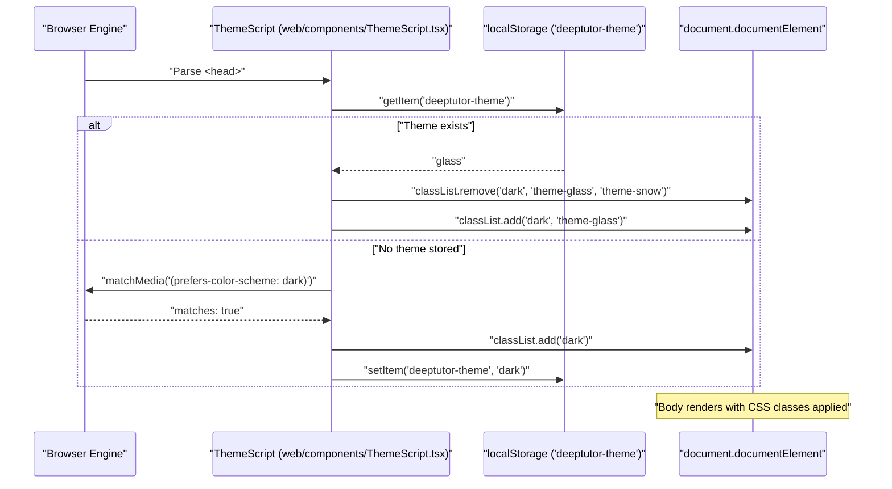
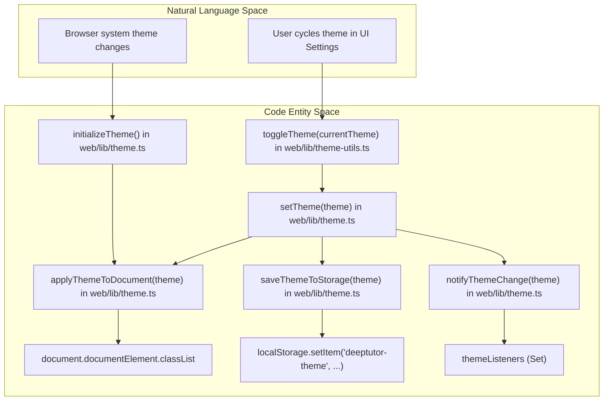

# 테마 시스템

관련 소스 파일

다음 파일들이 이 wiki 페이지를 생성할 때 맥락으로 사용되었습니다:

- [assets/roster/forkers.svg](assets/roster/forkers.svg)
- [assets/roster/stargazers.svg](assets/roster/stargazers.svg)
- [web/app/(workspace)/book/page.tsx](web/app/(workspace)/book/page.tsx)
- [web/app/layout.tsx](web/app/layout.tsx)
- [web/components/ThemeScript.tsx](web/components/ThemeScript.tsx)
- [web/lib/debounce.ts](web/lib/debounce.ts)
- [web/lib/theme-utils.ts](web/lib/theme-utils.ts)
- [web/lib/theme.ts](web/lib/theme.ts)

## 목적과 범위

DeepTutor 테마 시스템은 시각 모드를 관리하기 위한 견고한 메커니즘을 제공하며, 단순한 light/dark 전환을 넘어 `glass`와 `snow` 같은 특수 테마까지 포함합니다 [web/lib/theme.ts:6](). 이 시스템은 초기 페이지 로드 동안 "Flash of Unstyled Content"(FOUC)을 방지하고, `localStorage`를 사용해 브라우저 세션 전반에서 지속적으로 동기화함으로써 매끄러운 사용자 경험을 보장하도록 설계되었습니다 [web/lib/theme.ts:2-4](). 또한 Tailwind CSS의 class-based 전략을 활용하며, blocking initialization script를 통해 Next.js layout에 직접 통합됩니다 [web/app/layout.tsx:43-49]().

---

## 아키텍처 개요

테마 시스템은 세 가지 주요 계층으로 구성됩니다:
1.  **Blocking Initialization (`ThemeScript`)**: React hydration 전에 실행되어 저장된 선호도 또는 시스템 설정을 기반으로 초기 테마를 설정하는 inline script입니다 [web/components/ThemeScript.tsx:10-41]().
2.  **Persistence Layer (`theme.ts`)**: `localStorage`, 브라우저의 `matchMedia` API, 수동 pub-sub 리스너와 상호작용하는 핵심 유틸리티입니다 [web/lib/theme.ts:8-126]().
3.  **Extended Utilities (`theme-utils.ts`)**: 여러 테마를 순환하는 기능이나 cross-tab synchronization 같은 일반적인 UI 작업을 위한 helper 함수입니다 [web/lib/theme-utils.ts:6-81]().

### 시스템 구성 요소와 역할

| Component | File Path | Role |
| :--- | :--- | :--- |
| `ThemeScript` | [web/components/ThemeScript.tsx:10-49]() | 테마 깜빡임을 방지하기 위해 Server Component로 `<head>`에 주입됩니다 [web/components/ThemeScript.tsx:5-9](). |
| `theme.ts` | [web/lib/theme.ts:1-127]() | 테마 변경을 적용, 저장, 구독하는 핵심 로직입니다. |
| `theme-utils.ts` | [web/lib/theme-utils.ts:1-82]() | UI 컴포넌트를 위한 상위 수준 helper입니다(테마 순환, 색상 helper). |
| `RootLayout` | [web/app/layout.tsx:35-61]() | `ThemeScript`를 주입하고 기본 font 변수와 background class를 적용합니다 [web/app/layout.tsx:45-51](). |

**Sources:** [web/lib/theme.ts:1-11](), [web/components/ThemeScript.tsx:1-9](), [web/lib/theme-utils.ts:1-4](), [web/app/layout.tsx:4-49]()

---

## 구현 세부 사항

### ThemeScript를 이용한 FOUC 방지
사용자가 기본값이 아닌 테마를 활성화한 상태에서 흰색 플래시가 나타나는 것을 방지하기 위해, `ThemeScript` 컴포넌트는 raw JavaScript 문자열을 문서의 `<head>`에 주입합니다 [web/components/ThemeScript.tsx:43-48](). 이 스크립트는 SSR HTML에 inline으로 포함되어 브라우저가 hydration 전에 실행할 수 있도록 Server Component여야 합니다 [web/components/ThemeScript.tsx:5-9]().

**테마 적용 로직:**
*   **`dark`**: `.dark` 클래스를 추가합니다 [web/components/ThemeScript.tsx:19]().
*   **`glass`**: `.dark`와 `.theme-glass` 클래스를 추가합니다 [web/components/ThemeScript.tsx:21]().
*   **`snow`**: `.theme-snow` 클래스를 추가합니다 [web/components/ThemeScript.tsx:23]().
*   **Default/Fallback**: 저장된 테마가 없으면 `window.matchMedia('(prefers-color-scheme: dark)')`를 확인합니다. dark mode가 일치하면 `.dark`를 추가하고, 그렇지 않으면 `.theme-snow`로 기본 설정합니다 [web/components/ThemeScript.tsx:27-35]().

**테마 초기화 순서:**

**Sources:** [web/components/ThemeScript.tsx:11-41](), [web/lib/theme.ts:84-98](), [web/app/layout.tsx:41-53]()

### 테마 상태 관리
이 시스템은 단순한 유틸리티 함수에 무거운 context provider가 필요하지 않도록, 수동 pub-sub 패턴을 사용해 테마 변경을 리스너에게 알립니다 [web/lib/theme.ts:10-11]().

*   **`subscribeToThemeChanges`**: 컴포넌트가 `ThemeChangeListener`를 등록할 수 있게 합니다 [web/lib/theme.ts:16-21]().
*   **`setTheme`**: 주요 진입점입니다. `applyThemeToDocument`, `saveThemeToStorage`, `notifyThemeChange`를 호출합니다 [web/lib/theme.ts:122-126]().
*   **`applyThemeToDocument`**: `document.documentElement.classList`를 직접 조작해 특정 테마 식별자를 추가하거나 제거합니다 [web/lib/theme.ts:84-98]().
*   **`initializeTheme`**: 먼저 `getStoredTheme`를 통해 `localStorage`를 확인한 뒤, `getSystemTheme`을 통해 시스템 선호도로 fallback하며 초기 시작을 조율합니다 [web/lib/theme.ts:104-117]().

**Sources:** [web/lib/theme.ts:10-28](), [web/lib/theme.ts:84-98](), [web/lib/theme.ts:104-126]()

---

## 테마 유틸리티와 헬퍼

`theme-utils.ts` 파일은 일반적인 프런트엔드 패턴을 위한 단순화된 추상화를 제공합니다.

### 기능 헬퍼
*   **`toggleTheme`**: 테마를 `snow` -> `light` -> `dark` -> `glass` 순서로 순환합니다 [web/lib/theme-utils.ts:11-17]().
*   **`onThemeChange`**: 브라우저 `storage` 이벤트를 감지해 같은 애플리케이션의 여러 열린 탭 간 테마 변경을 동기화합니다 [web/lib/theme-utils.ts:62-81]().

### 스타일 매핑
이 함수들은 활성 테마에 따라 Tailwind 호환 문자열 또는 CSS class를 반환합니다:
*   **`getThemeClass`**: `Theme` 타입을 해당 CSS class 문자열로 매핑합니다(예: `glass`는 `"dark theme-glass"`로 매핑) [web/lib/theme-utils.ts:36-41]().
*   **`getTextColorForTheme`**: 테마에 따라 특정 slate 텍스트 색상을 반환합니다 [web/lib/theme-utils.ts:46-50]().
*   **`getBackgroundForTheme`**: `bg-white` 또는 `dark:bg-slate-800` 같은 background utility class를 반환합니다 [web/lib/theme-utils.ts:55-57]().

**Sources:** [web/lib/theme-utils.ts:11-17](), [web/lib/theme-utils.ts:36-57](), [web/lib/theme-utils.ts:62-81]()

---

## 데이터 흐름: 테마 선택에서 지속성까지

다음 다이어그램은 사용자 상호작용에서 하위 코드 엔터티와 브라우저 저장소로 이어지는 흐름을 보여줍니다.

**Sources:** [web/lib/theme.ts:11-28](), [web/lib/theme.ts:56-66](), [web/lib/theme.ts:84-98](), [web/lib/theme.ts:104-126](), [web/lib/theme-utils.ts:11-17]()

---

## LocalStorage 스키마

테마 시스템은 reload 간 상태를 유지하기 위해 브라우저의 `localStorage`에 있는 특정 key에 의존합니다.

| Key | Value Type | Allowed Values |
| :--- | :--- | :--- |
| `deeptutor-theme` | `string` | `"light"`, `"dark"`, `"glass"`, `"snow"` [web/lib/theme.ts:6-8]() |

**Sources:** [web/lib/theme.ts:6-8](), [web/components/ThemeScript.tsx:14-24]()
