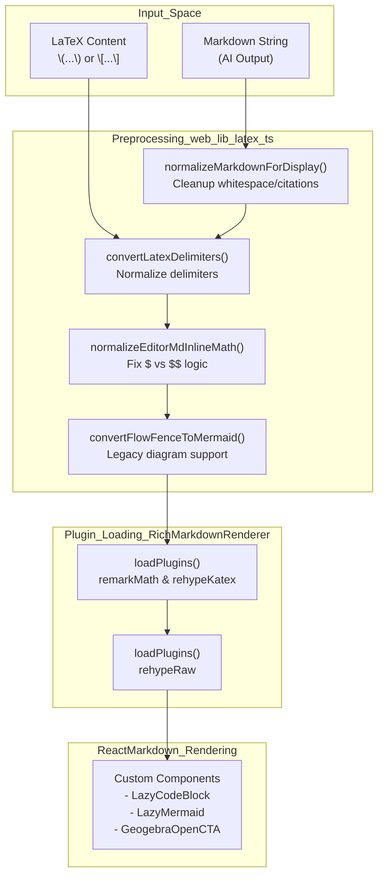
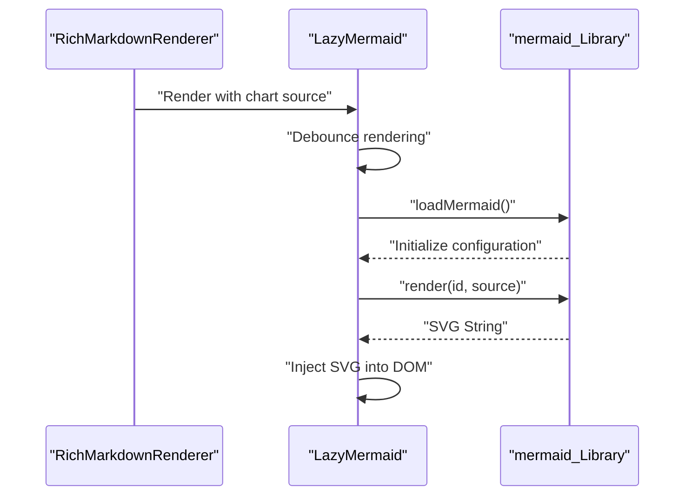

# Markdown 렌더링 및 내보내기

관련 소스 파일

다음 파일들이 이 wiki 페이지를 생성할 때 맥락으로 사용되었습니다:

- [web/components/common/RichMarkdownRenderer.tsx](web/components/common/RichMarkdownRenderer.tsx)
- [web/components/common/SimpleMarkdownRenderer.tsx](web/components/common/SimpleMarkdownRenderer.tsx)
- [web/lib/latex.ts](web/lib/latex.ts)
- [web/lib/markdown-display.ts](web/lib/markdown-display.ts)
- [web/tests/markdown-display.test.ts](web/tests/markdown-display.test.ts)

## 목적과 범위

이 페이지는 DeepTutor 프런트엔드의 markdown 렌더링과 PDF export 시스템을 설명합니다. 이 시스템은 수학 공식, 다이어그램, 표, 접이식 섹션을 지원하는 풍부한 콘텐츠 표시와 고품질 PDF export 기능을 제공합니다. 여기에는 다음이 포함됩니다:

- **ReactMarkdown 설정**과 plugin 생태계.
- **수학 공식 렌더링**을 위한 KaTeX와 delimiter 정규화.
- **Mermaid 다이어그램 통합**과 legacy 형식 변환을 포함한 시각화.
- **Markdown 정규화**를 통한 AI 생성 콘텐츠 및 citation 처리.
- **커스텀 component override**를 통한 향상된 렌더링과 trace view.

테마 관련 스타일은 [7.3 Theme System](). 렌더링된 콘텐츠의 상태 관리는 [7.2 Global State Management]()를 참조하세요.

---

## Markdown 렌더링 아키텍처

### 핵심 의존성

markdown 렌더링 시스템은 통합 처리 pipeline을 통해 markdown을 변환하는 상호 운용 가능한 NPM package 스택 위에 구축됩니다.

| Package | Purpose |
|---------|---------|
| `react-markdown` | 핵심 markdown-to-React renderer. |
| `remark-gfm` | GitHub Flavored Markdown(표, task list). |
| `remark-math` | markdown의 수학 구문을 파싱합니다. |
| `rehype-katex` | KaTeX로 수학 표현식을 렌더링합니다. |
| `rehype-raw` | markdown 내 raw HTML을 허용합니다. |
| `mermaid` | 다이어그램 렌더링 엔진. |

**Sources:** [web/components/common/RichMarkdownRenderer.tsx:4-8](), [web/components/common/SimpleMarkdownRenderer.tsx:4-5]()

---

### Markdown 처리 pipeline

이 pipeline은 원시 AI 출력을 구조화된 React component tree로 변환합니다. markdown이 `ReactMarkdown`에 전달되기 전에 정규화와 정리를 거칩니다.

**Markdown 처리 흐름**

**Sources:** [web/lib/latex.ts:16-51](), [web/lib/latex.ts:195-246](), [web/components/common/RichMarkdownRenderer.tsx:162-168](), [web/components/common/RichMarkdownRenderer.tsx:31-44]()

---

## Renderer 구현

DeepTutor는 문맥에 따라 두 가지 주요 rendering component를 사용합니다. 사용자에게 표시되는 콘텐츠에는 `RichMarkdownRenderer`를, 내부 trace log에는 `SimpleMarkdownRenderer`를 사용합니다.

### RichMarkdownRenderer

주요 페이지에서 사용하는 고정밀 renderer입니다. 초기 번들 크기를 최적화하기 위해 plugin의 동적 로딩을 지원합니다.

- **Dynamic Plugin Loading**: `remark-math`, `rehype-katex`, `rehype-raw` 같은 plugin은 `useEffect` hook 내부의 `loadPlugins` 함수에서 비동기로 로드됩니다 [web/components/common/RichMarkdownRenderer.tsx:180-210]().
- **Lazy Components**: 무거운 시각화 라이브러리의 로딩을 지연시키기 위해 `LazyMermaid`, `LazyCodeBlock`, `GeogebraOpenCTA`에 `next/dynamic`을 사용합니다 [web/components/common/RichMarkdownRenderer.tsx:31-44]().
- **Source Line Tracking**: `trackSourceLines` prop을 지원합니다. 활성화되면 `escapeUnknownHtmlTagsForDisplay`를 통한 공격적인 정규화를 우회하여 line count를 보존하므로, scroll sync를 위한 AST position이 정확하게 유지됩니다 [web/components/common/RichMarkdownRenderer.tsx:156-168](). 또한 `sourceLineAttr` helper를 통해 `data-source-line` attribute를 노출합니다 [web/components/common/RichMarkdownRenderer.tsx:109-115]().
- **Heading IDs**: `headingId`와 `extractText` helper를 사용해 heading에 slugified ID를 자동 생성하여 anchor linking을 지원합니다 [web/components/common/RichMarkdownRenderer.tsx:52-74]().

**Sources:** [web/components/common/RichMarkdownRenderer.tsx:1-210]()

### SimpleMarkdownRenderer

"trace" view(예: 에이전트 내부 사고 과정)에 사용됩니다. 성능과 컴팩트한 UI에 초점을 맞춥니다.

- **Variant Support**: `trace`, `compact`, `default` variant를 지원합니다. `traceComponents` 매핑은 내부 log에 맞춰 padding(`cellPad`)과 margin(`gap`)을 조정합니다 [web/components/common/SimpleMarkdownRenderer.tsx:79-87](), [web/components/common/SimpleMarkdownRenderer.tsx:89-184]().
- **Header Stripping**: `stripLeadingHashes` 유틸리티를 통해 compact list에 나타나는 header의 앞쪽 해시를 자동으로 제거합니다 [web/components/common/SimpleMarkdownRenderer.tsx:61-68]().
- **Filtered Elements**: `img`, `progress`, `button`, `textarea` 같은 요소를 명시적으로 null 처리하거나 단순화하여 깔끔한 trace log를 유지합니다 [web/components/common/SimpleMarkdownRenderer.tsx:131](), [web/components/common/SimpleMarkdownRenderer.tsx:174-179]().

**Sources:** [web/components/common/SimpleMarkdownRenderer.tsx:1-184]()

---

## 콘텐츠 정규화와 보안

### Markdown 표시 유틸리티 (`web/lib/markdown-display.ts`)

렌더링 전에 markdown은 일반적인 LLM 출력 흔적을 처리하고 보안을 보장하기 위해 처리됩니다.

- **HTML Sanitization**: `ALLOWED_HTML_TAGS`는 구조적 태그와 텍스트 수준 태그의 허용 목록을 정의합니다 [web/lib/markdown-display.ts:27-136](). 알려지지 않은 태그(예: LLM pseudo-tag `<think>` 또는 `<search>`)는 inline code span으로 이스케이프됩니다 [web/lib/markdown-display.ts:213-233]().
- **Citation Linking**: `normalizeMarkdownForDisplay`는 bare citation(예: `[1]`)과 연구 특화 ID(예: `[CIT-1-01]`)를 해당 reference list entry로 자동 링크합니다 [web/tests/markdown-display.test.ts:36-50]().
- **URL Transformation**: `markdownUrlTransform`은 엄격한 정책을 구현하며, 특정 protocol(`https`, `mailto` 등)만 허용하고, self-contained KB preview를 위한 `` 태그에서만 raster data image(PNG/JPG base64)를 허용합니다 [web/lib/markdown-display.ts:175-203]().
- **Empty Block Removal**: AI model이 남겨두는 경우가 많은 빈 table, 빈 details/summary block, 빈 form control placeholder를 적극적으로 제거합니다 [web/lib/markdown-display.ts:4-16](), [web/tests/markdown-display.test.ts:10-29]().

**Sources:** [web/lib/markdown-display.ts:1-233](), [web/tests/markdown-display.test.ts:1-153]()

---

## 수학 공식 렌더링

수학 표현식은 KaTeX를 사용해 조판됩니다. 이 시스템은 다양한 AI 생성 LaTeX 형식을 지원하며 `remark-math`와의 호환성을 위해 이를 정규화합니다.

### 정규화 로직 (`web/lib/latex.ts`)

`convertLatexDelimiters` 함수는 다음 변환을 처리합니다:
- **Block Math**: `\[ ... \]`를 `$$ ... $$`로 변환합니다 [web/lib/latex.ts:33-35]().
- **Inline Math**: `\( ... \)`를 `$ ... $`로 변환합니다 [web/lib/latex.ts:39-41]().
- **Nested Delimiters**: 중복 렌더링을 피하기 위해 `$$ ... $$` 안에 중첩된 `\( ... \)`는 제거합니다 [web/lib/latex.ts:23-28]().
- **Loose Blocks**: `normalizeEditorMdInlineMath` 함수는 내용에 `LIKELY_LATEX_BLOCK_RE`로 식별된 복잡한 LaTeX 기호가 포함되면 단일 행 `$` 수학을 `$$` 블록으로 승격합니다 [web/lib/latex.ts:57-66](), [web/lib/latex.ts:85-93]().

**Sources:** [web/lib/latex.ts:16-114]()

---

## 다이어그램 렌더링

### Mermaid 통합

시스템은 lazy-loaded `Mermaid` component를 사용해 다이어그램을 렌더링합니다.

**Mermaid 렌더링 수명 주기**

- **Loading State**: 라이브러리 또는 다이어그램이 처리되는 동안 `MermaidLoading` component를 표시합니다 [web/components/common/RichMarkdownRenderer.tsx:22-29]().
- **Code Block Detection**: 언어가 `mermaid`인 code block은 가로채서 `LazyMermaid` component에 전달합니다 [web/components/common/RichMarkdownRenderer.tsx:31-34]().

**Sources:** [web/components/common/RichMarkdownRenderer.tsx:22-34]()

### Legacy Flowchart 지원

DeepTutor는 표준 Mermaid syntax와 일부 editor에서 사용되는 legacy `flow` code block을 지원합니다.

- **Legacy Conversion**: `convertFlowFenceToMermaid`는 legacy `flow` syntax(예: `id=>type: label`)를 파싱하고 `renderNode` helper를 사용해 Mermaid `graph TD` 정의로 변환합니다 [web/lib/latex.ts:195-234]().
- **Edge Parsing**: `->`를 기준으로 분할해 조건 레이블(예: `cond(yes)->target`)을 포함한 복잡한 edge logic을 처리합니다 [web/lib/latex.ts:237-250]().

**Sources:** [web/lib/latex.ts:195-250]()

---

## Export 및 전역 스타일링

### PDF Export pipeline

PDF export는 고품질 출력을 보장하기 위해 렌더링된 DOM과 특정 CSS rule에 의존합니다.

- **Table of Contents**: `injectEditorMdTableOfContents` 함수는 `collectMarkdownHeadings`로 heading을 스캔해 생성된 링크 목록으로 `[TOC]` marker를 동적으로 대체할 수 있습니다 [web/lib/latex.ts:130-172](), [web/lib/latex.ts:185-193]().
- **Print Adjustments**: Markdown 렌더링 로직은 `hasRenderableChildren` 같은 검사를 포함해, 정적 export에서 깨져 보일 수 있는 빈 table이나 details block을 렌더링하지 않도록 합니다 [web/components/common/RichMarkdownRenderer.tsx:76-98]().
- **Scroll Management**: `scrollAnchorIntoView` 함수는 citation이나 내부 링크를 클릭할 때 가장 가까운 scrollable ancestor만 스크롤하도록 보장하여, export preview나 navigation 중 전체 페이지가 갑자기 이동하는 것을 방지합니다 [web/components/common/RichMarkdownRenderer.tsx:123-144]().

**Sources:** [web/lib/latex.ts:130-193](), [web/components/common/RichMarkdownRenderer.tsx:76-98](), [web/components/common/RichMarkdownRenderer.tsx:123-144]()

### 성능 고려사항

- **Bundle Optimization**: KaTeX와 Mermaid 같은 무거운 라이브러리는 `RichMarkdownRenderer`의 `dynamic` import와 조건부 `useEffect` 트리거를 통해 필요할 때만 로드됩니다 [web/components/common/RichMarkdownRenderer.tsx:31-44](), [web/components/common/RichMarkdownRenderer.tsx:180-210]().
- **Memoization**: 콘텐츠 처리와 정규화는 `useMemo`로 감싸져 있어 스트리밍 AI 응답 중 불필요한 re-render를 방지합니다 [web/components/common/RichMarkdownRenderer.tsx:162-168](), [web/components/common/RichMarkdownRenderer.tsx:212-220]().

**Sources:** [web/components/common/RichMarkdownRenderer.tsx:31-44](), [web/components/common/RichMarkdownRenderer.tsx:162-220]()
