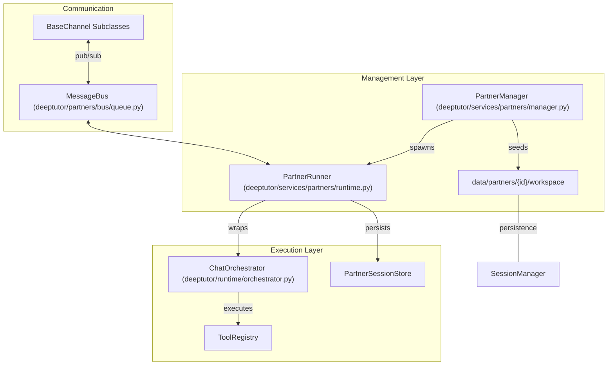
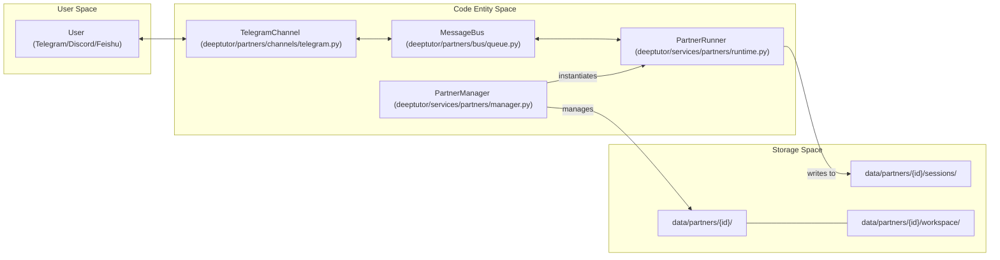

# TutorBot 시스템

관련 소스 파일

다음 파일들이 이 wiki 페이지를 생성할 때 맥락으로 사용되었습니다:

- [assets/figs/system/chat-agent-loop.png](assets/figs/system/chat-agent-loop.png)
- [assets/figs/system/partners-architecture.png](assets/figs/system/partners-architecture.png)
- [assets/figs/system/system architecture.png](assets/figs/system/system architecture.png)
- [deeptutor/api/routers/_partners_channel_schema.py](deeptutor/api/routers/_partners_channel_schema.py)
- [deeptutor/partners/channels/discord.py](deeptutor/partners/channels/discord.py)
- [deeptutor/partners/channels/feishu.py](deeptutor/partners/channels/feishu.py)
- [deeptutor/partners/channels/registry.py](deeptutor/partners/channels/registry.py)
- [deeptutor/partners/channels/telegram.py](deeptutor/partners/channels/telegram.py)
- [deeptutor/services/partners/commands.py](deeptutor/services/partners/commands.py)
- [deeptutor_cli/chat.py](deeptutor_cli/chat.py)
- [deeptutor_cli/common.py](deeptutor_cli/common.py)
- [tests/services/partners/test_channel_streaming.py](tests/services/partners/test_channel_streaming.py)
- [tests/services/partners/test_partner_runtime.py](tests/services/partners/test_partner_runtime.py)
- [web/components/partners/PartnerChannels.tsx](web/components/partners/PartnerChannels.tsx)
- [web/lib/partners-api.ts](web/lib/partners-api.ts)

**TutorBot System**(코드베이스에서는 "Partners" 시스템으로 지칭됨)은 DeepTutor 내부의 자율적 다중 인스턴스 에이전트 하위 시스템으로, 외부 메시징 플랫폼과의 통합 및 지속적인 운영을 위해 설계되었습니다 [deeptutor/services/partners/manager.py:1-10](). 표준 request-response API와 달리 TutorBot은 자체 수명 주기, 전용 workspace, 메시징 turn 전반에 걸쳐 상태를 유지하는 특수한 tool-augmented agent loop를 가진 장기 실행 엔터티로 동작합니다 [deeptutor/services/partners/runtime.py:13-25]().

## 시스템 개요

이 시스템은 `PartnerManager`(또는 `TutorBotManager`)가 조율하며, DeepTutor 서버 프로세스 내에서 bot instance의 생성, 지속성, 관리를 담당합니다 [deeptutor/services/partners/manager.py:17-30](). 각 bot은 고유한 `partner_id`를 부여받고, 로그, 미디어, 로컬 workspace 데이터를 위한 격리된 디렉터리 구조를 유지합니다 [deeptutor/services/partners/manager.py:5-15]().

### 핵심 구성 요소

| Component | Code Entity | Responsibility |
| :--- | :--- | :--- |
| **Manager** | `PartnerManager` | 수명 주기 관리(start/stop), 구성 병합, 디렉터리 시딩 [deeptutor/services/partners/manager.py:17-27](). |
| **Runner** | `PartnerRunner` | 특정 bot을 위한 실행 엔진으로, `ChatOrchestrator`와 `MessageBus`를 연결합니다 [deeptutor/services/partners/runtime.py:13-25](). |
| **API Router** | `deeptutor.api.routers.partners` | bot, "Souls"(persona template), channel 구성 관리를 위한 REST endpoint [deeptutor/api/routers/partners.py:25-150](). |
| **Channel Registry** | `deeptutor.partners.channels.registry` | 내장 channel(Telegram, Discord 등)과 외부 plugin의 자동 탐색 [deeptutor/partners/channels/registry.py:1-10](). |
| **Message Bus** | `MessageBus` | 메시징 channel과 agent loop 사이의 비동기 통신 계층(Inbound/Outbound) [deeptutor/partners/bus/queue.py:14-20](). |

Sources: [deeptutor/services/partners/manager.py:17-30](), [deeptutor/services/partners/runtime.py:13-25](), [deeptutor/partners/channels/registry.py:1-10](), [deeptutor/partners/bus/queue.py:14-20]()

### 고수준 아키텍처

다음 다이어그램은 bot 관리 계층과 운영 실행 구성 요소 간의 관계를 보여줍니다.

**TutorBot Operational Flow**

Sources: [deeptutor/services/partners/manager.py:17-30](), [deeptutor/services/partners/runtime.py:13-25](), [deeptutor/partners/bus/queue.py:14-20](), [deeptutor/partners/channels/base.py:10-25]()

## Bot 수명 주기와 지속성

TutorBot은 "agent-native"하고 지속적입니다. bot이 초기화되면 manager는 설정 파일의 존재를 보장하고 필수 템플릿으로 bot의 workspace를 시드합니다.

- **Isolation:** 각 bot은 서로 다른 bot instance 간 데이터 프라이버시를 보장하기 위해 자체 `workspace`와 `sessions` 디렉터리를 가집니다 [deeptutor/services/partners/manager.py:5-15]().
- **Secret Management:** 시스템은 API 응답에서 `_is_secret_field` 로직을 사용해 민감한 channel credential(token, password, API key)을 자동으로 마스킹합니다 [deeptutor/api/routers/_partners_channel_schema.py:97-118](). secret은 관리 API의 명시적 파라미터를 통해서만 노출됩니다 [web/components/partners/PartnerChannels.tsx:70-73]().
- **Schema-Driven Config:** 시스템은 Pydantic 모델(예: `TelegramConfig`, `DiscordConfig`)을 사용해 JSON Schema를 생성하고, frontend가 어떤 channel에 대해서도 구성 폼을 동적으로 렌더링할 수 있게 합니다 [deeptutor/api/routers/_partners_channel_schema.py:120-146]().
- **Throttled Streaming:** Telegram과 Discord 같은 channel은 내부 buffer와 간격 기반 편집(예: 0.6s–0.8s)을 사용한 `send_delta`를 구현해 플랫폼 rate limit을 준수하면서도 "live" typing 경험을 제공합니다 [deeptutor/partners/channels/telegram.py:35-45](), [deeptutor/partners/channels/discord.py:25-35]().

Sources: [deeptutor/api/routers/_partners_channel_schema.py:120-146](), [deeptutor/partners/channels/telegram.py:35-45](), [deeptutor/partners/channels/discord.py:25-35](), [web/components/partners/PartnerChannels.tsx:70-73]()

## 하위 페이지

### [TutorBot Agent Loop](#8.1)
bot 내부에서 사용하는 ReAct pattern을 자세히 설명합니다. `PartnerRunner`가 `StreamEvent` 타입(CONTENT, TOOL_CALL, PROGRESS)을 외부 messaging platform 업데이트로 매핑하는 방식과 대화 기록 지속성을 관리하는 방식을 다룹니다 [tests/services/partners/test_partner_runtime.py:103-118]().
*자세한 내용은 [TutorBot Agent Loop](#8.1)를 참조하세요.*

### [Messaging Channels and Skills](#8.2)
`BaseChannel` 추상화와 Telegram, Discord, Feishu 같은 지원 messaging platform을 살펴봅니다 [deeptutor/partners/channels/telegram.py:192-200](), [deeptutor/partners/channels/discord.py:38-46](). 이 페이지는 또한 내장 skill system과 bot 기능 확장을 위해 사용되는 registry를 문서화합니다.
*자세한 내용은 [Messaging Channels and Skills](#8.2)를 참조하세요.*

## 기술 요약 다이어그램

이 다이어그램은 고수준 시스템 개념을 구현에 사용되는 구체적인 Python 클래스와 디렉터리 경로에 매핑합니다.

**자연어에서 코드로의 매핑**

Sources: [deeptutor/services/partners/manager.py:5-15](), [deeptutor/services/partners/runtime.py:13-25](), [deeptutor/partners/channels/telegram.py:192-200](), [deeptutor/partners/bus/queue.py:14-20]()
