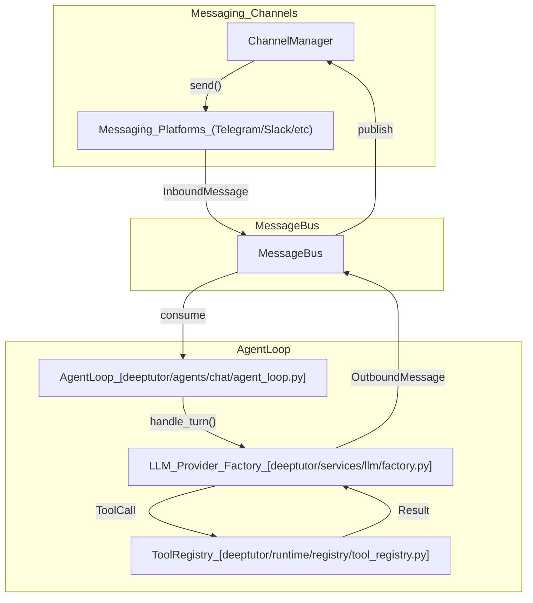
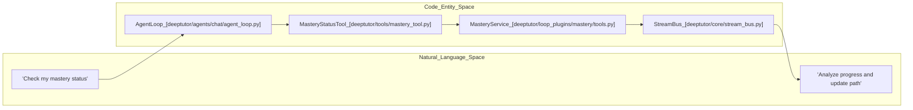

# TutorBot Agent Loop

관련 소스 파일

다음 파일들이 이 wiki 페이지를 생성할 때 맥락으로 사용되었습니다:

- [assets/figs/system/chat-agent-loop.png](assets/figs/system/chat-agent-loop.png)
- [assets/figs/system/partners-architecture.png](assets/figs/system/partners-architecture.png)
- [assets/figs/system/system architecture.png](assets/figs/system/system architecture.png)
- [deeptutor/agents/chat/agentic_pipeline.py](deeptutor/agents/chat/agentic_pipeline.py)
- [deeptutor/services/partners/commands.py](deeptutor/services/partners/commands.py)
- [deeptutor/tools/mastery_tool.py](deeptutor/tools/mastery_tool.py)
- [deeptutor_cli/chat.py](deeptutor_cli/chat.py)
- [deeptutor_cli/common.py](deeptutor_cli/common.py)
- [site/src/content/docs/docs/cli/agent-handoff.md](site/src/content/docs/docs/cli/agent-handoff.md)
- [site/src/content/docs/docs/cli/commands.md](site/src/content/docs/docs/cli/commands.md)
- [site/src/content/docs/zh-cn/docs/cli/agent-handoff.md](site/src/content/docs/zh-cn/docs/cli/agent-handoff.md)
- [site/src/content/docs/zh-cn/docs/cli/commands.md](site/src/content/docs/zh-cn/docs/cli/commands.md)
- [tests/services/partners/test_partner_runtime.py](tests/services/partners/test_partner_runtime.py)

**TutorBot Agent Loop**는 TutorBot 하위 시스템의 핵심 자율 처리 엔진입니다. 이 엔진은 정교한 **ReAct (Reasoning and Acting)** 패턴을 구현해, 지속적이고 다중 인스턴스인 agent가 특화된 도구, subagent, 메모리 시스템을 활용하면서 다양한 messaging platform 전반에서 사용자와 상호작용할 수 있게 합니다.

## 개요와 수명 주기

TutorBot instance는 `TutorBotManager`가 관리하며, 이 manager는 DeepTutor 서버 내에서 in-process agent의 수명 주기를 다룹니다. 각 bot은 고유한 설정, 로그, 미디어를 포함하는 격리된 workspace에서 동작합니다.

### TutorBotManager 수명 주기
`TutorBotManager`의 책임은 다음과 같습니다:
1.  **초기화**: `bot.yaml`에서 설정을 로드하고 runtime override와 병합합니다.
2.  **Instance 관리**: 실행 중인 task, agent loop, heartbeat service를 추적하는 `TutorBotInstance` 객체를 생성합니다.
3.  **지속성**: bot 설정과 "Souls"(persona template)를 디스크에 저장합니다.
4.  **보안**: API용 bot 데이터를 직렬화하기 전에 민감한 channel secret(API token 등)을 마스킹합니다.

### 데이터 흐름: Message Bus에서 Agent Loop로
이 시스템은 `MessageBus`를 활용해 messaging channel과 processing logic을 분리합니다. `AgentLoop`는 bus에서 inbound message를 소비하고 `MessageTool`을 통해 outbound response를 발행합니다.

**TutorBot Message Flow**

Sources: [deeptutor/agents/chat/agent_loop.py:16-30](), [deeptutor/core/stream_bus.py:29-29](), [deeptutor/runtime/registry/tool_registry.py:41-41]()

## AgentLoop 구현

`AgentLoop` 클래스 [deeptutor/agents/chat/agent_loop.py:16-16]()는 단일 agent turn의 중앙 orchestrator입니다. 반복적인 ReAct cycle을 사용해 LLM provider, tool registry, session memory 사이를 조율합니다.

### 핵심 구성 요소와 설정
- **AgenticChatPipeline**: 탐색 루프 agent 다음에 응답 단계를 연결해 구성합니다 [deeptutor/agents/chat/agentic_pipeline.py:145-146]().
- **ChatPromptAssembler**: memory와 tool manifest를 포함해 system/user prompt block을 구성합니다 [deeptutor/agents/chat/agentic_pipeline.py:17-17]().
- **Tool Composition**: 사용자의 권한(예: notebook, memory)에 따라 tool을 동적으로 활성화합니다 [deeptutor/agents/chat/agentic_pipeline.py:9-15]().
- **Budgeting**: 탐색 단계에서 무한 루프를 방지하기 위해 `DEFAULT_MAX_ROUNDS`(기본값 8)를 강제합니다 [deeptutor/agents/chat/agentic_pipeline.py:62-62]().

### ReAct 실행 pipeline
agent는 구조화된 ReAct 실행 흐름을 따릅니다:
1.  **Context Construction**: `UnifiedContext`를 통해 history, shared memory, 현재 메시지를 수집합니다 [deeptutor/agents/chat/agentic_pipeline.py:28-28]().
2.  **LLM Interaction**: `build_completion_kwargs`를 사용해 설정된 LLM을 호출합니다 [deeptutor/agents/chat/agentic_pipeline.py:22-22]().
3.  **Tool Dispatch**: `dispatch_tool_calls`를 사용해 tool call을 반복적으로 실행합니다 [deeptutor/agents/chat/agentic_pipeline.py:25-25](). `MAX_PARALLEL_TOOL_CALLS`까지 병렬 실행을 지원합니다 [deeptutor/agents/chat/agentic_pipeline.py:27-27]().
4.  **Output Dispatch**: thinking, tool call, content 이벤트를 `StreamBus`로 스트리밍합니다 [deeptutor/agents/chat/agentic_pipeline.py:29-29]().

### 메모리와 Context 관리
이 loop는 다중 계층 메모리 전략을 사용합니다:
- **L1 Trace**: 즉각적인 실행 history.
- **L2 Per-Surface Summaries**: 특정 platform을 위한 요약된 context.
- **L3 Cross-Surface Knowledge**: `MemoryConsolidator`가 통합하는 장기 지속 메모리.
- **Context Window Guard**: agent가 LLM token limit을 초과하지 않도록 `CONTEXT_WINDOW_GUARD_RATIO`(0.9)를 유지합니다 [deeptutor/agents/chat/agentic_pipeline.py:63-63]().

Sources: [deeptutor/agents/chat/agent_loop.py:16-40](), [deeptutor/agents/chat/agentic_pipeline.py:145-180](), [deeptutor/core/agentic/tool_dispatch.py:27-27]()

## Nano Team 협업

TutorBot은 "Nano Teams"를 통해 복잡한 task 실행을 지원합니다. 즉, 공유 목표를 위해 협업하는 소규모 특화 agent 그룹입니다.

### Subagent 조율
`MasteryPath` 같은 특화 capability는 학습 수명 주기를 관리하기 위한 전용 toolset을 사용합니다. 예를 들어 `MasteryTool` 세트에는 mastery를 build, grade, assess하기 위한 tool이 포함됩니다 [deeptutor/tools/mastery_tool.py:9-17]().

**Entity Mapping: Agent to Code**

Sources: [deeptutor/tools/mastery_tool.py:1-27](), [deeptutor/agents/chat/agent_loop.py:16-30](), [deeptutor/core/stream_bus.py:29-29]()

## 대화형 CLI Loop

`deeptutor chat` REPL은 agent loop에 대한 로컬 인터페이스를 제공하여 개발자가 실시간으로 capability와 tool 상호작용을 테스트할 수 있게 합니다 [deeptutor_cli/chat.py:1-12]().

### REPL 기능
- **Session Continuity**: `--session`을 통해 기존 session을 재개합니다 [deeptutor_cli/chat.py:44-44]().
- **Slash Commands**: `/cap`으로 capability를 전환하고, `/tool`로 tool을 토글하며, `/regenerate`로 마지막 turn을 다시 시도할 수 있습니다 [deeptutor_cli/chat.py:111-119]().
- **Tool Result Inspection**: `/show` 명령은 `ToolResultBuffer`에 저장된 thinking 또는 tool output을 펼쳐볼 수 있게 합니다 [deeptutor_cli/common.py:30-30]().
- **Streaming Rendering**: `TurnStreamRenderer`는 `StreamEvent` 객체(예: `CONTENT`, `TOOL_CALL`, `PROGRESS`)를 처리해 terminal UI를 갱신합니다 [deeptutor_cli/common.py:176-180]().

### Signal 처리
CLI loop에는 `Ctrl-C`를 처리하기 위한 `_SigintInterceptor`가 포함되어 있습니다. 프로세스를 종료하는 대신, 서버 측에서 실행 중인 turn을 취소하고 REPL로 제어권을 반환합니다 [deeptutor_cli/common.py:167-176]().

Sources: [deeptutor_cli/chat.py:79-168](), [deeptutor_cli/common.py:78-131](), [deeptutor_cli/common.py:154-198]()
