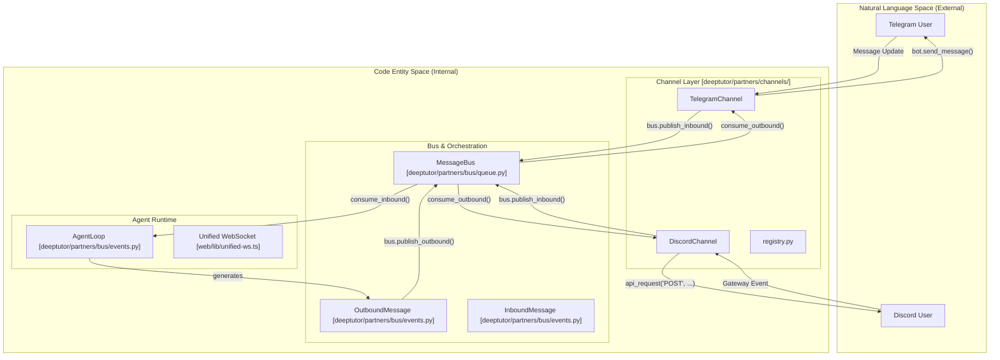
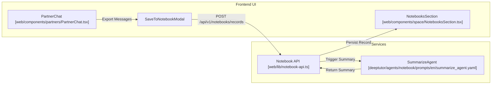

# 메시징 채널과 스킬

관련 소스 파일

다음 파일들이 이 wiki 페이지를 생성할 때 맥락으로 사용되었습니다:

- [assets/figs/webui/cowriter.png](assets/figs/webui/cowriter.png)
- [deeptutor/agents/notebook/prompts/en/summarize_agent.yaml](deeptutor/agents/notebook/prompts/en/summarize_agent.yaml)
- [deeptutor/agents/notebook/prompts/zh/summarize_agent.yaml](deeptutor/agents/notebook/prompts/zh/summarize_agent.yaml)
- [deeptutor/api/routers/_partners_channel_schema.py](deeptutor/api/routers/_partners_channel_schema.py)
- [deeptutor/partners/__init__.py](deeptutor/partners/__init__.py)
- [deeptutor/partners/bus/__init__.py](deeptutor/partners/bus/__init__.py)
- [deeptutor/partners/bus/events.py](deeptutor/partners/bus/events.py)
- [deeptutor/partners/bus/queue.py](deeptutor/partners/bus/queue.py)
- [deeptutor/partners/channels/__init__.py](deeptutor/partners/channels/__init__.py)
- [deeptutor/partners/channels/base.py](deeptutor/partners/channels/base.py)
- [deeptutor/partners/channels/dingtalk.py](deeptutor/partners/channels/dingtalk.py)
- [deeptutor/partners/channels/discord.py](deeptutor/partners/channels/discord.py)
- [deeptutor/partners/channels/email.py](deeptutor/partners/channels/email.py)
- [deeptutor/partners/channels/feishu.py](deeptutor/partners/channels/feishu.py)
- [deeptutor/partners/channels/registry.py](deeptutor/partners/channels/registry.py)
- [deeptutor/partners/channels/telegram.py](deeptutor/partners/channels/telegram.py)
- [site/src/content/docs/docs/partners/channels.md](site/src/content/docs/docs/partners/channels.md)
- [site/src/content/docs/zh-cn/docs/partners/channels.md](site/src/content/docs/zh-cn/docs/partners/channels.md)
- [tests/services/partners/test_channel_streaming.py](tests/services/partners/test_channel_streaming.py)
- [web/app/(workspace)/partners/[partnerId]/page.tsx](web/app/(workspace)/partners/[partnerId]/page.tsx)
- [web/components/partners/PartnerArchives.tsx](web/components/partners/PartnerArchives.tsx)
- [web/components/partners/PartnerChannels.tsx](web/components/partners/PartnerChannels.tsx)
- [web/components/partners/PartnerChat.tsx](web/components/partners/PartnerChat.tsx)
- [web/components/space/NotebooksSection.tsx](web/components/space/NotebooksSection.tsx)
- [web/lib/chat-export.ts](web/lib/chat-export.ts)
- [web/lib/partners-api.ts](web/lib/partners-api.ts)

DeepTutor의 TutorBot 하위 시스템은 다양한 메시징 플랫폼 전반에서 자율적으로 동작하도록 설계되었습니다. 이는 `ChannelManager`가 플랫폼별 통신을 처리하고, 통합된 `AgentLoop`가 견고한 "Skill" 시스템을 사용해 작업을 실행하는 분리된 아키텍처를 통해 구현됩니다.

## 채널 관리

`ChannelManager`(및 관련 `BaseChannel` 계층)는 서로 다른 메시징 protocol의 복잡성을 추상화하는 역할을 합니다. Telegram, Discord, Slack, Feishu, WeChat 같은 활성 채널의 수명 주기를 관리하고, inbound message 정규화를 수행하며, 비동기 outbound routing을 처리합니다 [deeptutor/partners/channels/base.py:21-25]().

### 채널 탐색과 Registry
시스템은 사용 가능한 channel 구현을 찾기 위해 auto-discovery 메커니즘을 사용합니다. `discover_all_with_errors` 함수는 `deeptutor.partners.channels` package를 스캔해 `BaseChannel` 하위 클래스를 식별합니다 [deeptutor/partners/channels/registry.py:63-70](). 또한 Python `entry_points`를 통해 등록된 외부 plugin도 지원합니다 [deeptutor/partners/channels/registry.py:40-51]().

### 설정과 Schema Introspection
Web UI가 어떤 channel이든(내장 또는 plugin) 일반적인 설정 폼을 렌더링할 수 있도록, 시스템은 schema introspection bridge를 제공합니다 [deeptutor/api/routers/_partners_channel_schema.py:1-10]().
*   **Model Resolution:** `resolve_config_model`은 channel class와 연결된 Pydantic config model(예: `TelegramConfig`)을 찾습니다 [deeptutor/api/routers/_partners_channel_schema.py:22-31]().
*   **Secret Masking:** `collect_secret_fields` 유틸리티는 `token`이나 `app_id` 같은 민감한 필드를 식별해 UI에서 안전하게 처리되도록 보장합니다 [deeptutor/api/routers/_partners_channel_schema.py:97-103]().
*   **UI Integration:** `PartnerChannels` component는 이 schema를 사용해 설정 필드를 동적으로 생성합니다 [web/app/(workspace)/partners/[partnerId]/page.tsx:209]().

### 지원 플랫폼
DeepTutor는 다양한 메시징 platform을 지원합니다. 각 channel 구현은 WebSocket, Long Polling, REST 같은 자체 연결 로직을 관리합니다.

| Platform | Implementation Class | Configuration Model | Key Features |
| :--- | :--- | :--- | :--- |
| **Telegram** | `TelegramChannel` [deeptutor/partners/channels/telegram.py:192]() | `TelegramConfig` | HTML 렌더링, 파일 attachment, streaming edit [deeptutor/partners/channels/telegram.py:106-121](). |
| **Discord** | `DiscordChannel` [deeptutor/partners/channels/discord.py:49]() | `DiscordConfig` | Gateway WebSocket 연결, typing indicator, message splitting [deeptutor/partners/channels/discord.py:72-110](). |
| **Feishu/Lark** | `FeishuChannel` [deeptutor/partners/channels/feishu.py:1]() | `FeishuConfig` | Rich text(post) 파싱, interactive card 지원, WebSocket long connection [deeptutor/partners/channels/feishu.py:171-200](). |
| **Email** | `EmailChannel` | `EmailConfig` | 메일 기반 상호작용을 위한 SMTP/IMAP 통합. |

### 메시지 라우팅과 스트리밍
outbound message는 `OutboundMessage` event로 `MessageBus`에 발행됩니다 [deeptutor/partners/bus/events.py:19-20](). `StreamingSupport`를 지원하는 channel(Telegram, Discord 등)은 `send_delta`를 통해 점진적 전달을 처리할 수 있으며, 이는 agent가 생각하는 동안 단일 메시지를 실시간으로 편집합니다 [deeptutor/partners/channels/discord.py:175-184]().

**Messaging Entity and Data Flow Map**

Sources: [deeptutor/partners/channels/registry.py:54-70](), [deeptutor/partners/channels/telegram.py:192-205](), [deeptutor/partners/channels/discord.py:111-151](), [deeptutor/partners/bus/queue.py:1-20]().

## Skill 시스템

Skill 시스템은 행동 playbook과 CLI tool 정의를 LLM context에 주입함으로써 사용자가 agent의 기능을 확장할 수 있게 합니다.

### Skill 정의 (`SKILL.md`)
Skill은 다음을 포함하는 구조화된 형식으로 정의됩니다:
*   **Purpose:** agent가 언제 그리고 어떻게 skill을 트리거해야 하는지에 대한 지침.
*   **Prerequisites:** 필요한 환경 설정(예: Python package).
*   **Command Reference:** agent가 실행하도록 허가된 `deeptutor` CLI command의 허용 목록.

### 내장 CLI Skill
주요 skill은 `deeptutor` CLI reference로, agent가 전체 플랫폼을 자율적으로 관리할 수 있게 합니다 [SKILL.md:1-5]().

| Category | Authorized Commands |
| :--- | :--- |
| **Capabilities** | `deep_solve`, `deep_research`, `math_animator`, `deep_question` [SKILL.md:23-47](). |
| **Knowledge** | `kb create`, `kb add`, `kb search`, `kb list` [SKILL.md:49-59](). |
| **Bot Management** | `bot create`, `bot start`, `bot stop`, `bot list` [SKILL.md:61-68](). |
| **Memory & Session** | `session list`, `session open`, `memory show` [SKILL.md:70-85](). |

### Skill Registry와 ClawHub
Skill은 Web UI의 `SkillsSection`을 통해 관리할 수 있습니다 [web/components/space/NotebooksSection.tsx:175-219](). 시스템은 커뮤니티 기여 skill을 공유하고 발견하기 위한 "ClawHub" registry(CLI에서 참조됨)를 지원합니다.

## Notebook 통합
어떤 channel에서든 생성된 대화 transcript는 장기 보존과 RAG (Retrieval-Augmented Generation)를 위해 사용자의 개인 `Notebook`에 저장할 수 있습니다.
*   **Save Pipeline:** `SaveToNotebookModal`은 partner session의 메시지를 캡처합니다 [web/app/(workspace)/partners/[partnerId]/page.tsx:41-44]().
*   **Summarization:** 레코드가 저장되면 특화된 `summarize_agent`가 핵심 결론과 재사용 가치를 중심으로 80-180단어 요약을 생성합니다 [deeptutor/agents/notebook/prompts/en/summarize_agent.yaml:1-20]().
*   **Metadata:** 레코드는 `record_type: tutorbot`으로 태그되며 partner-specific metadata(예: `partner_id`, `partner_name`)를 포함합니다 [web/app/(workspace)/partners/[partnerId]/page.tsx:103-107]().

**Skill and Notebook Integration Flow**

Sources: [web/app/(workspace)/partners/[partnerId]/page.tsx:94-125](), [deeptutor/agents/notebook/prompts/en/summarize_agent.yaml:1-28](), [web/components/space/NotebooksSection.tsx:175-219]().
