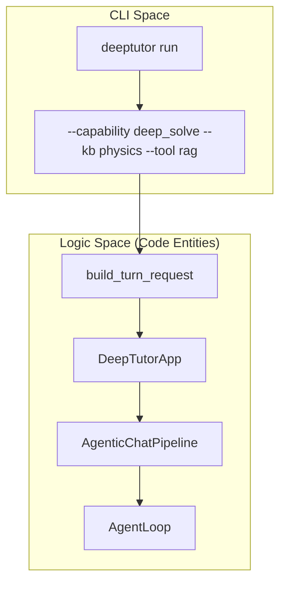
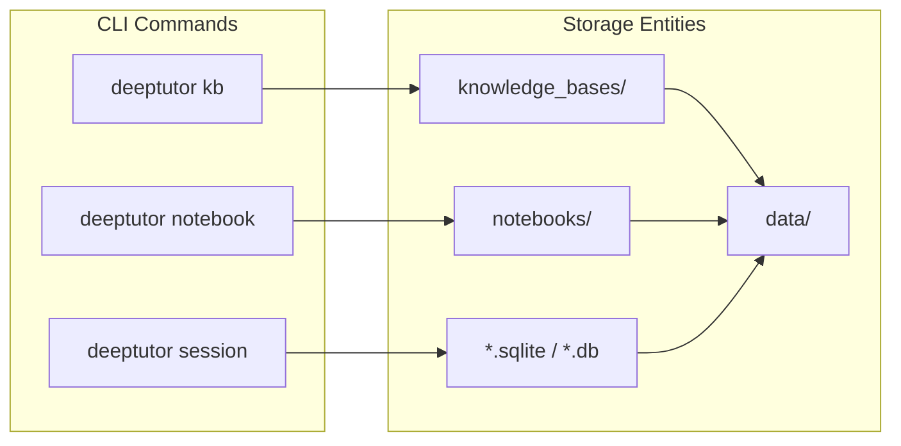

# CLI 참조

관련 소스 파일

다음 파일들이 이 wiki 페이지를 생성할 때 맥락으로 사용되었습니다:

- [.github/workflows/pypi-release.yml](.github/workflows/pypi-release.yml)
- [.gitignore](.gitignore)
- [deeptutor/agents/chat/agentic_pipeline.py](deeptutor/agents/chat/agentic_pipeline.py)
- [deeptutor/api/run_server.py](deeptutor/api/run_server.py)
- [deeptutor/tools/mastery_tool.py](deeptutor/tools/mastery_tool.py)
- [deeptutor_cli/main.py](deeptutor_cli/main.py)
- [requirements.txt](requirements.txt)
- [requirements/dev.txt](requirements/dev.txt)
- [requirements/math-animator.txt](requirements/math-animator.txt)
- [site/src/content/docs/docs/cli/agent-handoff.md](site/src/content/docs/docs/cli/agent-handoff.md)
- [site/src/content/docs/docs/cli/commands.md](site/src/content/docs/docs/cli/commands.md)
- [site/src/content/docs/zh-cn/docs/cli/agent-handoff.md](site/src/content/docs/zh-cn/docs/cli/agent-handoff.md)
- [site/src/content/docs/zh-cn/docs/cli/commands.md](site/src/content/docs/zh-cn/docs/cli/commands.md)

DeepTutor CLI는 시스템의 agent-native 기능과 상호작용하고, knowledge base를 관리하며, 자율 TutorBot을 조율하기 위한 주요 진입점입니다. `typer` 라이브러리로 구축되었으며 [deeptutor_cli/main.py:7-7](), 로컬 개발과 프로덕션 운영 모두를 위한 통합 인터페이스를 제공합니다.

CLI는 `deeptutor` 명령으로 등록되며 [deeptutor_cli/main.py:28-34]() 기능 영역별로 구성된 다양한 하위 명령을 지원합니다. 이 CLI는 대화형 사용을 위한 `RunMode.CLI`와 API 호스팅을 위한 `RunMode.SERVER` 같은 서로 다른 모드로 동작합니다 [deeptutor_cli/main.py:26-26](), [deeptutor_cli/main.py:133-133]().

### CLI 아키텍처와 명령 Registry

CLI는 메인 진입점 [deeptutor_cli/main.py:29-58]()이 특화된 sub-app에 위임하는 모듈형 등록 패턴을 따릅니다.

| Sub-command | 목적 | Source Registry |
| :--- | :--- | :--- |
| `run` | 단일 turn capability 실행(예: research, solve). | [deeptutor_cli/main.py:74-111]() |
| `chat` | 대화형 REPL 세션 실행. | [deeptutor_cli/main.py:37-37]() |
| `partner` | IM 연결 동반자(Telegram, Discord 등) 관리. | [deeptutor_cli/main.py:36-36]() |
| `kb` | Knowledge Base 작업(RAG 관리). | [deeptutor_cli/main.py:38-38]() |
| `skill` | Skill 관리 및 ClawHub 같은 hub에서 설치. | [deeptutor_cli/main.py:39-39]() |
| `session` | 공유 세션과 history 관리. | [deeptutor_cli/main.py:43-43]() |
| `notebook` | notebook과 가져온 markdown record 관리. | [deeptutor_cli/main.py:44-44]() |
| `memory` | 경량 지속 메모리 보기 및 관리. | [deeptutor_cli/main.py:40-40]() |
| `config` | 시스템 설정과 환경을 검사. | [deeptutor_cli/main.py:42-42]() |
| `provider` | LLM provider 인증과 OAuth 관리. | [deeptutor_cli/main.py:45-45]() |
| `book` | 대화형 Book(BookEngine) 관리. | [deeptutor_cli/main.py:46-46]() |
| `serve` | FastAPI 백엔드 서버 시작. | [deeptutor_cli/main.py:124-160]() |
| `start` | backend와 frontend를 함께 실행. | [deeptutor_cli/main.py:113-121]() |

**Sources:** [deeptutor_cli/main.py:29-160](), [site/src/content/docs/docs/cli/commands.md:8-232]()

---

### 핵심 실행 명령

`run`과 `serve` 명령은 DeepTutor 백엔드의 두 가지 주요 운영 모드를 나타냅니다.

#### Capability 실행 (`run`)
`run` 명령은 사용자가 `deep_research`나 `deep_solve` 같은 등록된 capability를 터미널에서 직접 호출할 수 있게 합니다 [deeptutor_cli/main.py:74-92](). `build_turn_request` [deeptutor_cli/main.py:98-109]()를 사용해 `TurnRequest` 객체를 구성하고, 이 객체는 이후 `DeepTutorApp` [deeptutor_cli/main.py:110-110]()에서 처리됩니다. 또한 `rag`, `web_search`, `reason` 같은 tool 활성화 플래그, knowledge base 첨부, `--config` 또는 `--config-json`을 통한 설정 override를 지원합니다 [deeptutor_cli/main.py:82-90]().

#### API Server (`serve`)
`serve` 명령은 CLI를 `RunMode.SERVER`로 전환하고 [deeptutor_cli/main.py:133-133]() `uvicorn`을 사용해 FastAPI 애플리케이션을 시작합니다 [deeptutor_cli/main.py:154-160](). 구성된 backend 포트를 자동으로 감지합니다 [deeptutor_cli/main.py:135-137](). Windows에서는 Math Animator 같은 특정 agent가 필요로 하는 subprocess 실행을 지원하기 위해 `WindowsProactorEventLoopPolicy`를 명시적으로 설정합니다 [deeptutor_cli/main.py:142-143]().

이 명령들과 대화형 REPL의 자세한 사용법은 **[Core CLI Commands](#9.1)**를 참조하세요.

**Sources:** [deeptutor_cli/main.py:74-160](), [site/src/content/docs/docs/cli/commands.md:8-126]()

---

### Knowledge와 Memory 관리

DeepTutor는 agent가 상호작용하는 데이터 계층을 관리하기 위한 다양한 명령을 제공합니다.

*   **Knowledge Base (`kb`):** RAG 시스템을 관리하며, 파일이나 디렉터리에서 collection을 생성하고(`kb create`), 문서를 추가하고(`kb add`), 검색을 수행할 수 있습니다 [site/src/content/docs/docs/cli/commands.md:128-215]().
*   **Session & Memory:** `session` 명령은 대화 기록을 관리하고 REPL에서 session 재개를 허용합니다 [site/src/content/docs/docs/cli/commands.md:233-246](). `memory` 명령은 지속적인 학습자 프로필과 장기 메모리 요약과 상호작용합니다 [deeptutor_cli/main.py:40-40]().
*   **Notebooks:** `notebook` 명령은 사용자의 workspace에서 구조화된 markdown record를 관리합니다 [deeptutor_cli/main.py:44-44](), [site/src/content/docs/docs/cli/commands.md:23-23]().

데이터와 RAG collection 관리에 대한 자세한 내용은 **[Knowledge Base and Session Commands](#9.2)**를 참조하세요.

**Sources:** [deeptutor_cli/main.py:38-44](), [site/src/content/docs/docs/cli/commands.md:128-246]()

---

### Provider와 인증

`provider` sub-command는 특화된 LLM backend에 대한 인증과 접근 검증을 처리합니다.

*   **OAuth Login:** `provider login` 명령을 사용한 대화형 OAuth flow를 지원합니다 [site/src/content/docs/docs/cli/agent-handoff.md:91-94]().
*   **Token Management:** 인증 후 토큰은 workspace에 저장되어 cloud 기반 agent나 로컬 CLI turn이 수동 키 입력 없이 특정 LLM provider를 사용할 수 있게 합니다 [site/src/content/docs/docs/cli/agent-handoff.md:92-96]().

**Sources:** [deeptutor_cli/main.py:45-45](), [site/src/content/docs/docs/cli/agent-handoff.md:89-97]()

---

### CLI에서 코드 엔터티로의 매핑

다음 다이어그램은 CLI 명령 공간과 이를 뒷받침하는 서비스 및 agent 엔터티를 연결합니다.

#### Capability 실행 흐름
이 다이어그램은 CLI `run` 명령이 `DeepTutorApp` facade와 하위 runtime으로 어떻게 매핑되는지 보여줍니다.

Title: "Capability Execution Mapping"

**Sources:** [deeptutor_cli/main.py:74-111](), [deeptutor/agents/chat/agentic_pipeline.py:145-146](), [deeptutor/agents/chat/agentic_pipeline.py:16-16]()

#### 데이터 관리 매핑
이 다이어그램은 CLI sub-command가 관리하는 구체적인 storage 엔터티와 파일을 매핑합니다.

Title: "CLI to Data Entity Mapping"

**Sources:** [deeptutor_cli/main.py:38-44](), [.gitignore:8-13](), [.gitignore:265-270](), [site/src/content/docs/docs/cli/commands.md:128-246]()
