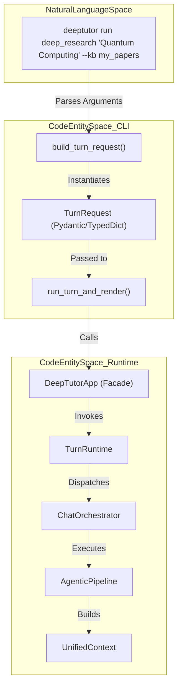
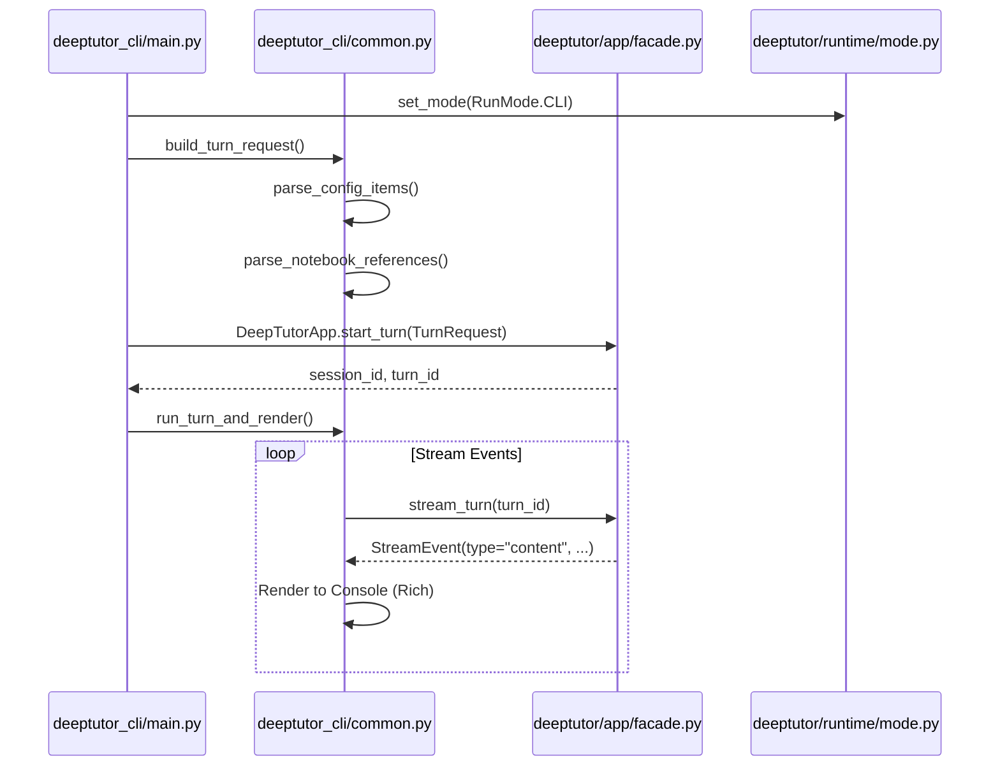

# 핵심 CLI 명령

관련 소스 파일

다음 파일들이 이 wiki 페이지를 생성할 때 맥락으로 사용되었습니다:

- [.github/workflows/pypi-release.yml](.github/workflows/pypi-release.yml)
- [.gitignore](.gitignore)
- [assets/figs/system/chat-agent-loop.png](assets/figs/system/chat-agent-loop.png)
- [assets/figs/system/partners-architecture.png](assets/figs/system/partners-architecture.png)
- [assets/figs/system/system architecture.png](assets/figs/system/system architecture.png)
- [deeptutor/api/run_server.py](deeptutor/api/run_server.py)
- [deeptutor/services/partners/commands.py](deeptutor/services/partners/commands.py)
- [deeptutor_cli/_tool_result.py](deeptutor_cli/_tool_result.py)
- [deeptutor_cli/chat.py](deeptutor_cli/chat.py)
- [deeptutor_cli/common.py](deeptutor_cli/common.py)
- [deeptutor_cli/config_cmd.py](deeptutor_cli/config_cmd.py)
- [deeptutor_cli/init_cmd.py](deeptutor_cli/init_cmd.py)
- [deeptutor_cli/init_wizard.py](deeptutor_cli/init_wizard.py)
- [deeptutor_cli/main.py](deeptutor_cli/main.py)
- [requirements.txt](requirements.txt)
- [requirements/dev.txt](requirements/dev.txt)
- [requirements/math-animator.txt](requirements/math-animator.txt)
- [tests/services/partners/test_partner_runtime.py](tests/services/partners/test_partner_runtime.py)

DeepTutor CLI는 시스템의 agent-first 기능, 도구, knowledge management 기능에 직접 접근할 수 있도록 설계된 인터페이스입니다. 이는 agent 로직을 테스트하기 위한 개발 도구이자, 웹 브라우저 없이 작업을 실행하기 위한 프로덕션 진입점 역할을 합니다.

CLI는 `typer` 라이브러리로 구현되며 [deeptutor_cli/main.py:28-33]() 진입 시 전역 `RunMode`를 `CLI`로 설정합니다 [deeptutor_cli/main.py:26]().

## CLI 구조 개요

CLI는 여러 sub-command를 가진 메인 애플리케이션으로 구성됩니다. 많은 sub-command가 `kb`, `session`, `notebook` 같은 특정 자원을 관리하는 반면, 핵심 명령은 지능형 agent 모듈의 실행과 backend server 관리를 담당합니다.

| Command | Function | Implementation File |
| :--- | :--- | :--- |
| `deeptutor run` | 단일 capability turn을 실행합니다(예: research, solve). | [deeptutor_cli/main.py:74-92]() |
| `deeptutor chat` | 지속적인 대화를 위한 대화형 REPL을 시작합니다. | [deeptutor_cli/chat.py:40-78]() |
| `deeptutor serve` | `uvicorn`을 통해 FastAPI API server를 시작합니다. | [deeptutor_cli/main.py:123-160]() |
| `deeptutor start` | launcher를 통해 backend와 frontend를 함께 실행합니다. | [deeptutor_cli/main.py:113-121]() |
| `deeptutor partner` | partner(IM-connected companion)를 관리합니다. | [deeptutor_cli/main.py:48](), [deeptutor_cli/main.py:60]() |
| `deeptutor book` | BookEngine을 통해 interactive Book을 관리합니다. | [deeptutor_cli/main.py:58](), [deeptutor_cli/main.py:70]() |

**Sources:** [deeptutor_cli/main.py:1-72](), [requirements.txt:1-23]()

## 데이터 흐름: CLI에서 Agent 실행까지

다음 다이어그램은 `deeptutor run` 같은 CLI 명령이 원시 사용자 입력을 시스템이 처리할 수 있는 구조화된 요청으로 변환하는 방식을 보여줍니다.

### CLI에서 Runtime으로의 매핑
"이 다이어그램은 자연어 공간(사용자 CLI 입력)을 코드 엔터티 공간(Runtime 객체)과 매핑합니다."

**Sources:** [deeptutor_cli/main.py:74-111](), [deeptutor_cli/common.py:78-96](), [deeptutor_cli/chat.py:156-168]()

## 핵심 명령 상세

### `deeptutor run`
`run` 명령은 "agent-first" 상호작용을 위한 주요 진입점입니다. 사용자는 `chat`, `deep_solve`, `deep_question`, `deep_research`, `math_animator` 같은 등록된 capability를 단일 turn으로 호출할 수 있습니다 [deeptutor_cli/main.py:74-92]().

**주요 인자 및 옵션:**
* `capability`: 호출할 capability의 고유 이름입니다 [deeptutor_cli/main.py:75-79]().
* `message`: 사용자의 질의 또는 작업 설명입니다 [deeptutor_cli/main.py:80]().
* `--kb`: context에 첨부할 하나 이상의 knowledge base를 지정합니다 [deeptutor_cli/main.py:83]().
* `--tool`: `rag` 또는 `web_search` 같은 특정 tool을 활성화합니다 [deeptutor_cli/main.py:82]().
* `--notebook-ref`: `notebook_id:record_id` 구문을 사용해 notebook의 특정 record를 참조합니다 [deeptutor_cli/main.py:84]().
* `--config-json`: 복잡한 agent별 override를 JSON 문자열로 전달할 수 있습니다 [deeptutor_cli/main.py:88-90]().
* `--format`: 출력 렌더링을 제어하며, `rich`(Markdown 지원 terminal UI) 또는 `json`을 지원합니다 [deeptutor_cli/main.py:91]().

**구현 로직:**
1. `build_turn_request`를 호출해 검증된 `TurnRequest`를 구성합니다 [deeptutor_cli/main.py:98-109]().
2. `DeepTutorApp` facade를 초기화하고 `run_turn_and_render`를 통해 turn을 실행합니다 [deeptutor_cli/main.py:110]().
3. 동기 Typer 명령 내부에서 turn의 비동기 실행을 처리하기 위해 `maybe_run`을 사용합니다 [deeptutor_cli/main.py:110](), [deeptutor_cli/common.py:18]().

### `deeptutor serve`
`serve` 명령은 CLI를 client 도구에서 server 호스트로 전환합니다.
1. `RunMode`를 `SERVER`로 설정합니다 [deeptutor_cli/main.py:133]().
2. **Windows Compatibility:** Windows에서는 Math Animator/Manim 같은 구성 요소에 필요한 subprocess 실행을 지원하기 위해 event loop policy를 `WindowsProactorEventLoopPolicy`로 전환합니다 [deeptutor_cli/main.py:142-143](), [deeptutor/api/run_server.py:17-18]().
3. **Uvicorn Integration:** `uvicorn`을 사용해 `deeptutor.api.main:app`에 정의된 FastAPI 애플리케이션을 실행합니다 [deeptutor_cli/main.py:154-160]().
4. **Hot Reload:** `--reload` 플래그를 지원하며, `web/*`와 `data/*` 같은 자주 변경되는 디렉터리를 제외합니다 [deeptutor_cli/main.py:159](), [deeptutor/api/run_server.py:46-55]().

### `deeptutor chat`
`chat` 명령은 대화형 REPL(Read-Eval-Print Loop)을 제공합니다. 실행마다 상태가 없는 `run`과 달리, `chat`은 session을 유지하여 다중 turn 대화를 가능하게 합니다.

**REPL 기능:**
* **Session Management:** `--session`을 사용해 기존 session을 재개할 수 있습니다 [deeptutor_cli/chat.py:44]().
* **Slash Commands:** `/quit`, `/new`(context 재설정), `/tool on|off`, `/cap`(capability 전환), `/regenerate` 같은 내부 명령을 지원합니다 [deeptutor_cli/chat.py:110-121]().
* **State Persistence:** 현재 session ID, 활성화된 tool, capability를 `ChatState` 객체에 추적합니다 [deeptutor_cli/chat.py:28-37]().
* **Cron Service:** REPL session 중 백그라운드 작업을 위해 `cron_service` 시작을 시도합니다 [deeptutor_cli/chat.py:81-88]().

**Sources:** [deeptutor_cli/main.py:123-160](), [deeptutor_cli/chat.py:1-168](), [deeptutor/api/run_server.py:1-74]()

## TurnRequest 구축 유틸리티

CLI는 CLI 옵션을 `DeepTutorApp` facade에서 사용하는 `TurnRequest` schema로 연결하는 내부 helper에 의존합니다.

### 구현과 로직
파싱 로직은 콜론으로 구분된 notebook 문자열이나 key-value config pair를 구조화된 객체로 변환하는 등 사용자 입력 정규화를 처리합니다 [deeptutor_cli/common.py:41-75]().

| Function | Responsibility |
| :--- | :--- |
| `parse_config_items` | `key=value` 형식의 CLI 문자열을 Python dictionary로 변환합니다 [deeptutor_cli/common.py:41-49](). |
| `parse_json_object` | 복잡한 설정을 위해 JSON 문자열을 안전하게 dictionary로 파싱합니다 [deeptutor_cli/common.py:51-61](). |
| `parse_notebook_references` | `notebook_id:rec1,rec2` 문자열을 구조화된 ID/Record 매핑으로 분리합니다 [deeptutor_cli/common.py:64-75](). |

### 요청 처리 흐름
"이 다이어그램은 명령 실행 중 CLI 구성 요소가 Core Services와 어떻게 상호작용하는지 보여줍니다."

**Sources:** [deeptutor_cli/main.py:74-111](), [deeptutor_cli/common.py:41-96](), [deeptutor_cli/chat.py:156-168]()
