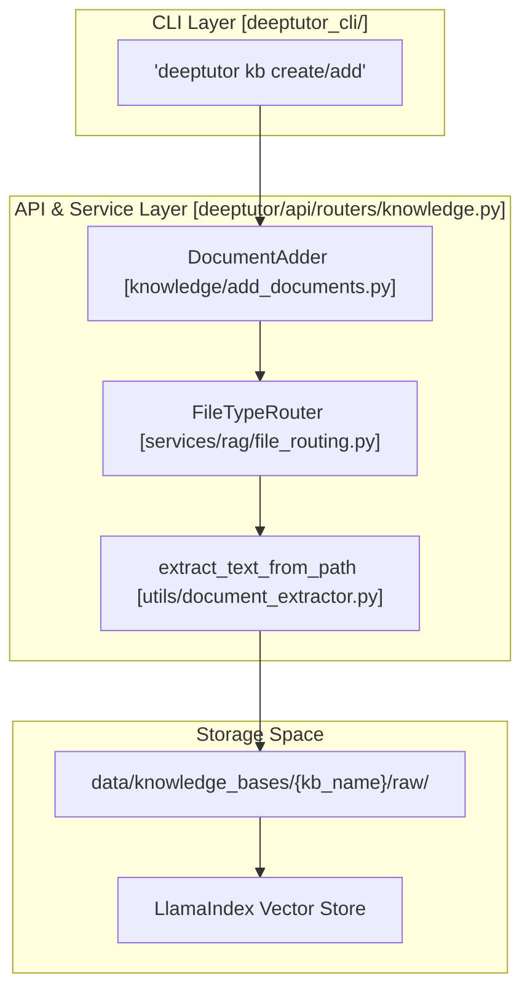
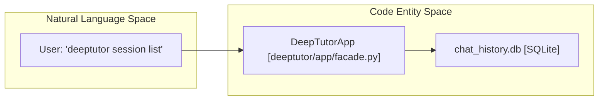
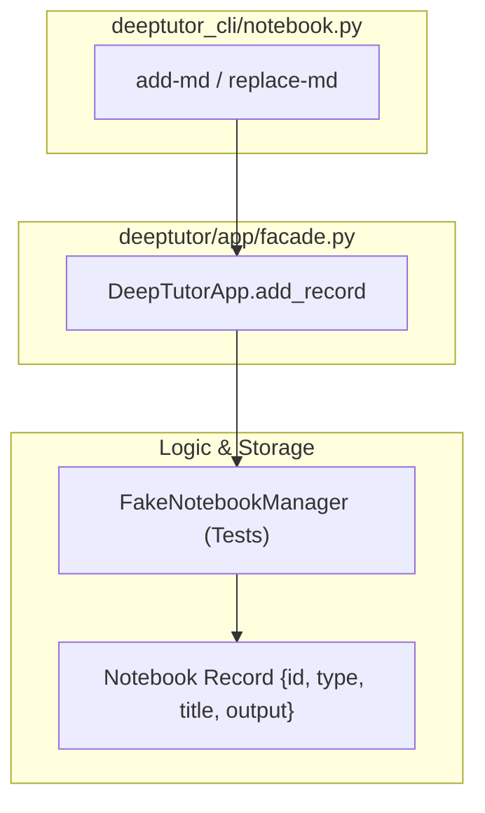

# Knowledge Base 및 Session 명령

관련 소스 파일

다음 파일들이 이 wiki 페이지를 생성할 때 맥락으로 사용되었습니다:

- [deeptutor/api/routers/knowledge.py](deeptutor/api/routers/knowledge.py)
- [deeptutor_cli/notebook.py](deeptutor_cli/notebook.py)
- [tests/api/test_knowledge_router.py](tests/api/test_knowledge_router.py)
- [tests/cli/test_notebook_cli.py](tests/cli/test_notebook_cli.py)

이 섹션은 Knowledge Base(KB), chat session, long-term memory, shared notebook을 포함한 지속적 데이터 관리를 위한 DeepTutor CLI sub-command의 기술 참조를 제공합니다. 이 명령들은 `DeepTutorApp` facade [deeptutor/app/facade.py:56-58]()를 통해 통합 데이터 레이아웃과 하위 storage 시스템과 직접 상호작용합니다.

## Knowledge Base(KB) 명령

`deeptutor kb` suite는 사용자가 RAG (Retrieval-Augmented Generation) 리소스를 관리할 수 있게 합니다. 이 명령들은 `KnowledgeBaseManager`와 API router의 특수 로직과 연동되어 문서를 인덱싱, 저장, 조회합니다.

### 구현 세부 사항
Knowledge base는 CLI의 `kb` sub-app을 통해 관리됩니다. backend 로직은 knowledge router [deeptutor/api/routers/knowledge.py:66-66]()에 중앙집중화되어 있으며, 여기서 CRUD 작업과 파일 업로드를 처리합니다. 시스템은 주로 `LlamaIndex`를 중심으로 하는 multi-provider RAG architecture를 사용합니다 [deeptutor/api/routers/knowledge.py:51-51]().

| Sub-command | Description | Backend Implementation |
|:---|:---|:---|
| `list` | 기존 knowledge base를 모두 나열합니다. | `list_visible_knowledge_bases` [deeptutor/api/routers/knowledge.py:48-49]() |
| `create` | 파일이나 디렉터리로부터 새 KB를 초기화합니다. | `KnowledgeBaseInitializer` [deeptutor/api/routers/knowledge.py:35-35]() |
| `add` | 기존 KB에 새 문서를 추가합니다. | `DocumentAdder` [deeptutor/api/routers/knowledge.py:34-34]() |
| `search` | 테스트 retrieval query를 수행합니다. | `resolve_kb` [deeptutor/api/routers/knowledge.py:45-45]() |
| `set-default` | 사용자의 기본 KB를 설정합니다. | `get_kb_manager` [deeptutor/api/routers/knowledge.py:90-95]() |

### 데이터 흐름: KB 문서 수집
다음 다이어그램은 로컬 파일에서 CLI와 `DocumentAdder` 로직을 거쳐 검색 가능한 vector 엔터티로 이어지는 흐름을 보여줍니다.

**KB Ingestion and Storage Architecture**

**Sources:** [deeptutor/api/routers/knowledge.py:34-57](), [deeptutor/api/routers/knowledge.py:83-85](), [tests/api/test_knowledge_router.py:67-76]()

---

## Session 관리 명령

`deeptutor session` 명령은 대화 기록을 세밀하게 제어할 수 있게 합니다. DeepTutor는 복잡한 agent 워크플로를 CLI REPL과 Web interface 전반에서 재개할 수 있도록 session을 지속적으로 저장합니다.

### 구현
Session은 `DeepTutorApp` facade를 통해 관리됩니다. backend storage는 일반적으로 SQLite 기반 session store입니다. CLI 명령은 사용자 인터페이스를 지속성 있는 `chat_history.db`와 연결합니다.

| Command | Action | Facade Method |
|:---|:---|:---|
| `list` | 최근 session history를 표시합니다. | `list_sessions()` |
| `show` | session 내 메시지를 표시합니다. | `get_session(session_id)` |
| `open` | REPL에서 session을 재개합니다. | (CLI 내부 로직, `session_id` 사용) |
| `rename` | session 제목을 업데이트합니다. | `rename_session(session_id, title)` |
| `delete` | session record를 제거합니다. | `delete_session(session_id)` |

### 코드 엔터티 연관
session 명령은 `DeepTutorApp` facade를 통해 CLI와 backend session storage 로직을 연결합니다.

**Session Command Mapping**

**Sources:** [deeptutor/app/facade.py:56-58](), [deeptutor_cli/notebook.py:10-12]()

---

## Notebook 및 Memory 명령

DeepTutor는 session-specific context와 "Notebooks" 또는 "Memory"에 저장된 지속적 사용자 큐레이션 데이터를 구분합니다.

### Notebook 서비스 (`deeptutor notebook`)
`DeepTutorApp`을 통해 접근하는 `NotebookManager`는 agent가 turn 중 참조할 수 있는 record를 처리합니다. 이는 `deeptutor_cli/notebook.py`를 통해 관리됩니다.

*   **CLI Operations:** 목록 조회 [deeptutor_cli/notebook.py:16-20](), 생성 [deeptutor_cli/notebook.py:22-31](), 세부 정보 표시 [deeptutor_cli/notebook.py:32-53]()를 지원합니다.
*   **Markdown Integration:** 사용자는 `add-md`를 사용해 외부 노트를 가져오거나 [deeptutor_cli/notebook.py:68-100](), `replace-md`를 사용해 기존 record를 업데이트할 수 있습니다 [deeptutor_cli/notebook.py:102-121]().
*   **Data Structure:** record에는 `chat`, `question`, `research`, `solve` 같은 type이 포함됩니다 [deeptutor_cli/notebook.py:76-76]().
*   **Record Removal:** `remove-record`를 사용해 notebook에서 개별 record를 삭제할 수 있습니다 [deeptutor_cli/notebook.py:55-66]().

**Notebook CLI Data Flow**

**Sources:** [deeptutor_cli/notebook.py:1-121](), [tests/cli/test_notebook_cli.py:14-87]()

### Long-term Memory (`deeptutor memory`)
메모리 하위 시스템은 명시적인 consolidation pipeline이 있는 구조화된 3계층 저장소(L1/L2/L3)를 제공합니다.

*   **Three-Layer Architecture:**
    *   **L1 (Trace):** 세밀한 agent 활동을 캡처하는 원시 run trace.
    *   **L2 (Summaries):** trace에서 파생된 정규화된 문서 record.
    *   **L3 (Knowledge):** 표면별(chat, notebook, book, TutorBot) 큐레이션 슬롯.
*   **CLI Integration:** agent는 turn 동안 이 저장소와 상호작용하여 서로 다른 상호작용 표면 전반에서 장기 context를 유지합니다.

---

## 설정 및 초기화

CLI는 주로 `deeptutor init`과 `deeptutor config`를 통해 환경을 구성할 수 있는 대화형 및 프로그래밍 방식의 수단을 제공합니다.

### 초기화 마법사 (`deeptutor init`)
`init` 명령은 provider와 system port를 설정하기 위한 다단계 wizard를 실행합니다.
*   **LLM Step:** 사용자는 provider(예: OpenAI, Anthropic, DeepSeek)를 선택하고 API key를 입력합니다.
*   **Connectivity Probes:** wizard는 저장하기 전에 API key와 base URL을 검증하기 위해 실시간 연결 probe를 수행합니다.

### 설정 검사 (`deeptutor config`)
`config show` 명령은 다음을 포함해 현재 system state를 JSON 형식으로 출력합니다:
*   **Network Ports:** backend와 frontend port 할당.
*   **Runtime Config:** 활성 LLM, Embedding, Search provider 설정.
*   **Tooling:** `main.yaml`에서 현재 활성화된 tool 목록.

**Sources:** [deeptutor_cli/notebook.py:1-121](), [deeptutor/api/routers/knowledge.py:1-66](), [tests/cli/test_notebook_cli.py:1-118]()
