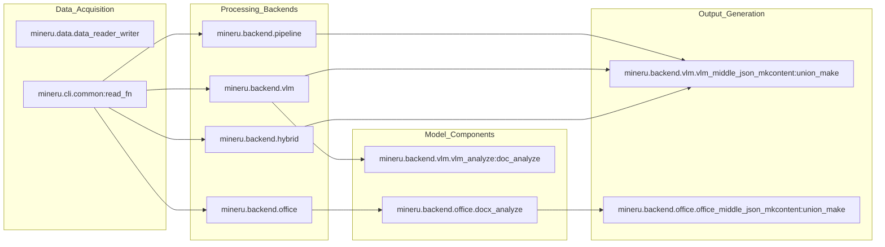

# MinerU 개요

<details>
<summary>관련 소스 파일</summary>

이 위키 페이지를 생성하기 위해 다음 파일들이 컨텍스트로 사용되었습니다:

- [README.md](README.md)
- [README_zh-CN.md](README_zh-CN.md)
- [docs/en/index.md](docs/en/index.md)
- [docs/en/quick_start/index.md](docs/en/quick_start/index.md)
- [docs/images/flowchart_en.png](docs/images/flowchart_en.png)
- [docs/images/flowchart_zh_cn.png](docs/images/flowchart_zh_cn.png)
- [docs/images/project_panorama_en.png](docs/images/project_panorama_en.png)
- [docs/images/project_panorama_zh_cn.png](docs/images/project_panorama_zh_cn.png)
- [docs/zh/index.md](docs/zh/index.md)
- [docs/zh/quick_start/index.md](docs/zh/quick_start/index.md)
- [mineru/version.py](mineru/version.py)
- [pyproject.toml](pyproject.toml)

</details>


MinerU는 복잡한 PDF 문서와 이미지를 구조화된 기계 판독 가능한 Markdown 및 JSON 형식으로 변환하도록 설계된 고성능 도구입니다. 대규모 언어 모델(LLM) 학습 및 검색 증강 생성(RAG) 파이프라인을 지원하기 위한 고품질 데이터 추출에 특히 최적화되어 있습니다.

이 시스템은 "PDF, 이미지, DOCX, PPTX 및 XLSX를 Markdown 및 JSON으로 변환하기 위한 실용적인 문서 파싱 도구" [pyproject.toml:10-10]()로 정의되며, 다중 열 레이아웃, 수학 공식(LaTeX), 표 및 다국어 텍스트를 포함한 광범위한 문서 요소를 지원합니다. 현재 버전은 `3.4.0` [mineru/version.py:1-1]()입니다.

## 시스템 아키텍처

MinerU는 사용자가 속도, 정확도 및 하드웨어 가용성 간의 균형을 맞출 수 있도록 멀티 백엔드 아키텍처를 채택하고 있습니다. 오케스트레이션은 주로 `do_parse` 및 `aio_do_parse` 함수에 의해 처리되며, 이 함수들은 구성을 기반으로 특정 백엔드로 작업을 분배합니다.

### 백엔드 개요

| 백엔드 | 코드 식별자 | 설명 |
| :--- | :--- | :--- |
| **Pipeline** | `pipeline` | 레이아웃 감지, OCR 및 MFD/MFR을 사용하는 전통적인 멀티 모델 파이프라인. |
| **VLM** | `vlm-auto-engine` | 로컬 비전-언어 모델(예: Qwen2-VL)을 통한 높은 정확도. |
| **Hybrid** | `hybrid-auto-engine` | 고정밀 재구성을 위해 VLM 레이아웃 이해와 전통적인 OCR/공식 모델을 결합. |
| **HTTP Client** | `*-http-client` | 원격 OpenAI 호환 또는 VLM 서버로 추론을 오프로드. |
| **Office** | `docx`, `pptx`, `xlsx` | PDF 렌더링을 우회하여 약 10배 속도 향상을 제공하는 Office 문서의 네이티브 변환. |

출처: [pyproject.toml:74-118](), [README.md:31-49](), [README_zh-CN.md:31-49]()

### 핵심 로직 흐름
다음 다이어그램은 시스템이 CLI 진입점에서 시작하여 특화된 백엔드 엔진으로 전환되고 최종적으로 구조화된 출력을 생성하는 과정을 보여줍니다.

**MinerU 분배 아키텍처**
```mermaid
graph TD
    ["mineru_CLI"] -- "calls" --> Main["mineru.cli.client:main"]
    Main -- "dispatches" --> DP["mineru.cli.common:do_parse"]
    
    DP -- "backend == 'pipeline'" --> PB["mineru.backend.pipeline.pipeline_analyze:doc_analyze"]
    DP -- "backend.startswith('vlm-')" --> VB["mineru.backend.vlm.vlm_analyze:doc_analyze"]
    DP -- "backend.startswith('hybrid-')" --> HB["mineru.backend.hybrid.hybrid_analyze:doc_analyze"]
    
    DP -- "suffix == 'docx'" --> DX["mineru.backend.office.docx_analyze:office_docx_analyze"]
    DP -- "suffix == 'pptx'" --> PX["mineru.backend.office.pptx_analyze:office_pptx_analyze"]
    DP -- "suffix == 'xlsx'" --> XX["mineru.backend.office.xlsx_analyze:office_xlsx_analyze"]
    
    PB & VB & HB -- "produces" --> MJ1["middle_json"]
    DX & PX & XX -- "produces" --> MJ2["middle_json"]
    
    MJ1 -- "passed to" --> VUM["mineru.backend.vlm.vlm_middle_json_mkcontent:union_make"]
    MJ2 -- "passed to" --> OUM["mineru.backend.office.office_middle_json_mkcontent:union_make"]
    
    VUM & OUM -- "generates" --> Output["Markdown / JSON / Images"]
```
출처: [pyproject.toml:128-135](), [README.md:10-25](), [README_zh-CN.md:31-49]()

## 핵심 기능

*   **레이아웃 보존**: 문서 구조를 유지하기 위해 제목, 텍스트 블록, 이미지 및 표를 식별합니다.
*   **공식 인식**: 특화된 모델(MFD/MFR)을 통해 수학 공식을 LaTeX로 추출합니다.
*   **표 재구성**: 특화된 표 인식 로직(Wired vs Wireless)을 사용하여 복잡한 표를 구조화된 Markdown 또는 OTSL 형식으로 변환합니다.
*   **다국어 지원**: `fast-langdetect` 및 언어별 OCR 엔진을 활용하여 다양한 언어를 지원합니다 [pyproject.toml:49-49]().
*   **비전-언어 모델(VLM) 지원**: 시각 이해를 위해 `vllm`, `lmdeploy`, `mlx` 및 `transformers` 백엔드와 통합됩니다 [pyproject.toml:74-89]().
*   **유연한 출력**: 표준 Markdown, NLP 최적화 Markdown 및 상세 콘텐츠 리스트를 생성합니다.

## 하위 시스템 관계

MinerU는 리소스 라이프사이클을 관리하는 일련의 특화된 모듈과 모델 싱글톤을 통해 원시 문서 픽셀/바이트와 구조화된 데이터 간의 간극을 좁힙니다.

**코드 엔티티 매핑**

출처: [pyproject.toml:107-118](), [README.md:10-25]()

## 인터페이스 옵션

MinerU는 엔진과 상호 작용할 수 있는 몇 가지 방법을 제공합니다:
1.  **CLI**: 일괄 처리를 위한 `mineru` 명령 [pyproject.toml:129-129]().
2.  **API**: 원격 통합 및 비동기 작업 관리를 위한 FastAPI 기반 서버(`mineru-api`) [pyproject.toml:134-134]().
3.  **Router**: 여러 워커 인스턴스를 관리하기 위한 로드 밸런서(`mineru-router`) [pyproject.toml:135-135]().
4.  **Web UI**: 대화형 사용 및 시각화를 위한 Gradio 기반 인터페이스(`mineru-gradio`) [pyproject.toml:136-136]().
5.  **Python SDK**: 프로그램 방식의 제어를 위한 `do_parse` 또는 `aio_do_parse` 직접 사용.
6.  **모델 서버**: `mineru-vllm-server`, `mineru-lmdeploy-server` 및 `mineru-openai-server`를 포함한 VLM 백엔드용 특화 서버 [pyproject.toml:130-132]().
7.  **다운로더**: 자동화된 모델 가중치 획득을 위한 `mineru-models-download` [pyproject.toml:133-133]().

환경 설정 및 첫 번째 변환 실행에 대한 자세한 내용은 **[시작 가이드 및 설치](#1.1)**를 참조하세요.
구성 옵션 및 환경 변수의 전체 목록은 **[구성 참조](#1.2)**를 참조하세요.

---
출처: [pyproject.toml:128-137](), [README.md:1-25](), [mineru/version.py:1-1](), [README_zh-CN.md:1-30]()
