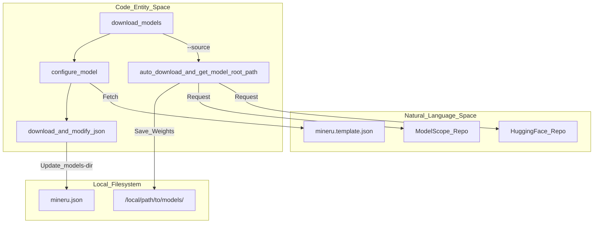
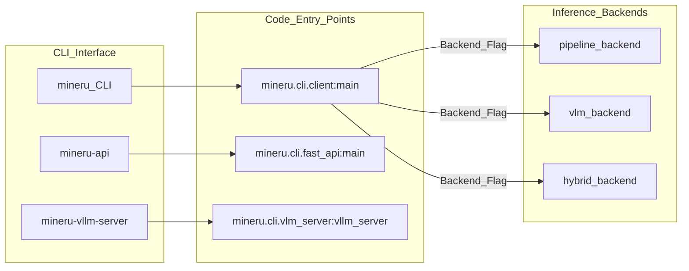

# 시작 가이드 및 설치

<details>
<summary>관련 소스 파일</summary>

이 위키 페이지를 생성하기 위해 다음 파일들이 컨텍스트로 사용되었습니다:

- [README.md](README.md)
- [README_zh-CN.md](README_zh-CN.md)
- [docs/en/quick_start/extension_modules.md](docs/en/quick_start/extension_modules.md)
- [docs/en/quick_start/index.md](docs/en/quick_start/index.md)
- [docs/en/usage/model_source.md](docs/en/usage/model_source.md)
- [docs/en/usage/quick_usage.md](docs/en/usage/quick_usage.md)
- [docs/zh/quick_start/extension_modules.md](docs/zh/quick_start/extension_modules.md)
- [docs/zh/quick_start/index.md](docs/zh/quick_start/index.md)
- [docs/zh/usage/model_source.md](docs/zh/usage/model_source.md)
- [docs/zh/usage/quick_usage.md](docs/zh/quick_start/extension_modules.md)
- [mineru.template.json](mineru.template.json)
- [mineru/cli/models_download.py](mineru/cli/models_download.py)
- [mineru/utils/llm_aided.py](mineru/utils/llm_aided.py)
- [mineru/utils/models_download_utils.py](mineru/utils/models_download_utils.py)
- [pyproject.toml](pyproject.toml)

</details>


이 페이지는 MinerU를 설치하고, 필요한 모델 자산을 구성하며, 첫 번째 문서 변환을 실행하기 위한 포괄적인 기술 가이드를 제공합니다. MinerU는 여러 백엔드(Pipeline, VLM, Hybrid)를 지원하며 다양한 하드웨어 아키텍처에 배포될 수 있습니다.

## 1. 설치

MinerU는 PyPI를 통해 배포되며 `pip` 또는 `uv`와 같은 표준 Python 패키지 관리자를 사용하여 설치할 수 있습니다. `mineru` 패키지는 핵심 라이브러리, CLI 도구 및 다양한 가속 엔진을 위한 선택적 확장을 제공합니다.

### 전제 조건
- **Python 버전**: `3.10`에서 `3.13` 버전이 필요합니다 [pyproject.toml:12-12]().
- **하드웨어 지원**: CPU 전용 구동도 지원되지만 성능 향상을 위해 하드웨어 가속(NVIDIA CUDA, Apple MPS 또는 다양한 국내 가속기)을 강력히 권장합니다 [docs/en/quick_start/index.md:23-25]().

### 설치 시나리오
MinerU는 선택적 의존성을 통해 의도한 사용 사례에 따른 모듈식 설치를 지원합니다 [pyproject.toml:65-118]().

| 시나리오 | 명령 | 설명 |
| :--- | :--- | :--- |
| **핵심 기능** | `uv pip install "mineru[core]"` | `vlm`, `pipeline` 및 `gradio`를 포함한 핵심 의존성을 설치합니다 [docs/en/quick_start/extension_modules.md:9-10](). |
| **S3 스토리지 지원** | `uv pip install "mineru[s3]"` | S3 버킷 읽기/쓰기 지원을 추가합니다 [docs/en/quick_start/extension_modules.md:17-18](). |
| **VLM 가속 (vLLM)** | `uv pip install "mineru[core,vllm]"` | 최적화된 VLM 추론을 위해 `vllm`을 추가합니다(Linux 권장) [docs/en/quick_start/extension_modules.md:29-30](). |
| **VLM 가속 (LMDeploy)** | `uv pip install "mineru[core,lmdeploy]"` | 대안 VLM 가속 엔진으로 `lmdeploy`를 추가합니다 [docs/en/quick_start/extension_modules.md:45-46](). |
| **최소 클라이언트** | `uv pip install mineru` | 원격 OpenAI 호환 서버에 연결하기 위한 기본 의존성을 설치합니다 [docs/en/quick_start/extension_modules.md:55-56](). |

### 하드웨어별 유의 사항
- **VLM 가속**: `vllm`과 `lmdeploy`는 Volta 아키텍처 이후의 그래픽 카드(8GB+ VRAM)에 대해 거의 동일한 가속 효과를 제공합니다 [docs/en/quick_start/extension_modules.md:24-26](). 충돌을 방지하기 위해 두 가지를 동시에 설치하는 것은 권장되지 않습니다 [docs/en/quick_start/extension_modules.md:40-40]().
- **CUDA 버전**: 기본 `vllm` 설치에는 CUDA 13.0 호환 드라이버가 필요합니다. CUDA 12.9 환경의 경우 사용자는 특정 설치 경로를 따르거나 제공된 Docker 이미지를 사용해야 합니다 [docs/en/quick_start/extension_modules.md:31-33]().
- **Windows 사용자**: Windows에서 CUDA 가속을 사용하려면 사용자는 PyTorch 공식 웹사이트에서 자신의 CUDA 버전에 맞는 `torch` 및 `torchvision`을 수동으로 설치해야 합니다 [docs/en/usage/quick_usage.md:23-25]().

출처: [pyproject.toml:12-120](), [docs/en/quick_start/extension_modules.md:6-67](), [docs/en/quick_start/index.md:23-30](), [docs/en/usage/quick_usage.md:23-25]()

## 2. 모델 다운로드 및 구성

MinerU는 여러 특화된 딥러닝 모델(레이아웃 감지, 공식 인식, OCR 등)에 의존합니다. 이 모델들은 첫 실행 전에 다운로드되어야 합니다.

### 자동 다운로드 도구
`mineru-models-download` CLI 도구(`mineru/cli/models_download.py`에 구현됨)는 HuggingFace 또는 ModelScope에서 모델을 자동으로 가져오고 초기 `mineru.json` 구성을 생성합니다 [mineru/cli/models_download.py:129-133]().

```bash
# 대화형 다운로드
mineru-models-download

# 소스 및 유형을 직접 지정
mineru-models-download --source modelscope --model_type all
```

### 구성 로직
다운로드 도구는 다음 단계를 수행합니다:
1.  **소스 선택**: 유효한 원격 소스는 `huggingface` 및 `modelscope`입니다. `auto` 옵션은 네트워크 연결 상태에 따라 가장 적합한 소스를 감지합니다 [mineru/cli/models_download.py:18-18]().
2.  **자산 가져오기**: 파이프라인 모델(예: `pp_doclayout_v2`, `unimernet_small`, `slanet_plus`, `pp_formulanet_plus_m`) 및 VLM 모델을 로컬 디렉터리로 다운로드합니다 [mineru/cli/models_download.py:38-51]().
3.  **구성 생성**: GitHub에서 `mineru.template.json`을 다운로드하고 `mineru.json`을 생성/업데이트하여 `models-dir` 경로를 유지합니다 [mineru/cli/models_download.py:21-33]().

**다이어그램: 모델 초기화 흐름**
이 다이어그램은 CLI 도구가 환경을 준비하기 위해 원격 저장소 및 로컬 파일 시스템과 어떻게 상호 작용하는지 보여줍니다.


출처: [mineru/cli/models_download.py:13-90](), [mineru/cli/models_download.py:114-155](), [mineru/utils/models_download_utils.py:15-102]()

## 3. `mineru.json` 구성

`mineru.json` 파일은 핵심 구성 허브입니다. 기본적으로 사용자의 홈 디렉터리(`~`)에 위치하지만 `MINERU_TOOLS_CONFIG_JSON` 환경 변수를 통해 재정의할 수 있습니다 [mineru/utils/models_download_utils.py:25-28]().

### 핵심 구성 블록
| 키 | 목적 |
| :--- | :--- |
| `models-dir` | `pipeline` 및 `vlm` 모델 가중치의 로컬 경로 [mineru/cli/models_download.py:26-28](). |
| `config_version` | 구성 업데이트 필요 여부를 결정하기 위해 다운로드 도구에서 사용됩니다 (임계값 `1.3.2`) [mineru/utils/models_download_utils.py:16-16](). |
| `llm-aided-config` | OpenAI 호환 API를 지원하는, LLM 지원 제목 계층 구조 구체화 설정 [mineru/utils/llm_aided.py:160-167](). |
| `latex-delimiter-config` | LaTeX 공식 구분 기호를 구성합니다 (기본값 `$`) [docs/en/usage/quick_usage.md:126-129](). |

다운로드한 폴더를 이동하는 경우 사용자는 `mineru.json`에서 모델 경로를 수동으로 업데이트할 수 있습니다 [docs/en/usage/quick_usage.md:155-158]().

출처: [mineru/cli/models_download.py:21-33](), [mineru/utils/models_download_utils.py:23-29](), [mineru/utils/llm_aided.py:160-188](), [docs/en/usage/quick_usage.md:117-158]()

## 4. 첫 번째 변환 실행

### 명령줄 인터페이스 (CLI)
`mineru` 명령은 로컬 파일을 처리하기 위한 기본 진입점입니다 [pyproject.toml:129-129]().

```bash
# 기본 백엔드를 사용한 기본 변환
mineru -p demo.pdf -o ./output

# 백엔드 및 입력 디렉터리 지정
mineru -p ./docs_dir -o ./output -b pipeline
```

### 데이터 흐름 아키텍처
명령이 실행되면 CLI는 `-b` 플래그를 기반으로 특정 백엔드로 요청을 조정합니다. `--api-url`이 제공되지 않으면 CLI는 임시 로컬 `mineru-api` 서비스를 시작합니다 [docs/en/usage/quick_usage.md:18-19]().

**다이어그램: CLI 실행 및 백엔드 발송**
CLI 명령과 내부 오케스트레이션 로직 및 백엔드의 연결 관계입니다.


출처: [pyproject.toml:128-136](), [docs/en/usage/quick_usage.md:12-14](), [docs/en/usage/quick_usage.md:31-33](), [docs/en/usage/quick_usage.md:15-19]()

## 5. 모델 소스 및 환경 변수

MinerU는 네트워크 상태에 맞춰 다양한 모델 저장소 간의 전환을 지원합니다.

| 변수 | 기본값 | 설명 |
| :--- | :--- | :--- |
| `MINERU_MODEL_SOURCE` | `huggingface` | `huggingface`, `modelscope` 또는 `local` 중에서 전환합니다 [mineru/cli/models_download.py:17-18](). |
| `MINERU_TOOLS_CONFIG_JSON` | `mineru.json` | 구성 파일의 맞춤형 파일명/경로 [mineru/utils/models_download_utils.py:25-25](). |
| `MINERU_API_TASK_RETENTION_SECONDS` | `86400` | `mineru-api`에서 완료되거나 실패한 작업의 유지 기간 [docs/en/usage/quick_usage.md:49-50](). |

### 소스 전환
ModelScope를 사용하려면 (중국 내 사용자에게 권장):
```bash
export MINERU_MODEL_SOURCE=modelscope
mineru -p demo.pdf -o ./output
```

로컬에 다운로드한 모델을 사용하려면 (오프라인 모드):
```bash
export MINERU_MODEL_SOURCE=local
mineru -p demo.pdf -o ./output
```
`local` 모드에서 시스템은 구성 파일로부터 `pipeline` 및 `vlm` 저장소의 루트 경로를 가져옵니다 [mineru/utils/models_download_utils.py:11-11]().

### 모델 경로 매핑
`auto_download_and_get_model_root_path` 유틸리티는 선택한 소스 및 저장소 모드(`pipeline` 또는 `vlm`)를 기반으로 모델 ID의 해결을 처리합니다 [mineru/utils/models_download_utils.py:102-110]().

| 모드 | 다운로드된 모델 | 저장소 구성 |
| :--- | :--- | :--- |
| `pipeline` | 레이아웃, OCR, 공식, 표 [mineru/cli/models_download.py:38-46]() | `models-dir.pipeline` |
| `vlm` | 비전-언어 모델 [mineru/cli/models_download.py:57-57]() | `models-dir.vlm` |

출처: [mineru/cli/models_download.py:17-18](), [mineru/utils/models_download_utils.py:11-28](), [docs/en/usage/quick_usage.md:4-7](), [docs/en/usage/quick_usage.md:43-51]()
