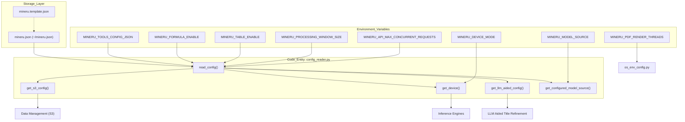
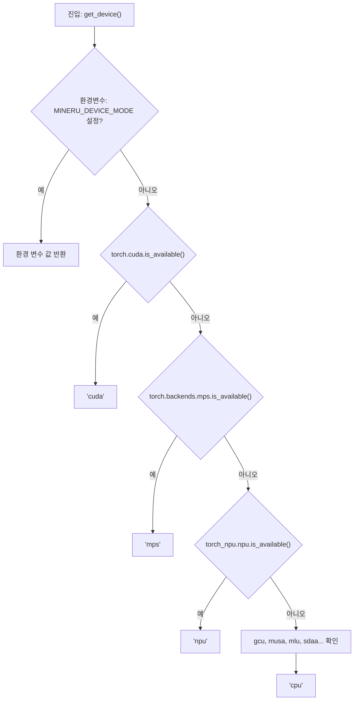
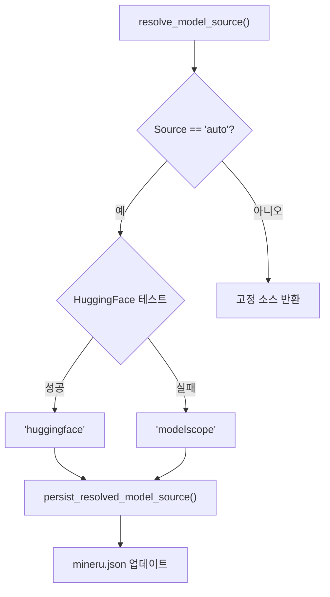

# 구성 참조

관련 소스 파일

이 위키 페이지를 생성하기 위해 다음 파일들이 컨텍스트로 사용되었습니다:

- [docs/en/usage/model_source.md](docs/en/usage/model_source.md)
- [docs/zh/usage/model_source.md](docs/zh/usage/model_source.md)
- [mineru.template.json](mineru.template.json)
- [mineru/cli/models_download.py](mineru/cli/models_download.py)
- [mineru/utils/config_reader.py](mineru/utils/config_reader.py)
- [mineru/utils/llm_aided.py](mineru/utils/llm_aided.py)
- [mineru/utils/model_utils.py](mineru/utils/model_utils.py)
- [mineru/utils/models_download_utils.py](mineru/utils/models_download_utils.py)
- [mineru/utils/os_env_config.py](mineru/utils/os_env_config.py)

이 페이지는 `mineru.json` 파일, 환경 변수 및 런타임에 이러한 설정을 해결하는 `config_reader` 모듈을 포함하여 MinerU의 구성 시스템에 대한 상세한 기술 참조를 제공합니다.

## 구성 아키텍처

MinerU는 다층 구성 방식을 사용합니다. 설정은 먼저 템플릿에 정의된 후 사용자가 제공한 JSON 파일에 의해 재정의되고, 최종적으로 런타임 유연성을 위해 환경 변수에 의해 대체될 수 있습니다.

### 구성 해결 흐름

다음 다이어그램은 `config_reader` 모듈이 다양한 소스에서 설정을 해결하는 방법을 보여줍니다.

**구성 해결 프로세스**

출처: [mineru/utils/config_reader.py:14-30](), [mineru/utils/config_reader.py:33-60](), [mineru/utils/config_reader.py:63-78](), [mineru/utils/config_reader.py:105-137](), [mineru/utils/config_reader.py:140-155](), [mineru/utils/config_reader.py:158-169](), [mineru/utils/os_env_config.py:15-17]()

---

## mineru.json 구성 파일

기본 구성 파일은 `mineru.json`입니다. 기본적으로 MinerU는 사용자의 홈 디렉터리(`~/mineru.json`)에서 이 파일을 찾지만, `MINERU_TOOLS_CONFIG_JSON` 환경 변수를 설정하여 이를 재정의할 수 있습니다 [mineru/utils/config_reader.py:14-23]().

### 핵심 구성 섹션

| 섹션 | 설명 |
| :--- | :--- |
| `models-dir` | 모델 가중치가 저장된 로컬 디렉터리 경로입니다. `pipeline` 및 `vlm` 백엔드에 대한 별도의 경로를 지원합니다 [mineru/utils/config_reader.py:219-226](), [mineru.template.json:25-28](). |
| `model-source` | 원격 저장소 소스입니다. `huggingface`, `modelscope` 또는 `auto`를 지원합니다 [mineru/utils/config_reader.py:33-60](), [mineru.template.json:29](). |
| `bucket_info` | 버킷 이름을 인덱스로 하는 S3/MinIO 자격 증명(AK, SK, 엔드포인트)이 포함된 딕셔너리입니다 [mineru/utils/config_reader.py:63-78](). |
| `latex-delimiter-config` | `inline` 및 `display` 공식에 대한 구분 기호(예: `$` vs `$$`)를 정의합니다 [mineru/utils/config_reader.py:195-204](), [mineru.template.json:6-15](). |
| `llm-aided-config` | LLM 지원 구조 구체화, 특히 `title_aided`에 대한 구성입니다 [mineru/utils/config_reader.py:207-216](), [mineru.template.json:16-24](). |
| `config_version` | 구성 파일의 스키마 버전을 추적합니다 [mineru.template.json:30](). |

### LLM 지원 구성
`llm-aided-config` block은 `llm_aided` 모듈이 OpenAI 호환 API를 사용하여 문서 구조를 미세 조정할 수 있도록 합니다 [mineru/utils/llm_aided.py:160-167]().

| 키 | 설명 |
| :--- | :--- |
| `api_key` | LLM 제공업체의 API 키입니다 [mineru.template.json:18](). |
| `base_url` | OpenAI 호환 엔드포인트의 기본 URL입니다 [mineru.template.json:19](). |
| `model` | 사용할 특정 모델 ID입니다(예: `qwen3.5-plus`) [mineru.template.json:20](). |
| `enable_thinking` | 추론/생각 블록을 활성화합니다. 활성화되면 로직이 `</think>` 태그를 제거합니다 [mineru/utils/llm_aided.py:184-200](). |
| `enable` | 런타임에 LLM 구체화를 활성화할지 여부를 나타내는 불리언 토글입니다 [mineru.template.json:22](). |

출처: [mineru/utils/config_reader.py:207-216](), [mineru/utils/llm_aided.py:160-200](), [mineru.template.json:1-32]()

---

## 환경 변수

환경 변수는 가장 높은 수준의 재정의를 제공하며 Docker 및 CI/CD 환경에서 빈번하게 사용됩니다.

### 시스템 및 장치 제어
*   `MINERU_DEVICE_MODE`: 장치 유형을 수동으로 강제 지정합니다(예: `cpu`, `cuda`, `mps`, `npu`, `musa`, `mlu`). 설정되지 않은 경우 `get_device()`가 자동 감지를 수행합니다 [mineru/utils/config_reader.py:105-137]().
*   `MINERU_TOOLS_CONFIG_JSON`: 구성 JSON 파일의 절대 경로 또는 상대 경로를 지정합니다 [mineru/utils/config_reader.py:14-23]().
*   `MINERU_MODEL_SOURCE`: 모델 소스를 구성합니다. 지원되는 값: `huggingface`, `modelscope`, `local`. `mineru.json`보다 우선합니다 [docs/en/usage/model_source.md:11-12]().

### 기능 토글 및 성능
*   `MINERU_FORMULA_ENABLE`: 공식 감지 및 인식의 전역 토글입니다 [mineru/utils/config_reader.py:140-143]().
*   `MINERU_TABLE_ENABLE`: 표 인식의 전역 토글입니다 [mineru/utils/config_reader.py:146-149]().
*   `MINERU_OCR_DET_MASK_INLINE_FORMULA_ENABLE`: 활성화되면 OCR 감지 단계 동안 감지된 인라인 공식을 마스킹합니다 [mineru/utils/config_reader.py:152-155]().
*   `MINERU_PROCESSING_WINDOW_SIZE`: 문서 처리 청크의 윈도우 크기를 설정합니다. 기본값은 64입니다 [mineru/utils/config_reader.py:158-169]().
*   `MINERU_API_MAX_CONCURRENT_REQUESTS`: API 모드에서 동시 요청을 제한합니다. 기본값은 3입니다 [mineru/utils/config_reader.py:172-192]().
*   `MINERU_PDF_RENDER_THREADS`: PDF 렌더링에 사용되는 스레드 수입니다. 기본값은 3입니다 [mineru/utils/os_env_config.py:15-17]().
*   `MINERU_PDF_RENDER_TIMEOUT`: PDF 렌더링 작업의 제한 시간(초)입니다. 기본값은 300초입니다 [mineru/utils/os_env_config.py:10-12]().

출처: [mineru/utils/config_reader.py:105-192](), [mineru/utils/os_env_config.py:10-28](), [docs/en/usage/model_source.md:11-26]()

---

## 런타임 구성 해결

`config_reader` 모듈은 설정을 동적으로 해결하기 위한 유틸리티 함수를 제공합니다.

### 장치 감지 로직
`config_reader.py`의 `get_device()` 함수는 특정 우선순위를 따릅니다:
1. `MINERU_DEVICE_MODE` 환경 변수를 확인합니다.
2. `torch.cuda.is_available()`을 확인하고, 참이면 `cuda`를 반환합니다.
3. `torch.backends.mps.is_available()`을 확인하고, 참이면 `mps`를 반환합니다.
4. 특화된 하드웨어를 순서대로 확인합니다: `npu` (Ascend), `gcu` (Enflame), `musa` (Moore Threads), `mlu` (Cambricon), `sdaa` (Tecorigin).
5. 기본값으로 `cpu`를 반환합니다.

**하드웨어 감지 시퀀스**

출처: [mineru/utils/config_reader.py:105-137]()

### 모델 소스 해결
MinerU는 `models_download_utils.py` 및 `config_reader.py`에 포함된 로직으로 모델 소스를 처리합니다. `auto`로 설정하면 HuggingFace 접근성을 테스트합니다 [mineru/utils/models_download_utils.py:190-200](). 해결된 후에는 실제 소스를 `mineru.json`에 영구 기록합니다 [mineru/utils/models_download_utils.py:88-99]().

**모델 소스 해결 로직**

출처: [mineru/utils/models_download_utils.py:88-101](), [mineru/utils/models_download_utils.py:189-204](), [docs/en/usage/model_source.md:25-31]()

### 구성 보존
`mineru-models-download` CLI 명령을 통해 모델을 다운로드하는 경우 시스템은 구성 파일을 자동으로 업데이트합니다. `persist_downloaded_model_config` 함수는 다운로드한 저장소(즉, `pipeline` 또는 `vlm`)의 로컬 경로와 사용된 소스를 `mineru.json`에 저장합니다 [mineru/utils/models_download_utils.py:168-187]().

---

## 구성 API 참조

### config_reader.py 함수

| 함수 | 역할 |
| :--- | :--- |
| `read_config()` | `mineru.json`을 로드하고 파싱합니다 [mineru/utils/config_reader.py:17-30](). |
| `get_configured_model_source()` | 구성에서 모델 소스를 읽어옵니다 [mineru/utils/config_reader.py:33-60](). |
| `get_s3_config(bucket_name)` | S3 자격 증명을 검색합니다 [mineru/utils/config_reader.py:63-78](). |
| `get_device()` | 하드웨어 가속을 감지합니다 [mineru/utils/config_reader.py:105-137](). |
| `get_latex_delimiter_config()` | 공식 구분 기호 설정을 반환합니다 [mineru/utils/config_reader.py:195-204](). |
| `get_llm_aided_config()` | 구조 구체화 구성을 검색합니다 [mineru/utils/config_reader.py:207-216](). |
| `get_local_models_dir()` | 로컬 모델 디렉터리를 반환합니다 [mineru/utils/config_reader.py:219-226](). |

### os_env_config.py 함수

| 함수 | 역할 |
| :--- | :--- |
| `get_load_images_threads()` | PDF 렌더링 스레드 수를 반환합니다 [mineru/utils/os_env_config.py:15-17](). |
| `get_load_images_timeout()` | PDF 렌더링 제한 시간을 반환합니다 [mineru/utils/os_env_config.py:10-12](). |

출처: [mineru/utils/config_reader.py:17-226](), [mineru/utils/os_env_config.py:5-28](), [mineru/utils/models_download_utils.py:168-187]()
