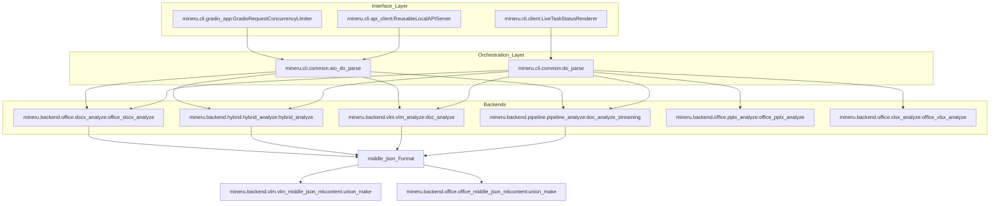
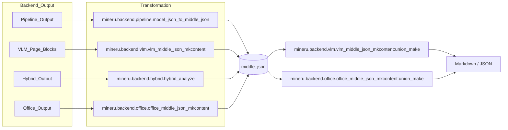

# 핵심 아키텍처

관련 소스 파일

이 위키 페이지를 생성하기 위해 다음 파일들이 컨텍스트로 사용되었습니다:

- [mineru/backend/pipeline/model_json_to_middle_json.py](mineru/backend/pipeline/model_json_to_middle_json.py)
- [mineru/backend/pipeline/pipeline_analyze.py](mineru/backend/pipeline/pipeline_analyze.py)
- [mineru/cli/client.py](mineru/cli/client.py)
- [mineru/cli/common.py](mineru/cli/common.py)
- [mineru/cli/gradio_app.py](mineru/cli/gradio_app.py)
- [mineru/utils/pdf_classify.py](mineru/utils/pdf_classify.py)
- [mineru/utils/pdf_image_tools.py](mineru/utils/pdf_image_tools.py)
- [mineru/utils/pdf_reader.py](mineru/utils/pdf_reader.py)
- [mineru/utils/pdf_text_tool.py](mineru/utils/pdf_text_tool.py)
- [mineru/utils/pdfium_guard.py](mineru/utils/pdfium_guard.py)
- [mineru/utils/span_pre_proc.py](mineru/utils/span_pre_proc.py)

MinerU는 원시 PDF 바이트, 이미지 또는 Office 문서를 구조화된 Markdown 및 JSON으로 변환하는 멀티 백엔드 문서 파싱 프레임워크로 설계되었습니다. 이 시스템은 통합된 오케스트레이션 레이어를 통해 다양한 AI 모델 및 OCR 엔진의 복잡성을 추상화하므로, 사용자는 속도, 정확도, 그리고 로컬 대 원격 컴퓨팅 파워 간의 균형을 자유롭게 선택할 수 있습니다.

## 상위 수준 데이터 흐름

MinerU의 데이터 흐름은 일반적으로 다음 4단계 프로세스를 따릅니다:
1.  **입력 처리**: 원시 바이트가 읽히고 `read_fn`을 통해 유효성이 검사됩니다. 이 함수는 PDF, 다양한 이미지 형식, 그리고 office 문서를 처리합니다 [mineru/cli/common.py:171-184]().
2.  **오케스트레이션**: 시스템은 `backend` 매개변수를 기반으로 호출할 백엔드를 결정합니다. 프로그램 방식의 사용에서는 `do_parse` 또는 `aio_do_parse`가 주요 진입점 역할을 합니다.
3.  **백엔드 분석**: 세 가지 핵심 백엔드(Pipeline, VLM 또는 Hybrid) 중 하나가 문서를 처리하여 원시 `model_output`을 생성합니다.
4.  **표준화 및 내보내기**: 원시 출력은 표준화된 `middle_json` 형식으로 변환되며, 이 형식은 `union_make`에 의해 처리되어 최종 Markdown 또는 콘텐츠 목록(Content Lists)을 생성합니다 [mineru/cli/common.py:24-25]().

### 시스템 구성 요소 다이어그램
다음 다이어그램은 CLI/API 호출이 어떻게 내부 코드 엔티티로 변환되어 백엔드를 통과하는지 보여줍니다.

**MinerU 실행 경로**

출처: [mineru/cli/client.py:179-183](), [mineru/cli/common.py:24-30](), [mineru/cli/gradio_app.py:72-133](), [mineru/cli/gradio_app.py:54-54]()

---

## 세 가지 백엔드

MinerU는 문서 파싱을 위해 서로 다른 하드웨어 및 정확도 요구 사항에 맞게 최적화된 세 가지 고유한 아키텍처 경로를 제공합니다.

### 1. 파이프라인 백엔드

**파이프라인 백엔드**는 "전통적인" 접근 방식입니다. 이 백엔드는 일련의 특화된 소형 모델들을 활용합니다: YOLO 기반의 레이아웃 감지(`PP-DocLayoutV2`), 공식 감지(MFD) 및 공식 인식(MFR) 전용 모델, 그리고 텍스트 추출을 위한 OCR 엔진입니다. 윈도우 기반 배칭을 통해 스트리밍 처리를 지원합니다.

*   **핵심 로직**: 다중 파일 배치 처리를 효율적으로 관리하기 위해 처리 윈도우를 활용하는 `doc_analyze_streaming`에 의해 오케스트레이션됩니다 [mineru/backend/pipeline/pipeline_analyze.py:157-166](), [mineru/backend/pipeline/pipeline_analyze.py:207-212](). 또한 레이아웃 및 OCR 모델의 라이프사이클을 관리하기 위해 `ModelSingleton`을 사용합니다 [mineru/backend/pipeline/pipeline_analyze.py:33-59]().
*   **변환**: 모델 결과는 `append_batch_results_to_middle_json`을 통해 중간 형식으로 변환됩니다 [mineru/backend/pipeline/model_json_to_middle_json.py:107-117]().
*   **자세한 내용은 [파이프라인 백엔드](#2.1)를 참조하세요.**

### 2. VLM 백엔드

**VLM 백엔드**는 end-to-end 문서 이해를 수행하기 위해 비전-언어 모델(예: `MinerU2.5-Pro`)을 활용합니다. 이 백엔드는 `vllm`, `lmdeploy`, `mlx`, `sglang` 및 `transformers`를 포함한 여러 추론 엔진을 지원합니다.

*   **핵심 로직**: 적절한 러너(예: `vllm`, `lmdeploy`)를 선택하는 엔진 유틸리티에 의해 관리됩니다 [mineru/utils/engine_utils.py:20-20](). 문서 분석을 위한 기본 진입점으로 `vlm_doc_analyze`를 사용합니다 [mineru/cli/common.py:26-27]().
*   **자세한 내용은 [VLM 백엔드](#2.2)를 참조하세요.**

### 3. 하이브리드 백엔드

**하이브리드 백엔드**는 VLM의 구조적 레이아웃 이해력과 파이프라인 모델의 고정밀 OCR 및 공식 인식 능력을 결합합니다. VLM을 사용하여 문서 구조를 정의한 다음 텍스트 및 공식을 위한 특화 모델을 사용하여 내용을 "채워 넣습니다".

*   **핵심 로직**: `torch`와 같은 로컬 의존성이 존재하는지 확인하기 위해 하이브리드 모듈을 동적으로 로드하는 `_load_hybrid_analyze_entrypoint`를 통해 호출됩니다 [mineru/cli/common.py:76-87](). 작동을 위해 `mineru[pipeline]` 의존성이 필요합니다 [mineru/cli/common.py:60-66]().
*   **자세한 내용은 [하이브리드 백엔드](#2.3)를 참조하세요.**

---

## 표준화된 중간 표현 (`middle_json`)

사용되는 백엔드와 관계없이, 모든 데이터는 궁극적으로 `middle_json`으로 알려진 공통 스키마로 변환됩니다. 이 형식은 최종 문서 생성 로직으로부터 모델 고유의 출력을 분리합니다.

**출력으로의 데이터 흐름**

출처: [mineru/cli/common.py:24-30](), [mineru/backend/pipeline/model_json_to_middle_json.py:72-81](), [mineru/backend/pipeline/pipeline_analyze.py:12-17]()

### 핵심 형식 구성 요소
| 구성 요소 | 역할 |
| :--- | :--- |
| `middle_json` | 모든 모델 출력을 표준화하는 내부 중간 표현입니다 [mineru/cli/common.py:24-25](). |
| `union_make` | 언어를 고려한 텍스트 병합 및 다양한 모드(Markdown, Content List V1/V2)에 대한 서식 지정을 처리하는 최종 조립 함수입니다 [mineru/cli/common.py:24-25](). |
| `MakeMode` | 출력 대상을 정의합니다: `MM_MD`, `CONTENT_LIST`, `CONTENT_LIST_V2` [mineru/cli/common.py:21-21](). |

**자세한 내용은 [middle_json 형식 및 콘텐츠 생성](#2.4)을 참조하세요.**

---

## 인터페이스 오케스트레이션

시스템은 모두 `do_parse` 또는 `aio_do_parse` 로직으로 수렴하는 여러 진입점을 통해 노출됩니다.

*   **CLI**: `LiveTaskStatusRenderer`를 통해 실시간 상태 렌더링을 제공하는 배치 처리 가능 클라이언트를 제공합니다 [mineru/cli/client.py:179-183](). `uniquify_task_stems`를 통해 작업 계획 및 출력 파일의 고유 이름 지정을 처리합니다 [mineru/cli/client.py:134-168]().
*   **FastAPI**: 멀티 파일 `/tasks` 엔드포인트를 제공합니다. 비동기 작업 제출을 지원하며 핵심 파싱 로직을 활용합니다.
*   **Gradio**: `ReusableLocalAPIServer`를 통한 로컬 API 통합 [mineru/cli/gradio_app.py:54-54]() 및 동시성 제한기 `GradioRequestConcurrencyLimiter`를 갖춘 대화형 UI를 제공합니다 [mineru/cli/gradio_app.py:72-133]().
*   **클라이언트 측 사후 처리**: `regenerate_client_side_outputs` 함수는 무거운 추론을 다시 실행하지 않고도 기존 `middle_json`에서 Markdown/JSON을 다시 렌더링할 수 있도록 합니다 [mineru/cli/client.py:51-51]().

출처: [mineru/cli/client.py:134-168](), [mineru/cli/gradio_app.py:54-133](), [mineru/cli/common.py:110-118](), [mineru/cli/client.py:51-51]()
