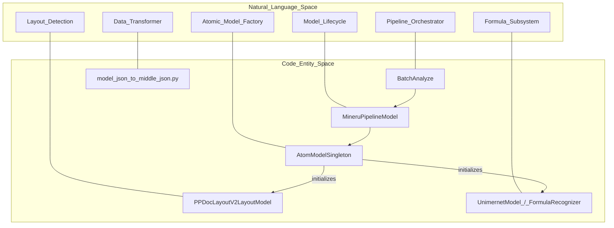
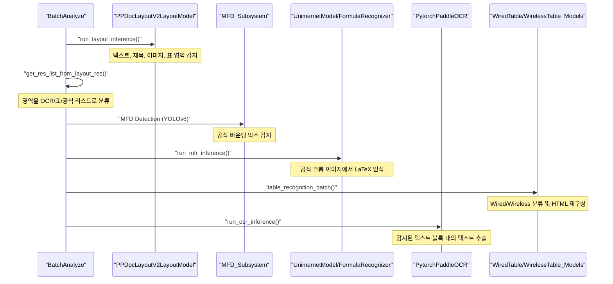

# 파이프라인 백엔드

관련 소스 파일

이 위키 페이지를 생성하기 위해 다음 파일들이 컨텍스트로 사용되었습니다:

- [mineru/backend/pipeline/batch_analyze.py](mineru/backend/pipeline/batch_analyze.py)
- [mineru/backend/pipeline/model_init.py](mineru/backend/pipeline/model_init.py)
- [mineru/backend/pipeline/model_json_to_middle_json.py](mineru/backend/pipeline/model_json_to_middle_json.py)
- [mineru/backend/pipeline/para_split.py](mineru/backend/pipeline/para_split.py)
- [mineru/backend/pipeline/pipeline_analyze.py](mineru/backend/pipeline/pipeline_analyze.py)
- [mineru/model/utils/tools/infer/predict_system.py](mineru/model/utils/tools/infer/predict_system.py)
- [mineru/utils/cut_image.py](mineru/utils/cut_image.py)
- [mineru/utils/ocr_utils.py](mineru/utils/ocr_utils.py)
- [mineru/utils/span_block_fix.py](mineru/utils/span_block_fix.py)

파이프라인 백엔드(Pipeline Backend)는 MinerU의 전통적인 다중 모델 오케스트레이션 레이어입니다. 이 백엔드는 문서 분석에 순차적 접근 방식을 사용하며, 레이아웃 감지, 공식 인식, OCR 및 표 재구성을 수행하기 위해 특화된 컴퓨터 비전 모델들을 함께 연결합니다. 이 백엔드는 높은 처리량의 배치 처리 및 개별 모델 구성 요소에 대한 정밀한 제어에 최적화되어 있습니다.

## 아키텍처 개요

파이프라인은 원시 PDF 페이지를 구조화된 `middle_json` 형식으로 변환하여 작동합니다. 이 프로세스는 모델 초기화, 배칭 및 데이터 변환을 조율하는 `BatchAnalyze`에 의해 관리됩니다 [mineru/backend/pipeline/batch_analyze.py:52-77](). VLM 또는 Hybrid 백엔드와 달리, 파이프라인 백엔드는 각 시맨틱 작업에 대해 아토믹(atomic) CV 모델에 크게 의존합니다.

### 코드 엔티티 관계
다음 다이어그램은 상위 수준의 파이프라인 개념이 코드베이스의 특정 클래스 및 함수와 어떻게 매핑되는지 보여줍니다.

**파이프라인 백엔드 엔티티 매핑**

출처: [mineru/backend/pipeline/batch_analyze.py:52-77](), [mineru/backend/pipeline/model_init.py:126-130](), [mineru/backend/pipeline/model_init.py:148-158](), [mineru/backend/pipeline/model_json_to_middle_json.py:1-25]()

## 모델 오케스트레이션 및 라이프사이클

### AtomModelSingleton
`AtomModelSingleton`은 OCR, 표 분류(Table Classification) 및 레이아웃과 같은 각각의 "아토믹" 모델에 대한 세분화된 액세스를 제공합니다. 중복 모델 로딩을 방지하기 위해 `threading.RLock`을 사용하는 스레드 안전 싱글톤 패턴을 구현합니다 [mineru/backend/pipeline/model_init.py:148-158]().
*   **캐싱 메커니즘**: 모델 매개변수(예: `det_db_box_thresh`, `lang`, `device`)를 기반으로 하는 복잡한 키를 사용하여 `_models` 딕셔너리에 모델 인스턴스를 캐싱합니다 [mineru/backend/pipeline/model_init.py:161-187]().
*   **아토믹 모델**: `Layout`, `MFR`, `OCR`, `WirelessTable`, `WiredTable`, `TableCls` 및 `TableOrientationCls`를 포함하여 `AtomicModel` 레지스트리를 통해 관리됩니다 [mineru/backend/pipeline/model_init.py:189-220]().

### 추론 잠금 (Inference Locking)
백엔드 간의 동시성(예: 파이프라인 및 하이브리드)을 지원하기 위해 MinerU는 추론 수준의 잠금을 구현합니다. `run_layout_inference`, `run_mfr_inference` 및 `run_ocr_inference`와 같은 함수는 공유 GPU 자원에 대한 경합 상태를 방지하기 위해 네이티브 모델 호출을 래핑합니다 [mineru/backend/pipeline/model_init.py:22-60](). 이러한 잠금은 `MINERU_ENABLE_PIPELINE_INFERENCE_LOCKS` 환경 변수를 통해 전역적으로 토글됩니다 [mineru/backend/pipeline/model_init.py:28-30]().

## BatchAnalyze 파이프라인

`BatchAnalyze` 클래스는 주요 실행 엔진입니다. 다양한 하드웨어에 최적화된 배치 크기를 사용하여 페이지 이미지에서 정보를 추출하는 다단계 프로세스를 구현합니다 [mineru/backend/pipeline/batch_analyze.py:38-41]().

### 데이터 흐름 실행
**BatchAnalyze 실행 흐름**

출처: [mineru/backend/pipeline/batch_analyze.py:12-35](), [mineru/backend/pipeline/model_init.py:42-60](), [mineru/backend/pipeline/model_init.py:148-187](), [mineru/backend/pipeline/batch_analyze.py:52-81]()

### 핵심 처리 단계
1.  **레이아웃 감지**: `PPDocLayoutV2LayoutModel`을 사용하여 `doc_title`, `abstract`, `table` 및 `image`와 같은 기본 문서 구조를 식별합니다 [mineru/backend/pipeline/model_init.py:126-130]().
2.  **공식 처리**:
    *   **인식 (MFR)**: `UnimernetModel` 또는 `FormulaRecognizer` (PP-FormulaNet-Plus-M)를 사용합니다. 선택은 `MINERU_FORMULA_CH_SUPPORT` 환경 변수에 의해 제어됩니다 [mineru/backend/pipeline/model_init.py:62-69]().
3.  **표 분석**:
    *   **방향**: `MineruTableOrientationClsModel`은 인식 전에 표의 회전을 보정합니다 [mineru/backend/pipeline/model_init.py:72-82]().
    *   **분류**: `PaddleTableClsModel`은 표가 "Wired"(선 있음)인지 "Wireless"(선 없음)인지 결정합니다 [mineru/backend/pipeline/model_init.py:85-86]().
    *   **재구성**: 구조화된 HTML을 생성하기 위해 `UnetTableModel` (Wired) 또는 `PaddleTableModel` (Wireless)을 사용합니다 [mineru/backend/pipeline/model_init.py:89-112]().
4.  **OCR**: `ocr_model_init` 함수는 `PytorchPaddleOCR` 엔진을 초기화합니다 [mineru/backend/pipeline/model_init.py:133-145](). `BatchAnalyze`는 노이즈를 방지하기 위해 OCR 감지 중에 선택적으로 인라인 공식을 마스킹할 수 있습니다 [mineru/backend/pipeline/batch_analyze.py:84-97]().

## 데이터 변환: Model JSON에서 Middle JSON으로

모델이 원시 감지 결과를 생성한 후, 데이터는 `model_json_to_middle_json.py`를 통해 `middle_json` 형식으로 표준화됩니다.

### 페이지 정보 구성
`page_model_info_to_page_info` 함수가 변환을 조율합니다 [mineru/backend/pipeline/model_json_to_middle_json.py:28-64]().
1.  **MagicModel 인스턴스**: 블록의 병합 및 필터링 로직을 처리하기 위해 `MagicModel` 객체가 생성됩니다 [mineru/backend/pipeline/model_json_to_middle_json.py:34-42]().
2.  **이미지 크롭**: `IMAGE`, `TABLE`, `CHART` 또는 `INTERLINE_EQUATION`으로 표시된 스팬(span)에 대해, 시스템은 `cut_image_and_table`을 통해 물리적 크롭 및 보존을 수행합니다 [mineru/backend/pipeline/model_json_to_middle_json.py:50-57]().
3.  **표 이미지 대체**: 표 HTML 내의 base64 인코딩된 이미지를 로컬 파일 경로로 대체합니다 [mineru/backend/pipeline/model_json_to_middle_json.py:60]().

### 중간 형식 매핑
| 소스 모델 출력 | Middle JSON 엔티티 | 설명 |
| :--- | :--- | :--- |
| PPDocLayoutV2 | `preproc_blocks` | 구조화된 영역 (텍스트, 제목 등) [mineru/backend/pipeline/model_json_to_middle_json.py:45]() |
| MFR | `interline_equation` | 바운딩 박스가 포함된 LaTeX 콘텐츠 [mineru/backend/pipeline/model_json_to_middle_json.py:51-56]() |
| OCR | `spans` | 신뢰도와 좌표가 포함된 텍스트 조각 [mineru/backend/pipeline/model_json_to_middle_json.py:140-142]() |

## 공식 및 텍스트 블록 미세 조정

파이프라인에는 문서 레이아웃의 극단적인 사례(edge case)를 처리하기 위한 특화된 로직이 포함되어 있습니다:

*   **Post-OCR 인식**: 초기 추출이 실패한 경우(예: 이미지에 포함된 텍스트), 콘텐츠 복구를 위해 `_apply_post_ocr`이 `run_ocr_inference`를 사용하여 크롭된 스팬 이미지에 대해 보조 OCR 패스를 실행합니다 [mineru/backend/pipeline/model_json_to_middle_json.py:148-194]().
*   **세로 텍스트 처리**: 세로 텍스트가 있는 문서의 경우 파이프라인은 스팬의 높이 대비 너비 비율을 계산합니다. 스팬의 80% 이상이 세로 방향이면 블록은 `merge_spans_to_vertical_line`을 사용하여 처리됩니다 [mineru/utils/span_block_fix.py:9-30](), [mineru/utils/span_block_fix.py:39-42]().
*   **단락 분할**: `para_split` 모듈은 줄 정렬과 "들쭉날쭉한" 가장자리를 분석하여 단락 경계를 감지합니다 [mineru/backend/pipeline/para_split.py:16-56](). 들여쓰기 및 숫자 표식을 기반으로 리스트 패턴과 색인 블록을 식별합니다 [mineru/backend/pipeline/para_split.py:59-117]().

## 성능 최적화

### 배칭 전략
파이프라인은 처리량과 메모리의 균형을 맞추기 위해 다양한 작업에 대해 구체적인 기본 배치 크기를 정의합니다 [mineru/backend/pipeline/batch_analyze.py:38-41]():
*   **레이아웃 감지**: 1 (`LAYOUT_BASE_BATCH_SIZE`)
*   **MFR (공식)**: 16 (`MFR_BASE_BATCH_SIZE`)
*   **OCR 감지**: 8 (`OCR_DET_BASE_BATCH_SIZE`)
*   **표 분류**: 16 (`TABLE_Wired_Wireless_CLS_BATCH_SIZE`)

### 메모리 관리
`clean_memory` 유틸리티는 집중적인 처리 후 하드웨어 자원을 관리하는 데 사용됩니다 [mineru/backend/pipeline/pipeline_analyze.py:23](). `AtomModelSingleton`은 메모리에 각 모델 구성의 인스턴스가 하나만 존재하도록 보장합니다 [mineru/backend/pipeline/model_init.py:148-158]().

### PDF 렌더링 및 스트리밍
PDF 이미지는 `load_images_from_pdf_doc`을 통해 로드됩니다 [mineru/backend/pipeline/pipeline_analyze.py:22](). `doc_analyze_streaming` 함수는 대용량 문서를 청크 단위로 처리하여 피크 메모리 사용량을 줄이기 위한 "처리 윈도우(processing window)" 전략(기본값 64페이지)을 구현합니다 [mineru/backend/pipeline/pipeline_analyze.py:157-207](). 이 윈도우 크기는 `get_processing_window_size`를 통해 구성할 수 있습니다 [mineru/backend/pipeline/pipeline_analyze.py:207]().

출처: [mineru/backend/pipeline/batch_analyze.py:38-107](), [mineru/backend/pipeline/model_init.py:22-60](), [mineru/backend/pipeline/model_init.py:148-187](), [mineru/backend/pipeline/model_json_to_middle_json.py:28-64](), [mineru/backend/pipeline/model_json_to_middle_json.py:148-194](), [mineru/utils/span_block_fix.py:9-42](), [mineru/backend/pipeline/para_split.py:59-117](), [mineru/backend/pipeline/pipeline_analyze.py:23-42](), [mineru/backend/pipeline/pipeline_analyze.py:157-207]()
