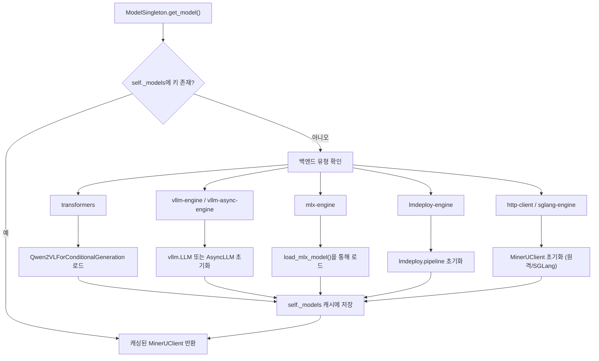
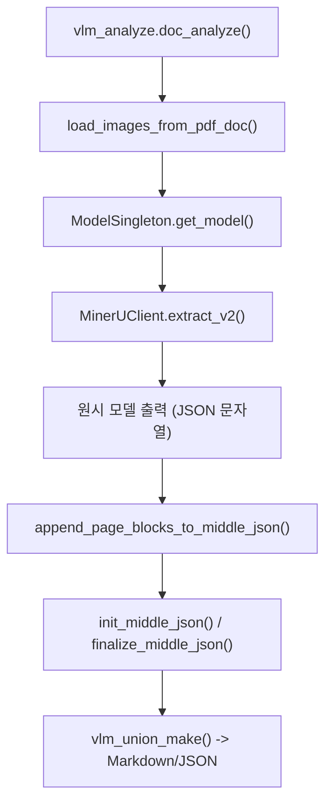

# VLM 백엔드

관련 소스 파일

이 위키 페이지를 생성하기 위해 다음 파일들이 컨텍스트로 사용되었습니다:

- [mineru/backend/vlm/utils.py](mineru/backend/vlm/utils.py)
- [mineru/backend/vlm/vlm_analyze.py](mineru/backend/vlm/vlm_analyze.py)
- [mineru/cli/vlm_preload.py](mineru/cli/vlm_preload.py)
- [mineru/cli/vlm_server.py](mineru/cli/vlm_server.py)
- [mineru/model/vlm/__init__.py](mineru/model/vlm/__init__.py)
- [mineru/model/vlm/lmdeploy_server.py](mineru/model/vlm/lmdeploy_server.py)
- [mineru/model/vlm/vllm_server.py](mineru/model/vlm/vllm_server.py)
- [mineru/utils/check_sys_env.py](mineru/utils/check_sys_env.py)

비전-언어 모델(VLM) 백엔드는 MinerU에서 높은 정확도의 추론 경로를 나타냅니다. 레이아웃, OCR 및 공식을 위해 별도의 모델을 사용하는 기존 파이프라인과 달리, VLM 백엔드는 통합된 방식으로 문서를 이해하기 위해 강력한 end-to-end 모델(주로 MinerU2.5-Pro / Qwen2-VL)을 활용합니다. 이 백엔드는 높은 구조적 무결성을 유지하면서 복잡한 레이아웃, 수학 공식 및 표를 처리하도록 설계되었습니다.

## ModelSingleton 라이프사이클

MinerU는 효율적인 자원 활용을 보장하고 중복 모델 로딩을 방지하기 위해 `ModelSingleton` 클래스를 통해 VLM 인스턴스를 관리합니다. 이는 VLM의 높은 VRAM 요구 사항을 고려할 때 매우 중요합니다.

- **초기화**: `ModelSingleton`은 클래식 싱글톤 패턴을 따라 `_models`에 로드된 모델의 단일 레지스트리를 유지합니다 [mineru/backend/vlm/vlm_analyze.py:43-52]().
- **모델 검색**: `get_model` 메서드는 `(backend, model_path, server_url)`로 구성된 캐시 키를 사용하여 `MinerUClient` 인스턴스를 저장하고 검색합니다 [mineru/backend/vlm/vlm_analyze.py:54-63]().
- **자원 관리**: `set_default_gpu_memory_utilization()`을 통해 기본 GPU 메모리 활용률을 설정하고 [mineru/backend/vlm/vlm_analyze.py:134-135](), 서로 다른 엔진에 대한 배치 크기를 관리하는 것 등을 포함하여 다양한 실행 환경의 설정을 처리합니다 [mineru/backend/vlm/vlm_analyze.py:106-107]().
- **자동 다운로드**: 로컬 백엔드에 `model_path`가 제공되지 않는 경우, HuggingFace 또는 ModelScope에서 모델을 가져오기 위해 `auto_download_and_get_model_root_path`를 호출합니다 [mineru/backend/vlm/vlm_analyze.py:80-81]().
- **종료**: 애플리케이션 종료 시 싱글톤을 비우고 VRAM을 해제하기 위해 `shutdown_cached_models` 함수가 사용됩니다 [mineru/backend/vlm/vlm_analyze.py:243-254]().
- **사전 로딩**: `preload_vlm_model` 함수는 첫 번째 요청이 도착하기 전에 `ModelSingleton`을 초기화하여 백엔드를 웜 스타트(warm-start)할 수 있게 해줍니다 [mineru/cli/vlm_preload.py:61-75]().

### 모델 로딩 로직
**ModelSingleton 초기화 흐름**

출처: [mineru/backend/vlm/vlm_analyze.py:43-205]()

## 지원되는 추론 엔진

VLM 백엔드는 로컬 소비자용 GPU부터 처리량이 많은 서버에 이르기까지 다양한 하드웨어를 수용할 수 있도록 광범위한 추론 엔진을 지원합니다.

| 엔진 | 하드웨어 대상 | 구현 세부 정보 |
| :--- | :--- | :--- |
| `vllm-engine` | Linux / NVIDIA / NPU | 동기식 `LLM`을 지원합니다. 하드웨어별 조정을 위해 `mod_kwargs_by_device_type`을 사용합니다 [mineru/backend/vlm/vlm_analyze.py:118-142](). |
| `vllm-async-engine` | Linux / NVIDIA / NPU | 동시 요청 처리를 위해 `AsyncLLM`을 사용합니다 [mineru/backend/vlm/vlm_analyze.py:143-153](). |
| `lmdeploy-engine` | Linux / Windows | `turbomind` 또는 `pytorch` 백엔드와 함께 `lmdeploy.pipeline`을 사용합니다. 여러 가속기(CUDA, Ascend, MACA, Cambricon)를 지원합니다 [mineru/backend/vlm/vlm_analyze.py:154-178](). |
| `transformers` | 일반 / CPU | `Qwen2VLForConditionalGeneration`을 사용하는 표준 HuggingFace 구현입니다. 실행 대상을 결정하기 위해 `get_device()`를 사용합니다 [mineru/backend/vlm/vlm_analyze.py:82-105](). |
| `mlx-engine` | Apple Silicon | macOS 네이티브 가속을 위해 `load_mlx_model`을 활용합니다. macOS 13.5 이상이 필요합니다 [mineru/backend/vlm/vlm_analyze.py:108-113](). |
| `sglang-engine` | 고처리량 환경 | 최적화된 서빙을 위해 `sglang.Engine`을 통해 초기화됩니다 [mineru/backend/vlm/vlm_analyze.py:179-192](). |
| `http-client` | 원격 서버 | `MinerUClient`를 통해 OpenAI 호환 VLM 서버(vLLM/LMDeploy)에 연결합니다 [mineru/backend/vlm/vlm_analyze.py:193-205](). |

출처: [mineru/backend/vlm/vlm_analyze.py:82-205](), [mineru/backend/vlm/utils.py:60-80](), [mineru/utils/check_sys_env.py:26-33]()

## 2단계 추출 프로토콜

VLM 백엔드는 `doc_analyze` 및 `aio_doc_analyze`에 의해 조율되는 프로토콜을 기반으로 작동합니다.

1. **레이아웃 및 텍스트 추출**: 모델이 페이지 이미지(`load_images_from_pdf_doc`을 통해 로드됨)를 처리하여 공식을 위한 LaTeX 및 표를 위한 Markdown/HTML을 포함한 문서 콘텐츠가 담긴 구조화된 JSON 유사 문자열을 생성합니다.
2. **구조적 구체화**: 원시 모델 출력은 파싱되어 `append_page_blocks_to_middle_json`을 통해 표준화된 `middle_json` 형식으로 변환됩니다.

### 사용자 정의 로직 프로세서
VLM이 필수 구조 출력 형식을 따르고 환각(hallucination)을 피할 수 있도록, vLLM 백엔드를 사용할 때 MinerU는 `MinerULogitsProcessor`를 주입할 수 있습니다 [mineru/backend/vlm/vlm_analyze.py:138-140](). 이는 모델의 생성을 내부 스키마와 일치하는 유효한 토큰으로 제한하여 `table` 또는 `formula` 태그와 같은 요소가 올바르게 열리고 닫히도록 보장합니다. 이 기능의 가용성은 하드웨어의 연산 능력(CUDA의 경우 >= 8.0) 및 vLLM 버전(>= 0.10.1)에 따릅니다 [mineru/backend/vlm/utils.py:12-57]().

출처: [mineru/backend/vlm/vlm_analyze.py:138-140](), [mineru/backend/vlm/utils.py:12-57]()

## 데이터 흐름: vlm_analyze에서 middle_json으로

VLM 백엔드의 주요 진입점은 `vlm_analyze.doc_analyze`입니다.

**VLM 백엔드 실행 파이프라인**

### 핵심 함수 및 클래스
- `doc_analyze` / `aio_doc_analyze`: PDF-to-image 변환, 모델 추론을 처리하고 중간 형식으로의 전환을 조율하는 동기 및 비동기 진입점입니다 [mineru/backend/vlm/vlm_analyze.py:257-328](), [mineru/backend/vlm/vlm_analyze.py:331-403]().
- `append_page_blocks_to_middle_json`: VLM의 원시 JSON 문자열 추론 결과를 파싱하여 표준화된 `middle_json` 스키마에 매핑하는 변환 레이어입니다 [mineru/backend/vlm/vlm_analyze.py:17-18]().
- `init_middle_json` / `finalize_middle_json`: 중간 표현을 생성하고 마감하는 라이프사이클 함수입니다 [mineru/backend/vlm/vlm_analyze.py:19-20]().
- `vlm_analyze`는 VLM을 위해 특정 DPI(기본값 200)로 PDF 페이지를 렌더링하기 위해 `pdf_image_tools.py`의 `load_images_from_pdf_doc`을 사용합니다 [mineru/utils/pdf_image_tools.py:34-49]().

출처: [mineru/backend/vlm/vlm_analyze.py:257-403](), [mineru/backend/vlm/vlm_analyze.py:17-21](), [mineru/utils/pdf_image_tools.py:34-49]()

## 독립형 VLM 서버

MinerU는 독립형 VLM 추론 서버를 실행하기 위한 특화된 CLI 명령을 제공합니다. 이 서버들은 OpenAI 호환 API를 노출하므로, MinerU 클라이언트가 무거운 VLM 계산을 원격 하드웨어로 오프로드할 수 있도록 해줍니다.

- **mineru-vllm-server**: `vllm_main`을 통해 vLLM 기반 서버를 시작합니다 [mineru/model/vlm/vllm_server.py:65](). `mod_kwargs_by_device_type`을 사용하여 `gpu_memory_utilization` 및 `compilation_config`와 같은 하드웨어별 인수를 자동으로 처리합니다 [mineru/model/vlm/vllm_server.py:55]().
- **mineru-lmdeploy-server**: LMDeploy 서버를 구동합니다. 여러 백엔드(turbomind/pytorch)를 지원하며 특히 Windows 환경이나 Ascend 또는 MooreThreads와 같은 특정 중국 가속기 환경에 유용합니다 [mineru/model/vlm/lmdeploy_server.py:11-90]().
- **mineru-openai-server**: OpenAI Chat Completions 프로토콜을 따르는 VLM 서버를 시작하기 위한 범용 명령입니다. 설치 가용성 또는 사용자 선택에 따라 vLLM 또는 LMDeploy 중 하나로 분배하는 래퍼 역할을 합니다 [mineru/cli/vlm_server.py:18-59]().

이 서버들은 일반적으로 `backend`를 `http-client`로 설정하고 파싱 요청 시 `server_url`을 제공함으로써 사용됩니다 [mineru/backend/vlm/vlm_analyze.py:193-205]().

출처: [mineru/model/vlm/lmdeploy_server.py:11-90](), [mineru/model/vlm/vllm_server.py:5-66](), [mineru/cli/vlm_server.py:18-59](), [mineru/backend/vlm/vlm_analyze.py:193-205]()

## 하드웨어별 구성

VLM 백엔드에는 다양한 AI 가속기(NPU, MUSA, XPU 등)에서 성능을 최적화하기 위한 로직이 포함되어 있습니다.

- **vLLM 장치 조정**: `mod_kwargs_by_device_type`은 `MINERU_VLLM_DEVICE` 환경 변수를 기반으로 엔진 매개변수를 수정합니다 [mineru/backend/vlm/utils.py:185-186](). 예를 들어, 쿤룬신(Kunlunxin, `kxpu`)은 청크 프리필(chunked prefill) 및 프리픽스 캐싱(prefix caching)을 비활성화하고 [mineru/backend/vlm/utils.py:144-145](), 코렉스(Corex, `corex`)는 특정 컴파일 모드를 설정합니다 [mineru/backend/vlm/utils.py:126-131]().
- **LMDeploy 백엔드 선택**: `set_lmdeploy_backend`는 OS(Linux vs Windows) 및 GPU 연산 능력에 따라 `turbomind`와 `pytorch` 중에서 자동으로 선택합니다 [mineru/backend/vlm/utils.py:60-80]().
- **VRAM 고려 배치 처리**: `set_default_batch_size`는 사용 가능한 VRAM에 기초하여 최적의 추론 배치 크기를 계산합니다(예: >=16GB의 경우 8, <8GB의 경우 1) [mineru/backend/vlm/utils.py:95-111]().
- **가속기 사양**: 하드웨어별 컴파일 및 블록 크기는 `_get_device_config`에 정의되어 있습니다 [mineru/backend/vlm/utils.py:114-149]().

출처: [mineru/backend/vlm/utils.py:60-149](), [mineru/backend/vlm/utils.py:95-111]()
