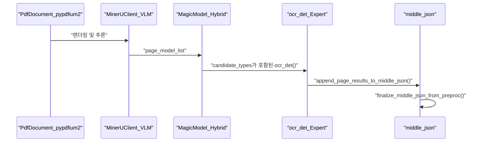

# 하이브리드 백엔드

<details>
<summary>관련 소스 파일</summary>

이 위키 페이지를 생성하기 위해 다음 파일들이 컨텍스트로 사용되었습니다:

- [mineru/backend/hybrid/__init__.py](mineru/backend/hybrid/__init__.py)
- [mineru/backend/hybrid/hybrid_analyze.py](mineru/backend/hybrid/hybrid_analyze.py)
- [mineru/backend/hybrid/hybrid_model_output_to_middle_json.py](mineru/backend/hybrid/hybrid_model_output_to_middle_json.py)
- [mineru/backend/utils/para_block_utils.py](mineru/backend/utils/para_block_utils.py)
- [mineru/backend/vlm/model_output_to_middle_json.py](mineru/backend/vlm/model_output_to_middle_json.py)
- [mineru/utils/engine_utils.py](mineru/utils/engine_utils.py)
- [mineru/utils/title_level_postprocess.py](mineru/utils/title_level_postprocess.py)

</details>


하이브리드 백엔드(`hybrid-auto-engine`)는 비전-언어 모델(VLM)의 구조적 이해력과 특화된 OCR 및 공식 인식 모델의 정밀함을 결합한 이중 경로 문서 분석 시스템입니다. VLM을 "레이아웃 엔진"으로 사용하는 동시에 콘텐츠 추출은 전문 모델에 위임함으로써, 순수 VLM 방식의 한계(예: 공식이나 복잡한 표의 환각 현상)를 극복하도록 설계되었습니다.

## 1. 아키텍처 개요

하이브리드 백엔드는 먼저 VLM을 사용하여 문서 구조를 식별한 다음, 고정밀 콘텐츠 추출을 위해 전통적인 파이프라인 모델을 적용하는 방식으로 작동합니다. 속도와 정확도의 균형을 맞추기 위해 서로 다른 노력 수준(effort levels, `medium` 및 `high`)을 지원합니다 [mineru/backend/hybrid/hybrid_analyze.py:110-115]().

### 하이브리드 파이프라인 라이프사이클
1.  **VLM 레이아웃 분석**: VLM이 영역(텍스트, 제목, 표, 이미지, 수식)을 식별합니다. 보통 노력 모드(`medium` effort mode)에서는 레이아웃 레이블이 `MEDIUM_EFFORT_LAYOUT_LABEL_TO_VLM_TYPE`을 통해 VLM 추출 유형으로 매핑됩니다 [mineru/backend/hybrid/hybrid_analyze.py:83-107]().
2.  **MagicModel 재구성**: 하이브리드 모듈의 `MagicModel` 클래스는 VLM 출력을 표준화된 블록 기반 구조로 변환하며, 좌표 정규화 및 카테고리 매핑을 처리합니다 [mineru/backend/hybrid/hybrid_model_output_to_middle_json.py:68-76]().
3.  **전문가 모델 구체화**: 
    *   **OCR 감지**: 특화된 모델들이 텍스트 감지를 구체화합니다. `ocr_det` 함수는 크롭된 영역들에 대해 배치 OCR 감지를 수행합니다 [mineru/backend/hybrid/hybrid_analyze.py:150-158]().
    *   **Post-OCR 구체화**: 블록 구성이 완료된 후, `_apply_post_ocr`은 텍스트 내용과 점수를 세부 조정하기 위해 크롭된 이미지에서 전문가 OCR 모델을 실행합니다 [mineru/backend/hybrid/hybrid_model_output_to_middle_json.py:127-143]().
4.  **LLM 지원 구체화**: LLM을 사용하여 제목 계층 구조 및 의미론적 그룹화를 수행하는 선택적 사후 처리입니다 [mineru/utils/title_level_postprocess.py:32-43]().

### 시스템 엔티티 브릿지
다음 다이어그램은 상위 수준의 논리적 구성 요소가 하이브리드 백엔드 내의 특정 코드 엔티티와 어떻게 매핑되는지 보여줍니다.

**하이브리드 백엔드 엔티티 매핑**
```mermaid
graph TD
    subgraph "NaturalLanguageSpace"
        A["LayoutEngine"]
        B["StructureReconstructor"]
        C["TitleOptimizer"]
        D["ContentMerger"]
    end

    subgraph "CodeEntitySpace"
        A1["hybrid_analyze.py"]
        B1["MagicModel_Hybrid"]
        C1["llm_aided_title"]
        D1["append_page_results_to_middle_json"]
    end

    A --- A1
    B --- B1
    C --- C1
    D --- D1

    A1 -->| "page_model_list" | B1
    B1 -->| "page_blocks" | D1
    D1 -->| "para_blocks" | C1
    C1 -->| "level" | MJ["middle_json"]
```
출처: [mineru/backend/hybrid/hybrid_analyze.py:15-27](), [mineru/backend/hybrid/hybrid_model_output_to_middle_json.py:68-76](), [mineru/utils/title_level_postprocess.py:32-43](), [mineru/backend/hybrid/hybrid_model_output_to_middle_json.py:192-201]().

## 2. MagicModel 구조 재구성

`MagicModel` (하이브리드 버전)은 VLM이 감지한 카테고리를 내부 `BlockType` 및 `ContentType` 열거형으로 매핑하는 역할을 담당합니다. PDF에서 추출된 스팬(spans), 인라인 공식 및 OCR 결과의 통합을 관리합니다.

| 카테고리 유형 | 매핑 메서드 | 출력 블록 컬렉션 |
| :--- | :--- | :--- |
| **시각적 (Visual)** | `get_image_blocks()`, `get_table_blocks()` | `image_blocks`, `table_blocks` [mineru/backend/hybrid/hybrid_model_output_to_middle_json.py:77-78]() |
| **구조적 (Structural)** | `get_title_blocks()`, `get_list_blocks()` | `title_blocks`, `list_blocks` [mineru/backend/hybrid/hybrid_model_output_to_middle_json.py:80-85]() |
| **콘텐츠 (Content)** | `get_text_blocks()`, `get_code_blocks()` | `text_blocks`, `code_blocks` [mineru/backend/hybrid/hybrid_model_output_to_middle_json.py:82-91]() |

### 콘텐츠 구체화 로직
재구성 프로세스에는 다음과 같은 몇 가지 구체화 단계가 포함됩니다:
- **제목 높이 분석**: `_resolve_title_line_avg_height`는 제목의 평균 줄 높이를 계산하며, 표준 줄 바운딩 박스보다 `_ocr_det_lines`(하이브리드 OCR 감지 힌트)에 우선순위를 부여합니다 [mineru/backend/hybrid/hybrid_model_output_to_middle_json.py:32-44]().
- **이미지/표 크롭**: `IMAGE`, `TABLE` 또는 `CHART`로 표시된 스팬에 대해, 시스템은 `cut_image_and_table`을 호출하여 물리적인 이미지 자산을 생성합니다 [mineru/backend/hybrid/hybrid_model_output_to_middle_json.py:96-98]().
- **Post-OCR 대체 (Fallback)**: OCR 신뢰도가 낮은 경우, 시스템은 `_restore_post_ocr_fallback`을 통해 콘텐츠 복구를 시도합니다 [mineru/backend/hybrid/hybrid_model_output_to_middle_json.py:154-158]().

## 3. 하이브리드 분석 파이프라인

하이브리드 파이프라인은 VLM과 특화 모델 간의 데이터 흐름을 조율합니다. 페이지 렌더링 및 좌표 계산을 위해 `pypdfium2`를 사용합니다 [mineru/backend/hybrid/hybrid_analyze.py:9-11]().

**데이터 흐름: hybrid_analyze**

출처: [mineru/backend/hybrid/hybrid_analyze.py:11-12](), [mineru/backend/hybrid/hybrid_analyze.py:150-158](), [mineru/backend/hybrid/hybrid_model_output_to_middle_json.py:192-201]().

### 전문가 모델 통합
하이브리드 백엔드는 `ocr_classify` 결과를 기반으로 VLM 네이티브 OCR과 특화된 파이프라인 OCR 간을 전환할 수 있습니다 [mineru/backend/hybrid/hybrid_analyze.py:140-148]().
1. **OCR 감지**: `ocr_det`는 크롭된 이미지의 배치 처리를 수행합니다. 패딩이 포함된 `crop_img`를 사용하여 OCR 엔진을 위한 영역을 추출합니다 [mineru/backend/hybrid/hybrid_analyze.py:191-193]().
2. **공식 마스킹**: OCR 엔진이 LaTeX 공식을 손상시키는 것을 방지하기 위해, 수식 감지(MFD) 결과를 사용하여 OCR 감지 중에 `mask_formula_regions_for_ocr_det`을 통해 공식 영역을 마스킹합니다 [mineru/backend/hybrid/hybrid_analyze.py:201-204]().
3. **배치 처리**: 파이프라인은 GPU 사용률을 최적화하기 위해 MFR(수식 인식) 및 OCR에 대한 배치 처리를 지원합니다 [mineru/backend/hybrid/hybrid_analyze.py:69-70]().

## 4. LLM 지원 제목 구체화

구성에서 `title_aided`가 활성화된 경우 시스템은 선택적으로 LLM을 사용하여 문서 계층 구조를 미세 조정할 수 있습니다 [mineru/utils/title_level_postprocess.py:32-38]().
1.  **구성 해결**: `_resolve_title_aided_config`는 `mineru.json`에서 `title_aided` 설정을 확인합니다 [mineru/utils/title_level_postprocess.py:17-29]().
2.  **구체화 실행**: `apply_title_leveling_to_pdf_info`는 의미론적 문맥을 기반으로 VLM이 예측한 제목 수준을 수정하는 `llm_aided_title` 함수를 호출합니다 [mineru/utils/title_level_postprocess.py:32-43]().

## 5. Middle JSON 마감

하이브리드 흐름에서, 스팬들을 단락으로 그룹화하고 레이아웃 수준의 보정을 적용하기 위해 `finalize_middle_json_from_preproc`가 호출됩니다.

### 단락 및 텍스트 병합
- **단락 구성**: `build_para_blocks_from_preproc`는 레이아웃 블록을 복사하여 단락 수준 구조를 초기화합니다 [mineru/backend/utils/para_block_utils.py:42-44]().
- **텍스트 병합**: `merge_para_text_blocks`는 페이지 전반에 걸쳐 인접한 텍스트 블록을 병합합니다. 줄이 문장을 끝맺는지 결정하기 위해 `LINE_STOP_FLAG`(예: `.`, `!`, `?`, `。`)를 사용합니다 [mineru/backend/utils/para_block_utils.py:8-14](), [mineru/backend/utils/para_block_utils.py:47-51]().
- **Merge barriers**: `TITLE` 및 `INTERLINE_EQUATION`과 같은 유형은 `SECTION_MERGE_BARRIER_TYPES`로 작동하여 잘못된 의미론적 병합을 방지합니다 [mineru/backend/utils/para_block_utils.py:9-14]().

### 표준화
- **제목 정규화**: `_normalize_split_title_blocks`는 최종 출력 스키마를 위해 하이브리드 고유의 제목 유형(DOC_TITLE, PARAGRAPH_TITLE)을 표준 `BlockType.TITLE`로 변환합니다 [mineru/backend/hybrid/hybrid_model_output_to_middle_json.py:165-179]().
- **메타데이터 정리**: `_ocr_det_lines` 및 `line_avg_height`와 같은 내부 처리용 키는 `cleanup_internal_para_block_metadata`를 통해 최종 단계에서 제거됩니다 [mineru/backend/utils/para_block_utils.py:27-30]().

출처: [mineru/backend/hybrid/hybrid_analyze.py](), [mineru/backend/hybrid/hybrid_model_output_to_middle_json.py](), [mineru/backend/utils/para_block_utils.py](), [mineru/utils/title_level_postprocess.py]().
