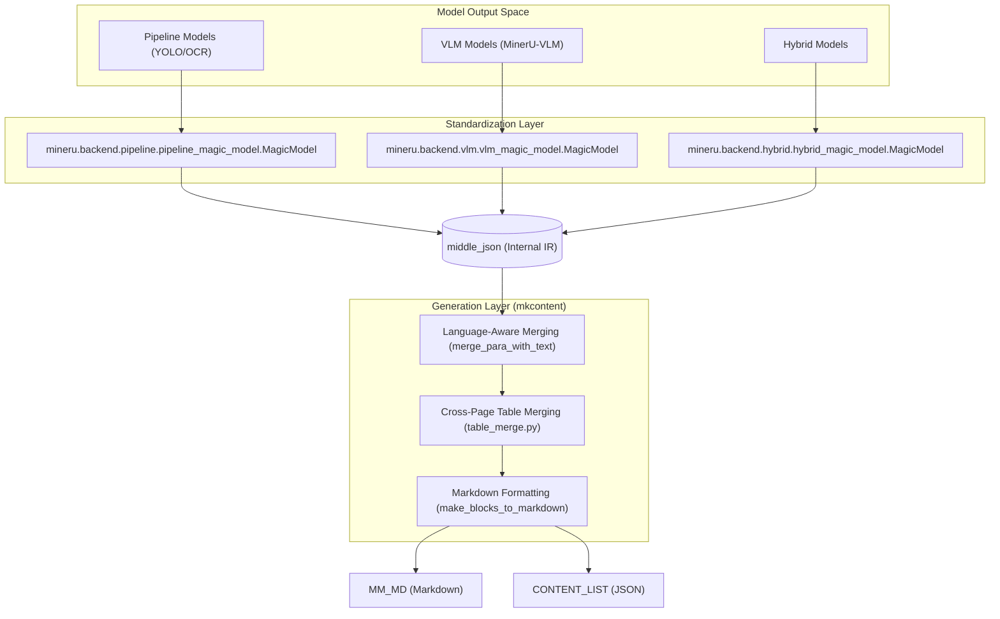
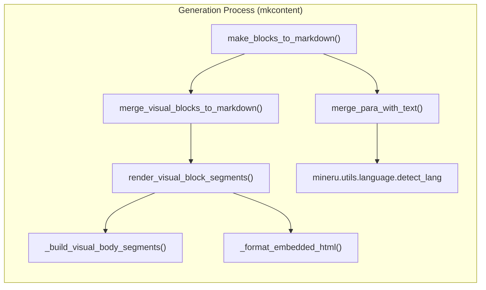

# middle_json 포맷 및 콘텐츠 생성

관련 소스 파일

이 위키 페이지를 생성하는 데 다음 파일들이 컨텍스트로 사용되었습니다:

- [docs/en/faq/index.md](docs/en/faq/index.md)
- [docs/en/reference/output_files.md](docs/en/reference/output_files.md)
- [docs/zh/faq/index.md](docs/zh/faq/index.md)
- [docs/zh/reference/output_files.md](docs/zh/reference/output_files.md)
- [mineru/backend/hybrid/hybrid_magic_model.py](mineru/backend/hybrid/hybrid_magic_model.py)
- [mineru/backend/pipeline/pipeline_magic_model.py](mineru/backend/pipeline/pipeline_magic_model.py)
- [mineru/backend/pipeline/pipeline_middle_json_mkcontent.py](mineru/backend/pipeline/pipeline_middle_json_mkcontent.py)
- [mineru/backend/vlm/vlm_magic_model.py](mineru/backend/vlm/vlm_magic_model.py)
- [mineru/backend/vlm/vlm_middle_json_mkcontent.py](mineru/backend/vlm/vlm_middle_json_mkcontent.py)
- [mineru/utils/boxbase.py](mineru/utils/boxbase.py)
- [mineru/utils/char_utils.py](mineru/utils/char_utils.py)
- [mineru/utils/draw_bbox.py](mineru/utils/draw_bbox.py)
- [mineru/utils/enum_class.py](mineru/utils/enum_class.py)
- [mineru/utils/magic_model_utils.py](mineru/utils/magic_model_utils.py)
- [mineru/utils/table_continuation.py](mineru/utils/table_continuation.py)
- [mineru/utils/table_merge.py](mineru/utils/table_merge.py)
- [mineru/utils/visual_magic_model_utils.py](mineru/utils/visual_magic_model_utils.py)

`middle_json`은 MinerU의 핵심 중간 표현(intermediate representation)입니다. 이는 Raw 모델 출력(Pipeline, VLM, Hybrid 또는 Office 백엔드)과 최종 문서 포맷 사이에서 표준화된 다리 역할을 합니다. 이러한 디커플링(decoupling)을 통해 MinerU는 텍스트 병합, 읽기 순서 및 Markdown 생성에 대한 일관된 로직을 유지하면서 다양한 모델 아키텍처를 지원할 수 있습니다.

## 1. 데이터 흐름 개요

변환 프로세스는 두 가지 주요 단계로 구성됩니다:
1.  **Standardization (표준화)**: 모델별 결과(PDF, 이미지 또는 Office 문서)가 `middle_json` 스키마로 변환됩니다. 파이프라인 백엔드에서는 `model_json_to_middle_json.py`가 이를 처리합니다.
2.  **Content Generation (콘텐츠 생성, `union_make`)**: `middle_json`을 처리하여 `MM_MD` (Multi-modal Markdown) 또는 `CONTENT_LIST`와 같은 최종 출력을 생성합니다.

### 시스템 데이터 흐름도
"자연어 공간"에서 "코드 엔티티 공간"으로의 매핑:

**출처:** [mineru/backend/pipeline/pipeline_magic_model.py:17-127](), [mineru/backend/vlm/vlm_magic_model.py:29-183](), [mineru/backend/hybrid/hybrid_magic_model.py:45-192](), [mineru/utils/table_merge.py:1-230]()

---

## 2. middle_json 스키마

`middle_json` 구조는 페이지별로 구성되며 상세한 레이아웃, 블록 및 스팬(span) 정보를 포함합니다.

### 주요 구성 요소
-   **`pdf_info`**: 각 요소가 하나의 페이지를 나타내는 리스트입니다.
-   **`preproc_blocks`**: 초기 모델 감지 결과를 나타내는 정렬된 콘텐츠 블록들입니다 [mineru/utils/draw_bbox.py:32-34]().
-   **`para_blocks`**: 단락 재구성 및 분할 후의 최종 콘텐츠 블록들입니다.
-   **`discarded_blocks`**: 일반적으로 메인 Markdown에서 제외되는 헤더, 푸터, 페이지 번호와 같은 요소들입니다 [mineru/utils/draw_bbox.py:170-172]().

### 블록 타입 (`BlockType`)
`mineru.utils.enum_class`에 정의되어 있으며, 공통 타입은 다음과 같습니다:
-   `TEXT`, `TITLE`, `IMAGE`, `TABLE`, `CHART`, `CAPTION`, `FOOTNOTE`, `CODE`, `ALGORITHM`, `INTERLINE_EQUATION`.
-   구조적 서브타입: `IMAGE_BODY`, `TABLE_BODY`, `CHART_BODY`, `IMAGE_CAPTION`, `TABLE_CAPTION`.
[mineru/utils/enum_class.py:4-50]()

---

## 3. 표준화 구현

표준화 로직은 서로 다른 출력 단위를 고려하여 백엔드별로 다르게 구성됩니다.

### 파이프라인 표준화
파이프라인은 `MagicModel`을 사용하여 `PP-DocLayoutV2` 레이블을 내부 블록 타입에 매핑합니다 [mineru/backend/pipeline/pipeline_magic_model.py:19-43](). 이는 좌표 보정, `txt_spans_extract`를 통한 OCR 스팬 추출 [mineru/backend/pipeline/pipeline_magic_model.py:94-101]()을 처리하고, 인덱스별로 블록을 정렬합니다 [mineru/backend/pipeline/pipeline_magic_model.py:121-121](). 또한 세로 쓰기 텍스트 블록도 감지합니다 [mineru/backend/pipeline/pipeline_magic_model.py:131-136]().

### VLM 및 하이브리드 표준화
VLM 및 하이브리드 백엔드는 시각적 블록 재그룹화를 위해 다음과 같은 공통 유틸리티 로직을 공유합니다:
-   **재그룹화 (Regrouping)**: `regroup_visual_blocks`는 캡션과 각주를 부모 이미지/표/차트와 연결합니다 [mineru/backend/vlm/vlm_magic_model.py:18-19]().
-   **캡션 폴백 (Caption Fallback)**: `fallback_inline_caption_fragments` 및 `fallback_leading_table_continuation_captions`는 캡션이 일반 텍스트로 잘못 분류된 경우를 처리합니다 [mineru/utils/visual_magic_model_utils.py:101-138]().
-   **수식 정리 (Formula Cleaning)**: `isolated_formula_clean`은 `\[` 및 `\]`와 같은 LaTeX 구분 기호를 제거합니다 [mineru/utils/visual_magic_model_utils.py:59-66]().

### 문자 정규화
MinerU는 모든 백엔드에서 텍스트의 일관성을 보장합니다:
-   **VLM 콘텐츠**: `full_to_half_exclude_marks`를 사용하여 특정 기호를 보존하면서 전각 문자를 반각 문자로 변환합니다 [mineru/backend/vlm/vlm_middle_json_mkcontent.py:65-69]().
-   **표 텍스트**: `_normalize_cell_text`는 표 병합 과정 중 시그니처 매칭을 위해 공백을 제거하고 문자를 정규화합니다 [mineru/utils/table_merge.py:70-71]().

**출처:** [mineru/backend/pipeline/pipeline_magic_model.py:19-127](), [mineru/utils/visual_magic_model_utils.py:59-138](), [mineru/backend/vlm/vlm_middle_json_mkcontent.py:65-69](), [mineru/utils/table_merge.py:70-71]()

---

## 4. 콘텐츠 생성 로직

콘텐츠 생성 로직은 중간 IR(중간 표현)을 최종 사용자용 포맷으로 변환합니다.

### 언어 감지 기반 텍스트 병합
`merge_para_with_text` 함수는 줄을 결합하는 세부 사항을 처리합니다:
-   **언어 감지 (Language Detection)**: `detect_lang`을 사용하여 컨텍스트를 판별합니다 [mineru/backend/vlm/vlm_middle_json_mkcontent.py:11-11]().
-   **서양 언어**: 줄 끝의 하이픈 감지(`is_hyphen_at_line_end`)를 포함하여 여러 줄에 걸쳐 끊어진 단어를 병합합니다 [mineru/backend/vlm/vlm_middle_json_mkcontent.py:8-8]().
-   **공백 처리**: `_has_following_joinable_span` 내의 로직은 후속 스팬이 결합 가능한지 확인하여 단락 끝에 불필요한 공백이 생기는 것을 방지합니다 [mineru/backend/vlm/vlm_middle_json_mkcontent.py:72-85]().

### 페이지 분할 표 병합
MinerU는 `mineru/utils/table_merge.py`에서 여러 페이지에 걸쳐 분할된 표를 병합하는 정교한 로직을 구현합니다:
-   **행 스캔 (Row Scanning)**: `_scan_rows`는 유효 열 메트릭을 계산하고 행/열 스팬(span)을 추적합니다 [mineru/utils/table_merge.py:78-146]().
-   **시그니처 매칭 (Signature Matching)**: `_build_row_signature`는 행 구조(텍스트, 스팬)의 지문(fingerprint)을 만들어 표가 계속 이어지는지 감지합니다 [mineru/utils/table_merge.py:149-157]().
-   **헤더 캐싱 (Header Caching)**: `_build_front_cache`는 후속 페이지의 잠재적 연속 부분과 비교하기 위해 첫 몇 개의 행(`MAX_HEADER_ROWS`까지)을 캐싱하여 저장합니다 [mineru/utils/table_merge.py:160-172]().

### 시각적 블록 렌더링
이미지나 표와 같은 복잡한 블록의 경우, `render_visual_block_segments`가 내부 스팬을 Markdown/HTML 세그먼트로 변환합니다:
-   **이미지**: `` Markdown 태그를 렌더링합니다. 만약 `content` (설명)가 존재하면, 이를 `
` HTML 블록으로 감쌉니다 [mineru/backend/vlm/vlm_middle_json_mkcontent.py:102-117]().
-   **표**: 표 콘텐츠를 HTML로 변환합니다. `_prefix_table_img_src`를 사용해 이미지 소스 경로에 버킷 패스를 접두사로 추가하고, `<eq>` 태그를 LaTeX 구분 기호로 바꿉니다 [mineru/backend/vlm/vlm_middle_json_mkcontent.py:33-57]().
-   **알고리즘/코드**: 언어 감정(`guess_lang`)을 통해 코드 블록을 렌더링하거나 HTML 기반 알고리즘 포맷팅을 적용합니다 [mineru/backend/vlm/vlm_middle_json_mkcontent.py:146-160]().

### 콘텐츠 구성 로직

**출처:** [mineru/backend/pipeline/pipeline_middle_json_mkcontent.py:18-88](), [mineru/backend/vlm/vlm_middle_json_mkcontent.py:119-210](), [mineru/utils/table_merge.py:78-172]()

---

## 5. 출력 버전 및 모드

MinerU는 `MakeMode`를 통해 여러 출력 스키마를 지원합니다:

| Mode | 설명 |
| :--- | :--- |
| `MM_MD` | 이미지, 표, 수식을 포함한 멀티모달 Markdown [mineru/utils/enum_class.py:90](). |
| `NLP_MD` | LLM 학습을 위해 이미지와 표를 제외한 순수 텍스트 Markdown [mineru/utils/enum_class.py:91](). |
| `CONTENT_LIST` | 모든 문서 요소의 JSON 구조화된 리스트 [mineru/utils/enum_class.py:92](). |
| `CONTENT_LIST_V2` | 세분화된 메타데이터를 제공하는 개선된 JSON 스키마 (v2.5에 도입됨) [mineru/utils/enum_class.py:93](). |

### 출력 타입 매핑
`ContentType` 및 `ContentTypeV2`는 구조화된 JSON 출력을 위한 스팬 수준 및 블록 수준 분류를 정의합니다:
-   **ContentType**: `IMAGE`, `TABLE`, `TEXT`, `INLINE_EQUATION` [mineru/utils/enum_class.py:51-60]().
-   **ContentTypeV2**: `CODE`, `ALGORITHM`, `SIMPLE_TABLE`, `COMPLEX_TABLE`, `LIST_TEXT`, `PAGE_HEADER` [mineru/utils/enum_class.py:62-87]().

**출처:** [mineru/utils/enum_class.py:51-93](), [docs/zh/reference/output_files.md:113-188]()
