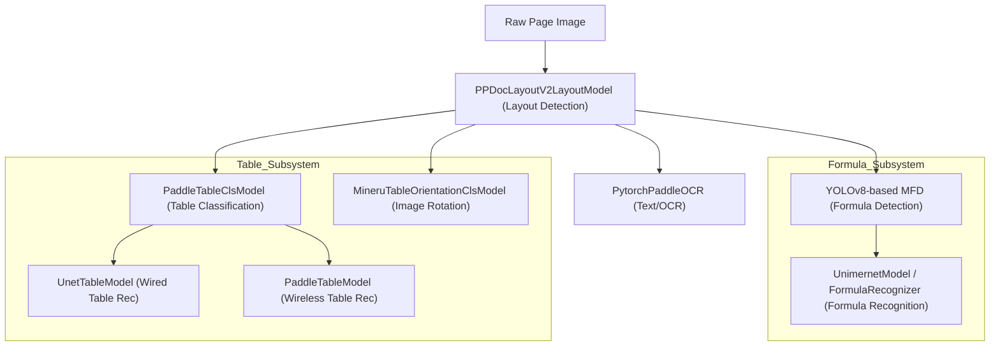

# 모델 하위 시스템 (Model Subsystems)

<details>
<summary>관련 소스 파일</summary>

이 위키 페이지를 생성하는 데 다음 파일들이 컨텍스트로 사용되었습니다:

- [mineru/backend/pipeline/batch_analyze.py](mineru/backend/pipeline/batch_analyze.py)
- [mineru/backend/pipeline/model_init.py](mineru/backend/pipeline/model_init.py)
- [mineru/backend/pipeline/model_list.py](mineru/backend/pipeline/model_list.py)
- [mineru/model/table/cls/mineru_table_ori_cls.py](mineru/model/table/cls/mineru_table_ori_cls.py)

</details>


MinerU는 문서 분해(document decomposition)를 수행하기 위해 일련의 특화된 머신러닝 모델을 활용합니다. 이러한 모델들은 개별 원자 단위(atomic units)로 관리되며, 파이프라인에 의해 오케스트레이션(orchestration)되어 원본 페이지 이미지를 구조화된 데이터로 변환합니다. 이 페이지는 이러한 하위 시스템들과 MinerU 아키텍처 내에서 각 시스템들의 역할에 대한 고수준 개요를 제공합니다.

이러한 모델들의 수명 주기(lifecycle)는 `AtomModelSingleton` [mineru/backend/pipeline/model_init.py:148-157]()에 의해 관리됩니다. 이를 통해 무거운 모델 가중치가 메모리에 한 번만 로드되고, 스레드 안전(thread-safe)한 구현을 사용해 여러 처리 작업에서 공유되도록 보장합니다 [mineru/backend/pipeline/model_init.py:184-187]().

## 하위 시스템 아키텍처 개요

다음 다이어그램은 `BatchAnalyze` 오케스트레이션 레이어 [mineru/backend/pipeline/batch_analyze.py:52-81]() 내에서 단일 문서 페이지를 처리하는 동안 서로 다른 모델 하위 시스템들이 상호 작용하는 방식을 나타냅니다.

### 모델 상호 작용 흐름

출처: [mineru/backend/pipeline/batch_analyze.py:52-81](), [mineru/backend/pipeline/model_init.py:189-220]()

### 모델 엔티티 매핑
이 다이어그램은 `AtomModelSingleton` [mineru/backend/pipeline/model_init.py:159-187]()에 의해 결정되는, 시스템 기능과 코드베이스 내의 구체적인 구현 클래스 및 파일 경로 간의 매핑을 보여줍니다.

```mermaid
classDiagram
    class "AtomModelSingleton" as AMS {
        +get_atom_model(atom_model_name)
        -_models: dict
    }
    class "PPDocLayoutV2LayoutModel" as PLM {
        +__init__(weight, device)
    }
    class "UnimernetModel" as UM {
        +predict(mfd_res, image)
    }
    class "FormulaRecognizer" as FR {
        +predict(mfd_res, image)
    }
    class "UnetTableModel" as UTM {
        +__init__(ocr_engine)
    }
    class "MineruTableOrientationClsModel" as MTOCM {
        +batch_predict(table_info_list)
    }

    AMS ..> PLM : "creates AtomicModel.Layout"
    AMS ..> UM : "creates AtomicModel.MFR"
    AMS ..> MTOCM : "creates AtomicModel.TableOrientationCls"
    AMS ..> UTM : "creates AtomicModel.WiredTable"
    
    PLM --|> "mineru/model/layout/pp_doclayoutv2.py"
    UM --|> "mineru/model/mfr/unimernet/Unimernet.py"
    FR --|> "mineru/model/mfr/pp_formulanet_plus_m/predict_formula.py"
    UTM --|> "mineru/model/table/rec/unet_table/main.py"
    MTOCM --|> "mineru/model/table/cls/mineru_table_ori_cls.py"
```
출처: [mineru/backend/pipeline/model_init.py:159-220](), [mineru/backend/pipeline/model_list.py:2-10](), [mineru/model/table/cls/mineru_table_ori_cls.py:25-27]()

## 레이아웃 감지 및 읽기 순서
레이아웃 감지 하위 시스템은 텍스트 블록, 제목, 그림, 표, 수식과 같은 기능적 영역을 식별합니다.

*   **기본 모델**: `PPDocLayoutV2LayoutModel`로, 영역을 `doc_title`, `table`, `display_formula`와 같은 기능적 레이블로 분류합니다.
*   **초기화**: `pp_doclayout_v2_model_init` [mineru/backend/pipeline/model_init.py:126-130]()을 통해 관리됩니다.
*   **후처리**: 분석 과정 중 `_prune_empty_ocr_text_blocks` [mineru/backend/pipeline/batch_analyze.py:166-180]()을 통해 비어 있는 OCR 텍스트 블록을 정리(prune)합니다.
*   **동시성**: 환경 변수를 통해 활성화된 경우 [mineru/backend/pipeline/model_init.py:28-30](), 레이아웃 추론은 `PIPELINE_LAYOUT_INFERENCE_LOCK` [mineru/backend/pipeline/model_init.py:24]()에 의해 보호됩니다.

자세한 내용은 [레이아웃 감지 및 읽기 순서](#3.1)를 참조하세요.

## 표 인식
MinerU는 표의 구조적 다양성을 처리하기 위해 이중 경로(dual-path) 인식 전략을 사용합니다.

*   **방향 보정 (Orientation Correction)**: 표 이미지가 회전되어 있는지 감지하고 `MineruTableOrientationClsModel` [mineru/backend/pipeline/model_init.py:72-82]()을 사용해 이를 보정합니다. OCR 점수를 활용하여 최종 회전 각도(0, 90 또는 270도)를 결정합니다 [mineru/model/table/cls/mineru_table_ori_cls.py:22]().
*   **분류 (Classification)**: `PaddleTableClsModel`이 표가 `WiredTable` (눈에 보이는 격자선이 있는 표)인지 `WirelessTable`인지 결정합니다.
*   **Wired Tables (유선 표)**: UNet 기반 아키텍처를 사용하는 `UnetTableModel` [mineru/backend/pipeline/model_init.py:98]()을 통해 처리됩니다.
*   **Wireless Tables (무선 표)**: SlanetPlus 아키텍처를 사용하는 `PaddleTableModel` [mineru/backend/pipeline/model_init.py:111]()을 통해 처리됩니다.

자세한 내용은 [표 인식](#3.2)을 참조하세요.

## OCR 엔진
OCR 하위 시스템은 디지털화되지 않은 PDF 영역 및 이미지 기반 콘텐츠에서의 텍스트 추출을 처리합니다.

*   **엔진**: `PytorchPaddleOCR`이며, `ocr_model_init` [mineru/backend/pipeline/model_init.py:133-145]()을 통해 초기화됩니다.
*   **최적화**: `OCR_DET_BASE_BATCH_SIZE` [mineru/backend/pipeline/batch_analyze.py:40]()와 같은 상수로 제어되는 배치 감지 및 인식을 지원합니다.
*   **언어 지원**: 초기화 시 정규화된 언어 코드 지원과 함께 구성됩니다 [mineru/backend/pipeline/model_init.py:139]().
*   **마스킹 (Masking)**: 주변 텍스트에 대한 OCR 정확도를 향상시키기 위해 `mask_formula_regions_for_ocr_det` [mineru/backend/pipeline/batch_analyze.py:88]()을 통해 인라인 수식 영역을 마스킹할 수 있습니다.

자세한 내용은 [OCR 엔진](#3.3)을 참조하세요.

## 수식 인식 (MFD/MFR)
수학적 콘텐츠는 수학 수식 감지(MFD) 및 수학 수식 인식(MFR)의 특화된 2단계 파이프라인으로 처리됩니다.

*   **인식 (MFR)**: MinerU는 `mfr_model_init` [mineru/backend/pipeline/model_init.py:115-123]()을 통해 초기화되는 두 가지 주요 인식 모델을 지원합니다:
    *   `UnimernetModel`: 일반적인 수식 인식을 위한 기본 모델입니다 [mineru/backend/pipeline/model_init.py:117]().
    *   `FormulaRecognizer`: 중국어 수식 지원이 활성화된 경우 사용되는 PP-FormulaNet-Plus-M 모델입니다 [mineru/backend/pipeline/model_init.py:119]().
*   **배치 처리**: 기본 배치 크기 16으로 추론을 배치 처리할 수 있습니다 [mineru/backend/pipeline/batch_analyze.py:39]().

자세한 내용은 [수식 인식 (MFD/MFR)](#3.4)을 참조하세요.

## 모델 관리 및 초기화
모델은 디바이스 배치 및 수명 주기를 관리하기 위해 `atom_model_init` [mineru/backend/pipeline/model_init.py:189-220]()의 중앙 집중식 팩토리 패턴을 통해 초기화됩니다.

| 모델 카테고리 | 클래스명 | 초기화 함수 |
| :--- | :--- | :--- |
| 레이아웃 | `PPDocLayoutV2LayoutModel` | `pp_doclayout_v2_model_init` [mineru/backend/pipeline/model_init.py:126]() |
| MFR | `UnimernetModel` / `FormulaRecognizer` | `mfr_model_init` [mineru/backend/pipeline/model_init.py:115]() |
| OCR | `PytorchPaddleOCR` | `ocr_model_init` [mineru/backend/pipeline/model_init.py:133]() |
| 표 분류 | `PaddleTableClsModel` | `table_cls_model_init` [mineru/backend/pipeline/model_init.py:85]() |
| Wired 표 | `UnetTableModel` | `wired_table_model_init` [mineru/backend/pipeline/model_init.py:89]() |
| Wireless 표 | `PaddleTableModel` | `wireless_table_model_init` [mineru/backend/pipeline/model_init.py:102]() |
| 방향 | `MineruTableOrientationClsModel` | `table_orientation_cls_model_init` [mineru/backend/pipeline/model_init.py:72]() |

출처: [mineru/backend/pipeline/model_init.py:1-220](), [mineru/backend/pipeline/batch_analyze.py:38-50](), [mineru/backend/pipeline/model_list.py:1-11](), [mineru/model/table/cls/mineru_table_ori_cls.py:13-22]()
