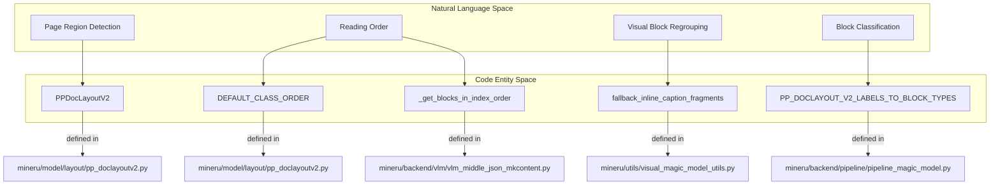
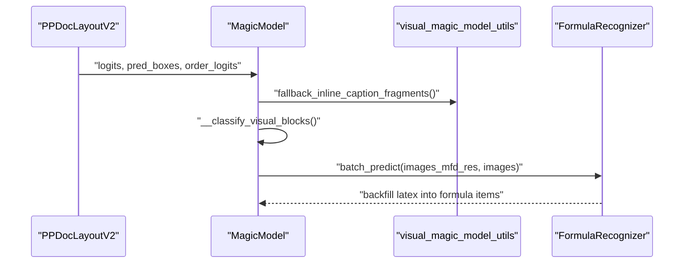
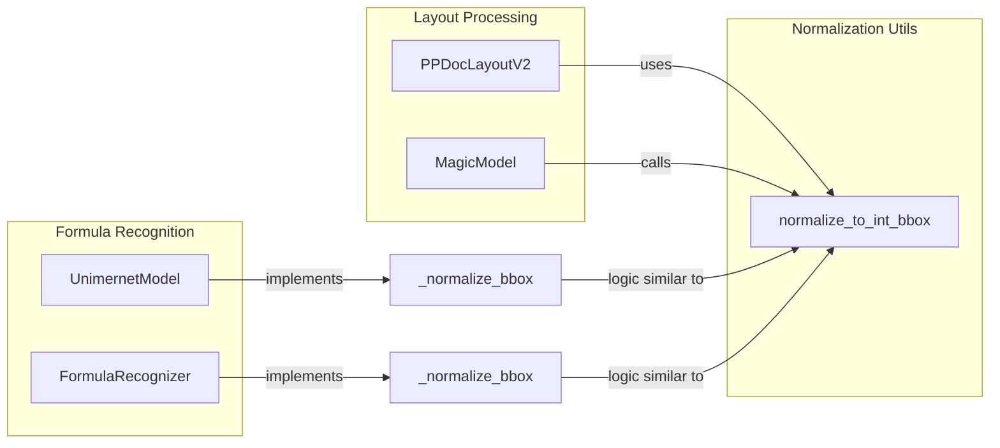

# 레이아웃 감지 및 읽기 순서

관련 소스 파일

이 위키 페이지를 생성하는 데 다음 파일들이 컨텍스트로 사용되었습니다:

- [mineru/model/layout/pp_doclayoutv2.py](mineru/model/layout/pp_doclayoutv2.py)
- [mineru/model/mfr/pp_formulanet_plus_m/predict_formula.py](mineru/model/mfr/pp_formulanet_plus_m/predict_formula.py)
- [mineru/model/mfr/unimernet/Unimernet.py](mineru/model/mfr/unimernet/Unimernet.py)
- [mineru/model/utils/pytorchocr/modeling/heads/rec_ppformulanet_head.py](mineru/model/utils/pytorchocr/modeling/heads/rec_ppformulanet_head.py)
- [mineru/model/utils/pytorchocr/modeling/heads/rec_unimernet_head.py](mineru/model/utils/pytorchocr/modeling/heads/rec_unimernet_head.py)
- [mineru/utils/bbox_utils.py](mineru/utils/bbox_utils.py)
- [mineru/utils/pdf_classify.py](mineru/utils/pdf_classify.py)
- [mineru/utils/pdf_image_tools.py](mineru/utils/pdf_image_tools.py)
- [mineru/utils/pdf_reader.py](mineru/utils/pdf_reader.py)
- [mineru/utils/pdf_text_tool.py](mineru/utils/pdf_text_tool.py)
- [mineru/utils/pdfium_guard.py](mineru/utils/pdfium_guard.py)
- [mineru/utils/span_pre_proc.py](mineru/utils/span_pre_proc.py)

레이아웃 감지 및 읽기 순서 하위 시스템은 문서 페이지 내의 기능적 영역(예: 텍스트, 제목, 이미지, 표, 수식)을 식별하고 이러한 영역들을 읽어야 하는 논리적 순서를 결정하는 역할을 합니다. 이 프로세스는 raw 픽셀 데이터와 구조화된 문서 계층 구조 사이의 간극을 메워줍니다.

## 시스템 아키텍처 및 데이터 흐름

MinerU는 레이아웃 분석을 위해 다단계 접근 방식을 사용합니다. **파이프라인 백엔드**에서 레이아웃 정보는 `MagicModel` 클래스를 통해 처리되고 오케스트레이션됩니다. 이 클래스는 raw 레이아웃 레이블을 내부 블록 타입으로 매핑하고 구조적 정제 작업을 수행합니다 [mineru/backend/pipeline/pipeline_magic_model.py:17-127]().

시스템은 서로 다른 작업을 위해 다음과 같은 특화된 모델에 의존합니다:
- **PP-DocLayoutV2**: 영역 감지 및 읽기 순서 예측을 위한 기본 엔진입니다 [mineru/model/layout/pp_doclayoutv2.py:25-26]().
- **수식 감지 (Formula Detection, MFD)**: 행간(interline) 및 인라인(inline) 수식의 위치를 찾고, 이 수식들은 이후 MFR 모델에 의해 처리됩니다.
- **수식 인식 (Formula Recognition, MFR)**: `UnimernetModel` [mineru/model/mfr/unimernet/Unimernet.py:26-41]() 또는 `FormulaRecognizer` (PP-FormulaNet-Plus-M) [mineru/model/mfr/pp_formulanet_plus_m/predict_formula.py:23-44]() 같은 모델이 감지된 영역을 LaTeX로 변환합니다.

### 레이아웃 감지 프로세스
1.  **영역 감지 (Region Detection)**: 시스템은 페이지 세분화(segmentation)를 위해 **PP-DocLayoutV2**를 사용합니다. 모델은 분류 로짓(logits), 예측된 바운딩 박스(bounding box), 그리고 읽기 순서 정보를 출력합니다 [mineru/model/layout/pp_doclayoutv2.py:184-200]().
2.  **레이블 매핑 (Label Mapping)**: `MagicModel`은 `PP-DocLayoutV2` 레이블을 `BlockType` 열거형(enum)으로 매핑합니다. 예를 들어, "algorithm"은 `BlockType.CODE`로 매핑되고, "display_formula"은 `BlockType.INTERLINE_EQUATION`으로 매핑됩니다 [mineru/backend/pipeline/pipeline_magic_model.py:19-43]().
3.  **특화 감지 및 정제 (Specialized Detection & Refinement)**:
    *   **텍스트 정제 (Text Refinement)**: `__fix_text_block` 함수는 스팬을 라인 단위로 병합합니다. 스팬 분포를 기반으로 세로 쓰기 텍스트를 감지하고, 그에 따라 `merge_spans_to_vertical_line` 또는 `merge_spans_to_line`을 사용합니다 [mineru/backend/pipeline/pipeline_magic_model.py:130-161]().
    *   **시각적 재그룹화 (Visual Regrouping)**: `find_best_visual_parent`와 같은 유틸리티를 사용하여 캡션과 각주를 해당하는 시각적 본문(이미지, 표, 차트)과 연결합니다 [mineru/backend/pipeline/pipeline_magic_model.py:10-14]().
    *   **인장 감지 (Seal Detection)**: "seal"로 표시된 레이아웃 블록은 "seal"을 `sub_type`으로 갖는 `BlockType.IMAGE`로 정규화됩니다 [mineru/backend/pipeline/pipeline_magic_model.py:117-119]().

### 읽기 순서 및 블록 정렬
영역이 식별되면 최종 출력이 사람이 읽는 의도된 순서를 따르도록 정렬됩니다.
1.  **PP-DocLayoutV2 읽기 순서**: 이 모델은 `order_logits`를 예측하는 내장형 읽기 순서 헤드(reading order head)를 포함하고 있습니다 [mineru/model/layout/pp_doclayoutv2.py:184-192](). `DEFAULT_CLASS_ORDER` 매핑을 사용하여 25개의 클래스를 특정 정렬 우선순위로 다시 매핑합니다 [mineru/model/layout/pp_doclayoutv2.py:91-117]().
2.  **정렬 로직**: 블록은 주로 감지 중에 할당된 `index`를 기준으로 정렬됩니다 [mineru/backend/pipeline/pipeline_magic_model.py:121](). 최종 콘텐츠 생성 시, `_get_blocks_in_index_order`는 시각적 하위 블록(캡션, 본문, 각주)이 이 인덱스를 따르도록 보장합니다 [mineru/backend/vlm/vlm_middle_json_mkcontent.py:136-143]().
3.  **세로 쓰기 텍스트 처리**: 블록이 `BlockType.VERTICAL_TEXT`로 식별되는 경우, `vertical_line_sort_spans_from_top_to_bottom`을 사용하여 줄을 위에서 아래로 정렬합니다 [mineru/backend/pipeline/pipeline_magic_model.py:138-141]().

### 레이아웃과 코드 엔티티 매핑
이 다이어그램은 개념적인 레이아웃 컴포넌트가 구체적인 구현 클래스 및 함수에 어떻게 매핑되는지 보여줍니다.

**제목: 레이아웃 엔티티 매핑**

출처: [mineru/model/layout/pp_doclayoutv2.py:91-117](), [mineru/backend/vlm/vlm_middle_json_mkcontent.py:136-143](), [mineru/backend/pipeline/pipeline_magic_model.py:19-43](), [mineru/backend/pipeline/pipeline_magic_model.py:123-124]()

## 구현 세부 사항: 영역 감지

MinerU는 영역을 `abstract`, `algorithm`, `aside_text`, `chart`, `display_formula`를 포함한 25개의 고유 레이블로 분류하는 `PP-DocLayoutV2`를 사용합니다 [mineru/model/layout/pp_doclayoutv2.py:33-59]().

### 레이블 분류
모델은 읽기 순서를 결정하기 전에 낮은 확률의 감지 결과를 필터링하기 위해 각 클래스별로 특정 신뢰도 임계값(confidence threshold)을 사용합니다 [mineru/model/layout/pp_doclayoutv2.py:62-88]().

| 레이블 인덱스 | 클래스명 | 임계값 | BlockType 매핑 |
| :--- | :--- | :--- | :--- |
| 6 | `doc_title` | 0.4 | `BlockType.DOC_TITLE` |
| 17 | `paragraph_title`| 0.4 | `BlockType.PARAGRAPH_TITLE` |
| 5 | `display_formula`| 0.4 | `BlockType.INTERLINE_EQUATION` |
| 21 | `table` | 0.5 | `BlockType.TABLE` |
| 14 | `image` | 0.5 | `BlockType.IMAGE` |
| 22 | `text` | 0.4 | `BlockType.TEXT` |

### 시각적 블록 정제
*   **시각적 분류**: `MagicModel`은 `VISUAL_TYPE_MAPPING`을 사용하여 시각적 블록을 "body", "caption", "footnote"로 분류합니다 [mineru/backend/pipeline/pipeline_magic_model.py:47-68]().
*   **수식 역채우기 (Formula Backfilling)**: `UnimernetModel` [mineru/model/mfr/unimernet/Unimernet.py:26-41]() 또는 `FormulaRecognizer` [mineru/model/mfr/pp_formulanet_plus_m/predict_formula.py:23-44]()와 같은 MFR 모델은 감지된 수식 영역을 배치 처리하고 결과 LaTeX 문자열을 결과 딕셔너리의 `latex` field에 역채웁니다 [mineru/model/mfr/unimernet/Unimernet.py:194-195](), [mineru/model/mfr/pp_formulanet_plus_m/predict_formula.py:208-209]().
*   **코드 언어 추정**: 코드 블록의 경우, 시스템은 `guess_language_by_text`를 사용해 프로그래밍 언어를 추정하고 이를 `guess_lang`에 저장합니다 [mineru/backend/pipeline/pipeline_magic_model.py:154-157]().

**제목: 감지 및 정제 파이프라인**

출처: [mineru/model/layout/pp_doclayoutv2.py:184-200](), [mineru/backend/pipeline/pipeline_magic_model.py:123-125](), [mineru/model/mfr/pp_formulanet_plus_m/predict_formula.py:133-149]()

## 구현 세부 사항: 읽기 순서

읽기 순서는 모델 기반 예측과 내부 정렬 로직의 결합으로 결정됩니다.

### 로직 및 알고리즘
1.  **트랜스포머 기반 순서 결정 (Transformer-Based Ordering)**: `PP-DocLayoutV2`는 시퀀스를 예측하기 위해 트랜스포머 디코더를 사용합니다. 읽기 순서 헤드(reading-order head)의 포워드 패스(forward pass) 동안 감지된 영역 간의 의존성을 처리하기 위해 `_create_bidirectional_mask`를 통해 양방향 어텐션 마스크(bidirectional attention mask)를 채택합니다 [mineru/model/layout/pp_doclayoutv2.py:133-163]().
2.  **클래스 기반 순서 재조정 (Class-Based Reordering)**: `DEFAULT_CLASS_ORDER`는 모델의 raw 출력 시퀀스를 표준화된 읽기 순서로 조정하기 위한 매핑을 제공합니다 [mineru/model/layout/pp_doclayoutv2.py:91-117]().
3.  **콘텐츠 렌더링 순서**: Markdown 변환 단계에서는 `get_blocks_in_index_order`를 사용해 블록들을 가져옵니다. 이를 통해 시각적 블록(예: 표) 내에서도 캡션, 본문, 각주가 올바른 순서로 나타나도록 보장합니다 [mineru/backend/pipeline/pipeline_middle_json_mkcontent.py:91-100]().
4.  **XY-Cut 알고리즘**: 모델 예측을 사용할 수 없거나 레거시 지원이 필요한 특정 시나리오에서는 가로 및 세로 간격을 기반으로 페이지를 읽기 트리(reading tree)로 재귀적으로 분할하는 `XY-Cut`과 같은 기하학적 블록 정렬 알고리즘이 활용됩니다.

## 좌표 정규화 및 스케일링

좌표는 다양한 스케일(모델 입력 vs. raw 이미지 픽셀)에 걸쳐 관리됩니다.
*   **레이아웃 정규화**: `PP-DocLayoutV2`는 기본 이미지 크기 `(800, 800)`에서 작동합니다 [mineru/model/layout/pp_doclayoutv2.py:30]().
*   **표준 유틸리티**: `normalize_to_int_bbox`는 다양한 바운딩 박스 포맷을 표준 `[xmin, ymin, xmax, ymax]` 정수 좌표로 변환하며, 선택적으로 `image_size`에 맞게 클리핑(clipping)합니다 [mineru/utils/bbox_utils.py:7-51]().
*   **MFR 정규화**: UniMERNet과 PP-FormulaNet-Plus-M 모두 인식 전에 크롭 영역이 이미지 경계 내에 있는지 보장하기 위해 내부 `_normalize_bbox` 메서드를 구현하고 있습니다 [mineru/model/mfr/unimernet/Unimernet.py:54-70](), [mineru/model/mfr/pp_formulanet_plus_m/predict_formula.py:74-90]().

### 좌표 처리 로직
이 다이어그램은 서로 다른 좌표 처리 엔티티 간의 관계를 보여줍니다.

**제목: 좌표 처리 로직**

출처: [mineru/utils/bbox_utils.py:7-51](), [mineru/model/layout/pp_doclayoutv2.py:30](), [mineru/model/mfr/unimernet/Unimernet.py:54-70](), [mineru/model/mfr/pp_formulanet_plus_m/predict_formula.py:74-90](), [mineru/backend/pipeline/pipeline_magic_model.py:28-28]()
