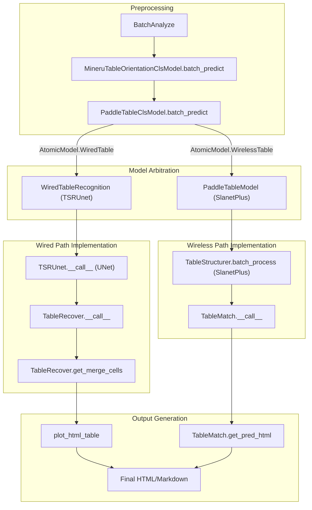
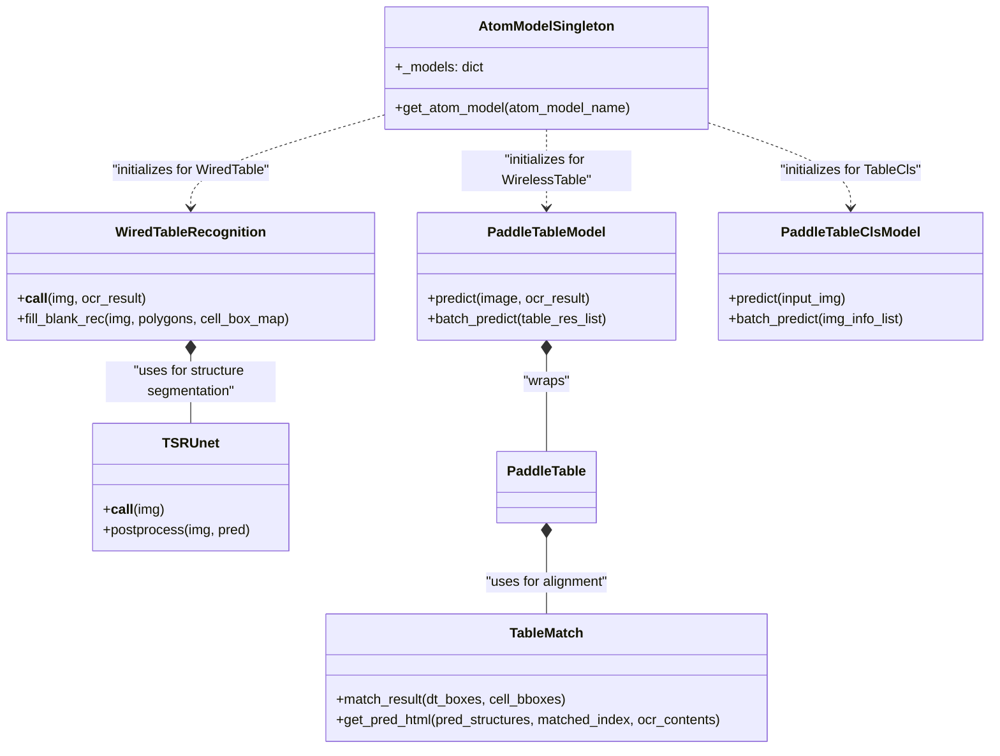

# 표 인식 (Table Recognition)

관련 소스 파일

이 위키 페이지를 생성하는 데 다음 파일들이 컨텍스트로 사용되었습니다:

- [mineru/model/table/cls/paddle_table_cls.py](mineru/model/table/cls/paddle_table_cls.py)
- [mineru/model/table/rec/onnxruntime_provider.py](mineru/model/table/rec/onnxruntime_provider.py)
- [mineru/model/table/rec/slanet_plus/__init__.py](mineru/model/table/rec/slanet_plus/__init__.py)
- [mineru/model/table/rec/slanet_plus/main.py](mineru/model/table/rec/slanet_plus/main.py)
- [mineru/model/table/rec/slanet_plus/matcher.py](mineru/model/table/rec/slanet_plus/matcher.py)
- [mineru/model/table/rec/slanet_plus/matcher_utils.py](mineru/model/table/rec/slanet_plus/matcher_utils.py)
- [mineru/model/table/rec/slanet_plus/table_structure.py](mineru/model/table/rec/slanet_plus/table_structure.py)
- [mineru/model/table/rec/slanet_plus/table_structure_utils.py](mineru/model/table/rec/slanet_plus/table_structure_utils.py)
- [mineru/model/table/rec/unet_table/__init__.py](mineru/model/table/rec/unet_table/__init__.py)
- [mineru/model/table/rec/unet_table/main.py](mineru/model/table/rec/unet_table/main.py)
- [mineru/model/table/rec/unet_table/table_recover.py](mineru/model/table/rec/unet_table/table_recover.py)
- [mineru/model/table/rec/unet_table/table_structure_unet.py](mineru/model/table/rec/unet_table/table_structure_unet.py)
- [mineru/model/table/rec/unet_table/utils.py](mineru/model/table/rec/unet_table/utils.py)
- [mineru/model/table/rec/unet_table/utils_table_line_rec.py](mineru/model/table/rec/unet_table/utils_table_line_rec.py)
- [mineru/model/table/rec/unet_table/utils_table_recover.py](mineru/model/table/rec/unet_table/utils_table_recover.py)

MinerU의 표 인식 시스템은 "Wired" (명시적인 격자선이 있는 표) 및 "Wireless" (공백 정렬에 의존하는 표) 구조를 모두 처리하도록 설계된 정교한 이중 경로(dual-path) 파이프라인입니다. 이 시스템은 표 데이터를 고정밀 HTML 및 Markdown 표현으로 변환하기 위해 자동 방향 보정, 특화된 분류 및 사용자 정의 격자 재구성 알고리즘을 통합하고 있습니다.

## 시스템 아키텍처

표 인식 로직은 `MineruPipelineModel` 및 `BatchAnalyze` 클래스 내에서 오케스트레이션됩니다. 레이아웃 모델에 의해 표 영역이 감지되면, 시스템은 표 이미지를 추출하고 `AtomModelSingleton`에 의해 관리되는 일련의 특화된 모델들을 통해 라우팅합니다.

### 표 인식 데이터 흐름
다음 다이어그램은 원본 이미지에서 재구성된 HTML 구조에 이르기까지 표의 수명 주기를 보여주며, 고수준의 단계를 대응하는 코드 엔티티와 매핑합니다.

**다이어그램: 표 처리 파이프라인**

**출처:** [mineru/model/table/rec/unet_table/main.py:68-129](), [mineru/model/table/rec/slanet_plus/main.py:165-187](), [mineru/model/table/cls/paddle_table_cls.py:134-150]()

---

## 방향 및 분류

인식이 시작되기 전에, 분류 단계를 거쳐 표 이미지가 인식 모델에 최적의 상태가 되도록 보장합니다.

### 1. 방향 보정
방향 보정 로직은 구조 분석 전에 표가 올바르게 세워졌는지 확인합니다.
- **모델:** `MineruTableOrientationClsModel` [mineru/model/table/cls/mineru_table_ori_cls.py:25-27]().
- **로직:** 이중 게이트(dual-gated) 방식을 사용합니다. 먼저, 세로형(높은 종횡비) 텍스트 박스를 감지하여 "회전 후보"를 식별합니다 [mineru/model/table/cls/mineru_table_ori_cls.py:68-90](). 후보가 발견되면, 세 개의 회전 각도(0°, 90°, 270°)에 대해 OCR 인식을 수행하고 가장 높은 신뢰도 점수를 가진 방향을 선택합니다 [mineru/model/table/cls/mineru_table_ori_cls.py:166-172]().
- **매개변수:** 점수 산정을 위해 최대 18개의 박스를 샘플링하며 [mineru/model/table/cls/mineru_table_ori_cls.py:18-18](), 불필요한 회전을 피하기 위해 0° 방향에 대해 0.9의 우선순위 임계값을 사용합니다 [mineru/model/table/cls/mineru_table_ori_cls.py:20-20]().

### 2. Wired 대 Wireless 분류
`PaddleTableClsModel` [mineru/model/table/cls/paddle_table_cls.py:16-26]()은 표 구조를 분류하여 어떤 인식 경로를 따를지 결정합니다.
- **Wired 표 (Wired Tables):** 눈에 보이는 셀 테두리가 특징입니다. UNet 기반의 `TSRUnet`에 의해 처리됩니다.
- **Wireless 표 (Wireless Tables):** 정렬에 의존하는 개방형 구조가 특징입니다. `SlanetPlus` 또는 `RapidTable`에 의해 처리됩니다.
- **구현:** 클래스 및 신뢰도 점수를 예측하기 위해 ONNX 추론 세션(`onnxruntime.InferenceSession`)을 사용합니다 [mineru/model/table/cls/paddle_table_cls.py:18-20](). 모델은 이미지 배치를 입력으로 받아 `cls_label` 및 `cls_score`로 `table_res` 딕셔너리를 업데이트합니다 [mineru/model/table/cls/paddle_table_cls.py:134-150]().
- **전처리:** 이미지는 224x224 크기로 조정되며, 평균 `[0.485, 0.456, 0.406]` 및 표준편차 `[0.229, 0.224, 0.225]`를 사용해 정규화됩니다 [mineru/model/table/cls/paddle_table_cls.py:21-25]().

**출처:** [mineru/model/table/cls/mineru_table_ori_cls.py:25-192](), [mineru/model/table/cls/paddle_table_cls.py:16-76](), [mineru/model/table/cls/paddle_table_cls.py:134-150]()

---

## Wired Table Recognition (TSRUnet)

Wired 표 경로는 UNet 기반 아키텍처를 사용하여 표 선을 세분화(segmentation)하고, 기하학적 복원 알고리즘을 사용해 격자를 재구성합니다.

### TSRUnet 모델
`TSRUnet` 클래스 [mineru/model/table/rec/unet_table/table_structure_unet.py:25-38]()는 다음 작업을 수행합니다:
1.  **추론 (Inference):** 픽셀 값이 가로선(1) 또는 세로선(2)을 나타내는 세분화 마스크(segmentation mask)를 예측합니다 [mineru/model/table/rec/unet_table/table_structure_unet.py:79-82]().
2.  **선 추출 (Line Extraction):** 모폴로지 연산(`cv2.morphologyEx`) 및 `get_table_line` [mineru/model/table/rec/unet_table/utils_table_line_rec.py:129-146]()을 사용하여 마스크로부터 불연속적인 선 세그먼트를 추출합니다 [mineru/model/table/rec/unet_table/table_structure_unet.py:117-128]().
3.  **정제 (Refinement):** `final_adjust_lines` 및 `adjust_lines`를 사용해 선 교차점이 닫히도록 조정하고 확장합니다 [mineru/model/table/rec/unet_table/table_structure_unet.py:131-137]().
4.  **회전 보정 (Rotation Fix):** `cal_rotate_angle` [mineru/model/table/rec/unet_table/table_structure_unet.py:164-177]()을 통해 표 선의 회전 각도를 계산하고, 선택적으로 격자를 표준화하기 위해 `rotate_image`를 수행합니다 [mineru/model/table/rec/unet_table/table_structure_unet.py:140-146]().

### TableRecover 및 격자 재구성
`WiredTableRecognition` 클래스 [mineru/model/table/rec/unet_table/main.py:61-66]()는 전체 복원을 구성(orchestrate)합니다:
- **`TableRecover`:** 예측된 다각형(polygon)들을 `logic_points`를 가진 논리적 격자로 변환합니다 [mineru/model/table/rec/unet_table/main.py:89-91]().
- **셀 매칭 (Cell Matching):** `match_ocr_cell` [mineru/model/table/rec/unet_table/main.py:107]()을 사용하여 OCR 결과를 예측된 다각형에 매핑합니다.
- **빈 셀 채우기 (Blank Filling):** 감지된 셀에 OCR 콘텐츠가 없는 경우, 시스템은 이미지를 크롭하고 `fill_blank_rec` [mineru/model/table/rec/unet_table/main.py:109]()를 통해 타겟 OCR을 수행합니다. 여기에는 신뢰도가 낮거나 관련 없는 문자를 필터링하여 버리는 노이즈 필터 `_should_drop_blank_cell_rec_result`가 포함됩니다 [mineru/model/table/rec/unet_table/main.py:174-184]().
- **HTML 생성:** 최종 HTML은 `plot_html_table` [mineru/model/table/rec/unet_table/main.py:121]()에 의해 생성됩니다.

**출처:** [mineru/model/table/rec/unet_table/main.py:46-129](), [mineru/model/table/rec/unet_table/table_structure_unet.py:25-150](), [mineru/model/table/rec/unet_table/utils_table_line_rec.py:129-175](), [mineru/model/table/rec/unet_table/utils_table_recover.py:122-158]()

---

## Wireless Table Recognition (SlanetPlus)

Wireless 표는 `SlanetPlus` 아키텍처를 둘러싼 `PaddleTableModel` 래퍼(wrapper)를 사용하여 처리됩니다.

### TableStructurer
`TableStructurer` [mineru/model/table/rec/slanet_plus/table_structure.py:28-40]()은 ONNX 모델을 사용하여 표 구조(HTML 태그)와 셀 바운딩 박스를 모두 예측합니다.
- **출력:** 구조 토큰 시퀀스(예: `<tr>`, `<td>`, `</td>`) 및 셀 좌표 리스트 [mineru/model/table/rec/slanet_plus/table_structure.py:53-68]().
- **배치 처리:** `batch_process`는 `BatchTablePreprocess`를 사용하여 여러 표 이미지에 대해 높은 처리량의 추론을 가능하게 합니다 [mineru/model/table/rec/slanet_plus/table_structure.py:70-113]().

### TableMatch 및 HTML 재구성
`PaddleTable` 클래스는 OCR 텍스트를 예측된 구조와 정렬합니다:
1.  **정규화 (Normalization):** 셀 바운딩 박스를 표준화하고 `adapt_slanet_plus` [mineru/model/table/rec/slanet_plus/main.py:137-145]()를 통해 스케일을 복원합니다.
2.  **벡터화 매칭 (Vectorized Matching):** `match_result` [mineru/model/table/rec/slanet_plus/matcher.py:132-159]()를 사용하여 OCR 결과와 예측된 구조 간의 매핑을 효율적으로 계산합니다. IoU 및 거리 점수를 사용하여 OCR 박스와 셀 박스를 페어링합니다 [mineru/model/table/rec/slanet_plus/matcher.py:73-102]().
3.  **논리 좌표 디코딩 (Logic Point Decoding):** `decode_logic_points` [mineru/model/table/rec/slanet_plus/main.py:68]()를 사용해 논리적 좌표(행/열 스팬)를 추출합니다.
4.  **HTML 생성:** `table_matcher`는 예측된 구조, 셀 바운딩 박스 및 OCR 결과를 결합하여 최종 HTML 문자열을 생성합니다 [mineru/model/table/rec/slanet_plus/main.py:62]().

**출처:** [mineru/model/table/rec/slanet_plus/main.py:37-71](), [mineru/model/table/rec/slanet_plus/table_structure.py:28-113](), [mineru/model/table/rec/slanet_plus/matcher.py:120-159]()

---

## 모델 중재(Arbitration) 로직

시스템은 `AtomModelSingleton`을 사용하여 이러한 모델들의 수명 주기를 관리합니다. 분류 단계의 출력을 기반으로 특정 인식 모델이 선택됩니다.

**다이어그램: 코드 엔티티 매핑**

| 시스템 개념 | 구현 클래스 | 주요 파일 |
| :--- | :--- | :--- |
| **모델 관리자** | `AtomModelSingleton` | `mineru/backend/pipeline/model_init.py` |
| **Wired 인식** | `WiredTableRecognition` | [mineru/model/table/rec/unet_table/main.py:61-66]() |
| **Wireless 인식** | `PaddleTableModel` | [mineru/model/table/rec/slanet_plus/main.py:153-163]() |
| **구조 복원** | `TableRecover` | [mineru/model/table/rec/unet_table/main.py:65-65]() |
| **표 분류기** | `PaddleTableClsModel` | [mineru/model/table/cls/paddle_table_cls.py:16-26]() |
| **표 구조 분석기** | `TableStructurer` | [mineru/model/table/rec/slanet_plus/table_structure.py:28-40]() |
| **추론 세션** | `OrtInferSession` | [mineru/model/table/rec/unet_table/utils.py:26-41]() |

## 표 병합 및 연속성

여러 페이지에 걸쳐 있는 표의 경우, MinerU는 `mineru/utils/table_merge.py`에서 특화된 병합 로직을 구현합니다.

- **행 스캔 (Row Scanning):** `_scan_rows`는 경계 간의 유효 열 메트릭과 보존된 행 스팬(rowspan)을 계산합니다 [mineru/utils/table_merge.py:78-146]().
- **연속성 감지 (Continuation Detection):** `is_table_continuation_text` 및 `_is_continuation_caption`은 캡션에서 "Continued Table" (계속되는 표) 표시를 식별합니다 [mineru/utils/table_merge.py:11-11](), [mineru/utils/table_merge.py:203-205]().
- **상태 관리 (State Management):** `TableMergeState`는 헤더 시그니처와 행 메트릭을 캐싱하여 후속 표가 이전 표의 논리적 연속인지 여부를 결정합니다 [mineru/utils/table_merge.py:54-67]().

**출처:** [mineru/utils/table_merge.py:11-205](), [mineru/model/table/rec/unet_table/main.py:46-51](), [mineru/model/table/rec/slanet_plus/main.py:153-163](), [mineru/model/table/rec/unet_table/utils.py:26-41](), [mineru/model/table/rec/slanet_plus/table_structure.py:28-40](), [mineru/model/table/cls/paddle_table_cls.py:16-76]()
