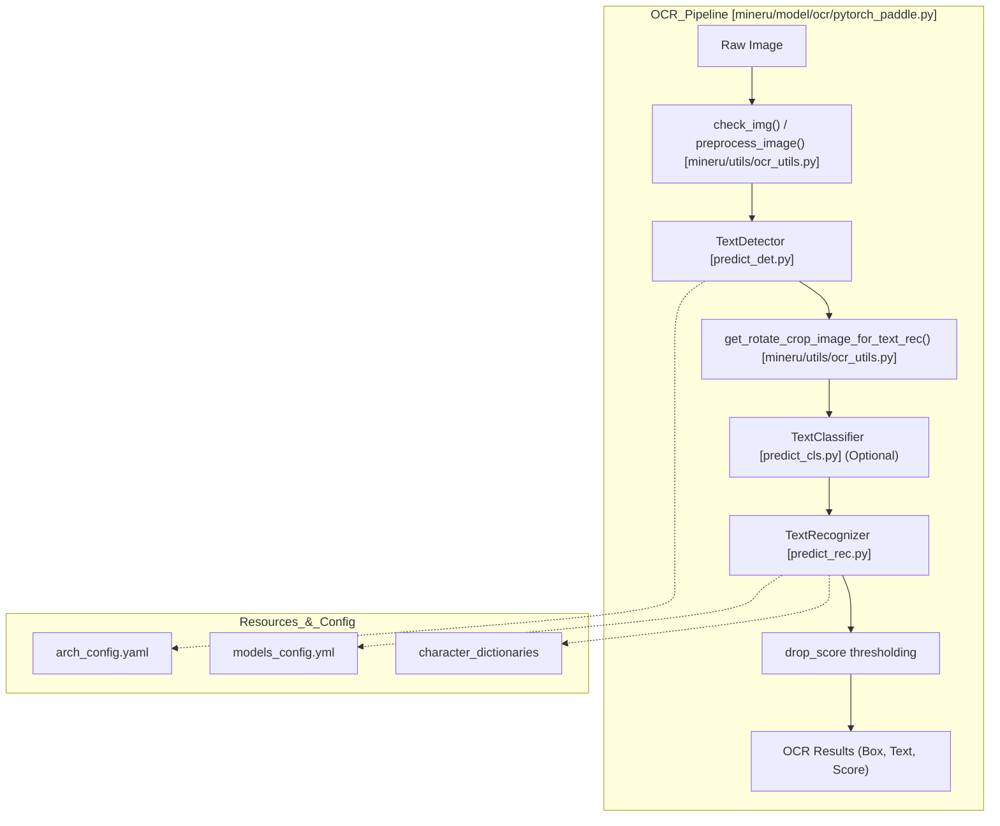
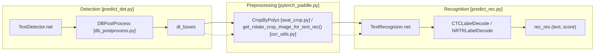

# OCR 엔진 (OCR Engine)

관련 소스 파일

이 위키 페이지를 생성하는 데 다음 파일들이 컨텍스트로 사용되었습니다:

- [mineru/backend/utils/ocr_det_utils.py](mineru/backend/utils/ocr_det_utils.py)
- [mineru/model/ocr/pytorch_paddle.py](mineru/model/ocr/pytorch_paddle.py)
- [mineru/model/utils/pytorchocr/base_ocr_v20.py](mineru/model/utils/pytorchocr/base_ocr_v20.py)
- [mineru/model/utils/pytorchocr/data/imaug/operators.py](mineru/model/utils/pytorchocr/data/imaug/operators.py)
- [mineru/model/utils/pytorchocr/modeling/backbones/__init__.py](mineru/model/utils/pytorchocr/modeling/backbones/__init__.py)
- [mineru/model/utils/pytorchocr/modeling/backbones/rec_lcnetv4.py](mineru/model/utils/pytorchocr/modeling/backbones/rec_lcnetv4.py)
- [mineru/model/utils/pytorchocr/modeling/heads/det_db_head.py](mineru/model/utils/pytorchocr/modeling/heads/det_db_head.py)
- [mineru/model/utils/pytorchocr/modeling/heads/rec_multi_head.py](mineru/model/utils/pytorchocr/modeling/heads/rec_multi_head.py)
- [mineru/model/utils/pytorchocr/modeling/necks/__init__.py](mineru/model/utils/pytorchocr/modeling/necks/__init__.py)
- [mineru/model/utils/pytorchocr/modeling/necks/db_fpn.py](mineru/model/utils/pytorchocr/modeling/necks/db_fpn.py)
- [mineru/model/utils/pytorchocr/modeling/necks/rnn.py](mineru/model/utils/pytorchocr/modeling/necks/rnn.py)
- [mineru/model/utils/pytorchocr/postprocess/db_postprocess.py](mineru/model/utils/pytorchocr/postprocess/db_postprocess.py)
- [mineru/model/utils/pytorchocr/postprocess/rec_postprocess.py](mineru/model/utils/pytorchocr/postprocess/rec_postprocess.py)
- [mineru/model/utils/pytorchocr/utils/resources/arch_config.yaml](mineru/model/utils/pytorchocr/utils/resources/arch_config.yaml)
- [mineru/model/utils/pytorchocr/utils/resources/dict/ppocrv6_dict.txt](mineru/model/utils/pytorchocr/utils/resources/dict/ppocrv6_dict.txt)
- [mineru/model/utils/pytorchocr/utils/resources/models_config.yml](mineru/model/utils/pytorchocr/utils/resources/models_config.yml)
- [mineru/model/utils/tools/infer/predict_cls.py](mineru/model/utils/tools/infer/predict_cls.py)
- [mineru/model/utils/tools/infer/predict_det.py](mineru/model/utils/tools/infer/predict_det.py)
- [mineru/model/utils/tools/infer/predict_rec.py](mineru/model/utils/tools/infer/predict_rec.py)
- [mineru/model/utils/tools/infer/pytorchocr_utility.py](mineru/model/utils/tools/infer/pytorchocr_utility.py)
- [mineru/resources/fasttext-langdetect/lid.176.ftz](mineru/resources/fasttext-langdetect/lid.176.ftz)
- [mineru/utils/language.py](mineru/utils/language.py)
- [mineru/utils/ocr_language.py](mineru/utils/ocr_language.py)

MinerU의 OCR 엔진은 고성능 다국어 광학 문자 인식(OCR) 하위 시스템입니다. 이 시스템은 PaddleOCR을 PyTorch로 커스텀 포팅한 것(`paddleocr2pytorch`)을 기반으로 구축되었으며, PaddleOCR 에코시스템의 사전 학습된 가중치를 활용하는 동시에 PyTorch 기반의 나머지 MinerU 파이프라인과 원활하게 통합할 수 있도록 지원합니다.

## 핵심 아키텍처: PytorchPaddleOCR

OCR 작업을 위한 기본 인터페이스는 `TextSystem`을 상속하는 `PytorchPaddleOCR` 클래스입니다 [[mineru/model/ocr/pytorch_paddle.py:50]](). 이 클래스는 감지 및 인식 모델을 오케스트레이션하고, 언어별 설정을 관리하며, 이미지 전처리 및 배치 최적화를 처리합니다.

### 구현 및 데이터 흐름
OCR 파이프라인은 스크립트 유형 및 하드웨어 가속에 특화된 로직과 함께 "감지 후 인식(Detect-then-Recognize)" 흐름을 따릅니다.

1.  **초기화**: 엔진은 `get_device()`를 통해 하드웨어 디바이스(CPU/GPU/NPU)를 확인합니다 [[mineru/model/ocr/pytorch_paddle.py:60]](). 요청된 언어를 지원되는 모델 키로 자동 정규화합니다 [[mineru/model/ocr/pytorch_paddle.py:66-71]]().
2.  **모델 로딩**: `arch_config.yaml`로부터 네트워크 구성을 로드하고 [[mineru/model/utils/pytorchocr/utils/resources/arch_config.yaml:1-330]](), `ModelPath.pytorch_paddle`을 사용해 모델 경로를 정의합니다 [[mineru/model/ocr/pytorch_paddle.py:72]]().
3.  **감지 (Detection)**: `TextDetector`는 DB (Differentiable Binarization)와 같은 알고리즘을 사용해 텍스트 바운딩 박스를 식별합니다 [[mineru/model/utils/tools/infer/predict_det.py:41]](). `poly` 박스 타입을 포함하여 "seal" (인장) 감지를 위한 특화된 구성을 지원합니다 [[mineru/model/ocr/pytorch_paddle.py:88-99]]().
4.  **인식 (Recognition)**: 크롭된 텍스트 라인 이미지는 `TextRecognizer`에 의해 처리됩니다 [[mineru/model/utils/tools/infer/predict_rec.py:16]](). 기본 배치 크기록 6 (`rec_batch_num`)을 사용합니다 [[mineru/model/ocr/pytorch_paddle.py:87]]().
5.  **Seal OCR (인장 OCR)**: 인장/스탬프 인식을 위한 특화된 모드(`is_seal`)가 존재하며, `SortPolyBoxes` 및 `CropByPolys`를 통해 커스텀 클리핑 및 정렬 로직을 활용합니다 [[mineru/model/ocr/pytorch_paddle.py:108-110]]().

### OCR 파이프라인 엔티티 맵
이 다이어그램은 논리적 OCR 단계와 이를 구현하는 구체적인 코드 엔티티 및 파일을 매핑합니다.

제목: OCR 엔진 데이터 흐름 및 컴포넌트

**출처:** [[mineru/model/ocr/pytorch_paddle.py:50-107]](), [[mineru/model/utils/pytorchocr/utils/resources/arch_config.yaml:1-330]](), [[mineru/model/utils/pytorchocr/utils/resources/models_config.yml:1-58]](), [[mineru/model/utils/tools/infer/predict_det.py:15-128]]()

## 언어 감지 및 다국어 지원

MinerU는 ISO 언어 코드 및 스크립트 제품군을 특정 PaddleOCR 모델 구성에 매핑함으로써 광범위한 언어를 지원합니다.

### 언어 매핑 로직
엔진은 최적화된 다국어 모델을 사용하기 위해 유사한 스크립트를 "제품군(families)"으로 그룹화합니다:
*   **아랍어 앨리어스**: `ar`, `fa`, `ug`, `ur`, `ps` 등을 포함합니다 [[mineru/utils/ocr_language.py:51]]().
*   **키릴 문자 앨리어스**: `bg`, `mn`, `kk`, `ky`, `tg` 등을 포함합니다 [[mineru/utils/ocr_language.py:54-85]]().
*   **데바나가리 문자 앨리어스**: `hi`, `mr`, `ne`, `sa` 등을 포함합니다 [[mineru/utils/ocr_language.py:86-100]]().

### 언어 감지
MinerU는 텍스트 언어를 식별하기 위해 `fasttext` 및 `fast-langdetect`를 활용합니다.
*   **Fasttext 모델**: 엔진은 사전 학습된 식별 모델 `lid.176.ftz`를 로드합니다 [[mineru/resources/fasttext-langdetect/lid.176.ftz]]().
*   **정규화**: `normalize_ocr_model_lang` 함수는 언어 코드를 특정 모델 키로 결정합니다 (예: CPU 상에서 `seal`을 `seal_lite`로 매핑) [[mineru/utils/ocr_language.py:134-157]]().

### 모델 구성 (`models_config.yml`)
언어 키와 특정 가중치(Safetensors 또는 PTH) 간의 매핑은 `models_config.yml`에 정의되어 있습니다 [[mineru/model/utils/pytorchocr/utils/resources/models_config.yml:1-58]]().

| 언어 키 | 감지 모델 | 인식 모델 | 사전 파일 |
| :--- | :--- | :--- | :--- |
| `ch` | `ch_PP-OCRv6_small_det_infer.safetensors` | `ch_PP-OCRv6_small_rec_infer.safetensors` | `ppocrv6_dict.txt` [[mineru/model/utils/pytorchocr/utils/resources/models_config.yml:6-9]]() |
| `arabic` | `ch_PP-OCRv6_small_det_infer.safetensors` | `arabic_PP-OCRv5_rec_infer.pth` | `ppocrv5_arabic_dict.txt` [[mineru/model/utils/pytorchocr/utils/resources/models_config.yml:26-29]]() |
| `seal` | `seal_PP-OCRv4_det_server_infer.pth` | `ch_PP-OCRv6_medium_rec_infer.safetensors` | `ppocrv6_dict.txt` [[mineru/model/utils/pytorchocr/utils/resources/models_config.yml:50-53]]() |

**출처:** [[mineru/model/utils/pytorchocr/utils/resources/models_config.yml:1-58]](), [[mineru/utils/ocr_language.py:134-157]]()

## OCR 모델 아키텍처

해당 포트는 `arch_config.yaml`에 정의된 PaddleOCR 아키텍처(v3 ~ v6)를 지원합니다.

### 감지 모델
감지 백본(backbone)은 일반적으로 **DBHead** (Differentiable Binarization)와 함께 **PPLCNetV4**, **PPHGNetV2** 또는 **MobileNetV3**를 사용합니다 [[mineru/model/utils/pytorchocr/utils/resources/arch_config.yaml:14-115]]().
*   **PP-OCRv6**: `PPLCNetV4` 백본과 `RepLKFPN` 넥(neck)을 사용합니다 [[mineru/model/utils/pytorchocr/utils/resources/arch_config.yaml:95-107]]().
*   **Inference Precision**: `BaseOCRV20` 클래스는 `fp16` 대 `fp32` 로직을 관리하며, CPU가 아닌 디바이스에서는 기본값으로 `fp16`을 사용합니다 [[mineru/model/utils/pytorchocr/base_ocr_v20.py:25-37]]().

### 인식 모델
인식 모델은 **SVTR_LCNet**, **SVTR_HGNet** 또는 **CRNN**과 같은 알고리즘을 활용합니다 [[mineru/model/utils/pytorchocr/utils/resources/arch_config.yaml:132-310]]().
*   **PP-OCRv6 LightSVTR**: 추론 효율성을 위해 `ctc_logits`를 직접 처리하는 `MultiHead` 구조를 구현합니다 [[mineru/model/utils/pytorchocr/modeling/heads/rec_multi_head.py:68-75]]().
*   **가중치 호환성**: 표준 PyTorch `.pth` 및 HuggingFace 스타일의 `.safetensors` 가중치 로드를 모두 지원합니다 [[mineru/model/utils/pytorchocr/base_ocr_v20.py:59-87]]().

**출처:** [[mineru/model/utils/pytorchocr/utils/resources/arch_config.yaml:1-330]](), [[mineru/model/utils/pytorchocr/base_ocr_v20.py:14-112]](), [[mineru/model/utils/pytorchocr/modeling/heads/rec_multi_head.py:22-77]]()

## 배치 최적화 및 후처리

### 배치 추론
*   **인식 (Recognition)**: 동시에 여러 텍스트 크롭 영역을 처리하기 위해 `rec_batch_num`을 사용합니다. `TextRecognizer`는 이미지를 배치 텐서로 크기 조정하고 정규화합니다 [[mineru/model/utils/tools/infer/predict_rec.py:105-156]]().
*   **분류 (Classification)**: `TextClassifier`는 배치 처리 속도를 높이기 위해 텍스트 바를 종횡비별로 정렬합니다 [[mineru/model/utils/tools/infer/predict_cls.py:64-72]]().

### 인장 보정 및 크롭
스탬프 내의 곡선형 텍스트를 처리하기 위해 다음과 같은 특화된 로직이 사용됩니다:
*   **SortPolyBoxes**: 읽기 순서를 결정하기 위해 최소 Y 좌표를 기준으로 다각형 순위를 매깁니다 [[mineru/model/ocr/seal_crop.py:26-39]]().
*   **CropByPolys**: `poly` 박스 타입을 지원하며, 복잡한 곡선 형태에 대해 `get_poly_rect_crop`을 사용합니다 [[mineru/model/ocr/seal_crop.py:42-64]]().
*   **디버그 아티팩트**: `MINERU_SEAL_OCR_DEBUG`를 통해 활성화되면, 엔진은 조사를 위해 감지 시각화 결과 및 크롭된 이미지를 파일로 덤프(dump)합니다 [[mineru/model/ocr/pytorch_paddle.py:128-173]]().

### 코드 상호작용: 감지에서 인식까지
이 다이어그램은 감지 컴포넌트와 인식 컴포넌트 간의 내부적인 정보 전달 방식을 보여줍니다.

제목: 감지에서 인식으로의 전달

**출처:** [[mineru/model/ocr/pytorch_paddle.py:108-112]](), [[mineru/model/ocr/seal_crop.py:42-64]](), [[mineru/model/utils/tools/infer/predict_rec.py:16-103]](), [[mineru/model/utils/tools/infer/predict_det.py:15-128]]()
