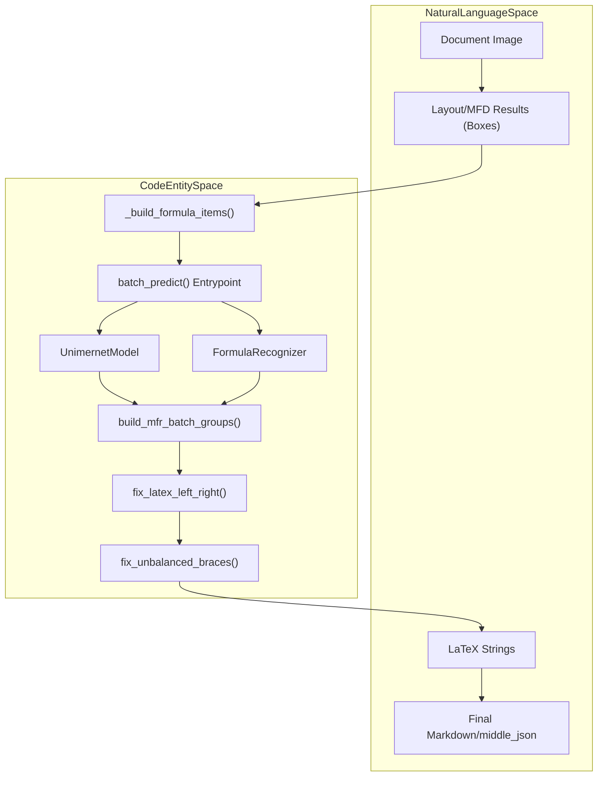
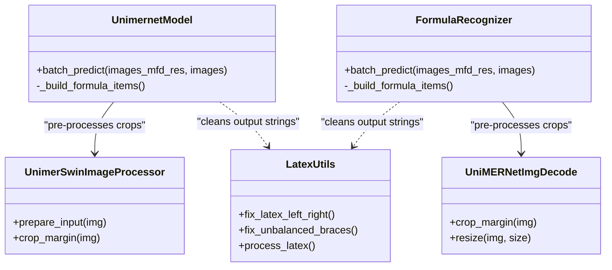

# 수식 인식 (MFD/MFR) (Formula Recognition)

관련 소스 파일

이 위키 페이지를 생성하는 데 다음 파일들이 컨텍스트로 사용되었습니다:

- [mineru/model/layout/pp_doclayoutv2.py](mineru/model/layout/pp_doclayoutv2.py)
- [mineru/model/mfr/pp_formulanet_plus_m/__init__.py](mineru/model/mfr/pp_formulanet_plus_m/__init__.py)
- [mineru/model/mfr/pp_formulanet_plus_m/predict_formula.py](mineru/model/mfr/pp_formulanet_plus_m/predict_formula.py)
- [mineru/model/mfr/pp_formulanet_plus_m/processors.py](mineru/model/mfr/pp_formulanet_plus_m/processors.py)
- [mineru/model/mfr/unimernet/Unimernet.py](mineru/model/mfr/unimernet/Unimernet.py)
- [mineru/model/mfr/unimernet/unimernet_hf/modeling_unimernet.py](mineru/model/mfr/unimernet/unimernet_hf/modeling_unimernet.py)
- [mineru/model/mfr/unimernet/unimernet_hf/unimer_mbart/modeling_unimer_mbart.py](mineru/model/mfr/unimernet/unimernet_hf/unimer_mbart/modeling_unimer_mbart.py)
- [mineru/model/mfr/unimernet/unimernet_hf/unimer_swin/image_processing_unimer_swin.py](mineru/model/mfr/unimernet/unimernet_hf/unimer_swin/image_processing_unimer_swin.py)
- [mineru/model/mfr/utils.py](mineru/model/mfr/utils.py)
- [mineru/model/utils/pytorchocr/modeling/heads/rec_ppformulanet_head.py](mineru/model/utils/pytorchocr/modeling/heads/rec_ppformulanet_head.py)
- [mineru/model/utils/pytorchocr/modeling/heads/rec_unimernet_head.py](mineru/model/utils/pytorchocr/modeling/heads/rec_unimernet_head.py)
- [mineru/utils/bbox_utils.py](mineru/utils/bbox_utils.py)

MinerU의 수식 인식 하위 시스템은 문서 이미지 내의 수학적 표현을 식별하고 이를 고품질 LaTeX 문자열로 변환합니다. 이 프로세스는 페이지 상의 수식 위치를 찾는 **수학 수식 감지 (Mathematical Formula Detection, MFD)** 단계와, 이미지-to-LaTeX 변환을 수행하는 **수학 수식 인식 (Mathematical Formula Recognition, MFR)** 단계의 두 가지 고유 단계로 나뉩니다.

## MFD/MFR 추론 파이프라인

파이프라인은 먼저 수식에 대한 바운딩 박스를 감지한 다음 시퀀스 생성을 위해 해당 영역을 크롭하는 방식으로 작동합니다.

### 1. 수학 수식 감지 (MFD)
MinerU는 수식 감지를 위해 특화된 모델을 사용하며, 이는 주로 **PP-DocLayoutV2**를 사용하는 레이아웃 감지 단계를 통해 통합되어 작동합니다 [mineru/model/layout/pp_doclayoutv2.py:1-130]().

*   **감지 카테고리**: 시스템은 `inline_formula` (텍스트 줄 내에 있는 수식)와 `display_formula` (독립된 블록 형태의 수식)를 구분합니다 [mineru/model/layout/pp_doclayoutv2.py:39-49]().
*   **신뢰도 임계값**: 감지 단계에서 높은 재현율(recall)을 보장하기 위해 `display_formula` 및 `inline_formula`에 대해 기본 임계값을 `0.4`로 설정합니다 [mineru/model/layout/pp_doclayoutv2.py:68-78]().
*   **데이터 추출**: `UnimernetModel` 및 `FormulaRecognizer` 모두에 있는 `_build_formula_items` 함수는 MFD 결과를 필터링하여 수식 레이블이 있는 항목을 추출하고 이를 인식을 위해 준비합니다 [mineru/model/mfr/unimernet/Unimernet.py:76-97](), [mineru/model/mfr/pp_formulanet_plus_m/predict_formula.py:96-117]().

**출처:** [mineru/model/layout/pp_doclayoutv2.py:33-88](), [mineru/model/mfr/unimernet/Unimernet.py:76-97](), [mineru/model/mfr/pp_formulanet_plus_m/predict_formula.py:96-117]().

### 2. 수학 수식 인식 (MFR)
수식 영역이 식별되면 MFR 모델은 수학적 표기법에 맞춰 튜닝된 이미지-to-텍스트 변환을 수행합니다. MinerU는 두 가지 주요 백엔드인 **UniMERNet** 및 **PP-FormulaNet-Plus-M**을 지원합니다.

#### 아키텍처 비교

| 기능 | UniMERNet | PP-FormulaNet-Plus-M |
| :--- | :--- | :--- |
| **기본 아키텍처** | Swin Transformer (Encoder) + MBart (Decoder) | PP-FormulaNet (PaddleOCR 기반) |
| **구현** | `UnimernetModel` [mineru/model/mfr/unimernet/Unimernet.py:26]() | `FormulaRecognizer` [mineru/model/mfr/pp_formulanet_plus_m/predict_formula.py:23]() |
| **전처리** | `UnimerSwinImageProcessor` [mineru/model/mfr/unimernet/unimernet_hf/unimer_swin/image_processing_unimer_swin.py:11]() | `UniMERNetImgDecode`, `ToBatch` [mineru/model/mfr/pp_formulanet_plus_m/predict_formula.py:62-67]() |
| **배치 처리 전략** | 영역 기반 정렬 [mineru/model/mfr/unimernet/Unimernet.py:152-160]() | 영역 기반 정렬 [mineru/model/mfr/pp_formulanet_plus_m/predict_formula.py:172-184]() |
| **디코더 헤드** | `UnimerMBartForCausalLM` [mineru/model/mfr/unimernet/unimernet_hf/unimer_mbart/modeling_unimer_mbart.py:15]() | `UniMERNetHead` [mineru/model/utils/pytorchocr/modeling/heads/rec_ppformulanet_head.py:38]() |

**출처:** [mineru/model/mfr/unimernet/Unimernet.py:26-41](), [mineru/model/mfr/pp_formulanet_plus_m/predict_formula.py:23-57](), [mineru/model/mfr/unimernet/unimernet_hf/modeling_unimernet.py:61-81](), [mineru/model/mfr/pp_formulanet_plus_m/processors.py:19-32](), [mineru/model/mfr/unimernet/unimernet_hf/unimer_swin/image_processing_unimer_swin.py:11-18]().

### 데이터 흐름: 감지에서 LaTeX까지
다음 다이어그램은 시스템이 감지와 인식 사이에서 어떻게 조율(coordinate)하는지 보여줍니다.

**수식 인식 흐름**

**출처:** [mineru/model/mfr/unimernet/Unimernet.py:76-97](), [mineru/model/mfr/pp_formulanet_plus_m/predict_formula.py:96-117](), [mineru/model/mfr/unimernet/Unimernet.py:113-197](), [mineru/model/mfr/pp_formulanet_plus_m/predict_formula.py:133-211](), [mineru/model/mfr/utils.py:10-50]().

---

## 구현 세부 사항

### UniMERNet 모델
UniMERNet 구현은 `VisionEncoderDecoderModel` 아키텍처를 활용합니다 [mineru/model/mfr/unimernet/unimernet_hf/modeling_unimernet.py:61]().

*   **인코더/디코더**: `UnimerSwinModel`을 비전 인코더로 사용하고 `UnimerMBartForCausalLM`을 텍스트 디코더로 사용합니다 [mineru/model/mfr/unimernet/unimernet_hf/modeling_unimernet.py:104-105](), [mineru/model/mfr/unimernet/unimernet_hf/unimer_mbart/modeling_unimer_mbart.py:15]().
*   **배치 최적화**: 패딩 오버헤드를 최소화하기 위해 크롭된 이미지를 면적(area) 기준으로 정렬합니다 [mineru/model/mfr/unimernet/Unimernet.py:152-155](). 비슷한 면적을 가진 이미지들을 배치로 그룹화하기 위해 `build_mfr_batch_groups`가 사용됩니다 [mineru/model/mfr/unimernet/Unimernet.py:160-161]().
*   **추론**: LaTeX 문자열을 생성하기 위해 `TokenizerWrapper`와 함께 `self.model.generate()`를 사용하며, 특히 과도한 공백을 제거하는 `fixed_str`을 사용합니다 [mineru/model/mfr/unimernet/unimernet_hf/modeling_unimernet.py:147-162]().

**출처:** [mineru/model/mfr/unimernet/Unimernet.py:152-170](), [mineru/model/mfr/unimernet/unimernet_hf/modeling_unimernet.py:61-162]().

### PP-FormulaNet-Plus-M
이 모델은 PaddleOCR-to-PyTorch 포트의 컴포넌트들을 활용하여 `BaseOCRV20` 프레임워크를 통해 통합되어 있습니다 [mineru/model/mfr/pp_formulanet_plus_m/predict_formula.py:23]().

*   **아키텍처**: `PP-FormulaNet_plus-M.pth`에 정의되어 있으며 `PP-FormulaNet_plus-M_inference.yml`을 통해 구성됩니다 [mineru/model/mfr/pp_formulanet_plus_m/predict_formula.py:29-44]().
*   **전처리**: `UniMERNetImgDecode`는 크롭된 영역 내에서 수식만을 고립시키기 위해 그레이스케일 임계값 설정(thresholding) 및 `cv2.findNonZero`를 사용하여 `crop_margin`을 수행합니다 [mineru/model/mfr/pp_formulanet_plus_m/processors.py:34-52]().
*   **어텐션 메커니즘**: 트랜스포머 기반 디코더의 인과적(causal) 및 슬라이딩 윈도우 마스크를 처리하기 위해 `AttentionMaskConverter`를 사용합니다 [mineru/model/utils/pytorchocr/modeling/heads/rec_ppformulanet_head.py:43-60]().

**출처:** [mineru/model/mfr/pp_formulanet_plus_m/predict_formula.py:23-71](), [mineru/model/mfr/pp_formulanet_plus_m/processors.py:19-52](), [mineru/model/utils/pytorchocr/modeling/heads/rec_ppformulanet_head.py:43-70]().

### LaTeX 정제
유효한 구문을 보장하기 위해 `mineru/model/mfr/utils.py`에 있는 특화된 유틸리티를 사용하여 모델의 raw 출력을 정리합니다.
*   **`fix_latex_left_right`**: `\left` 및 `\right` 구분 기호의 균형을 맞추고 그 뒤에 `(`, `[`, `{`와 같은 유효한 구분 기호가 오도록 보장합니다 [mineru/model/mfr/utils.py:10-50]().
*   **`fix_unbalanced_braces`**: 스택 기반 방식을 사용하여 닫히지 않은 중괄호 `{}`를 감지하고 제거합니다 [mineru/model/mfr/utils.py:163-207]().
*   **`process_latex`**: 특정 LaTeX 명령의 백슬래시 공백 처리를 담당하고 표준 LaTeX 렌더링에 적합하도록 유효한 문자 이스케이프를 보장합니다 [mineru/model/mfr/utils.py:210-241]().

**출처:** [mineru/model/mfr/utils.py:10-241]().

---

## 기술 데이터 흐름도

아래 다이어그램은 고수준 시스템 개념과 특정 코드 클래스 및 메서드를 연결해 줍니다.

**MFD/MFR 클래스 상호 작용**

**출처:** [mineru/model/mfr/unimernet/Unimernet.py:26](), [mineru/model/mfr/pp_formulanet_plus_m/predict_formula.py:23](), [mineru/model/mfr/pp_formulanet_plus_m/processors.py:19](), [mineru/model/mfr/unimernet/unimernet_hf/unimer_swin/image_processing_unimer_swin.py:11](), [mineru/model/mfr/utils.py:10-241]().

### 주요 함수 및 클래스
- **`_build_formula_items`**: `UnimernetModel` 및 `FormulaRecognizer` 모두에 존재하며, 이 메서드는 MFD 결과에서 수식 바운딩 박스를 추출하고 MFR 진행을 위해 준비합니다 [mineru/model/mfr/unimernet/Unimernet.py:76-97](), [mineru/model/mfr/pp_formulanet_plus_m/predict_formula.py:96-117]().
- **`fix_latex_left_right`**: LaTeX 구문 검증 및 구분 기호 균형 보정을 위한 중요한 유틸리티입니다 [mineru/model/mfr/utils.py:10-50]().
- **`UnimernetModel` (HF 래퍼)**: UniMERNet 아키텍처를 위한 `generate` 루프를 구현합니다 [mineru/model/mfr/unimernet/unimernet_hf/modeling_unimernet.py:61-162]().
- **`UniMERNetImgDecode`**: PP-FormulaNet-Plus-M에서 사용되며, 수식 크롭 영역의 여백 잘라내기(margin cropping) 및 크기 조정을 처리합니다 [mineru/model/mfr/pp_formulanet_plus_m/processors.py:19-168]().
- **`UnimerSwinImageProcessor`**: UniMERNet에서 사용되며, 수식 크롭 영역의 여백 잘라내기 및 크기 조정을 처리합니다 [mineru/model/mfr/unimernet/unimernet_hf/unimer_swin/image_processing_unimer_swin.py:11-180]().

**출처:**
- [mineru/model/mfr/unimernet/Unimernet.py]()
- [mineru/model/mfr/pp_formulanet_plus_m/predict_formula.py]()
- [mineru/model/mfr/pp_formulanet_plus_m/processors.py]()
- [mineru/model/mfr/utils.py]()
- [mineru/model/mfr/unimernet/unimernet_hf/modeling_unimernet.py]()
- [mineru/model/mfr/unimernet/unimernet_hf/unimer_swin/image_processing_unimer_swin.py]()
- [mineru/model/mfr/unimernet/unimernet_hf/unimer_mbart/modeling_unimer_mbart.py]()
- [mineru/model/utils/pytorchocr/modeling/heads/rec_ppformulanet_head.py]()
- [mineru/model/layout/pp_doclayoutv2.py]()
