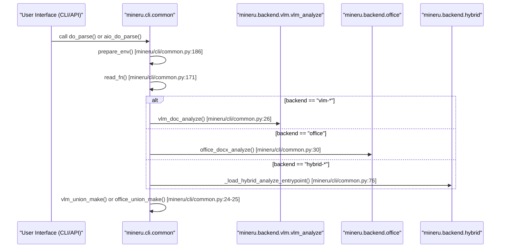

# CLI 및 API 인터페이스 (CLI & API Interfaces)

<details>
<summary>관련 소스 파일</summary>

이 위키 페이지를 생성하는 데 다음 파일들이 컨텍스트로 사용되었습니다:

- [README.md](README.md)
- [README_zh-CN.md](README_zh-CN.md)
- [docs/en/quick_start/index.md](docs/en/quick_start/index.md)
- [docs/zh/quick_start/index.md](docs/zh/quick_start/index.md)
- [mineru/cli/api_client.py](mineru/cli/api_client.py)
- [mineru/cli/api_protocol.py](mineru/cli/api_protocol.py)
- [mineru/cli/client.py](mineru/cli/client.py)
- [mineru/cli/common.py](mineru/cli/common.py)
- [mineru/cli/fast_api.py](mineru/cli/fast_api.py)
- [mineru/cli/gradio_app.py](mineru/cli/gradio_app.py)
- [mineru/cli/router.py](mineru/cli/router.py)
- [mineru/utils/cli_parser.py](mineru/utils/cli_parser.py)
- [pyproject.toml](pyproject.toml)

</details>


이 페이지는 MinerU의 사용자용 엔트리 포인트(entry points)에 대한 고수준 개요를 제공합니다. 시스템은 배치 처리를 위한 명령줄 도구부터 심층 통합을 위한 프로그래밍 방식의 Python API, 대화식 사용을 위한 웹 기반 인터페이스까지 다양한 상호 작용 모드를 지원합니다.

## 인터페이스 개요

MinerU는 여러 고유한 레이어를 통해 기능을 노출하며, 이들 모두는 최종적으로 `mineru.cli.common` 모듈의 핵심 처리 로직이나 특화된 백엔드 분석 엔진으로 연결됩니다.

### 인터페이스와 코드 매핑
다음 다이어그램은 다양한 사용자 인터페이스가 코드베이스 내의 특정 엔트리 포인트 스크립트 및 함수와 어떻게 매핑되는지 보여줍니다.

**사용자 인터페이스 엔티티 포인트**
```mermaid
graph TD
    subgraph "User_Space"
        CLI["mineru CLI"]
        WEB["Gradio Web UI"]
        API_REQ["FastAPI Request"]
        PROG["Python Script"]
    end

    subgraph "Code_Entry_Points"
        client_main["mineru.cli.client:main"]
        gradio_main["mineru.cli.gradio_app:main"]
        fastapi_main["mineru.cli.fast_api:main"]
        sdk_call["demo/demo.py"]
    end

    subgraph "Internal_Dispatch"
        aio_parse["aio_do_parse"]
        sync_parse["do_parse"]
    end

    CLI --> client_main
    WEB --> gradio_main
    API_REQ --> fastapi_main
    PROG --> sdk_call

    client_main --> sync_parse
    gradio_main --> aio_parse
    fastapi_main --> aio_parse
    sdk_call --> aio_parse
    
    sync_parse --- ["mineru/cli/common.py:36-36"]()
    aio_parse --- ["mineru/cli/common.py:35-35"]()
```
**출처:** [mineru/cli/client.py:129-129](), [mineru/cli/fast_api.py:34-44](), [mineru/cli/gradio_app.py:33-40](), [pyproject.toml:128-136]()

---

## [명령줄 인터페이스 (mineru CLI)](#4.1)

CLI는 로컬 문서 변환 및 환경 관리를 위한 기본 도구입니다. 다양한 백엔드를 지원하여 단일 파일 및 배치 처리를 모두 다룰 수 있도록 설계되었습니다.

*   **`mineru`**: PDF, 이미지, 또는 Office 문서를 변환하기 위한 주 명령입니다 [pyproject.toml:129](). `normalize_task_stem` [mineru/cli/common.py:110-111]()을 통한 작업 스템(task stem) 자르기와 `uniquify_task_stems` [mineru/cli/common.py:134-168]()를 사용한 고유화(uniquification) 등의 입력 정규화를 처리합니다.
*   **`mineru-api`**: 원격 요청 처리를 위한 FastAPI 서버를 구동합니다 [pyproject.toml:134]().
*   **`mineru-router`**: 작업자(worker) 풀을 관리하고 요청을 업스트림 서비스로 라우팅하는 로드 밸런서 서비스입니다 [pyproject.toml:135]().
*   **`mineru-gradio`**: Gradio 기반 웹 인터페이스를 구동합니다 [pyproject.toml:136]().
*   **`mineru-vllm-server` / `mineru-lmdeploy-server` / `mineru-openai-server`**: 독립형 VLM 추론 서버를 실행하기 위한 특화된 명령들입니다 [pyproject.toml:130-132]().
*   **수명 주기 관리**: CLI는 `LocalAPIServer` [mineru/cli/api_client.py:94]() 및 `ReusableLocalAPIServer` [mineru/cli/gradio_app.py:54]()를 사용하여 `stop_managed_process` [mineru/cli/api_client.py:222-242]()를 통한 프로세스 정리 등 로컬 추론 서버의 수명 주기를 관리합니다.

플래그 및 명령 사용법에 대한 전체 참조는 **[명령줄 인터페이스 (mineru CLI)](#4.1)**를 참고하세요.

---

## [FastAPI 및 Gradio 웹 인터페이스](#4.2)

서버 측 배포 및 대화식 테스트를 위해 MinerU는 HTTP를 통해 처리 파이프라인을 노출하는 내장 웹 서비스를 제공합니다.

*   **FastAPI 서버 (`mineru-api`)**: 파일 파싱을 위한 비동기 엔드포인트를 노출합니다. `AsyncParseTask` [mineru/cli/fast_api.py:142-171]()를 사용하여 `pending`에서 `completed`까지의 상태를 추적합니다 [mineru/cli/fast_api.py:78-82](). `_request_semaphore` [mineru/cli/fast_api.py:96]()를 통해 동시성을 관리하며 `X-MinerU-Task-Id` [mineru/cli/fast_api.py:88]()와 같은 특화된 헤더를 지원합니다.
*   **Gradio Web UI (`mineru-gradio`)**: 대화형 문서 변환을 위한 시각적 인터페이스입니다. 브라우저 측 요청 압박을 관리하기 위해 `GradioRequestConcurrencyLimiter` [mineru/cli/gradio_app.py:72-199]()를 포함하며, 작업 추적을 위한 라이브 상태 패널을 제공합니다.
*   **로드 밸런서 (`mineru-router`)**: 여러 업스트림 작업자들을 구성(orchestrate)합니다. `ParseRequestOptions` [mineru/cli/api_request.py:45-45]()를 사용하여 라우터와 개별 API 노드 간의 요청 매개변수를 표준화합니다.

API 스키마 및 웹 UI 실행에 대한 자세한 내용은 **[FastAPI 및 Gradio 웹 인터페이스](#4.2)**를 참고하세요.

---

## [프로그래밍 방식의 Python API](#4.3)

개발자는 모델 관리의 복잡성을 추상화하는 고수준 오케스트레이션 함수를 사용하여 MinerU를 Python 애플리케이션에 직접 통합할 수 있습니다.

*   **핵심 오케스트레이션**: `do_parse()` (동기) 및 `aio_do_parse()` (비동기)가 기본 엔트리 포인트입니다 [mineru/cli/common.py:35-36](). `get_vlm_engine()` [mineru/cli/common.py:20]()을 통해 VLM 엔진 선택을 처리하고 백엔드에 특화된 분석을 조율합니다.
*   **입력 처리**: `read_fn()` 유틸리티는 다양한 입력(PDF, PNG, JPG, DOCX, PPTX, XLSX)을 정규화합니다 [mineru/cli/common.py:171-184](). 이미지의 경우 `images_bytes_to_pdf_bytes()` [mineru/cli/common.py:179]()를 사용하여 내부적으로 PDF 바이트로의 변환을 수행합니다.
*   **Office 지원**: `office_docx_analyze`, `office_pptx_analyze` 및 `office_xlsx_analyze`와 같은 특정 분석기가 PDF가 아닌 형식을 처리합니다 [mineru/cli/common.py:28-30]().
*   **환경 설정**: `prepare_env()` [mineru/cli/common.py:186-191]()는 출력 Markdown 및 이미지를 위한 필수 디렉터리 구조를 자동으로 생성합니다.

### 데이터 흐름과 코드 엔티티 매핑
아래 다이어그램은 요청이 API/CLI 레이어에서 핵심 함수를 거쳐 특정 분석 백엔드로 이동하는 과정을 보여줍니다.

**처리 오케스트레이션 흐름**

**출처:** [mineru/cli/common.py:13-30](), [mineru/cli/fast_api.py:34-44](), [mineru/cli/client.py:42-49]()

함수 시그니처 및 데이터 구조에 대한 자세한 문서는 **[프로그래밍 방식의 Python API](#4.3)**를 참조하세요.
