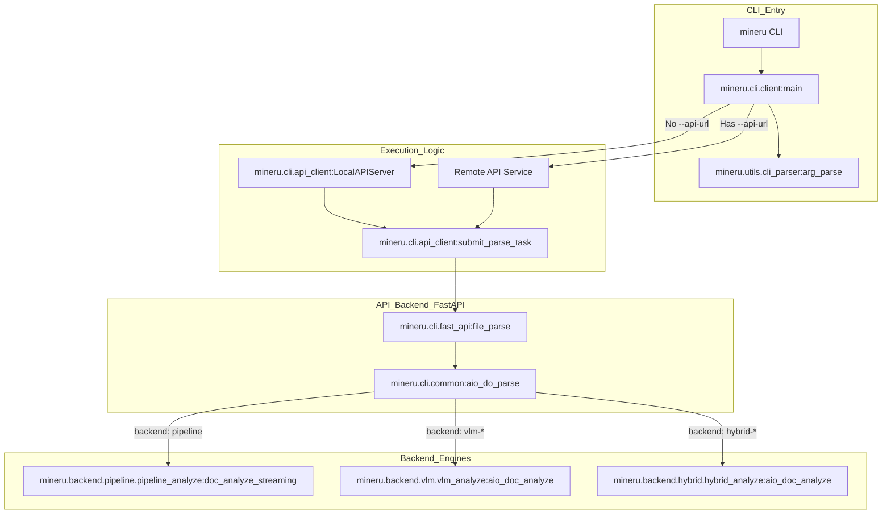
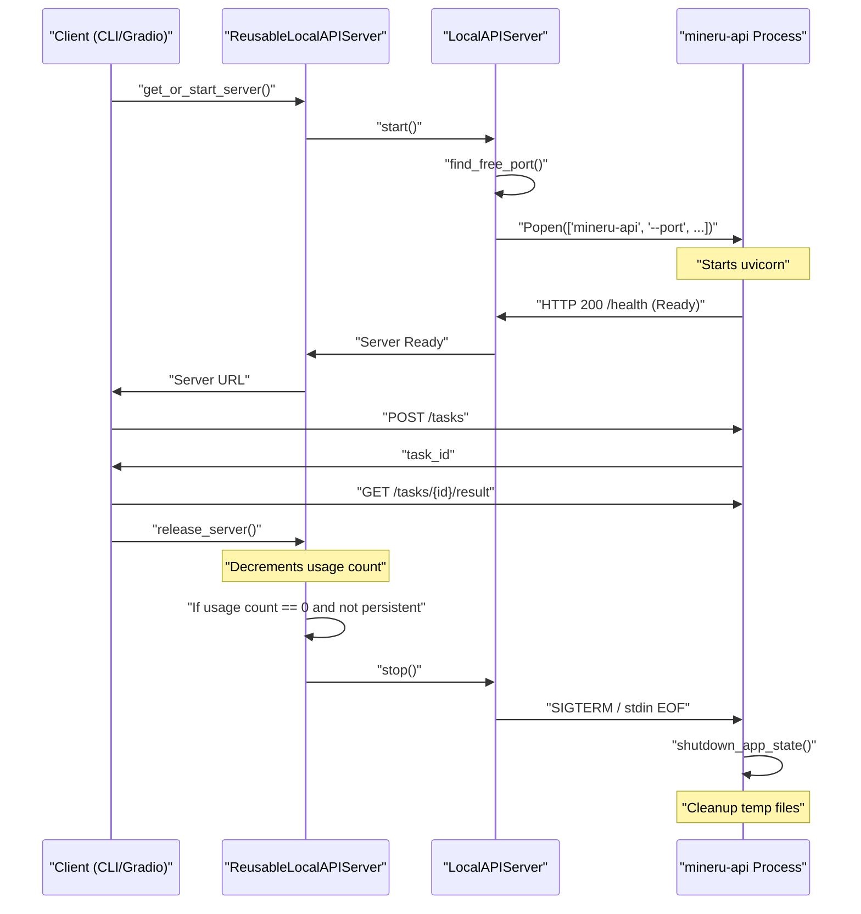
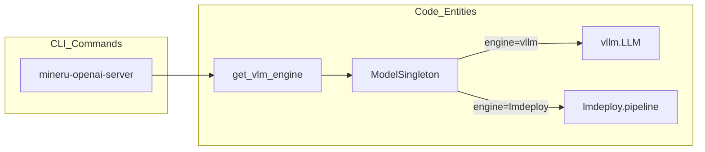

# 명령줄 인터페이스 (mineru CLI)

관련 소스 파일

이 위키 페이지를 생성하는 데 다음 파일들이 컨텍스트로 사용되었습니다:

- [docs/en/usage/advanced_cli_parameters.md](docs/en/usage/advanced_cli_parameters.md)
- [docs/en/usage/cli_tools.md](docs/en/usage/cli_tools.md)
- [docs/en/usage/index.md](docs/en/usage/index.md)
- [docs/zh/usage/advanced_cli_parameters.md](docs/zh/usage/advanced_cli_parameters.md)
- [docs/zh/usage/cli_tools.md](docs/zh/usage/cli_tools.md)
- [docs/zh/usage/index.md](docs/zh/usage/index.md)
- [mineru/cli/api_request.py](mineru/cli/api_request.py)
- [mineru/cli/client.py](mineru/cli/client.py)
- [mineru/cli/common.py](mineru/cli/common.py)
- [mineru/cli/gradio_app.py](mineru/cli/gradio_app.py)
- [mineru/cli/output_paths.py](mineru/cli/output_paths.py)
- [mineru/cli/visualization.py](mineru/cli/visualization.py)

MinerU 명령줄 인터페이스(CLI)는 문서 변환, 모델 관리, 서비스 배포를 위한 도구 모음을 제공합니다. 이는 사용자가 MinerU 생태계와 상호작용하는 기본 진입점 역할을 하며, 로컬 처리와 원격 클라이언트-서버 기능을 모두 제공합니다. 버전 3.0부터 `mineru` CLI는 `mineru-api` 백엔드와 통신하는 오케스트레이션 클라이언트 역할을 합니다 [docs/en/usage/cli_tools.md:100-105]().

## 1. CLI 진입점 개요

MinerU는 코드베이스 내의 특정 기능에 매핑된 여러 실행 가능한 명령을 정의합니다.

| 명령 | 진입점 함수 | 목적 |
| :--- | :--- | :--- |
| `mineru` | `mineru.cli.client:main` | 기본 문서 파싱 도구 (로컬/클라이언트) [mineru/cli/client.py:1146-1148](). |
| `mineru-models-download` | `mineru.cli.models_download:download_models` | 모델 가중치를 다운로드하고 구성함 [mineru/cli/models_download.py:144-148](). |
| `mineru-api` | `mineru.cli.fast_api:main` | 원격 파싱을 위한 FastAPI 서버를 시작함 [mineru/cli/fast_api.py:1022-1024](). |
| `mineru-router` | `mineru.cli.router:main` | 다중 워커를 위한 부하 분산 라우터를 시작함 [mineru/cli/router.py:461-463](). |
| `mineru-gradio` | `mineru.cli.gradio_app:main` | Gradio 기반 웹 인터페이스를 시작함 [mineru/cli/gradio_app.py:1162-1164](). |
| `mineru-vllm-server` | `mineru.cli.vlm_server:vllm_server` | vLLM 기반 OpenAI 호환 서버를 시작함. |
| `mineru-lmdeploy-server` | `mineru.cli.vlm_server:lmdeploy_server` | LMDeploy 기반 OpenAI 호환 서버를 시작함. |
| `mineru-openai-server` | `mineru.cli.vlm_server:openai_server` | 일반 OpenAI 호환 서버 래퍼 [docs/en/usage/quick_usage.md:103-104](). |

**출처:** [mineru/cli/client.py:1146-1148](), [mineru/cli/fast_api.py:1022-1024](), [mineru/cli/gradio_app.py:1162-1164](), [mineru/cli/router.py:461-463](), [mineru/cli/models_download.py:144-148](), [docs/en/usage/quick_usage.md:103-104]()

---

## 2. `mineru` 명령

`mineru` 명령은 PDF, 이미지, Office 문서를 Markdown으로 변환하는 핵심 유틸리티입니다.

### 2.1 실행 흐름 및 디스패치
CLI는 "클라이언트-서버" 아키텍처를 사용합니다. `--api-url`이 제공되지 않으면, CLI는 파싱 로직을 처리하기 위해 `LocalAPIServer` [mineru/cli/api_client.py:93-94]()를 실행합니다. 작업은 `submit_parse_task` 프로토콜 [mineru/cli/api_client.py:476]()을 통해 제출되고 실시간 콘솔 업데이트를 위해 `LiveTaskStatusRenderer` [mineru/cli/client.py:179-183]()를 사용하여 모니터링됩니다.

**CLI 디스패치 아키텍처**

**출처:** [mineru/cli/client.py:93-94](), [mineru/cli/client.py:179-183](), [mineru/cli/api_client.py:476](), [mineru/cli/fast_api.py:527-535](), [mineru/cli/common.py:27](), [mineru/utils/cli_parser.py:62]()

### 2.2 주요 플래그 및 매개변수
*   **`-p, --path`**: 입력 파일 경로 또는 디렉터리입니다. `.pdf`, 이미지, `.docx`, `.pptx`, `.xlsx`를 지원합니다 [docs/en/usage/cli_tools.md:11-12]().
*   **`-o, --output`**: 결과가 저장될 디렉터리입니다 [docs/en/usage/cli_tools.md:12]().
*   **`-b, --backend`**: 엔진 선택 (`pipeline`, `vlm-engine`, `hybrid-engine`, `vlm-http-client`, `hybrid-http-client`) [docs/en/usage/cli_tools.md:15-16]().
*   **`-m, --method`**: 파싱 전략 (`auto`, `txt`, `ocr`) [docs/en/usage/cli_tools.md:14]().
*   **`-l, --lang`**: OCR 정확도를 높이기 위해 문서 언어를 지정합니다 (pipeline 전용) [docs/en/usage/cli_tools.md:18-19]().
*   **`-s, --start` / `-e, --end`**: 파싱할 페이지 범위 (0부터 시작하는 인덱스) [docs/en/usage/cli_tools.md:21-22]().
*   **`--api-url`**: 기존 MinerU API 서비스에 연결합니다 [docs/en/usage/cli_tools.md:13]().
*   **`-u, --url`**: http-client 백엔드를 위한 OpenAI 호환 백엔드 URL입니다 [docs/en/usage/cli_tools.md:20]().
*   **`--effort`**: 하이브리드 파싱 강도 (`medium`, `high`) [docs/en/usage/cli_tools.md:17]().

**출처:** [docs/en/usage/cli_tools.md:11-22]()

### 2.3 출력 디렉터리 구조
출력은 파일 이름과 파싱 방법에 따라 구성됩니다. `resolve_parse_dir` 함수는 백엔드 및 파일 유형에 따라 최종 대상을 계산합니다 [mineru/cli/output_paths.py:29-58]().
*   `{filename}/{method}/images/`: 추출된 이미지 및 수식.
*   `{filename}/{method}/{filename}.md`: 최종 Markdown.
*   `{filename}/{method}/{filename}_middle.json`: 중간 표현식.
*   `{filename}/{method}/{filename}_model.json`: 원시 모델 추론 결과.

**출처:** [mineru/cli/common.py:186-192](), [mineru/cli/output_paths.py:29-58]()

---

## 3. 웹 및 API 인터페이스

### 3.1 `mineru-api` (FastAPI)
API 서버는 동기 및 비동기 엔드포인트를 제공합니다. `MINERU_API_MAX_CONCURRENT_REQUESTS`에 기반한 `asyncio.Semaphore`를 사용하여 동시성을 관리합니다 [mineru/cli/fast_api.py:94-96]().
*   **작업 관리**: `AsyncParseTask`를 사용하여 상태(`pending`, `processing`, `completed`, `failed`)를 추적합니다 [mineru/cli/fast_api.py:141-169]().
*   **엔드포인트**:
    *   `POST /tasks`: `task_id`를 반환하는 비동기 제출 [mineru/cli/fast_api.py:596-600]().
    *   `POST /file_parse`: 완료될 때까지 대기하는 동기 파싱 [mineru/cli/fast_api.py:527-535]().
    *   `GET /health`: 서비스 메타데이터, 프로토콜 버전 [mineru/cli/api_protocol.py:53](), 동시성 제한 [mineru/cli/fast_api.py:465-480]()을 반환합니다.

**출처:** [mineru/cli/fast_api.py:94-96](), [mineru/cli/fast_api.py:141-169](), [mineru/cli/fast_api.py:527-600](), [mineru/cli/api_protocol.py:53]()

### 3.2 `mineru-router`
여러 `mineru-api` 워커를 집계하는 부하 분산 게이트웨이입니다.
*   **업스트림 관리**: 여러 `--upstream-url` 대상을 지원하며 `--local-gpus`를 통해 로컬 워커를 실행할 수 있습니다 [mineru/cli/router.py:461-463]().
*   **헬스 체크**: `WorkerPool`을 통해 주기적으로 워커 상태를 갱신하여 정상적인 노드에 작업을 배포합니다 [mineru/cli/router.py:72-76]().

**출처:** [mineru/cli/router.py:72-76](), [mineru/cli/router.py:461-463]()

### 3.3 `mineru-gradio`
실시간 상태 업데이트 및 나란히 보기(side-by-side) 시각화를 지원하는 시각적 인터페이스입니다 [mineru/cli/gradio_app.py:202-219]().
*   **동시성 제한기**: `GradioRequestConcurrencyLimiter`를 사용하여 UI 요청을 관리합니다 [mineru/cli/gradio_app.py:72-75]().
*   **생명주기 관리**: `--api-url`이 제공되지 않으면 자동으로 `ReusableLocalAPIServer`를 실행합니다 [mineru/cli/gradio_app.py:54]().

**출처:** [mineru/cli/gradio_app.py:54](), [mineru/cli/gradio_app.py:72-75](), [mineru/cli/gradio_app.py:202-219]()

---

## 4. 로컬 API 서버 생명주기

MinerU는 `LocalAPIServer` 및 `ReusableLocalAPIServer`를 사용하여 임시 API 서버를 관리합니다.

### 4.1 구현 세부사항
*   **`LocalAPIServer`**: 사용 가능한 포트에서 `mineru-api` 프로세스를 시작하고 임시 디렉터리를 생성합니다 [mineru/cli/api_client.py:253-264]().
*   **`ReusableLocalAPIServer`**: 여러 요청(예: Gradio 내에서) 간에 재사용을 허용하도록 `LocalAPIServer`를 확장하여 시작 오버헤드를 줄입니다 [mineru/cli/gradio_app.py:54]().
*   **종료 로직**: 부모 프로세스가 종료될 경우 서버가 종료되도록 `stdin` 감시기를 구현합니다 [mineru/cli/fast_api.py:113-131]().

**서버 생명주기 다이어그램**

**출처:** [mineru/cli/fast_api.py:113-131](), [mineru/cli/gradio_app.py:54](), [mineru/cli/api_client.py:253-264]()

---

## 5. VLM 서버 및 시각화

### 5.1 VLM 추론 서버
`mineru-openai-server`와 같은 명령은 고성능 추론을 제공합니다.
*   **모델 생명주기**: `mineru-api`는 `maybe_preload_vlm_model`을 통해 모델을 사전 로드할 수 있습니다 [mineru/cli/fast_api.py:57-60]().
*   **사전 로딩**: `--enable-vlm-preload` 플래그는 서비스 시작 중에 VLM 모델을 웜업할 수 있도록 합니다 [docs/en/usage/cli_tools.md:45-46]().

**모델 구현 매핑**

**출처:** [mineru/cli/fast_api.py:57-60](), [mineru/cli/common.py:20](), [docs/en/usage/cli_tools.md:45-46]()

### 5.2 시각화
CLI는 레이아웃 영역 및 텍스트 범위의 경계 상자를 렌더링하는 `VisualizationJob`을 통해 레이아웃 시각화를 지원합니다 [mineru/cli/visualization.py:22-35](). 이는 `run_visualization_job`을 호출하여 파싱 정확도를 확인하기 위해 `mineru-gradio`에서 사용됩니다 [mineru/cli/visualization.py:84-86]().

**출처:** [mineru/cli/visualization.py:22-35](), [mineru/cli/visualization.py:84-86](), [mineru/cli/common.py:19]()
