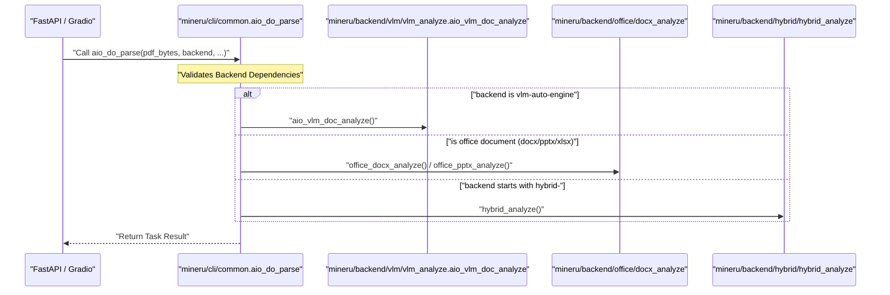

# FastAPI 및 Gradio 웹 인터페이스

<details>
<summary>관련 소스 파일</summary>

이 위키 페이지를 생성하는 데 다음 파일들이 컨텍스트로 사용되었습니다:

- [mineru/cli/api_client.py](mineru/cli/api_client.py)
- [mineru/cli/api_protocol.py](mineru/cli/api_protocol.py)
- [mineru/cli/client.py](mineru/cli/client.py)
- [mineru/cli/common.py](mineru/cli/common.py)
- [mineru/cli/fast_api.py](mineru/cli/fast_api.py)
- [mineru/cli/gradio_app.py](mineru/cli/gradio_app.py)
- [mineru/cli/router.py](mineru/cli/router.py)
- [mineru/resources/gradio_app.css](mineru/resources/gradio_app.css)
- [mineru/resources/gradio_app.js](mineru/resources/gradio_app.js)
- [mineru/resources/gradio_header.html](mineru/resources/gradio_header.html)
- [mineru/utils/cli_parser.py](mineru/utils/cli_parser.py)

</details>


이 페이지는 MinerU의 웹 기반 진입점인 **FastAPI** 서버, **mineru-router** 부하 분산기 및 **Gradio** 웹 인터페이스에 대해 다룹니다. 이러한 인터페이스는 비동기 파싱 파이프라인을 둘러싼 고수준 래퍼 역할을 하여, 원격 액세스, 다중 GPU 오케스트레이션 및 대화형 문서 변환을 가능하게 합니다.

## 웹 인터페이스 개요

MinerU는 세 가지 기본 웹 기반 작동 모드를 제공합니다:
1.  **FastAPI (`mineru-api`)**: 프로그래밍 방식의 통합 및 배치 처리를 위해 설계된 고성능 REST API [mineru/cli/fast_api.py:212-221]().
2.  **Router (`mineru-router`)**: 여러 `mineru-api` 업스트림을 집계하거나 로컬 GPU 워커를 관리하는 부하 분산기 [mineru/cli/router.py:21-23]().
3.  **Gradio (`mineru-gradio`)**: 대화형 문서 업로드, 실시간 미리보기 및 결과 다운로드를 지원하는 사용자 친화적인 웹 UI [mineru/cli/gradio_app.py:19-21]().

모든 인터페이스는 `aio_do_parse`가 제공하는 것과 동일한 기반 비동기 오케스트레이션 로직을 사용합니다 [mineru/cli/common.py:35-35]().

### 시스템 아키텍처 다이어그램

다음 다이어그램은 웹 인터페이스가 핵심 파싱 엔진 및 작업 관리 시스템과 상호작용하는 방식을 보여줍니다.

**웹 인터페이스와 코드 엔티티 매핑**
```mermaid
graph TD
    subgraph "Client_Space"
        [User] --> ["gradio_app.py"]
        ["API_Client"] --> ["router.py"]
    end

    subgraph "Interface_Layer"
        ["gradio_app.py"] -- "uses" --> ["ReusableLocalAPIServer"]
        ["fast_api.py"] -- "manages" --> ["AsyncParseTask"]
        ["router.py"] -- "orchestrates" --> ["WorkerPool"]
    end

    subgraph "Task_&_Orchestration"
        ["AsyncParseTask"] --> ["aio_do_parse"]
        ["aio_do_parse"] -- "mineru/cli/common.py" --> ["Dispatcher"]
    end

    subgraph "Processing_Backends"
        ["Dispatcher"] -- "VLM" --> ["aio_vlm_doc_analyze"]
        ["Dispatcher"] -- "Office" --> ["office_docx_analyze"]
        ["Dispatcher"] -- "Hybrid" --> ["hybrid_analyze"]
    end

    ["ReusableLocalAPIServer"] -- "api_client.py" --> ["fast_api.py"]
    ["WorkerPool"] -- "proxies_to" --> ["fast_api.py"]
```
출처: [mineru/cli/fast_api.py:142-171](), [mineru/cli/router.py:21-23](), [mineru/cli/common.py:35-35](), [mineru/cli/common.py:24-30](), [mineru/cli/api_client.py:54-54]()

---

## FastAPI 서버 (`mineru-api`)

FastAPI 서버(`fast_api.py`)는 핵심 서비스 컴포넌트입니다. 작업 대기열을 관리하고 문서 처리를 위한 엔드포인트를 제공합니다.

### 핵심 엔드포인트

| 엔드포인트 | 메서드 | 설명 |
| :--- | :--- | :--- |
| `/tasks` | `POST` | `submit_async_task`를 통한 비동기 제출. `task_id`를 즉시 반환함 [mineru/cli/fast_api.py:355-375](). |
| `/tasks/{task_id}/status` | `GET` | `AsyncParseTask` 상태(`pending`, `processing`, `completed`, `failed`)를 반환함 [mineru/cli/fast_api.py:78-81](). |
| `/tasks/{task_id}/result` | `GET` | 작업이 완료된 경우 최종 ZIP 결과를 다운로드함 [mineru/cli/fast_api.py:420-442](). |
| `/file_parse` | `POST` | `do_file_parse`를 사용하는 기존의 동기 엔드포인트 [mineru/cli/fast_api.py:292-301](). |
| `/health` | `GET` | 서버 메타데이터 및 `API_PROTOCOL_VERSION`을 반환함 [mineru/cli/fast_api.py:279-288](). |

### 작업 관리: `AsyncParseTask`
서버는 `AsyncParseTask` 데이터클래스를 사용하여 요청을 추적합니다 [mineru/cli/fast_api.py:142-171](). 
- **보존**: 작업 및 해당 출력물은 `DEFAULT_TASK_RETENTION_SECONDS`(24시간)로 정의된 기간 동안 유지됩니다 [mineru/cli/fast_api.py:85-85]().
- **정리**: 백그라운드 작업 `cleanup_expired_tasks`가 `DEFAULT_TASK_CLEANUP_INTERVAL_SECONDS`로 정의된 주기마다 실행됩니다 [mineru/cli/fast_api.py:86-86]().

### 동시성 제어
- **세마포어**: `asyncio.Semaphore` (`_request_semaphore`)를 사용하여 활성 처리를 제한합니다 [mineru/cli/fast_api.py:96-96]().
- **대기열**: 세마포어가 가득 차면 작업은 `pending` 상태로 전환됩니다. `to_status_payload` 메서드는 클라이언트에게 대기 위치를 알리기 위해 `queued_ahead` 정보를 포함합니다 [mineru/cli/fast_api.py:173-196]().

출처: [mineru/cli/fast_api.py:78-104](), [mineru/cli/fast_api.py:142-196](), [mineru/cli/fast_api.py:355-442](), [mineru/cli/api_protocol.py:2-4]()

---

## 부하 분산기 (`mineru-router`)

`mineru-router`는 여러 `mineru-api` 인스턴스에 대한 리버스 프록시 및 부하 분산기 역할을 합니다.

### 주요 기능
- **워커 관리**: `LOCAL_GPU_AUTO`를 사용하여 로컬 GPU를 자동으로 감지하고 로컬 워커를 실행합니다 [mineru/cli/router.py:70-70]().
- **업스트림 집계**: `upstream_urls`를 통해 기존 `mineru-api` 업스트림 또는 원격 소스를 집계합니다 [mineru/cli/router.py:68-69]().
- **헬스 체크**: `WorkerPool`은 주기적으로 워커 상태를 갱신하고 `UPSTREAM_FAILURE_THRESHOLD`를 모니터링합니다 [mineru/cli/router.py:72-76]().

### 데이터 흐름
1.  **요청 도착**: 라우터는 `parse_request_form`에 의해 처리되는 `POST /tasks` 요청을 수신합니다 [mineru/cli/router.py:44-44]().
2.  **워커 선택**: 작업 친화성(affinity)을 유지하면서 `WorkerPool`에서 워커를 선택합니다.
3.  **프록시 처리**: 업로드된 파일과 매개변수를 선택된 업스트림으로 전달합니다 [mineru/cli/router.py:21-23]().
4.  **작업 추적**: 라우터는 상태 및 결과의 일관성을 위해 `task_id`를 특정 업스트림 워커에 매핑합니다.

출처: [mineru/cli/router.py:44-78](), [mineru/cli/api_client.py:28-42](), [mineru/cli/api_protocol.py:2-4]()

---

## Gradio 웹 UI (`gradio_app.py`)

Gradio 인터페이스는 MinerU 파이프라인을 위한 시각적 프론트엔드를 제공하며, 파싱 결과의 대화형 탐색을 지원합니다.

### 기능 및 구현
- **로컬 API 생명주기**: `ReusableLocalAPIServer`를 사용하여 백그라운드에서 전용 `mineru-api` 인스턴스를 관리합니다 [mineru/cli/gradio_app.py:54-54]().
- **동시성 제한기**: UI 측의 부하를 관리하기 위해 `asyncio.Semaphore` 및 `threading.Lock`을 사용하는 `GradioRequestConcurrencyLimiter`를 구현합니다 [mineru/cli/gradio_app.py:72-75]().
- **대기 스냅샷**: 사용자에게 로컬 대기열에서의 현재 위치를 보여주기 위해 `GradioConcurrencyWaitSnapshot`을 제공합니다 [mineru/cli/gradio_app.py:57-63]().
- **시각화**: 원본 PDF와 감지된 레이아웃 블록의 나란히 보기 비교를 생성하기 위해 `VisualizationJob`을 통합합니다 [mineru/cli/gradio_app.py:51-51]().

### UI 컴포넌트 매핑
- **입력**: 문서 선택을 위한 `gr.File` 및 미리보기를 위한 `PDF` 컴포넌트 [mineru/cli/gradio_app.py:20-21]().
- **로그**: 실시간 처리 로그를 위한 사용자 지정 JavaScript 자동 스크롤(`STATUS_BOX_AUTOSCROLL_JS`) 기능이 포함된 `gr.Textbox` [mineru/cli/gradio_app.py:202-219]().
- **스타일링**: 세련된 디자인을 위해 사용자 지정 CSS (`gradio_app.css`) 및 JS (`gradio_app.js`) 자산을 사용합니다 [mineru/resources/gradio_app.css:1-16](), [mineru/resources/gradio_app.js:1-10]().

출처: [mineru/cli/gradio_app.py:51-219](), [mineru/cli/api_client.py:54-54](), [mineru/resources/gradio_app.css:1-16](), [mineru/resources/gradio_app.js:1-10]()

---

## 비동기 파이프라인: `aio_do_parse`

FastAPI와 Gradio 인터페이스는 모두 비차단(non-blocking) 실행을 위한 기본 진입점으로 `aio_do_parse`를 호출합니다. 이 함수는 백엔드 간의 라우팅을 처리합니다.

**파이프라인 오케스트레이션 시퀀스**

출처: [mineru/cli/common.py:35-35](), [mineru/cli/common.py:24-30](), [mineru/cli/common.py:69-74]()

### `common.py` 내 주요 유틸리티 함수
- **`uniquify_task_stems`**: 충돌을 방지하기 위해 입력 순서를 유지하면서 작업 로컬의 고유한 stem을 할당합니다 [mineru/cli/common.py:134-168]().
- **`normalize_upload_filename`**: 사용자가 제공한 파일 이름을 파일 시스템에 안전하도록 정리합니다 [mineru/cli/common.py:114-118]().
- **`prepare_env`**: 특정 작업을 위해 필요한 디렉터리 구조(`/images` 하위 폴더)를 생성합니다 [mineru/cli/common.py:186-191]().
- **`ensure_backend_dependencies`**: 특정 백엔드 모듈을 로드하기 전에 `torch`가 존재하는지 동적으로 확인합니다 [mineru/cli/common.py:69-74]().
- **`read_fn`**: 초기 파일 읽기를 처리하고 `images_bytes_to_pdf_bytes`를 사용하여 이미지 입력을 PDF 바이트로 변환합니다 [mineru/cli/common.py:171-183]().

출처: [mineru/cli/common.py:69-191]()
