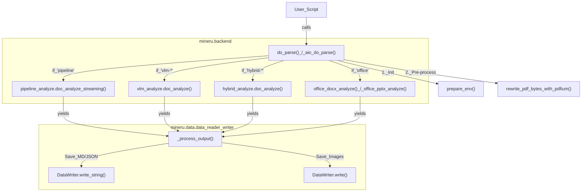
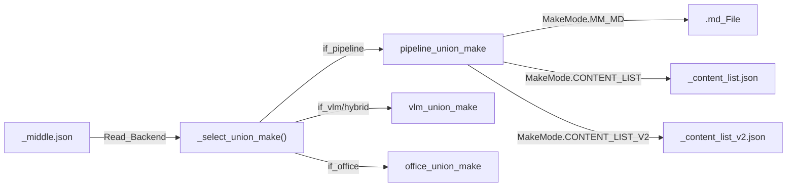

# 프로그래밍 방식의 Python API

관련 소스 파일

이 위키 페이지를 생성하는 데 다음 파일들이 컨텍스트로 사용되었습니다:

- [demo/demo.py](demo/demo.py)
- [mineru/backend/utils/formula_number.py](mineru/backend/utils/formula_number.py)
- [mineru/cli/backend_options.py](mineru/cli/backend_options.py)
- [mineru/cli/client_side_output.py](mineru/cli/client_side_output.py)
- [mineru/data/data_reader_writer/__init__.py](mineru/data/data_reader_writer/__init__.py)
- [mineru/data/data_reader_writer/base.py](mineru/data/data_reader_writer/base.py)
- [mineru/data/data_reader_writer/dummy.py](mineru/data/data_reader_writer/dummy.py)
- [mineru/data/data_reader_writer/filebase.py](mineru/data/data_reader_writer/filebase.py)
- [mineru/data/data_reader_writer/multi_bucket_s3.py](mineru/data/data_reader_writer/multi_bucket_s3.py)
- [mineru/data/data_reader_writer/s3.py](mineru/data/data_reader_writer/s3.py)
- [mineru/data/io/__init__.py](mineru/data/io/__init__.py)
- [mineru/data/io/base.py](mineru/data/io/base.py)
- [mineru/data/io/http.py](mineru/data/io/http.py)
- [mineru/data/io/s3.py](mineru/data/io/s3.py)
- [mineru/data/utils/__init__.py](mineru/data/utils/__init__.py)
- [mineru/utils/pdf_page_id.py](mineru/utils/pdf_page_id.py)
- [tests/unittest/pdfs/test.pdf](tests/unittest/pdfs/test.pdf)
- [tests/unittest/test_e2e.py](tests/unittest/test_e2e.py)

프로그래밍 방식의 Python API는 개발자에게 MinerU의 문서 파싱 기능에 대한 직접적인 액세스를 제공합니다. 이는 다양한 백엔드(Pipeline, VLM, Hybrid, Office) 전반에서 문서 변환의 생명주기를 처리하는 오케스트레이션 함수와 로컬 및 클라우드 스토리지를 위한 강력한 I/O 추상화 레이어를 중심으로 구성됩니다.

## 핵심 오케스트레이션 함수

프로그래밍 방식 사용을 위한 기본 진입점은 `mineru/cli/common.py`에 정의되어 있습니다. 이러한 함수는 백엔드 선택, 환경 준비 및 출력 생성의 복잡성을 추상화합니다.

### `do_parse()`
CLI 및 로컬 스크립트에서 사용되는 동기식 진입점입니다. 문서 바이트를 반복하고 요청된 백엔드를 초기화하며 원시 데이터에서 구조화된 출력까지의 흐름을 조율합니다 [mineru/cli/common.py:186-191](). PDF, 이미지 및 Office 문서(`docx`, `pptx`, `xlsx`)를 지원합니다 [mineru/cli/common.py:42-47]().

### `aio_do_parse()`
파싱 파이프라인의 비동기 버전으로, 웹 서버(FastAPI) 또는 동시 처리 작업에 통합되도록 설계되었습니다. `asyncio`를 사용하여 비차단(non-blocking) I/O 작업을 관리하며, 특히 `vlm-http-client`를 통해 원격 VLM 엔드포인트를 호출할 때 유용합니다 [mineru/cli/common.py:27]().

### 파싱 워크플로 다이어그램
이 다이어그램은 상위 수준의 요청이 파싱 로직을 실행하는 특정 코드 엔티티에 어떻게 매핑되는지 보여줍니다.

**제목: MinerU 프로그래밍 방식 파싱 흐름**

출처: [mineru/cli/common.py:24-30](), [mineru/cli/common.py:186-191](), [mineru/cli/common.py:31-34](), [tests/unittest/test_e2e.py:99-105]()

---

## 데이터 리더 및 라이터 추상화

MinerU는 `mineru.data` 모듈에 정의된 `DataReader` 및 `DataWriter` 추상화를 사용하여 데이터 저장소를 처리 로직으로부터 분리합니다 [mineru/data/data_reader_writer/__init__.py:2-4](). 이를 통해 시스템은 로컬 파일 시스템, HTTP 소스 및 S3 호환 스토리지를 지원할 수 있습니다.

### DataWriter 구현
`DataWriter` 인터페이스는 출력이 로컬 디렉터리이든 클라우드 버킷이든 관계없이 파싱 로직이 동일하게 유지되도록 보장합니다.

*   **`FileBasedDataWriter`**: 로컬 파일 시스템 작업을 위한 표준 구현입니다 [mineru/data/data_reader_writer/filebase.py:4](). 파싱 생명주기 동안 이미지와 markdown 결과를 저장하는 데 사용됩니다 [tests/unittest/test_e2e.py:115-140]().
*   **S3 및 다중 버킷 지원**: S3와의 통합은 `S3Reader` / `S3Writer` 및 `MultiBucketS3DataReader` / `MultiBucketS3DataWriter`를 통해 지원됩니다 [mineru/data/data_reader_writer/multi_bucket_s3.py:62-158]().
*   **`MultiS3Mixin`**: 여러 S3 구성을 관리하여 버킷 이름이 고유하도록 보장하고 상대 경로에 대한 기본 버킷/접두사를 제공합니다 [mineru/data/data_reader_writer/multi_bucket_s3.py:21-59]().
*   **`DummyDataWriter`**: 테스트 또는 드라이런(dry-run) 시나리오에 사용되는 무작동(no-op) 라이터입니다 [mineru/data/data_reader_writer/dummy.py:3]().

### 데이터를 위한 유틸리티 함수
`mineru.cli.common` 모듈 및 `mineru.data` 하위 모듈은 입력 데이터를 표준화하기 위한 헬퍼 함수를 제공합니다:

| 함수 | 목적 |
| :--- | :--- |
| `read_fn(path)` | 파일을 읽고, 유형을 추측하며, 필요한 경우 이미지를 PDF 바이트로 변환합니다 [mineru/cli/common.py:171-184](). |
| `rewrite_pdf_bytes_with_pdfium()` | PDF 바이트 스트림을 정규화하고 페이지 범위 추출을 처리합니다 [mineru/cli/common.py:33-34](). |
| `get_end_page_id()` | 처리할 최종 페이지 인덱스를 안전하게 계산하여 범위를 벗어나는 오류를 방지합니다 [mineru/utils/pdf_page_id.py:5-10](). |
| `guess_suffix_by_path()` | 경로 확장자가 있는 경우 이를 기반으로 파일 유형을 결정합니다 [demo/demo.py:11](). |
| `uniquify_task_stems()` | 충돌을 방지하기 위해 작업에 고유한 파일 이름을 할당합니다 [mineru/cli/common.py:134-168](). |

출처: [mineru/cli/common.py:171-184](), [mineru/data/data_reader_writer/multi_bucket_s3.py:62-158](), [mineru/utils/pdf_page_id.py:5-10](), [demo/demo.py:11-13]()

---

## 클라이언트 측 출력 생성

원격 서버와 상호작용하거나 기존 결과를 재처리할 때, MinerU는 중간 `middle_json` 형식을 사용하여 최종 출력(Markdown, Content List)을 재생성할 수 있도록 지원합니다.

### `regenerate_client_side_outputs()`
이 함수는 `_middle.json` 파일을 읽고 JSON 메타데이터에 지정된 백엔드를 기반으로 적절한 `union_make` 함수를 호출합니다. 이를 통해 클라이언트는 과도한 추론을 다시 실행하지 않고도 서버와 동일한 고품질 Markdown 및 JSON 콘텐츠 목록을 생성할 수 있습니다 [mineru/cli/client_side_output.py:44-97]().

**제목: 클라이언트 측 출력 워크플로**

출처: [mineru/cli/common.py:24-25](), [mineru/cli/client_side_output.py:44-97](), [mineru/cli/client.py:51]()

---

## API 클라이언트 사용 패턴 (demo.py)

`demo/demo.py` 스크립트는 `mineru.cli.api_client`를 사용하여 원격 MinerU 서버 또는 동적으로 생성된 로컬 서버와 상호작용하는 방법을 보여줍니다.

### 주요 클라이언트 패턴:
1.  **로컬 서버 생명주기**: 스크립트 실행 동안 관리형 FastAPI 프로세스를 시작하기 위해 `LocalAPIServer`를 사용합니다 [demo/demo.py:148-150]().
2.  **작업 제출**: 파일을 `UploadAsset`으로 묶어 `submit_parse_task`를 통해 제출합니다 [demo/demo.py:163-167]().
3.  **상태 폴링**: 진행 상황을 모니터링하기 위해 콜백과 함께 `wait_for_task_result`를 사용합니다 [demo/demo.py:182-187]().
4.  **결과 추출**: 최종 ZIP을 다운로드하고 `safe_extract_zip`을 사용하여 Markdown 및 이미지를 해제합니다 [demo/demo.py:189-200]().

### 구성 매개변수
API는 `build_parse_request_form_data`를 사용하여 빌드된 출력을 조정하기 위한 매개변수를 수락합니다 [demo/demo.py:55-74]():
*   **`backend`**: `pipeline`, `vlm-engine`, `hybrid-engine` 등 사이의 선택 [mineru/cli/backend_options.py:3-7]().
*   **`effort`**: 하이브리드 백엔드의 분석 강도를 제어합니다 (`medium`, `high`) [mineru/cli/backend_options.py:8-9]().
*   **`parse_method`**: `auto`, `ocr` 또는 `txt`와 같은 옵션 [demo/demo.py:101]().
*   **`formula_enable` / `table_enable`**: 특수 파싱 모듈을 토글하기 위한 부울(Boolean) 플래그 [demo/demo.py:103-104]().

### 후처리 로직
프로그래밍 방식 사용자는 `formula_number.py`와 같은 내부 후처리 유틸리티를 활용하여 문서 구조를 개선할 수도 있습니다:
*   **`optimize_formula_number_blocks()`**: isolated 수식 번호를 `\tag{}`를 사용하여 인접한 LaTeX 수식 블록에 병합합니다 [mineru/backend/utils/formula_number.py:155-166]().
*   **`finalize_client_side_middle_json()`**: 최종 렌더링 전에 제목 수준 및 메타데이터를 세부 조정합니다 [mineru/cli/client_side_output.py:9-71]().

출처: [demo/demo.py:55-200](), [mineru/cli/backend_options.py:3-22](), [mineru/utils/pdf_page_id.py:5-10](), [mineru/backend/utils/formula_number.py:155-179]()
