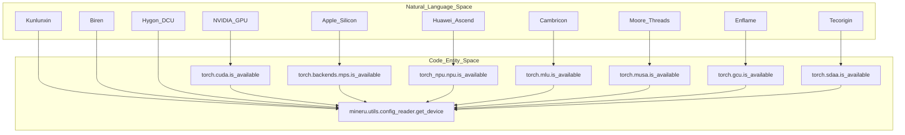
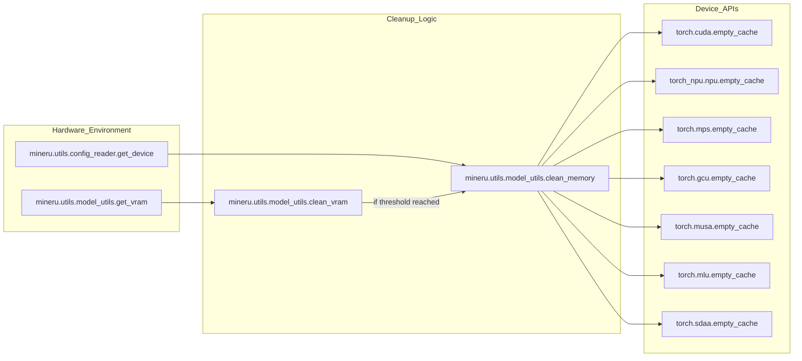

# 하드웨어 가속

관련 소스 파일

이 위키 페이지를 생성하는 데 다음 파일들이 컨텍스트로 사용되었습니다:

- [docs/zh/usage/acceleration_cards/AMD.md](docs/zh/usage/acceleration_cards/AMD.md)
- [docs/zh/usage/acceleration_cards/Ascend.md](docs/zh/usage/acceleration_cards/Ascend.md)
- [docs/zh/usage/acceleration_cards/Biren.md](docs/zh/usage/acceleration_cards/Biren.md)
- [docs/zh/usage/acceleration_cards/Cambricon.md](docs/zh/usage/acceleration_cards/Cambricon.md)
- [docs/zh/usage/acceleration_cards/Enflame.md](docs/zh/usage/acceleration_cards/Enflame.md)
- [docs/zh/usage/acceleration_cards/Hygon.md](docs/zh/usage/acceleration_cards/Hygon.md)
- [docs/zh/usage/acceleration_cards/IluvatarCorex.md](docs/zh/usage/acceleration_cards/IluvatarCorex.md)
- [docs/zh/usage/acceleration_cards/Kunlunxin.md](docs/zh/usage/acceleration_cards/Kunlunxin.md)
- [docs/zh/usage/acceleration_cards/METAX.md](docs/zh/usage/acceleration_cards/METAX.md)
- [docs/zh/usage/acceleration_cards/MooreThreads.md](docs/zh/usage/acceleration_cards/MooreThreads.md)
- [docs/zh/usage/acceleration_cards/THead.md](docs/zh/usage/acceleration_cards/THead.md)
- [docs/zh/usage/acceleration_cards/Tecorigin.md](docs/zh/usage/acceleration_cards/Tecorigin.md)
- [docs/zh/usage/acceleration_cards/VastAI.md](docs/zh/usage/acceleration_cards/VastAI.md)
- [mineru/utils/config_reader.py](mineru/utils/config_reader.py)
- [mineru/utils/model_utils.py](mineru/utils/model_utils.py)

MinerU는 표준 NVIDIA GPU 및 Apple Silicon에서부터 중국 국산 AI 칩의 광범위한 생태계에 이르기까지 매우 다양한 하드웨어 가속기를 지원합니다. 이러한 하드웨어 추상화는 주로 `config_reader.py`에서의 중앙 장치 감지 및 VLM과 Pipeline 백엔드에서의 가속화된 추론 엔진 구성을 통해 관리됩니다.

## 장치 감지 및 로직

시스템은 모델(PyTorch, ONNX Runtime, vLLM 등)을 실행할 때 어떤 런타임 환경을 사용할지 결정하기 위해 실행 시점에 사용 가능한 하드웨어를 식별합니다.

### 장치 결정 흐름
`mineru/utils/config_reader.py`의 `get_device()` 함수는 다음 우선순위를 사용하여 실행 장치를 결정합니다:
1.  **환경 변수**: `MINERU_DEVICE_MODE`를 확인합니다 [mineru/utils/config_reader.py:106-108]().
2.  **NVIDIA CUDA**: `torch.cuda.is_available()`을 확인합니다 [mineru/utils/config_reader.py:110-111]().
3.  **Apple MPS**: `torch.backends.mps.is_available()`을 확인합니다 [mineru/utils/config_reader.py:112-113]().
4.  **특수 가속기**: 각각의 torch 확장을 통해 NPU(Huawei), GCU(Enflame), MUSA(MooreThreads), MLU(Cambricon) 및 SDAA(Tecorigin)를 순차적으로 확인합니다 [mineru/utils/config_reader.py:115-135]().

### 하드웨어와 코드 매핑
다음 다이어그램은 하드웨어 카테고리가 MinerU 코드베이스 내의 특정 코드 엔티티 및 감지 로직에 어떻게 매핑되는지 보여줍니다.

**제목: 하드웨어 감지 및 엔티티 매핑**

출처: [mineru/utils/config_reader.py:105-138]()

## VLM 엔진 구성

VLM 백엔드에는 중국 국산 가속기, 특히 `vllm` 및 `lmdeploy` 엔진을 위한 특수 로직이 포함되어 있습니다.

### 장치별 구성
엔진 매개변수는 `MINERU_VLLM_DEVICE` 또는 `MINERU_LMDEPLOY_DEVICE` 환경 변수에 따라 종종 조정됩니다.

*   **Kunlunxin (kxpu)**: `MINERU_VLLM_DEVICE=kxpu` 설정이 필요합니다 [docs/zh/usage/acceleration_cards/Kunlunxin.md:42]().
*   **MooreThreads (musa)**: vLLM v1 지원 제한으로 인해 MinerU는 MUSA에 v0 엔진을 사용합니다 [docs/zh/usage/acceleration_cards/MooreThreads.md:44-47]().
*   **Cambricon (mlu)**: vLLM v1과의 호환성 문제로 인해 현재 vLLM에 v0 엔진을 채택하고 있습니다 [docs/zh/usage/acceleration_cards/Cambricon.md:68-71]().

### 백엔드 선택
`lmdeploy`의 경우 백엔드는 환경 변수에 의해 결정됩니다:
- **ascend/maca/camb**: `MINERU_LMDEPLOY_DEVICE`를 `ascend` [docs/zh/usage/acceleration_cards/Ascend.md:77](), `maca` [docs/zh/usage/acceleration_cards/METAX.md:57](), 또는 `camb` [docs/zh/usage/acceleration_cards/Cambricon.md:45]()로 설정하여 `pytorch` 백엔드를 사용합니다.

출처: [mineru/utils/config_reader.py:105-138](), [docs/zh/usage/acceleration_cards/MooreThreads.md:44-47](), [docs/zh/usage/acceleration_cards/Cambricon.md:68-71]()

## 지원 가속기 상세 정보

### 화웨이 어센드 (Huawei Ascend, NPU)
*   **드라이버/CANN**: CANN 환경이 필요합니다 (예: 드라이버 23.0.3) [docs/zh/usage/acceleration_cards/Ascend.md:7]().
*   **백엔드**: `vllm` 및 `lmdeploy`를 모두 지원합니다. `MINERU_LMDEPLOY_DEVICE`는 `ascend`로 설정해야 합니다 [docs/zh/usage/acceleration_cards/Ascend.md:14, 77]().
*   **특수 처리**: 310P 카드의 경우, vLLM 명령에 `--enforce-eager --dtype float16` 매개변수가 필요합니다 [docs/zh/usage/acceleration_cards/Ascend.md:89-93]().
*   **환경**: 격리를 위해 `ASCEND_RT_VISIBLE_DEVICES`를 사용합니다 [docs/zh/usage/acceleration_cards/Ascend.md:174]().

### METAX (MACA)
*   **엔진**: `maca.Dockerfile`을 통해 지원됩니다. `vllm` 및 `lmdeploy` 백엔드를 모두 지원합니다 [docs/zh/usage/acceleration_cards/METAX.md:24-36]().
*   **환경**: `MINERU_LMDEPLOY_DEVICE=maca`를 사용합니다 [docs/zh/usage/acceleration_cards/METAX.md:57]().
*   **도구**: `mx-smi`를 통해 모니터링합니다 [docs/zh/usage/acceleration_cards/METAX.md:147]().

### T-Head (PPU)
*   **엔진**: `ppu.Dockerfile`을 통해 `vllm` 및 `lmdeploy`를 지원합니다 [docs/zh/usage/acceleration_cards/THead.md:19-30]().
*   **환경**: 컨테이너 실행 시 `--device=/dev/alixpu` 및 `--device=/dev/alixpu_ctl`이 필요합니다 [docs/zh/usage/acceleration_cards/THead.md:38-39]().
*   **도구**: `ppu-smi`를 통해 모니터링합니다 [docs/zh/usage/acceleration_cards/THead.md:138]().

### Kunlunxin (KXPU)
*   **구성**: `MINERU_VLLM_DEVICE=kxpu` 설정이 필요합니다 [docs/zh/usage/acceleration_cards/Kunlunxin.md:42]().
*   **환경**: 격리를 위해 `XPU_VISIBLE_DEVICES`를 사용합니다 [docs/zh/usage/acceleration_cards/Kunlunxin.md:119]().

### VastAI (VACC)
*   **백엔드 지원**: vLLM 백엔드를 사용하여 `vlm-engine` 및 `vlm-http-client`를 독점적으로 지원합니다 [docs/zh/usage/acceleration_cards/VastAI.md:75, 215]().
*   **요구 사항**: vLLM 명령에 `--enforce_eager`를 포함해야 합니다 [docs/zh/usage/acceleration_cards/VastAI.md:124]().
*   **환경**: `VACC_VISIBLE_DEVICES`를 사용합니다 [docs/zh/usage/acceleration_cards/VastAI.md:69]().

### MooreThreads (MUSA)
*   **환경**: `MTHREADS_VISIBLE_DEVICES=all` 및 `MINERU_VLLM_DEVICE=musa` 설정이 필요합니다 [docs/zh/usage/acceleration_cards/MooreThreads.md:29-30]().
*   **엔진**: vLLM v1 호환성 문제로 인해 v0 엔진을 사용합니다 [docs/zh/usage/acceleration_cards/MooreThreads.md:45-47]().

### Tecorigin (SDAA)
*   **지원**: `sdaa-vllm-latest` 이미지를 통해 모든 변환 모드에서 `vllm`을 지원합니다 [docs/zh/usage/acceleration_cards/Tecorigin.md:30, 49-106]().
*   **환경**: `SDAA_VISIBLE_DEVICES`를 사용합니다 [docs/zh/usage/acceleration_cards/Tecorigin.md:115]().
*   **도구**: `teco-smi -c`를 통해 모니터링합니다 [docs/zh/usage/acceleration_cards/Tecorigin.md:116]().

### 중국 국산 가속기 지원 요약

| 가속기 | 기호 | 격리 환경 변수 | SMI 도구 |
| :--- | :--- | :--- | :--- |
| Huawei Ascend | `npu` | `ASCEND_RT_VISIBLE_DEVICES` | `npu-smi` |
| Cambricon | `mlu` | `MLU_VISIBLE_DEVICES` | `cnmon` |
| METAX | `maca` | `CUDA_VISIBLE_DEVICES` | `mx-smi` |
| Tecorigin | `sdaa` | `SDAA_VISIBLE_DEVICES` | `teco-smi` |
| T-Head | `ppu` | `PPU_VISIBLE_DEVICES` | `ppu-smi` |
| Kunlunxin | `kxpu` | `XPU_VISIBLE_DEVICES` | `xpu-smi` |
| Hygon DCU | `dcu` | `HIP_VISIBLE_DEVICES` | `hy-smi` |
| Biren | `supa` | `SUPA_VISIBLE_DEVICES` | `brsmi` |
| VastAI | `vacc` | `VACC_VISIBLE_DEVICES` | N/A |
| Enflame | `gcu` | `TOPS_VISIBLE_DEVICES` | `efsmi` |
| MooreThreads | `musa` | `MTHREADS_VISIBLE_DEVICES` | `mthreads-gmi` |

출처: [docs/zh/usage/acceleration_cards/Ascend.md](), [docs/zh/usage/acceleration_cards/METAX.md](), [docs/zh/usage/acceleration_cards/THead.md](), [docs/zh/usage/acceleration_cards/Kunlunxin.md](), [docs/zh/usage/acceleration_cards/VastAI.md](), [docs/zh/usage/acceleration_cards/Tecorigin.md](), [docs/zh/usage/acceleration_cards/MooreThreads.md](), [docs/zh/usage/acceleration_cards/Enflame.md:104-106](), [docs/zh/usage/acceleration_cards/Cambricon.md:153-155]()

## 최적화 전략

### 메모리 관리
시스템은 장기 실행 배치 작업 중에 메모리 부족(OOM) 오류를 방지하기 위해 하드웨어 메모리를 모니터링하고 정리하는 유틸리티를 제공합니다.

**제목: 하드웨어 메모리 생명주기**

출처: [mineru/utils/model_utils.py:183-205](), [mineru/utils/model_utils.py:208-212]()

### 정밀도 및 Eager 실행
많은 중국 국산 카드(예: Ascend 310P 및 VastAI)는 그래프 컴파일 문제나 정밀도 불일치를 피하기 위해 eager 모드 실행이 필요합니다. 이는 엔진 인수에 `--enforce-eager` (또는 `--enforce_eager`)를 추가하고 `--dtype float16`을 지정하여 처리됩니다 [docs/zh/usage/acceleration_cards/Ascend.md:89-93](), [docs/zh/usage/acceleration_cards/VastAI.md:124]().

### 메모리 정리 구현
`mineru/utils/model_utils.py`의 `clean_memory()` 함수는 각각의 `empty_cache()` 구현을 사용하여 CUDA, NPU, MPS, GCU, MUSA, MLU 및 SDAA에 대해 장치별 캐시 지우기 기능을 제공합니다 [mineru/utils/model_utils.py:183-205]().

출처: [docs/zh/usage/acceleration_cards/Ascend.md:88-93](), [docs/zh/usage/acceleration_cards/VastAI.md:123-125](), [mineru/utils/model_utils.py:183-205]()
